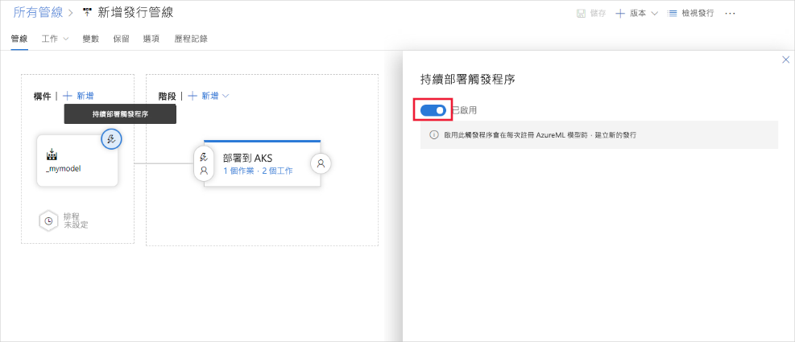

# 連續部署模型

本文說明如何使用 Azure DevOps 中的持續部署，自動檢查已註冊模型的新版本，並將這些新模型推送到生產環境。

## 必要條件

本文假設您已在 Azure Machine Learning 工作區中註冊模型。 如需定型和註冊 scikit-learn 學習模型的範例，請參閱 [此教學](how-to-train-scikit-learn.md) 課程。

## 連續部署模型

您可以使用 [Azure DevOps](https://azure.microsoft.com/services/devops/)的 Machine Learning 擴充功能，持續部署模型。 在 Azure Machine Learning 工作區中註冊新的機器學習模型時，您可以使用 Azure DevOps 的 Machine Learning 擴充功能來觸發部署管線。

1. 註冊 [Azure Pipelines](https://docs.microsoft.com/azure/devops/pipelines/get-started/pipelines-sign-up?view=azure-devops)，讓您的應用程式持續整合和傳遞到任何可能的平臺或雲端。  (請注意，Azure Pipelines 與 [Machine Learning 管線](concept-ml-pipelines.md#compare)不同。 ) 

1. [建立 Azure DevOps 專案。](https://docs.microsoft.com/azure/devops/organizations/projects/create-project?view=azure-devops)

1. 安裝 [Azure Pipelines 的 Machine Learning 延伸](https://marketplace.visualstudio.com/items?itemName=ms-air-aiagility.vss-services-azureml&targetId=6756afbe-7032-4a36-9cb6-2771710cadc2&utm_source=vstsproduct&utm_medium=ExtHubManageList)模組。

1. 使用服務連線來設定 Azure Machine Learning 工作區的服務主體連線，讓您可以存取您的構件。 移至 [專案設定]，選取 [ **服務連接**]，然後選取 [ **Azure Resource Manager**：

    

1. 在 [ **領域層級** ] 清單中，選取 [ **AzureMLWorkspace**]，然後輸入其餘的值：

    

1. 若要使用 Azure Pipelines 持續部署機器學習模型，請在 [管線] 下，選取 [ **發行**]。 新增成品，然後選取 **AzureML 模型** 成品和您稍早建立的服務連接。 選取要觸發部署的模型和版本：

    

1. 在模型成品上啟用模型觸發程式。 當您開啟觸發程式時，每次指定的版本 (時，該模型的最新版本) 就會在您的工作區中註冊，並觸發 Azure DevOps 發行管線。

    

## 後續步驟

請參閱 GitHub 上的下列專案，以取得 ML 模型持續部署的更多範例。

* [Microsoft/MLOps](https://github.com/Microsoft/MLOps)
* [Microsoft/MLOpsPython](https://github.com/microsoft/MLOpsPython)