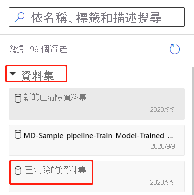

# 將資料匯入 Azure Machine Learning 設計工具 (預覽)

在本文中，您將了解如何在設計工具中匯入自己的資料，以建立自訂解決方案。 有兩種方式可將資料匯入設計工具中： 

* **Azure Machine Learning 資料集** - 在 Azure Machine Learning 中註冊[資料集](concept-data.md#datasets)，以啟用可協助管理資料的進階功能。
* **匯入資料模組** - 使用[匯入資料](algorithm-module-reference/import-data.md)模組，直接從線上資料來源存取資料。

## 使用 Azure Machine Learning 資料集

建議使用[資料集](concept-data.md#datasets)將資料匯入設計工具中。 當註冊資料集時，可充分利用[版本設定與追蹤](how-to-version-track-datasets.md)和[資料監視](how-to-monitor-datasets.md)等進階資料功能。

### 註冊資料集

您可[使用 SDK 以程式設計方式](how-to-create-register-datasets.md#use-the-sdk)註冊現有的資料集，或[在 Azure Machine Learning Studio 中以視覺化方式](how-to-create-register-datasets.md#use-the-ui)註冊現有的資料集。

您也可以將任何設計工具模組的輸出註冊為資料集。

1. 選取用來輸出所要註冊資料的模組。

1. 在 [屬性] 窗格中，選取 [輸出] > [註冊資料集]。

    ![顯示如何巡覽至 [註冊資料集] 選項的螢幕擷取畫面](media/how-to-designer-import-data/register-dataset-designer.png)

### 使用資料集

已註冊的資料集可在模組選擇區的 [資料集] > [我的資料集] 下找到。 若要使用資料集，請將其拖放到管線畫布上。 然後，將資料集的輸出連接埠連線到選擇區中其他模組。

> [!NOTE]
> 設計工具目前僅支援處理[表格式資料集](how-to-create-register-datasets.md#dataset-types)。 如果想要使用[檔案資料集](how-to-create-register-datasets.md#dataset-types)，請使用適用於 Python 和 R 的 Azure Machine Learning SDK。

## 使用匯入資料模組匯入資料

雖然建議使用資料集匯入資料，但您也可以使用[匯入資料](algorithm-module-reference/import-data.md)模組。 匯入資料模組會略過在 Azure Machine Learning 中的資料集註冊作業，並直接從[資料存放區](concept-data.md#datastores)或 HTTP URL 匯入資料。

如需如何使用匯入資料模組的詳細資訊，請參閱[匯入資料參考頁面](algorithm-module-reference/import-data.md)。

> [!NOTE]
> 如果資料集有太多資料行，可能會遇到下列錯誤：「驗證因大小限制而失敗」。 若要避免這種情況，請[在資料集介面中註冊資料集](how-to-create-register-datasets.md#use-the-ui)。

## 支援的來源

本節會列出設計工具支援的資料來源。 資料會從資料存放區或[表格式資料集](how-to-create-register-datasets.md#dataset-types)進入設計工具。

### 資料存放區來源
如需支援的資料存放區來源清單，請參閱[存取 Azure 儲存體服務中的資料](how-to-access-data.md#supported-data-storage-service-types)。

### 表格式資料集來源

設計工具支援從下列來源建立的表格式資料集：
 * 符號分隔檔案
 * JSON 檔案
 * Parquet 檔案
 * SQL 查詢

## 資料類型

設計工具可在內部辨識下列資料類型：

* String
* 整數
* Decimal
* Boolean
* Date

設計工具使用內部資料類型以在模組之間傳遞資料。 您可使用[轉換為資料集](algorithm-module-reference/convert-to-dataset.md)模組，以明確地將資料轉換為「資料表」格式。 接受內部格式以外格式的任何模組會在將資料傳遞至下一個模組之前，以無訊息方式轉換資料。

## 資料條件約束

設計工具中模組受限於計算目標的大小。 針對較大資料集，您應該使用較大的 Azure Machine Learning 計算資源。 如需 Azure Machine Learning 計算的詳細資訊，請參閱 [Azure Machine Learning 中的計算目標是什麼？](concept-compute-target.md#azure-machine-learning-compute-managed)

## 後續步驟

透過下列主題了解設計工具的基本概念：[教學課程：使用設計工具預測汽車價格](tutorial-designer-automobile-price-train-score.md)。
