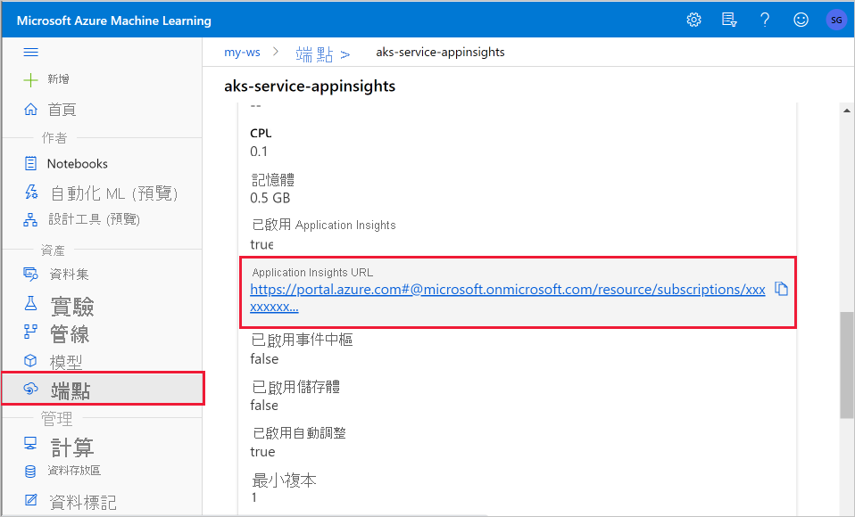
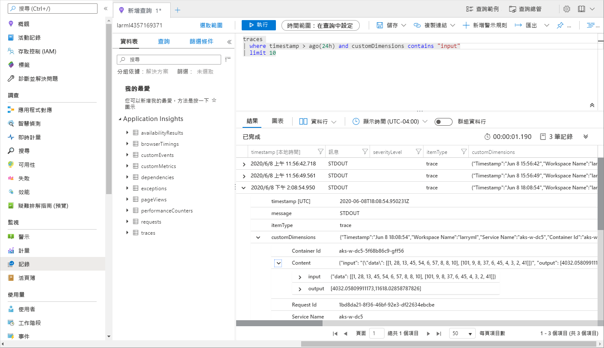

# <a name="monitor-and-collect-data-from-ml-web-service-endpoints"></a>從 ML Web 服務端點監視及收集資料


在本文中，您將瞭解如何從部署至 Azure Kubernetes Service (AKS) 中的 web 服務端點的模型，或 (ACI) 的 Azure 容器實例中收集資料。 使用 [Azure 應用程式見解](../azure-monitor/app/app-insights-overview.md) 從端點收集下列資料：
* 輸出資料
* 回應
* 要求速率、回應時間和失敗率
* 相依性速率、回應時間和失敗率
* 例外狀況

.Ipynb 筆記本中的「 [啟用-應用程式-深入](https://github.com/Azure/MachineLearningNotebooks/blob/master/how-to-use-azureml/deployment/enable-app-insights-in-production-service/enable-app-insights-in-production-service.ipynb) 解析」會示範本文中的概念。
 
[!INCLUDE [aml-clone-in-azure-notebook](../../includes/aml-clone-for-examples.md)]
 
## <a name="prerequisites"></a>必要條件

* Azure 訂用帳戶-試用 [免費或付費版本的 Azure Machine Learning](https://aka.ms/AMLFree)。

* 已安裝 Azure Machine Learning 工作區、包含指令碼的本機目錄，以及適用於 Python 的 Azure Machine Learning SDK。 若要深入瞭解，請參閱 [如何設定開發環境](how-to-configure-environment.md)。

* 定型的機器學習模型。 若要深入瞭解，請參閱「 [訓練影像分類模型](tutorial-train-models-with-aml.md) 」教學課程。

<a name="python"></a>

## <a name="configure-logging-with-the-python-sdk"></a>使用 Python SDK 設定記錄

在本節中，您會瞭解如何使用 Python SDK 來啟用應用程式深入解析記錄。 

### <a name="update-a-deployed-service"></a>更新已部署的服務

使用下列步驟來更新現有的 web 服務：

1. 識別您工作區中的服務。 的值 `ws` 是工作區的名稱。

    ```python
    from azureml.core.webservice import Webservice
    aks_service= Webservice(ws, "my-service-name")
    ```
2. 更新您的服務並啟用 Azure 應用程式見解

    ```python
    aks_service.update(enable_app_insights=True)
    ```

### <a name="log-custom-traces-in-your-service"></a>記錄您服務中的自訂追蹤

> [!IMPORTANT]
> Azure 應用程式 Insights 只會記錄最多64kb 的承載。 如果達到此限制，您可能會看到錯誤，例如記憶體不足，或未記錄任何資訊。 如果您想要記錄的資料較大64kb，則應該使用在 [生產環境中收集模型資料](how-to-enable-data-collection.md)的資訊，將資料儲存至 blob 儲存體。
>
> 針對更複雜的情況，例如 AKS 部署內的模型追蹤，我們建議使用協力廠商程式庫，例如 [OpenCensus](https://opencensus.io)。

若要記錄自訂追蹤，請在 [ [如何部署] 和](how-to-deploy-and-where.md) [檔] 中遵循 AKS 或 ACI 的標準部署程式。 然後，使用下列步驟：

1. 藉由加入 print 語句來更新評分檔案，以便在推斷期間將資料傳送至 Application Insights。 如需更複雜的資訊，例如要求資料和回應，請使用 JSON 結構。 

    下列範例檔案 `score.py` 會記錄模型初始化的時間、推斷期間的輸入和輸出，以及發生任何錯誤的時間。

    
    ```python
    import pickle
    import json
    import numpy 
    from sklearn.externals import joblib
    from sklearn.linear_model import Ridge
    from azureml.core.model import Model
    import time

    def init():
        global model
        #Print statement for appinsights custom traces:
        print ("model initialized" + time.strftime("%H:%M:%S"))
        
        # note here "sklearn_regression_model.pkl" is the name of the model registered under the workspace
        # this call should return the path to the model.pkl file on the local disk.
        model_path = Model.get_model_path(model_name = 'sklearn_regression_model.pkl')
        
        # deserialize the model file back into a sklearn model
        model = joblib.load(model_path)
    

    # note you can pass in multiple rows for scoring
    def run(raw_data):
        try:
            data = json.loads(raw_data)['data']
            data = numpy.array(data)
            result = model.predict(data)
            # Log the input and output data to appinsights:
            info = {
                "input": raw_data,
                "output": result.tolist()
                }
            print(json.dumps(info))
            # you can return any datatype as long as it is JSON-serializable
            return result.tolist()
        except Exception as e:
            error = str(e)
            print (error + time.strftime("%H:%M:%S"))
            return error
    ```

2. 更新服務設定，並確定啟用 Application Insights。
    
    ```python
    config = Webservice.deploy_configuration(enable_app_insights=True)
    ```

3. 建置映像並將其部署在 AKS 或 ACI 上。 如需詳細資訊，請參閱 [如何部署和位置](how-to-deploy-and-where.md)。


### <a name="disable-tracking-in-python"></a>在 Python 中停用追蹤

若要停用 Azure 應用程式 Insights，請使用下列程式碼：

```python 
## replace <service_name> with the name of the web service
<service_name>.update(enable_app_insights=False)
```

<a name="studio"></a>

## <a name="configure-logging-with-azure-machine-learning-studio"></a>使用 Azure Machine Learning studio 設定記錄

您也可以從 Azure Machine Learning studio 啟用 Azure 應用程式見解。 當您準備好將模型部署為 web 服務時，請使用下列步驟來啟用 Application Insights：

1. 登入 studio https://ml.azure.com 。
1. 移至 [ **模型** ]，然後選取您想要部署的模型。
1. 選取 [  **+ 部署**]。
1. 填入「 **部署模型** 」表單。
1. 展開 [ **Advanced** ] 功能表。

    
1. 選取 [ **啟用 Application Insights 診斷和資料收集**]。

    

## <a name="view-metrics-and-logs"></a>查看計量和記錄

### <a name="query-logs-for-deployed-models"></a>已部署模型的查詢記錄

您可以使用函式 `get_logs()` 來取出先前部署之 web 服務的記錄。 記錄可能包含部署期間發生之任何錯誤的相關詳細資訊。

```python
from azureml.core.webservice import Webservice

# load existing web service
service = Webservice(name="service-name", workspace=ws)
logs = service.get_logs()
```

### <a name="view-logs-in-the-studio"></a>查看 studio 中的記錄

Azure 應用程式 Insights 會將您的服務記錄儲存在與 Azure Machine Learning 工作區相同的資源群組中。 使用下列步驟來使用 studio 來查看您的資料：

1. 移至您在 [studio](https://ml.azure.com/)中的 Azure Machine Learning 工作區。
1. 選取 [端點]  。
1. 選取已部署的服務。
1. 選取 **Application Insights url** ] 連結。

    [](././media/how-to-enable-app-insights/appinsightsloc.png#lightbox)

1. 在 Application Insights 中，從 [ **總覽** ] 索引標籤或 [ __監視__ ] 區段中，選取 [ __記錄__]。

    [![監視的 [總覽] 索引標籤](./media/how-to-enable-app-insights/overview.png)](./media/how-to-enable-app-insights/overview.png#lightbox)

1. 若要從 score.py 檔中查看記錄的資訊，請查看 __追蹤__ 資料表。 下列查詢會搜尋已記錄 __輸入__ 值的記錄：

    ```kusto
    traces
    | where customDimensions contains "input"
    | limit 10
    ```

   [](././media/how-to-enable-app-insights/model-data-trace.png#lightbox)

如需有關如何使用 Azure 應用程式 Insights 的詳細資訊，請參閱 [什麼是 Application Insights？](../azure-monitor/app/app-insights-overview.md)。

## <a name="web-service-metadata-and-response-data"></a>Web 服務中繼資料和回應資料

> [!IMPORTANT]
> Azure 應用程式 Insights 只會記錄最多64kb 的承載。 如果達到此限制，您可能會看到錯誤，例如記憶體不足，或未記錄任何資訊。

若要記錄 web 服務要求資訊，請將 `print` 語句加入至 score.py 檔案。 每個語句都會在 `print` 訊息底下的 Application Insights 追蹤資料表中產生一個專案 `STDOUT` 。 Application Insights 會將 `print` 語句輸出儲存在  `customDimensions` `Contents` 追蹤資料表中和。 列印 JSON 字串會在下的追蹤輸出中產生階層式資料結構 `Contents` 。

## <a name="export-data-for-retention-and-processing"></a>匯出保留和處理的資料

>[!Important]
> Azure 應用程式 Insights 僅支援匯出至 blob 儲存體。 如需此實作為限制的詳細資訊，請參閱 [從 App Insights 匯出遙測](https://docs.microsoft.com/azure/azure-monitor/app/export-telemetry#continuous-export-advanced-storage-configuration)。

使用 Application Insights 的 [連續匯出](https://docs.microsoft.com/azure/azure-monitor/app/export-telemetry) ，將資料匯出至 blob 儲存體帳戶，您可以在其中定義保留設定。 Application Insights 會以 JSON 格式匯出資料。 

:::image type="content" source="media/how-to-enable-app-insights/continuous-export-setup.png" alt-text="連續匯出":::

## <a name="next-steps"></a>後續步驟

在本文中，您已瞭解如何啟用 web 服務端點的記錄和查看記錄。 請嘗試下列文章以取得後續步驟：


* [如何將模型部署至 AKS 叢集](https://docs.microsoft.com/azure/machine-learning/how-to-deploy-azure-kubernetes-service)

* [如何將模型部署至 Azure 容器實例](https://docs.microsoft.com/azure/machine-learning/how-to-deploy-azure-container-instance)

* [MLOps：使用 Azure Machine Learning 管理、部署及監視模型](https://docs.microsoft.com/azure/machine-learning/concept-model-management-and-deployment) ，以深入瞭解如何利用從生產環境中的模型收集的資料。 這類資料有助於持續改善您的機器學習程式。
