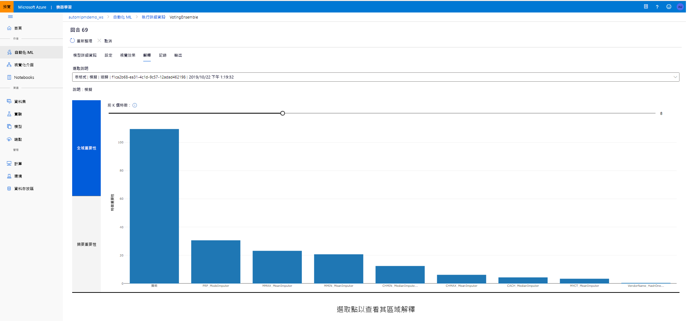

# <a name="interpretability-model-explanations-in-automated-machine-learning"></a>可解釋性:自動化機器學習中的模型說明

[!INCLUDE [applies-to-skus](../../includes/aml-applies-to-basic-enterprise-sku.md)]

在本文中,您將瞭解如何在 Azure 機器學習中獲取有關自動機器學習 (ML) 的說明。 自動 ML 可説明您瞭解工程功能的重要性。 

默認情況下設置`model_explainability=True`1.0.85 後的所有 SDK 版本。 在 SDK 版本 1.0.85`model_explainability=True`和`AutoMLConfig`早期版本中, 使用者需要在物件中設置,以便使用模型可解釋性。 

在本文中，您將學會如何：

- 在培訓期間執行最佳模型或任何模型的可解釋性。
- 啟用視覺化效果,以説明您檢視資料和說明中的模式。
- 在推理或評分期間實現可解釋性。

## <a name="prerequisites"></a>Prerequisites

- 可解釋性功能。 運行`pip install azureml-interpret azureml-contrib-interpret`以獲取所需的包。
- 構建自動 ML 實驗的知識。 有關如何使用 Azure 機器學習 SDK 的詳細資訊,請完成此[回歸模型教學](tutorial-auto-train-models.md)或瞭解如何[設定自動 ML 實驗](how-to-configure-auto-train.md)。

## <a name="interpretability-during-training-for-the-best-model"></a>最佳模型培訓期間的可解釋性

從 中檢索`best_run`說明 ,其中包括工程特徵的說明。

### <a name="download-engineered-feature-importance-from-artifact-store"></a>從工件商店下載工程功能重要性

您可以使用`ExplanationClient`從的項目儲存下載專案特徵`best_run`。 

```python
from azureml.explain.model._internal.explanation_client import ExplanationClient

client = ExplanationClient.from_run(best_run)
engineered_explanations = client.download_model_explanation(raw=False)
print(engineered_explanations.get_feature_importance_dict())
```

## <a name="interpretability-during-training-for-any-model"></a>任何模型的培訓期間的可解釋性 

當您計算模型解釋並可視化它們時,您並不限於自動 ML 模型的現有模型解釋。 您還可以取得具有不同測試資料的模型說明。 本節中的步驟演示如何根據測試數據計算和可視化工程要素的重要性。

### <a name="retrieve-any-other-automl-model-from-training"></a>從培訓中檢索任何其他自動ML模型

```python
automl_run, fitted_model = local_run.get_output(metric='accuracy')
```

### <a name="set-up-the-model-explanations"></a>設定模型說明

用於`automl_setup_model_explanations`獲取工程說明。 可以`fitted_model`產生以下項目:

- 來自經過培訓或測試樣品的精選數據
- 專案特徵名稱清單
- 類別配置的類別的類別

`automl_explainer_setup_obj`包含上述清單中的所有結構。

```python
from azureml.train.automl.runtime.automl_explain_utilities import automl_setup_model_explanations

automl_explainer_setup_obj = automl_setup_model_explanations(fitted_model, X=X_train, 
                                                             X_test=X_test, y=y_train, 
                                                             task='classification')
```

### <a name="initialize-the-mimic-explainer-for-feature-importance"></a>初始化模擬直譯器,使其具有功能重要性

要生成 AutoML 模型的說明,`MimicWrapper`請使用 類。 您可以使用以下參數初始化模擬包裝器:

- 直譯器設定物件
- 您的工作區
- LightGBM 模型,用作自動 ML`fitted_model`模型的替代項

類比包裝器還獲取將上`automl_run`載 工程解釋的物件。

```python
from azureml.explain.model.mimic.models.lightgbm_model import LGBMExplainableModel
from azureml.explain.model.mimic_wrapper import MimicWrapper

# Initialize the Mimic Explainer
explainer = MimicWrapper(ws, automl_explainer_setup_obj.automl_estimator, LGBMExplainableModel, 
                         init_dataset=automl_explainer_setup_obj.X_transform, run=automl_run,
                         features=automl_explainer_setup_obj.engineered_feature_names, 
                         feature_maps=[automl_explainer_setup_obj.feature_map],
                         classes=automl_explainer_setup_obj.classes)
```

### <a name="use-mimicexplainer-for-computing-and-visualizing-engineered-feature-importance"></a>使用模擬直易器計算和視覺化專案要素重要性

您可以使用轉換後的`explain()`測試 範例在 MimicWrapper 中調用該方法,以獲得生成的工程要素的功能重要性。 您還可以使用查看`ExplanationDashboard`自動 ML 推土機生成的工程要素要素要素重要性值的儀錶板可視化效果。

```python
engineered_explanations = explainer.explain(['local', 'global'], eval_dataset=automl_explainer_setup_obj.X_test_transform)
print(engineered_explanations.get_feature_importance_dict())
```

### <a name="interpretability-during-inference"></a>推理過程中的可解釋性

在本節中,您將瞭解如何使用用於計算上一節中說明的說明器操作自動 ML 模型。

### <a name="register-the-model-and-the-scoring-explainer"></a>註冊模型和評分直譯器

使用`TreeScoringExplainer`創建評分解釋器,該直譯器將在推理時計算工程要素重要性值。 使用此選項計算的初始化評分直`feature_map`譯器 。 

保存評分解釋器,然後將模型和評分解釋器註冊到模型管理服務。 執行下列程式碼：

```python
from azureml.interpret.scoring.scoring_explainer import TreeScoringExplainer, save

# Initialize the ScoringExplainer
scoring_explainer = TreeScoringExplainer(explainer.explainer, feature_maps=[automl_explainer_setup_obj.feature_map])

# Pickle scoring explainer locally
save(scoring_explainer, exist_ok=True)

# Register trained automl model present in the 'outputs' folder in the artifacts
original_model = automl_run.register_model(model_name='automl_model', 
                                           model_path='outputs/model.pkl')

# Register scoring explainer
automl_run.upload_file('scoring_explainer.pkl', 'scoring_explainer.pkl')
scoring_explainer_model = automl_run.register_model(model_name='scoring_explainer', model_path='scoring_explainer.pkl')
```

### <a name="create-the-conda-dependencies-for-setting-up-the-service"></a>建立用於設定服務的 conda 相依項

接下來,在容器中為部署的模型創建必要的環境依賴項。 請注意,版本>= 1.0.45 的 azureml 預設值必須列為 pip 依賴項,因為它包含將模型託管為 Web 服務所需的功能。

```python
from azureml.core.conda_dependencies import CondaDependencies

azureml_pip_packages = [
    'azureml-interpret', 'azureml-train-automl', 'azureml-defaults'
]

myenv = CondaDependencies.create(conda_packages=['scikit-learn', 'pandas', 'numpy', 'py-xgboost<=0.80'],
                                 pip_packages=azureml_pip_packages,
                                 pin_sdk_version=True)

with open("myenv.yml","w") as f:
    f.write(myenv.serialize_to_string())

with open("myenv.yml","r") as f:
    print(f.read())

```

### <a name="deploy-the-service"></a>部署服務

使用 conda 檔和前面步驟中的評分檔部署服務。

```python
from azureml.core.webservice import Webservice
from azureml.core.webservice import AciWebservice
from azureml.core.model import Model, InferenceConfig
from azureml.core.environment import Environment

aciconfig = AciWebservice.deploy_configuration(cpu_cores=1,
                                               memory_gb=1,
                                               tags={"data": "Bank Marketing",  
                                                     "method" : "local_explanation"},
                                               description='Get local explanations for Bank marketing test data')
myenv = Environment.from_conda_specification(name="myenv", file_path="myenv.yml")
inference_config = InferenceConfig(entry_script="score_local_explain.py", environment=myenv)

# Use configs and models generated above
service = Model.deploy(ws,
                       'model-scoring',
                       [scoring_explainer_model, original_model],
                       inference_config,
                       aciconfig)
service.wait_for_deployment(show_output=True)
```

### <a name="inference-with-test-data"></a>使用測試資料的推理

使用一些測試數據進行推理,以從自動 ML 模型中查看預測值。 查看工程要素對預測值的重要性。

```python
if service.state == 'Healthy':
    # Serialize the first row of the test data into json
    X_test_json = X_test[:1].to_json(orient='records')
    print(X_test_json)
    # Call the service to get the predictions and the engineered explanations
    output = service.run(X_test_json)
    # Print the predicted value
    print(output['predictions'])
    # Print the engineered feature importances for the predicted value
    print(output['engineered_local_importance_values'])
```

### <a name="visualize-to-discover-patterns-in-data-and-explanations-at-training-time"></a>視覺化以在培訓時發現數據和解釋中的模式

您可以在[Azure 機器學習工作室](https://ml.azure.com)的工作區中可視化要素重要性圖表。 自動 ML 執行完成後,選擇 **「查看模型詳細資訊**以檢視特定運行」。 選擇 **「說明」** 選項卡以查看說明可視化儀錶板。

[](./media/how-to-machine-learning-interpretability-automl/automl-explainability.png#lightbox)

## <a name="next-steps"></a>後續步驟

有關如何在 Azure 機器學習 SDK(而非自動機器學習)區域中啟用模型說明和功能重要性的詳細資訊,請參閱[有關可解釋性的概念文章](how-to-machine-learning-interpretability.md)。
