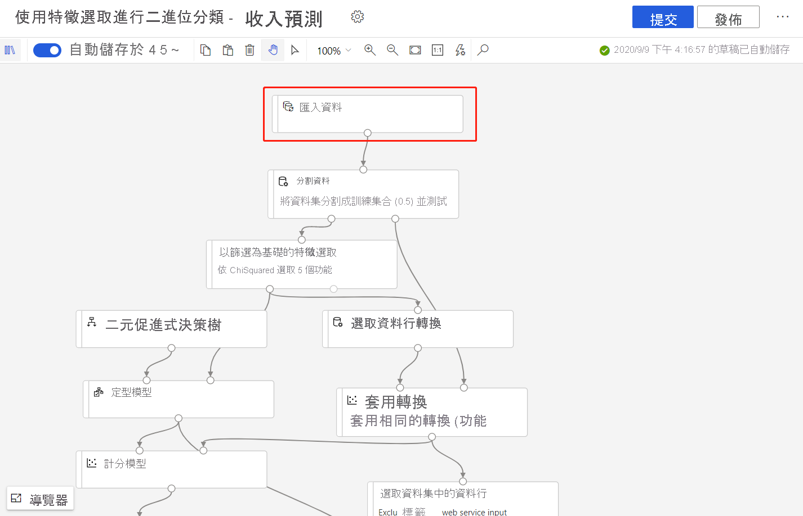

# 使用 Azure Machine Learning 設計工具 (預覽) 重新定型模型
[!INCLUDE [applies-to-skus](../../includes/aml-applies-to-enterprise-sku.md)]

在本操作操作者文章中，您將瞭解如何使用 Azure 機器學習設計器重新訓練機器學習模型。 瞭解如何使用已發佈的管道自動執行機器學習工作流以進行再培訓。

在本文中，您將學會如何：

> [!div class="checklist"]
> * 將機器學習模型定型。
> * 創建管道參數。
> * 發佈培訓管道。
> * 重新訓練模型。

## Prerequisites

* Azure 訂用帳戶。 如果沒有 Azure 訂閱，請創建[一個免費帳戶](https://aka.ms/AMLFree)。
* 具有企業 SKU 的 Azure 機器學習工作區。

本文假定您具備在設計器中構建管道的基本知識。 如需設計工具的導引簡介，請完成[教學課程](tutorial-designer-automobile-price-train-score.md)。 

### 範例管線

本文中使用的管道是[示例 3：收入預測](how-to-designer-sample-classification-predict-income.md)中找到的管道的更改版本。 它使用[導入資料](algorithm-module-reference/import-data.md)模組而不是示例資料集來演示如何使用自己的資料訓練模型。

## 訓練機器學習模型

要重新訓練模型，您需要一個初始模型。 在本節中，您將瞭解如何使用設計器訓練模型並訪問保存的模型。

1. 選擇 **"導入資料**"模組。
1. 在屬性窗格中，指定資料來源。

   

   在此示例中，資料存儲在[Azure 資料存儲](how-to-access-data.md)中。 如果還沒有資料存儲，則可以現在通過選擇 **"新建資料存儲**"來創建一個資料存儲。

1. 指定資料的路徑。 您還可以選擇 **"流覽路徑"** 以流覽到資料存儲。 
1. 在畫布頂部選擇 **"提交**"。
    
   > [!NOTE]
   > 如果已為此管道草稿設置預設計算，則管道將自動運行。 否則，您可以按照設置窗格上的提示立即設置設置。

### 查找您訓練的模型

設計器將所有管道輸出（包括經過訓練的模型）保存到預設存儲帳戶。 但是，您也可以直接在設計器中訪問經過訓練的模型：

1. 等待管道完成運行。
1. 選取 **訓練模型** 模組。
1. 在"設置"窗格中，選擇 **"輸出\日誌**"。
1. 選擇 **"查看輸出**"圖示，然後按照快顯視窗中的說明查找已訓練的模型。

## 創建管道參數

將管道參數添加到運行時動態設置變數。 對於此管道，為訓練資料路徑添加參數，以便您可以在新資料集上重新訓練模型。

1. 選擇 **"導入資料**"模組。
1. 在"設置"窗格中，選擇 **"路徑"** 欄位上方的橢圓。
1. 選擇 **"添加到管道"參數**。
1. 提供參數名稱和預設值。

   > [!NOTE]
   > 您可以通過選擇管道拔模標題旁邊的 **"設置**齒輪"圖示來檢查和編輯管道參數。 

## 發佈培訓管道

發佈管道時，它會創建管道終結點。 管道終結點允許您重用和管理管道，實現可重複性和自動化。 在此示例中，您已設置用於重新訓練的管道。

1. 選擇 **"在**設計器畫布上方發佈"。
1. 選擇或創建管道終結點。

   > [!NOTE]
   > 您可以將多個管道發佈到單個終結點。 終結點中的每個管道都提供一個版本號，您可以在調用管道終結點時指定該版本號。

1. 選取 [發行]****。

## 重新訓練模型

現在，您已經發佈了培訓管道，您可以使用它使用新資料重新訓練模型。 可以從 Azure 門戶提交從管道終結點提交的運行，也可以以程式設計方式提交。

### 使用設計器提交運行

使用以下步驟提交從設計器運行的管道終結點：

1. 轉到 **"終結點"** 頁。
1. 選擇 **"管道終結點**"選項卡。
1. 選擇管道終結點。
1. 選擇 **"已發佈管道"** 選項卡。
1. 選擇要運行的管道。
1. 選取 [提交]****。
1. 在設置對話方塊中，可以為輸入資料路徑值指定新值。 此值指向新資料集。

### 使用代碼提交運行

您可以在概述面板中找到已發佈管道的 REST 終結點。 通過調用終結點，可以重新訓練已發佈的管道。

要進行 REST 調用，您需要一個 OAuth 2.0 承載式身份驗證標頭。 有關將身份驗證設置為工作區和進行參數化 REST 調用的資訊，請參閱構建[Azure 機器學習管道以進行批次處理評分](tutorial-pipeline-batch-scoring-classification.md#publish-and-run-from-a-rest-endpoint)。

## 後續步驟

按照[設計器教程](tutorial-designer-automobile-price-train-score.md)來訓練和部署回歸模型。
