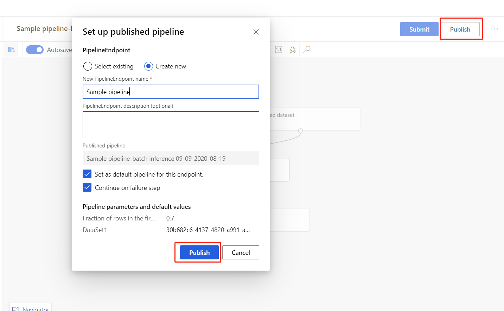
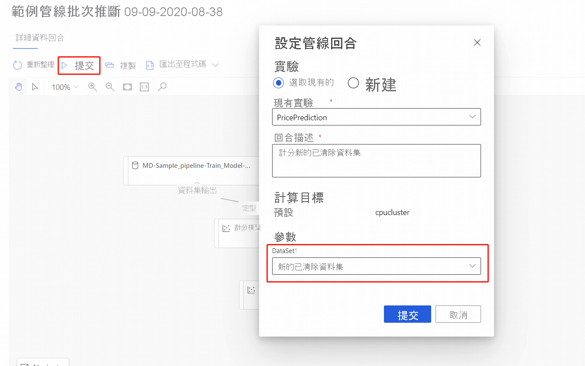

# 使用 Azure Machine Learning 設計工具執行批次預測 (預覽)
[!INCLUDE [applies-to-skus](../../includes/aml-applies-to-enterprise-sku.md)]

在本文中，您將瞭解如何使用設計器創建批次處理預測管道。 批次處理預測允許您使用可以從任何 HTTP 庫觸發的 Web 服務持續按需對大型資料集進行評分。

在此操作操作中，您將學習執行以下任務：

> [!div class="checklist"]
> * 創建和發佈批次處理推理管道
> * 使用管道終結點
> * 管理終結點版本

要瞭解如何使用 SDK 設置批次處理評分服務，請參閱隨附的["如何"](how-to-run-batch-predictions.md)

## Prerequisites

此如何假定您已經具有培訓管道。 有關設計師的導覽介紹，請完成[設計器教程的第一部分](tutorial-designer-automobile-price-train-score.md)。 

## 建立批次推斷管線

您的訓練管道必須至少運行一次才能創建推斷管道。

1. 轉到工作區中的 **"設計器"** 選項卡。

1. 選擇訓練要用於預測模型的訓練管道。

1. **提交**管道。

    

現在訓練管道已經運行，您可以創建批次處理推理管道。

1. 在 **"提交"** 旁邊，選擇新的下拉清單**創建推理管道**。

1. 選擇**批次處理推理管道**。

    
    
結果將是預設批次推斷管線。 

### 添加管道參數

要創建新資料的預測，可以在此管道草稿視圖中手動連接其他資料集，也可以為資料集創建參數。 參數允許您更改運行時批次處理推斷過程的行為。

在本節中，您將創建一個資料集參數來指定要進行預測的不同資料集。

1. 選擇資料集模組。

1. 畫布右側將顯示一個窗格。 在窗格的底部，選擇 **"設置為管道參數**"。
   
    輸入參數的名稱，或接受預設值。

## 發佈批次處理推斷管道

現在，您已準備好部署推斷管道。 這將部署管道，並使它可供其他人使用。

1. 選取 [發佈]**** 按鈕。

1. 在顯示的對話方塊中，展開**管道終結點**的下拉清單，然後選擇 **"新建管道終結點**"。

1. 提供終結點名稱和可選說明。

    在對話方塊底部附近，您可以看到使用定型期間使用的資料集 ID 的預設值配置的參數。

1. 選取 [發行]****。

## 使用終結點

現在，您有一個已發佈的管道，具有資料集參數。 管道將使用在訓練管道中創建的定型模型來對作為參數提供的資料集進行評分。

### 提交管道運行 

在本節中，您將設置手動管道運行並更改管道參數以為新資料評分。 

1. 部署完成後，轉到 **"終結點"** 部分。

1. 選擇**管道終結點**。

1. 選擇您創建的終結點的名稱。

1. 選擇**已發佈的管道**。

    此螢幕顯示在此終結點下發布的所有已發佈的管道。

1. 選擇您發佈的管道。

    管道詳細資訊頁顯示管道的詳細執行歷程記錄和連接字串資訊。 
    
1. 選擇 **"提交**"以創建管道的手動運行。

    
    
1. 更改參數以使用其他資料集。
    
1. 選擇 **"提交**"以運行管道。

### 使用 REST 終結點

您可以在 **"終結點"** 部分中查找有關如何使用管道終結點和已發佈的管道的資訊。

您可以在運行概述面板中找到管道終結點的 REST 終結點。 通過調用終結點，您將使用其預設發佈的管道。

您還可以在 **"已發佈"管道**頁中使用已發佈的管道。 選擇已發佈的管道並查找其 REST 終結點。 

要進行 REST 調用，您需要一個 OAuth 2.0 承載式身份驗證標頭。 若要進一步了解如何設定對工作區進行驗證以及如何進行參數化 REST 呼叫，請參閱下列[教學課程章節](tutorial-pipeline-batch-scoring-classification.md#publish-and-run-from-a-rest-endpoint)。

## 版本控制終結點

設計器將一個版本分配給發佈到終結點的每個後續管道。 您可以在 REST 調用中指定要作為參數執行的管道版本。 如果不指定版本號，設計器將使用預設管道。

發佈管道時，可以選擇使其成為該終結點的新預設管道。

您還可以在終結點的 **"已發佈管道"** 選項卡中設置新的預設管道。

## 後續步驟

依照設計工具[教學課程](tutorial-designer-automobile-price-train-score.md)的指示來定型和部署迴歸模型。
''