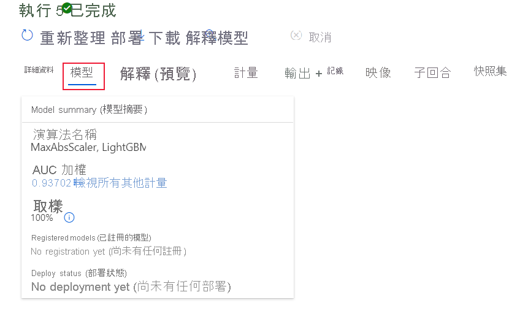

# 使用 Azure Machine Learning 建立、檢閱和部署自動化機器學習模型
[!INCLUDE [applies-to-skus](../../includes/aml-applies-to-enterprise-sku.md)]

在本文中，您將瞭解如何在 Azure Machine Learning studio 中不使用一行程式碼，建立、探索及部署自動化機器學習模型。

>[!IMPORTANT]
> Azure Machine Learning Studio 中的自動化 ML 體驗目前處於預覽狀態。 可能不支援特定功能，或功能受到限制。

 自動化機器學習是針對特定資料來選取最佳機器學習服務演算法的流程。 此流程可讓您快速產生機器學習模型。 [深入了解自動化機器學習](concept-automated-ml.md)。
 
如需端對端範例，請嘗試[使用 Azure Machine Learning 自動化 ML 介面建立分類模型的教學課程](tutorial-first-experiment-automated-ml.md)。 

如需以 Python 程式碼為基礎的體驗，請使用 Azure Machine Learning SDK [設定自動化機器學習實驗](how-to-configure-auto-train.md)。

## Prerequisites

* Azure 訂用帳戶。 如果您沒有 Azure 訂用帳戶，請在開始前先建立免費帳戶。 立即試用[免費或付費版本的 Azure Machine Learning](https://aka.ms/AMLFree)。

* **Enterprise 版**的 Azure Machine Learning 工作區。 請參閱[建立 Azure Machine Learning 工作區](how-to-manage-workspace.md)。  若要將現有的工作區升級到 Enterprise 版，請參閱[升級至 Enterprise 版](how-to-manage-workspace.md#upgrade)。

## 開始使用

1. 在 https://ml.azure.com 登入 Azure Machine Learning。 

1. 選取訂用帳戶及工作區。 

1. 巡覽至左側窗格。 選取位於 [撰寫] 區段下的 [自動化 ML]。

 若這是第一次執行任何實驗，則將會看到空白清單，以及前往文件的連結。 

否則，將會看到最近自動化機器學習實驗的清單，其中包括使用 SDK 建立的項目。 

## 建立及執行實驗

1. 選取 [+ 新增自動化 ML 執行] 並填入表單。

1. 從儲存體容器選取資料集，或建立新的資料集。 資料集可從本機檔案、Web URL、資料存放區或 Azure 開放資料集建立。 深入瞭解[資料集建立](how-to-create-register-datasets.md)。  

    >[!Important]
    > 訓練資料的需求：
    >* 資料必須是表格式形式。
    >* 您想要預測的值 (目標資料行) 必須存在於資料中。

    1. 若要從本機電腦上的檔案建立新的資料集，請選取 [ **+ 建立資料集**]，然後選取 [**從本機**檔案]。 

    1. 在 [**基本資訊**] 表單中，為您的資料集指定一個唯一的名稱，並提供選擇性的描述。 

    1. 選取 [下一步] 來開啟 [資料存放區和檔案選取表單]。 在此表單上，您將會選取上傳資料集的位置：與工作區一同自動建立的預設儲存體容器，或選取想要用於實驗的儲存體容器。 
    
        1. 如果您的資料位於虛擬網路後方，您必須啟用 [**略過驗證**] 功能，以確保工作區可以存取您的資料。 深入瞭解[網路隔離與隱私權](how-to-enable-virtual-network.md#machine-learning-studio)。 
    
    1. 選取 **[流覽]** ，上傳您資料集的資料檔案。 

    1. 檢閱 [設定和預覽] 表單以進行確認。 表單會根據檔案類型以智慧方式填入。 

        欄位| 描述
        ----|----
        檔案格式| 定義檔案中所儲存資料的版面配置和類型。
        分隔符號| 一或多個字元，其用來指定純文字或其他資料流中個別獨立區域之間的界限。
        編碼| 識別要用來讀取資料集之字元結構描述資料表的位元。
        資料行標題| 指出資料集標題 (如果有的話) 的處理方式。
        Skip rows (略過資料列) | 指出資料集內略過多少資料列 (如果有的話)。
    
        選取 [下一步] 。

    1. [結構描述] 表單會根據在 [設定與預覽] 表單中選取的項目以智慧方式填入。 請在此處設定每個資料行的資料類型、檢閱資料行名稱，以及選取針對實驗**不要包含**哪些資料行。 
            
        選取 [下一步]。

    1. [確認詳細資料] 表單上會顯示先前在 [基本資訊] 和 [設定與預覽] 表單中填入的資訊摘要。 您也可以選擇使用啟用分析的計算，為資料集建立資料設定檔。 深入了解[資料分析](#profile)。

        選取 [下一步] 。
1. 在新建立的資料集出現後選取該資料集。 您也可以檢視資料集的預覽和範例統計資料。 

1. 在 [設定執行] 表單上，輸入唯一的實驗名稱。

1. 選取目標資料行；這是將要進行預測的資料行。

1. 為資料分析和訓練作業選取計算。 現有的計算清單會出現在下拉式清單中。 若要建立新的計算，請遵循步驟 7 中的指示。

1. 選取 [建立新的計算] 來針對此實驗設定計算內容。

    欄位|描述
    ---|---
    計算名稱| 輸入可識別您計算內容的唯一名稱。
    虛擬機器優先順序| 低優先順序虛擬機器較便宜，但不保證計算節點。 
    虛擬機器類型| 選取 [虛擬機器類型的 CPU 或 GPU]。
    虛擬機器大小| 為您的計算選取虛擬機器大小。
    最小/最大節點數| 若要分析資料，您必須指定一個或多個節點。 輸入所計算的節點數上限。 AML Compute 的預設為 6 個節點。
    進階設定 | 這些設定可讓您為您的實驗設定使用者帳戶和現有的虛擬網路。 
    
    選取 [建立]。 建立新的計算可能會需要數分鐘。

    >[!NOTE]
    > 計算名稱會指出所選/建立的計算是否已「啟用分析」。 (如需詳細資料，請參閱[資料分析](#profile))。

    選取 [下一步] 。

1. 在 [工作類型和設定] 表單上，選取工作類型：分類、迴歸，或預測。 如需詳細資訊，請參閱支援的工作[類型](concept-automated-ml.md#when-to-use-automl-classify-regression--forecast)。

    1. 針對**分類**，您也可以啟用用於文字 featurizations 的深度學習。

    1. 如需**預測**，您可以： 
    
        1. 啟用深度學習
    
        1. 選取*時間資料行*：此資料行包含要使用的時間資料。

        1. 選取 [*預測範圍*]：指出模型能夠預測到未來的時間單位數 (分鐘/小時/天/周/月/年) 。 模型需要針對未來預測的時間越長，其正確性越低。 [深入了解預測及預測範圍](how-to-auto-train-forecast.md)。

1. (選擇性) 檢視其他組態設定：可用來更進一步控制訓練作業的其他設定。 否則會根據實驗選取範圍和資料來套用預設值。 

    其他組態|描述
    ------|------
    主要計量| 用來評分模型的主要計量。 [深入了解模型計量](how-to-configure-auto-train.md#primary-metric)。
    解釋最佳模型 | 選取以啟用或停用，以便顯示建議最佳模型的可解釋性。
    封鎖的演算法| 選取要從訓練作業中排除的演算法。
    結束準則| 當符合其中任何一項準則時，訓練作業即會停止。   訓練作業時間 (小時)：允許訓練作業執行的時間長度。   計量分數閾值：所有管線的最低計量分數。 這可確保若擁有想要達到的已定義目標計量，則不會在訓練作業上花費超過必要程度的時間。
    驗證| 選取要在訓練作業中使用的交叉驗證選項。 [深入了解交叉驗證](how-to-configure-cross-validation-data-splits.md#prerequisites)。
    並行| *並行反覆項目上限*：要在訓練作業中測試的管線 (反覆項目) 數量上限。 作業不會執行超過指定數量的反覆項目。

1.  (選擇性) View 特徵化設定：如果您選擇在 [**其他設定**] 表單中啟用 [**自動特徵化**]，則會套用預設特徵化技術。 在 [ **View 特徵化] 設定**中，您可以變更這些預設值，並據以進行自訂。 瞭解如何[自訂 featurizations](#customize-featurization)。 

    

## 資料分析與摘要統計資料

您可在資料集中取得各式各樣的摘要統計資料來驗證資料集是否已針對 ML 準備就緒。 針對非數值資料行，其僅會包含如最小值、最大值和錯誤計數等基本統計資料。 針對數值資料行，您也可以檢閱其統計時間和估計分位數。 具體而言，資料設定檔包含：

>[!NOTE]
> 針對無關類型特徵顯示的空白項目。

統計資料|描述
------|------
功能| 要進行摘要的資料行名稱。
設定檔| 以推斷類型為基礎的內嵌視覺效果。 例如，字串、布林值和日期會具備值的計數，小數 (數值) 則會包含近似長條圖。 這可供快速了解資料的分佈。
類型分佈| 資料行中類型的內嵌值計數。 Null 為其自身的類型，因此此視覺效果在偵測奇數或遺漏值時相當實用。
類型|資料行的推斷類型。 可能的值包括：字串、布林值、日期和小數。
最小值| 資料行的最小值。 如果特徵的類型沒有固有排序 (例如布林值)，則會顯示空白項目。
最大值| 資料行的最小值。 
Count| 資料行中遺漏和未遺漏項目的總數。
未遺漏計數| 資料行中未遺漏的項目數。 空字串和錯誤都會視為值，因此不會計入「未遺漏計數」中。
分位數| 每個分位數的近似值可供了解資料其分佈。
平均值| 資料行的算術平均數或平均。
標準差| 此資料行資料的離散或變異量量值。
Variance| 此資料行資料從其平均值分散程度的量值。 
偏度| 此資料行資料與常態分佈相異程度的量值。
峰度| 相較於常態分佈，此資料行資料集中於尾端程度的量值。

## 自訂特徵化

在**特徵化**表單中，您可以啟用/停用自動特徵化，並為您的實驗自訂自動特徵化設定。 若要開啟此表單，請參閱[建立和執行實驗](#create-and-run-experiment)一節中的步驟10。 

下表摘要說明目前可透過 studio 取得的自訂專案。 

資料行| 自訂
---|---
已包括 | 指定要包含哪些資料行以進行定型。
功能類型| 變更所選資料行的數值型別。
插補與| 選取要在資料中插補遺漏值的值。

## 執行實驗並檢視結果

選取 [完成] 以執行實驗。 實驗準備流程最多需要 10 分鐘。 訓練作業可能需要額外 2-3 分鐘不等，才能讓每個管線完成執行。

### 檢視實驗詳細資料

[執行詳細資料] 畫面會在 [詳細資料] 索引標籤中開啟。此畫面會顯示實驗執行的摘要，並會在頂端執行編號的旁邊包含狀態列。 

[模型] 索引標籤包含依計量分數所建立的模型清單。 依預設，根據所選計量評分最高的模型會出現在清單頂端。 如果訓練作業嘗試多個模型，系統會將所有結果新增到清單中。 使用此方式快速比較到目前為止所產生的各個模型計量。

### 檢視訓練執行的詳細資料

向下切入任何已完成的模型，以查看定型執行詳細資料，例如 [**模型**] 索引標籤上的模型摘要或 [**計量**] 索引標籤上的效能度量圖表。[深入瞭解圖表](how-to-understand-automated-ml.md)。

## 部署模型

當手邊具備最佳模型時，即可將其作為 Web 服務部署以預測新的資料。

自動化 ML 可協助部署模型，而無須撰寫程式碼：

1. 您有數個部署選項。 

    + 選項1：根據您所定義的度量準則，部署最佳模型。 
        1. 實驗完成後，選取畫面頂端的 [**執行 1** ]，流覽至父執行頁面。 
        1.  選取 [**最佳模型摘要**] 區段中所列的模型。 
        1. 選取視窗左上方的 [**部署**]。 

    + 選項2：從這個實驗部署特定的模型反復專案。
        1. 從 [**模型**] 索引標籤中選取所需的模型
        1. 選取視窗左上方的 [**部署**]。

1. 填入 [部署模型] 窗格。

    欄位| 值
    ----|----
    名稱| 輸入部署的唯一名稱。
    描述| 輸入描述以更清楚地識別此部署的用途。
    計算類型| 選取想要部署的端點類型：*Azure Kubernetes Service (AKS)* 或 *Azure 容器執行個體 (ACI)* 。
    計算名稱| 僅適用於 AKS：選取想要部署的目標 AKS 叢集名稱。
    啟用驗證 | 選取允許以權杖為基礎或以金鑰為基礎的驗證。
    使用自訂部署資產| 若想要上傳自己的評分指令碼和環境檔案，請啟用此功能。 [深入了解評分指令碼](how-to-deploy-and-where.md)。

    >[!Important]
    > 檔案名稱必須少於 32 個字元，且必須以英數字元開始及結束。 其中可包含虛線、底線、點和英數字元。 不允許空格。

    「進階」功能表提供預設部署功能，例如[資料收集](how-to-enable-app-insights.md)和資源使用率設定。 若想要覆寫這些預設，請在此功能表中進行。

1. 選取 [部署]。 部署需要約 20 分鐘才能完成。
    開始部署之後，[**模型摘要**] 索引標籤隨即出現。 請參閱部署**狀態**一節底下的部署進度。 

現在您已擁有可運作的 Web 服務，可用來產生預測！ 您可從 [Power BI 內建的 Azure Machine Learning 支援](how-to-consume-web-service.md#consume-the-service-from-power-bi)以透過查詢服務來測試預測。

## 後續步驟

* [了解如何取用 Web 服務](https://docs.microsoft.com/azure/machine-learning/how-to-consume-web-service)。
* [了解自動化機器學習結果](how-to-understand-automated-ml.md)。
* [深入了解自動化機器學習](concept-automated-ml.md)和 Azure Machine Learning。
