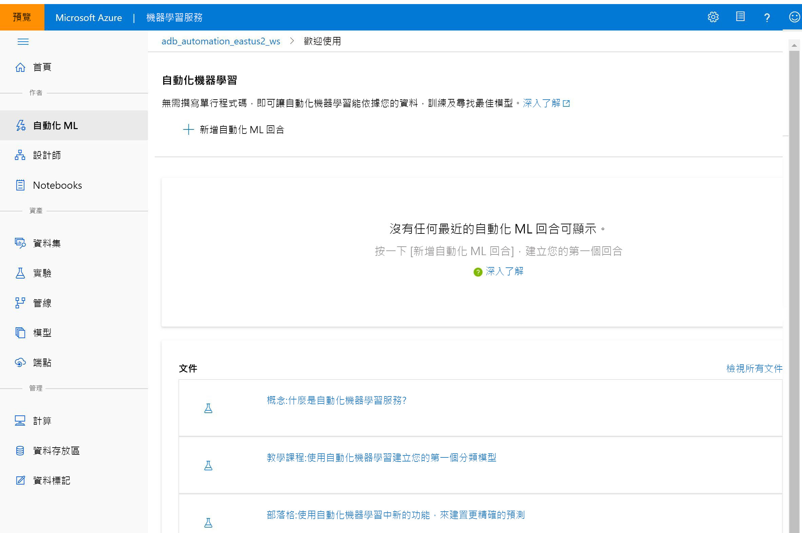

# 什麼是 Azure Machine Learning？

在本文中，您會了解 Azure Machine Learning，這是一種雲端式環境，可用來定型、部署、自動化、管理及追蹤 ML 模型。 

Azure Machine Learning 可用於任何一種機器學習，從傳統 ML 到深度學習、受監督和不受監督的學習。 無論您想要撰寫 Python 或 R 程式碼或使用零程式碼/低程式碼選項 (例如[設計工具](tutorial-designer-automobile-price-train-score.md))，都可以在 Azure Machine Learning 工作區中建立、定型和追蹤高精確度的機器學習和深度學習模型。 

開始訓練您的本機電腦，然後向外擴增到雲端。 

此服務也會與熱門的深度學習和增強式開放原始碼工具 (例如 PyTorch、TensorFlow、scikit-learn 和 Ray RLlib) 交互操作。 

> [!VIDEO https://channel9.msdn.com/Events/Connect/Microsoft-Connect--2018/D240/player]

> [!Tip]
> **免費試用！**  如果您沒有 Azure 訂用帳戶，請在開始前先建立一個免費帳戶。 立即試用[免費或付費版本的 Azure Machine Learning](https://aka.ms/AMLFree)。 即可取得用於 Azure 服務的點數。 信用額度用完之後，您可以保留帳戶並使用[免費的 Azure 服務](https://azure.microsoft.com/free/)。 除非您明確變更您的設定且同意付費，否則我們絕對不會從您的信用卡收取任何費用。

## 什麼是機器學習？

機器學習是一項資料科學技術，可讓電腦使用現有資料來預測未來的行為、結果和趨勢。 使用機器學習，電腦不需要明確進行程式設計就能學習。

機器學習的預測可讓應用程式和裝置更聰明。 例如，當您線上購物時，機器學習服務可根據您已經購買的產品，協助推薦其他您可能會想要的產品。 或是當您的信用卡被刷過時，機器學習服務可將該筆交易與交易資料庫進行比對，協助偵測詐騙。 而且，當您的吸塵器機器人清潔房間時，機器學習服務可協助它判斷作業是否已完成。

## 適用於每個工作的機器學習工具 

Azure Machine Learning 為開發人員和資料科學家提供其機器學習工作流程需要的所有工具，包括：
+ [Azure Machine Learning 設計工具](tutorial-designer-automobile-price-train-score.md) (預覽)：拖放模組可讓您建立實驗，然後部署管線。

+ Jupyter 筆記本：使用我們的[範例筆記本](https://aka.ms/aml-notebooks)或建立您自己的筆記本，將<a href="https://docs.microsoft.com/python/api/overview/azure/ml/intro?view=azure-ml-py" target="_blank">適用於 Python 的 SDK</a> 範例用於機器學習。 

+ R 指令碼或筆記本，您可以在其中使用<a href="https://azure.github.io/azureml-sdk-for-r/reference/index.html" target="_blank">適用於 R 的 SDK</a> 來撰寫您自己的程式碼，或在設計工具中使用 R 模組。

+ + [Many Models Solution Accelerator](https://aka.ms/many-models) (預覽) 建置在 Azure Machine Learning 中，可讓您定型、操作及管理上百個或甚至數千個機器學習模型。

+ [Visual Studio Code 擴充功能](tutorial-setup-vscode-extension.md) \(英文\)

+ [機器學習 CLI](reference-azure-machine-learning-cli.md)

+ 開放原始碼架構，例如 PyTorch、TensorFlow 及 scikit-learn 等等。

+ 使用 Ray RLlib 的[增強式學習](how-to-use-reinforcement-learning.md)

您甚至可使用 [MLflow 來追蹤計量及部署模型](how-to-use-mlflow.md) 或 Kubeflow，以[建置端對端工作流程管線](https://www.kubeflow.org/docs/azure/)。

## 以 Python 或 R 建置 ML 模型

使用 Azure Machine Learning <a href="https://docs.microsoft.com/python/api/overview/azure/ml/intro?view=azure-ml-py" target="_blank">Python SDK</a> 或 <a href="https://azure.github.io/azureml-sdk-for-r/reference/index.html" target="_blank">R SDK</a>，開始訓練您的本機電腦。 然後可以擴增至雲端。 

透過許多可用的[計算目標](how-to-set-up-training-targets.md) (例如 Azure Machine Learning Compute 和 [Azure Databricks](/azure/azure-databricks/what-is-azure-databricks)) 及[進階的超參數微調服務](how-to-tune-hyperparameters.md)，您可以使用雲端功能更快地建置更好的模型。

您也可以使用 SDK，[自動進行模型定型和微調](tutorial-auto-train-models.md)。

## 使用無程式碼的工具建置 ML 模型

若要進行無程式碼或低程式碼的訓練和部署，請嘗試：

+ **Azure Machine Learning 設計工具 (預覽)**

  使用設計工具來準備資料、定型、測試、部署、管理和追蹤機器學習模型，而不需撰寫任何程式碼。 不需要設計程式，就能以視覺化方式連線資料集和模組來建構模型。 試用[設計工具教學課程](tutorial-designer-automobile-price-train-score.md)。

  若要深入了解，請參閱 [Azure Machine Learning 設計工具概觀文章](concept-designer.md)。 

  

+ **自動化機器學習 UI**

  了解如何在易於使用的介面中建立[自動化 ML 實驗](tutorial-first-experiment-automated-ml.md)。 

  

## MLOps：部署和生命週期管理
當您有正確的模型時，您可以在 Web 服務中、在 IoT 裝置上或從 Power BI 輕鬆使用它。 如需詳細資訊，請參閱有關[如何部署和部署位置](how-to-deploy-and-where.md)的文章。

接著，您可以使用[適用於 Python 的 Azure Machine Learning SDK](https://aka.ms/aml-sdk)、[Azure Machine Learning Studio](https://ml.azure.com) 或[機器學習 CLI](reference-azure-machine-learning-cli.md) 來管理所部署的模型。

這些模型可被取用並[即時](how-to-consume-web-service.md)或[非同步](how-to-use-parallel-run-step.md)地傳回大量資料的相關預測。

另外，透過進階[機器學習管線](concept-ml-pipelines.md)，您可以在資料準備、模型定型與評估及部署的每個步驟上共同作業。 管線可讓您執行下列作業：

* 自動化雲端中的端對端機器學習程序
* 重複使用元件，並且只在需要時重新執行步驟
* 在每個步驟中使用不同的計算資源
* 執行批次評分工作

如果您想要使用指令碼來自動化機器學習工作流程，[機器學習 CLI](reference-azure-machine-learning-cli.md) 會提供命令列工具來執行一般工作，例如提交定型回合或部署模型。

若要開始使用 Azure Machine Learning，請參閱以下的[後續步驟](#next-steps)。

## 與其他服務整合

Azure Machine Learning 可與 Azure 平台上的其他服務搭配運作，也可以與 Git 和 MLFlow 等開放原始碼工具整合。

+ 計算目標，例如 __Azure Kubernetes Service__、__Azure 容器執行個體__、__Azure Databricks__、__Azure Data Lake Analytics__ 和 __Azure HDInsight__。 如需計算目標的詳細資訊，請參閱[什麼是計算目標？](concept-compute-target.md)。
+ __Azure 事件方格__。 如需詳細資訊，請參閱[取用 Azure Machine Learning 事件](concept-event-grid-integration.md)。
+ __Azure 監視器__。 如需詳細資訊，請參閱[監視 Azure Machine Learning](monitor-azure-machine-learning.md)。
+ 資料存放區，例如 __Azure 儲存體帳戶__、__Azure Data Lake Storage__、__Azure SQL Database__、__適用於 PostgreSQL 的 Azure 資料庫__和 __Azure 開放資料集__。 如需詳細資訊，請參閱[存取 Azure 儲存體服務中的資料](how-to-access-data.md)和[使用 Azure 開放資料集來建立資料集](how-to-create-register-datasets.md#create-datasets-with-azure-open-datasets)。
+ __Azure 虛擬網路__。 如需詳細資訊，請參閱[虛擬網路中的安全實驗和推斷](how-to-enable-virtual-network.md)。
+ __Azure Pipelines__。 如需詳細資訊，請參閱[定型和部署機器學習服務模型](/azure/devops/pipelines/targets/azure-machine-learning)。
+ __Git 存放庫記錄__。 如需詳細資訊，請參閱 [Git 整合](concept-train-model-git-integration.md)。
+ __MLflow__。 如需詳細資訊，請參閱[使用 MLflow 追蹤計量和部署模型](how-to-use-mlflow.md) 
+ __Kubeflow__。 如需詳細資訊，請參閱[建置端對端工作流程管線](https://www.kubeflow.org/docs/azure/)。

### 安全通訊

您的 Azure 儲存體帳戶、計算目標和其他資源可以在虛擬網路內安全地使用，以定型模型及執行推斷。 如需詳細資訊，請參閱[虛擬網路中的安全實驗和推斷](how-to-enable-virtual-network.md)。

## 基本版和 Enterprise 版

Azure Machine Learning 提供兩個針對您的機器學習需求量身打造的版本：
+ 基本 (正式推出)
+ Enterprise (預覽)

這些版本會決定開發人員和資料科學家可在其工作區中使用哪些機器學習工具。   

基本工作區可讓您繼續使用 Azure Machine Learning，且只針對機器學習過程中所用的 Azure 資源付費。 當 Enterprise 版處於預覽狀態時，該版工作區只會針對其 Azure 使用量計費。 深入了解 Azure Machine Learning [版本概觀和定價頁面](https://azure.microsoft.com/pricing/details/machine-learning/)中提供的內容。 

您會在建立工作區時指派此版本。 而且，系統已為您將預先存在的工作區轉換為基本版。 基本版包含從 2019 年 10 月起正式推出的所有功能。 在您升級至 Enterprise 版之前，這些工作區中使用 Enterprise 版功能所建立的任何實驗，都將繼續以唯讀方式提供給您。 了解如何[將基本工作區升級為 Enterprise 版](how-to-manage-workspace.md#upgrade)。 

客戶須負責支付計算和其他 Azure 資源在這段期間所產生的成本。

## 後續步驟

- 使用您慣用的方法建立您的第一個實驗：
  + [使用 Python 筆記本來定型和部署 ML 模型](tutorial-1st-experiment-sdk-setup.md)
  + [使用 R Markdown 來定型和部署 ML 模型](tutorial-1st-r-experiment.md) 
  + [使用自動化機器學習來定型和部署 ML 模型](tutorial-first-experiment-automated-ml.md) 
  + [使用設計工具的拖放功能進行定型和部署](tutorial-designer-automobile-price-train-score.md) 
  + [使用機器學習 CLI 來定型和部署模型](tutorial-train-deploy-model-cli.md)

- 了解用來建置、最佳化及管理機器學習案例的[機器學習管線](concept-ml-pipelines.md)。

- 進一步閱讀 [Azure Machine Learning 的架構和概念](concept-azure-machine-learning-architecture.md)一文。
