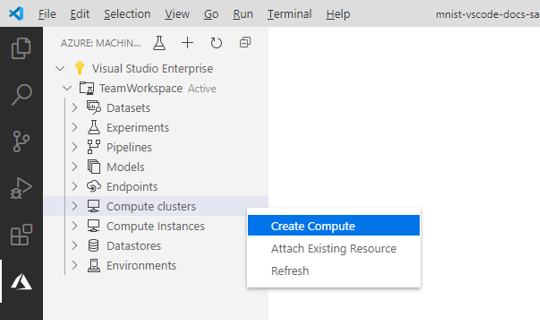
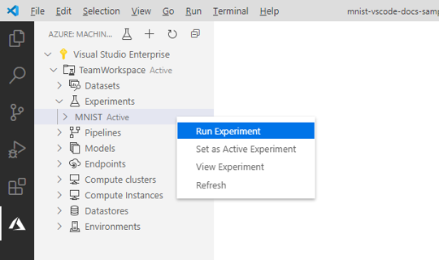
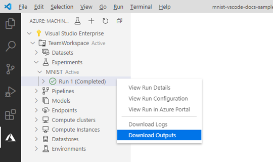

# <a name="train-and-deploy-an-image-classification-tensorflow-model-using-the-azure-machine-learning-visual-studio-code-extension-preview"></a>使用 Azure Machine Learning Visual Studio Code 擴充功能來定型和部署影像分類 TensorFlow 模型 (預覽)

了解如何使用 TensorFlow 和 Azure Machine Learning Visual Studio Code 擴充功能來定型和部署影像分類模型，以辨識手寫數字。

在本教學課程中，您會了解下列工作：

> [!div class="checklist"]
> * 了解程式碼
> * 建立工作區
> * 建立實驗
> * 設定電腦目標
> * 執行組態檔
> * 將模型定型
> * 註冊模型
> * 部署模型

## <a name="prerequisites"></a>必要條件

- Azure 訂用帳戶。 如果您沒有訂用帳戶，請註冊以[試用免費或付費版本的 Azure Machine Learning](https://aka.ms/AMLFree)。
- 安裝 [Visual Studio Code](https://code.visualstudio.com/docs/setup/setup-overview)，這是輕量型、跨平台的程式碼編輯器。
- Azure Machine Learning Studio Visual Studio Code 擴充功能。 如需安裝指示，請參閱[設定 Azure Machine Learning Visual Studio Code 擴充功能教學課程](./tutorial-setup-vscode-extension.md)

## <a name="understand-the-code"></a>了解程式碼

本教學課程的程式碼會使用 TensorFlow 來定型影像分類機器學習模型，以將 0-9 的手寫數字分類。 其做法是建立神經網路，其接受 28 px x 28 px 影像的像素值作為輸入並輸出含有 10 個機率的清單，每個要分類的數字都適用一個機率。 以下是資料的外觀範例。  


下載 [VS Code Tools for AI 存放庫](https://github.com/microsoft/vscode-tools-for-ai/archive/master.zip)並將其解壓縮在電腦上的任何位置，以取得此教學課程的程式碼。

## <a name="create-a-workspace"></a>建立工作區

在 Azure Machine Learning 中建置應用程式所需進行的第一件事，就是建立工作區。 工作區包含用來定型模型的資源，以及已定型的模型本身。 如需詳細資訊，請參閱[何謂工作區](./concept-workspace.md)。 

1. 在 Visual Studio Code 活動列上，選取 **Azure** 圖示，以開啟 Azure Machine Learning 視圖。
1. 以滑鼠右鍵按一下您的 Azure 訂用帳戶，然後選取 [建立工作區]。 
    
    > [!div class="mx-imgBorder"]
    > 

1. 根據預設，產生的名稱包含建立日期和時間。 在文字輸入方塊中，將名稱變更為 "TeamWorkspace"，然後按 **Enter** 。
1. 選取 [建立新的資源群組]。 
1. 將您的資源群組命名為 "TeamWorkspace-rg"，然後按 **輸入** 。 
1. 選擇工作區的位置。 建議您選擇的位置是最接近您打算部署模型的位置。 例如，「美國西部 2」。
1. 當系統提示您選取工作區類型時，請選擇 [基本]。

此時，會向 Azure 提出要求，以在您的帳戶中建立新的工作區。 幾分鐘後，新的工作區就會出現在您的訂用帳戶節點中。 

## <a name="create-an-experiment"></a>建立實驗

您可以在工作區中建立一或多個實驗，以追蹤和分析個別的模型定型回合。 回合可以在 Azure 雲端或您的本機電腦上完成。

1. 在 Visual Studio Code 活動列上，選取 **Azure** 圖示。 Azure Machine Learning 檢視隨即出現。
1. 展開您的訂用帳戶節點。
1. 展開 [TeamWorkspace] 節點。 
1. 以滑鼠右鍵按一下 [Experiments] 節點。
1. 從操作功能表中選取 [建立實驗]。

    > [!div class="mx-imgBorder"]
    > 

1. 將您的實驗命名為 "MNIST"，然後按 **Enter** 以建立新的實驗。 

就像工作區一樣，要求會傳送至 Azure，以使用所提供的組態來建立實驗。 幾分鐘後，新的實驗就會出現在工作區的 [Experiments] 節點中。 

## <a name="configure-compute-targets"></a>設定電腦目標

計算目標是您執行指令碼及部署定型模型的運算資源或環境。 如需詳細資訊，請參閱 [Azure Machine Learning 計算目標文件](./concept-compute-target.md)。

若要建立計算目標：

1. 在 Visual Studio Code 活動列上，選取 **Azure** 圖示。 Azure Machine Learning 檢視隨即出現。 
1. 展開您的訂用帳戶節點。 
1. 展開 [TeamWorkspace] 節點。 
1. 在工作區節點下方，以滑鼠右鍵按一下 [計算叢集] 節點，然後選擇 [建立計算]。 

    > [!div class="mx-imgBorder"]
    > 

1. 選取 [Azure Machine Learning Compute (AMLCompute)]。 Azure Machine Learning Compute 是一種受控的計算基礎結構，可讓使用者輕鬆建立單一或多重節點計算，以供您工作區中的其他使用者使用。
1. 選擇 VM 大小。 從選項清單中選取 **Standard_F2s_v2** 。 您的 VM 大小會影響定型模型所需的時間量。 如需 VM 大小的詳細資訊，請參閱 [Azure 中的 Linux 虛擬機器大小](../virtual-machines/sizes.md)。
1. 將您的計算命名為 "TeamWkspc-com"，然後按 **Enter** 來建立計算。

    檔案會出現在具有類似以下內容的 VS Code 中：

    ```json
    {
        "location": "westus2",
        "tags": {},
        "properties": {
            "computeType": "AmlCompute",
            "description": "",
            "properties": {
                "vmSize": "Standard_F2s_v2",
                "vmPriority": "dedicated",
                "scaleSettings": {
                    "maxNodeCount": 4,
                    "minNodeCount": 0,
                    "nodeIdleTimeBeforeScaleDown": "PT120S"
                }
            }
        }
    }
    ```

1. 當您對組態感到滿意時，請選取 [檢視] > [命令選擇區]以開啟命令選擇區。
1. 在命令選擇區中輸入下列命令，以儲存您的回合組態檔。

    ```text
    Azure ML: Save and Continue
    ```

幾分鐘後，新的計算目標就會出現在工作區的 [計算叢集] 節點中。

## <a name="create-a-run-configuration"></a>建立回合組態

當您將訓練回合提交至計算目標時，您也會提交執行訓練作業所需的組態。 例如，包含定型程式碼的指令碼，以及其執行所需的 Python 相依性。

若要建立回合組態：

1. 在 Visual Studio Code 活動列上，選取 **Azure** 圖示。 Azure Machine Learning 檢視隨即出現。 
1. 展開您的訂用帳戶節點。 
1. 展開 **TeamWorkspace > 計算叢集** 節點。 
1. 在計算節點下方，以滑鼠右鍵按一下 [TeamWkspc-com] 計算節點，然後選擇 [建立回合組態]。

    > [!div class="mx-imgBorder"]
    > 

1. 將您的回合組態命名為 "MNIST-rc"，然後按 **Enter** 來建立回合組態。
1. 然後，選取 [建立新的 Azure ML 環境]。 環境會定義執行指令碼所需的相依性。
1. 將您的環境命名為 "MNIST-env"，然後按 [輸入]。
1. 從清單中選取 [Conda 相依性檔案]。
1. 按 [輸入] 以瀏覽 Conda 相依性檔案。 在此情況下，相依性檔案是位於 `vscode-tools-for-ai/mnist-vscode-docs-sample` 目錄中的 `env.yml` 檔案。

    檔案會出現在具有類似以下內容的 VS Code 中：

    ```json
    {
        "name": "MNIST-env",
        "version": "1",
        "python": {
            "interpreterPath": "python",
            "userManagedDependencies": false,
            "condaDependencies": {
                "name": "vs-code-azure-ml-tutorial",
                "channels": [
                    "defaults"
                ],
                "dependencies": [
                    "python=3.6.2",
                    "tensorflow=1.15.0",
                    "pip",
                    {
                        "pip": [
                            "azureml-defaults"
                        ]
                    }
                ]
            },
            "baseCondaEnvironment": null
        },
        "environmentVariables": {},
        "docker": {
            "baseImage": "mcr.microsoft.com/azureml/base:intelmpi2018.3-ubuntu16.04",
            "baseDockerfile": null,
            "baseImageRegistry": {
                "address": null,
                "username": null,
                "password": null
            },
            "enabled": false,
            "arguments": []
        },
        "spark": {
            "repositories": [],
            "packages": [],
            "precachePackages": true
        },
        "inferencingStackVersion": null
    }
    ```

1. 當您對組態感到滿意後，請開啟命令選擇區並輸入下列命令，以儲存您的組態：

    ```text
    Azure ML: Save and Continue
    ```

1. 此範例不會使用在 Azure Machine Learning 中註冊的資料集。 而是在 train.py 執行時將其載入。 當系統提示您建立訓練執行所需的資料參考時，請在提示字元中輸入 "n"，然後按 **Enter** 。
1. 按 **Enter** ，以瀏覽要在計算節點上執行的指令檔檔案。 在此情況下，用來定型模型的指令碼是 `vscode-tools-for-ai/mnist-vscode-docs-sample` 目錄內的 `train.py` 檔案。

    名為 `MNIST-rc.runconfig` 的檔案會出現在具有類似以下內容的 VS Code 中：

    ```json
    {
        "script": "train.py",
        "arguments": [],
        "framework": "Python",
        "communicator": "None",
        "target": "TeamWkspc-com",
        "environment": {
            "name": "MNIST-env",
            "version": "1",
            "python": {
                "interpreterPath": "python",
                "userManagedDependencies": false,
                "condaDependencies": {
                    "name": "vs-code-azure-ml-tutorial",
                    "channels": [
                        "defaults"
                    ],
                    "dependencies": [
                        "python=3.6.2",
                        "tensorflow=1.15.0",
                        "pip",
                        {
                            "pip": [
                                "azureml-defaults"
                            ]
                        }
                    ]
                },
                "baseCondaEnvironment": null
            },
            "environmentVariables": {},
            "docker": {
                "baseImage": "mcr.microsoft.com/azureml/base:intelmpi2018.3-ubuntu16.04",
                "baseDockerfile": null,
                "baseImageRegistry": {
                    "address": null,
                    "username": null,
                    "password": null
                },
                "enabled": false,
                "arguments": []
            },
            "spark": {
                "repositories": [],
                "packages": [],
                "precachePackages": true
            },
            "inferencingStackVersion": null
        },
        "history": {
            "outputCollection": true,
            "snapshotProject": false,
            "directoriesToWatch": [
                "logs"
            ]
        }
    }
    ```

1. 當您對組態感到滿意後，請開啟命令選擇區並輸入下列命令，以儲存您的組態：

    ```text
    Azure ML: Save and Continue
    ```

`MNIST-rc`回合組態新增至 TeamWkspc-com 計算節點下，而 `MNIST-env` 環境組態會新增至「環境」 節點下。

## <a name="train-the-model"></a>將模型定型

在定型過程中，TensorFlow 模型的建立方式，是針對每個要分類的數字，處理內嵌在其中的定型資料和學習模式。 

若要執行 Azure Machine Learning 實驗：

1. 在 Visual Studio Code 活動列上，選取 **Azure** 圖示。 Azure Machine Learning 檢視隨即出現。 
1. 展開您的訂用帳戶節點。 
1. 展開 [TeamWorkspace] > [Experiments] 節點。 
1. 以滑鼠右鍵按一下 [MNIST] 實驗。
1. 選取 [執行實驗]。

    > [!div class="mx-imgBorder"]
    > 

1. 從計算目標選項清單中，選取 **TeamWkspc-com** 計算目標。
1. 然後，選取 [MNIST-rc] 回合組態。
1. 此時，要求會傳送至 Azure，以在工作區中所選的計算目標上執行您的實驗。 這個程序需要幾分鐘的時間。 執行訓練作業的時間量會受到數個因素的影響，例如計算類型和定型資料大小。 若要追蹤實驗的進度，請以滑鼠右鍵按一下目前的執行節點，然後選取 [在 Azure 入口網站中檢視執行]。
1. 當要求開啟外部網站的對話方塊出現時，請選取 [開啟]。

    > [!div class="mx-imgBorder"]
    > 

當模型完成定型時，執行節點旁的狀態標籤會更新為 [已完成]。

## <a name="register-the-model"></a>註冊模型

既然已將模型定型，您就能在工作區中註冊該模型。 

若要註冊您的模型：

1. 在 Visual Studio Code 活動列上，選取 **Azure** 圖示。 Azure Machine Learning 檢視隨即出現。
1. 展開您的訂用帳戶節點。 
1. 展開 [TeamWorkspace] > [Experiments] > [MNIST] 節點。
1. 取得從定型模型產生的模型輸出。 以滑鼠右鍵按一下 [回合 1] 執行節點，然後選取 [下載輸出]。 

    > [!div class="mx-imgBorder"]
    > 

1. 選擇要儲存所下載輸出的目錄。 根據預設，輸出會置於目前在 Visual Studio Code 中開啟的目錄中。
1. 以滑鼠右鍵按一下 [Models] 節點，然後選擇 [註冊模型]。

    > [!div class="mx-imgBorder"]
    > 

1. 將模型命名為 "MNIST-TensorFlow-model"，然後按 **Enter** 。
1. TensorFlow 模型是由數個檔案所組成。 在選項清單中，選取 [模型資料夾] 作為模型路徑格式。 
1. 選取 `azureml_outputs/Run_1/outputs/outputs/model` 目錄。

    包含您模型組態的檔案會出現在 Visual Studio Code 中，其內容如下所示：

    ```json
    {
        "modelName": "MNIST-TensorFlow-model",
        "tags": {
            "": ""
        },
        "modelPath": "c:\\Dev\\vscode-tools-for-ai\\mnist-vscode-docs-sample\\azureml_outputs\\Run_1\\outputs\\outputs\\model",
        "description": ""
    }
    ```

1. 當您對組態感到滿意後，請開啟命令選擇區並輸入下列命令，以儲存您的組態：

    ```text
    Azure ML: Save and Continue
    ```

幾分鐘後，此模型會出現在 [Models] 節點之下。

## <a name="deploy-the-model"></a>部署模型

在 Visual Studio Code 中，您可以將模型當作 Web 服務部署至：

+ Azure 容器執行個體 (ACI)。
+ Azure Kubernetes Service (AKS)。

您不需要事先建立 ACI 容器來進行測試，因為 ACI 容器會視需要建立。 不過，您需要事先設定 AKS 叢集。 如需部署選項的詳細資訊，請參閱[使用 Azure Machine Learning 部署模型](how-to-deploy-and-where.md)。

若要將 Web 服務部署為 ACI：

1. 在 Visual Studio Code 活動列上，選取 **Azure** 圖示。 Azure Machine Learning 檢視隨即出現。
1. 展開您的訂用帳戶節點。 
1. 展開 [TeamWorkspace] > [Models] 節點。 
1. 以滑鼠右鍵按一下 [MNIST-TensorFlow-model]，然後選取 [從已註冊的模型部署服務]。

    > [!div class="mx-imgBorder"]
    > 

1. 選取 **Azure 容器執行個體** 。
1. 將服務命名為 "mnist-tensorflow-svc"，然後按 **Enter** 。
1. 在輸入方塊中按 **Enter** ，然後瀏覽 `mnist-vscode-docs-sample` 目錄中的 `score.py` 檔案，以選擇要在容器中執行的指令碼。
1. 在輸入方塊中按 **Enter** ，然後瀏覽 `mnist-vscode-docs-sample` 目錄中的 `env.yml` 檔案，以提供執行指令碼所需的相依性。

    包含您模型組態的檔案會出現在 Visual Studio Code 中，其內容如下所示：

    ```json
    {
        "name": "mnist-tensorflow-svc",
        "imageConfig": {
            "runtime": "python",
            "executionScript": "score.py",
            "dockerFile": null,
            "condaFile": "env.yml",
            "dependencies": [],
            "schemaFile": null,
            "enableGpu": false,
            "description": ""
        },
        "deploymentConfig": {
            "cpu_cores": 1,
            "memory_gb": 10,
            "tags": {
                "": ""
            },
            "description": ""
        },
        "deploymentType": "ACI",
        "modelIds": [
            "MNIST-TensorFlow-model:1"
        ]
    }
    ```

1. 當您對組態感到滿意後，請開啟命令選擇區並輸入下列命令，以儲存您的組態：

    ```text
    Azure ML: Save and Continue
    ```

此時，要求會傳送至 Azure 以部署您的 Web 服務。 這個程序需要幾分鐘的時間。 部署後，新的服務就會出現在 [Endpoints] 節點之下。

## <a name="next-steps"></a>後續步驟

* 如需如何使用 Visual Studio Code 外的 Azure Machine Learning 進行定型的逐步解說，請參閱[教學課程：使用 Azure Machine Learning 將模型定型](tutorial-train-models-with-aml.md)。
* 如需在本機編輯、執行和偵錯程式碼的逐步解說，請參閱 [Python Hello World 教學課程](https://code.visualstudio.com/docs/Python/Python-tutorial)。