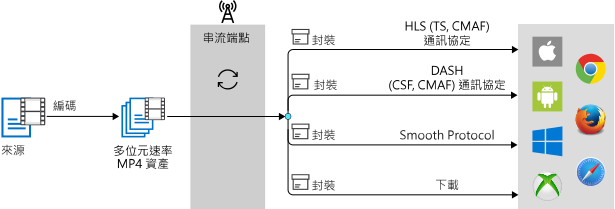

# <a name="dynamic-packaging-in-media-services-v3"></a>媒體服務 v3 中的動態封裝

[!INCLUDE [media services api v3 logo](./includes/v3-hr.md)]

Microsoft Azure 媒體服務可以用來為許多媒體來源檔案格式編碼。 它會透過不同的串流通訊協定 (不論是否有內容保護) 來傳遞這些格式，以聯繫所有主要裝置 (例如 iOS 和 Android 裝置)。 這些用戶端了解不同的通訊協定。 例如，iOS 需要以 HTTP 即時串流 (HLS) 格式傳遞串流，而 Android 裝置則支援 HLS 和 MPEG DASH。

在媒體服務中，[串流端點](streaming-endpoint-concept.md) (原點) 代表動態 (Just-In-Time) 封裝及原始服務，其可將即時且隨選的內容直接傳遞至用戶端播放應用程式。 它會使用下節中所述的其中一種常見串流媒體通訊協定。 「動態封裝」是隨附於所有串流端點的標準功能。

> [!NOTE]
> 您可以使用 [Azure 入口網站](https://portal.azure.com/)來管理 v3 [即時活動](live-events-outputs-concept.md)、檢視 v3 [資產](assets-concept.md)、取得存取 API 的相關資訊。 針對所有其他管理工作 (例如，轉換和作業)，請使用 [REST API](/rest/api/media/)、[CLI](/cli/azure/ams) 或其中一個支援的 [SDK](media-services-apis-overview.md#sdks)。

## <a name="to-prepare-your-source-files-for-delivery"></a>準備來源檔案以進行傳遞

若要利用動態封裝功能，您必須將您的夾層 (來源) 檔案[編碼](encoding-concept.md)成一組多位元速率 MP4 (ISO 基礎媒體 14496-12) 檔案。 您必須具有內含經過編碼的 MP4 的[資產](assets-concept.md)，以及媒體服務動態封裝所需的串流設定檔。 從這組 MP4 檔案中，您可以使用動態封裝透過下面描述的串流媒體通訊協定來傳遞影片。

Azure 媒體服務動態封裝僅支援 MP4 容器格式的影片和音訊檔案。 使用替代的轉碼器 (例如 Dolby) 時，音訊檔案也必須編碼成 MP4 容器。  

> [!TIP]
> 取得 MP4 檔案和串流設定檔的方法之一，是[使用媒體服務編碼您的夾層檔案](#encode-to-adaptive-bitrate-mp4s)。 

若要讓已編碼資產中的視訊可供用戶端播放，您必須建立[串流定位器](streaming-locators-concept.md)並建置串流 URL。 接著，根據串流用戶端資訊清單中指定的格式 (HLS、MPEG DASH 或 Smooth Streaming)，您會以您所選擇的通訊協定接收資料流。

因此，您只需要儲存及支付一種儲存格式之檔案的費用，媒體服務會根據用戶端的要求建置及提供適當的回應。

如果您打算使用媒體服務動態加密來保護您的內容，請參閱[串流通訊協定和加密類型](content-protection-overview.md#streaming-protocols-and-encryption-types)。

### <a name="hls-protocol"></a>HLS 通訊協定

您的串流用戶端可以指定下列 HLS 格式：

|通訊協定|範例|
|---|---|
|HLS V4 |`https://amsv3account-usw22.streaming.media.azure.net/21b17732-0112-4d76-b526-763dcd843449/ignite.ism/manifest(format=m3u8-aapl)`||
|HLS V3 |`https://amsv3account-usw22.streaming.media.azure.net/21b17732-0112-4d76-b526-763dcd843449/ignite.ism/manifest(format=m3u8-aapl-v3)`||
|HLS CMAF| `https://amsv3account-usw22.streaming.media.azure.net/21b17732-0112-4d76-b526-763dcd843449/ignite.ism/manifest(format=m3u8-cmaf)`||

> [!NOTE]
> Apple 先前的指導方針建議，低頻寬網路的後援是提供僅限音訊的串流。  目前，媒體服務編碼器會自動產生僅限音訊的曲目。Apple 指導方針現在會指出「不」應包含僅限音訊的曲目，特別是 Apple TV 散發套件。  為了防止播放機預設為僅限音訊曲目，我們建議在 URL 中使用 “audio-only=false” 標記，在 HLS 中移除僅限音訊轉譯，或僅使用 HLS-V3。 例如： `http://host/locator/asset.ism/manifest(format=m3u8-aapl,audio-only=false)` 。

### <a name="mpeg-dash-protocol"></a>MPEG-DASH 通訊協定

您的串流用戶端可以指定下列 MPEG-DASH 格式：

|通訊協定|範例|
|---|---|
|MPEG-DASH CSF| `https://amsv3account-usw22.streaming.media.azure.net/21b17732-0112-4d76-b526-763dcd843449/ignite.ism/manifest(format=mpd-time-csf)` ||
|MPEG-DASH CMAF|`https://amsv3account-usw22.streaming.media.azure.net/21b17732-0112-4d76-b526-763dcd843449/ignite.ism/manifest(format=mpd-time-cmaf)` ||

### <a name="smooth-streaming-protocol"></a>Smooth Streaming 通訊協定

您的串流用戶端可以指定下列 Smooth Streaming 格式：

|通訊協定|注意事項/範例| 
|---|---|
|Smooth Streaming| `https://amsv3account-usw22.streaming.media.azure.net/21b17732-0112-4d76-b526-763dcd843449/ignite.ism/manifest`||
|Smooth Streaming 2.0 (舊版資訊清單)|根據預設，Smooth Streaming 資訊清單格式包含重複的標記 (r-tag)。 不過，有些播放程式不支援 `r-tag`。 使用這些播放程式的用戶端可以使用停用 r-tag 的格式︰<br/><br/>`https://amsv3account-usw22.streaming.media.azure.net/21b17732-0112-4d76-b526-763dcd843449/ignite.ism/manifest(format=fmp4-v20)`|

> [!NOTE]
> Smooth Streaming 需要音訊和視訊皆存在於您的串流中。

## <a name="on-demand-streaming-workflow"></a>隨選資料流處理工作流程

下列步驟示範常見的媒體服務串流工作流程，其中動態封裝會與 Azure 媒體服務中的標準編碼器一起使用。

1. [上傳輸入檔](job-input-from-http-how-to.md)，例如 MP4、QuickTime/MOV 或其他支援的檔案格式。 此檔案也稱為夾層檔或來源檔案。 如需支援格式的清單，請參閱[標準編碼器所支援的格式](media-encoder-standard-formats.md)。
1. 將夾層檔[編碼](#encode-to-adaptive-bitrate-mp4s)為 H.264/AAC MP4 自適性位元速率集。

    如果您已經有編碼的檔案，而只想要複製和串流該檔案，請使用：[CopyVideo](/rest/api/media/transforms/createorupdate#copyvideo) 和 [CopyAudio](/rest/api/media/transforms/createorupdate#copyaudio) API。 系統會建立含有串流資訊清單 (.ism 檔案) 的新 MP4 檔案。
1. 發佈包含自適性位元速率 MP4 集的輸出資產。 您會透過建立[串流定位器](streaming-locators-concept.md)來發佈。
1. 建置以不同格式 (HLS、MPEG-DASH 及 Smooth Streaming) 為目標的 URL。 「串流端點」會負責處理這所有不同格式的正確資訊清單和要求。
    
下圖顯示搭配動態封裝工作流程的隨選資料流處理。



下載路徑會出現在上圖中，顯示您可直接透過「串流端點」 (原點) 下載 MP4 檔案 (您會在串流定位器上指定可下載的[串流原則](streaming-policy-concept.md))。<br/>動態封裝程式不會改變此檔案。 如果您要略過「串流端點」 (原始) 功能，可以選擇性地使用 Azure Blob 儲存體 API 來直接存取 MP4 以進行漸進式下載。 

### <a name="encode-to-adaptive-bitrate-mp4s"></a>編碼為調適性位元速率 MP4

下列文章會示範[如何使用媒體服務來對視訊進行編碼](encoding-concept.md)：

* [使用內建預設從 HTTPS URL 進行編碼](job-input-from-http-how-to.md)。
* [使用內建預設對本機檔案進行編碼](job-input-from-local-file-how-to.md)。
* [建置自訂預設來以特定案例或裝置需求為目標](customize-encoder-presets-how-to.md)。

請參閱標準編碼器[格式和轉碼器](media-encoder-standard-formats.md)的清單。

## <a name="live-streaming-workflow"></a>即時串流工作流程

即時事件可設定為*傳遞* (內部部署即時編碼器會傳送多重位元速率串流) 或*即時編碼* (內部部署即時編碼器會傳送單一位元速率串流)。 

以下是適用於「動態封裝」搭配即時串流的常見工作流程：

1. 建立[即時事件](live-events-outputs-concept.md)。
1. 取得內嵌 URL 並設定您的內部部署編碼器，以使用該 URL 來傳送貢獻摘要。
1. 取得預覽 URL 並使用它來確認已收到來自編碼器的輸入。
1. 建立新的資產。
1. 建立即時輸出並使用您所建立的資產名稱。<br />即時輸出會將資料流封存到資產中。
1. 使用內建的串流原則類型來建立串流定位器。<br />若您想要將內容加密，請檢閱[內容保護概觀](content-protection-overview.md)。
1. 列出串流定位器上的路徑，以取得要使用的 URL。
1. 取得您想要串流之來源串流端點的主機名稱。
1. 建置以不同格式 (HLS、MPEG-DASH 及 Smooth Streaming) 為目標的 URL。 「串流端點」會處理向不同格式提供正確資訊清單和要求的工作。

下圖顯示「動態封裝」搭配即時串流的工作流程：


如需媒體服務 v3 中即時串流的相關資訊，請參閱[即時串流概觀](live-streaming-overview.md)。

## <a name="video-codecs-supported-by-dynamic-packaging"></a>動態封裝支援視訊轉碼器

動態封裝支援的影片檔案格式為 MP4 的容器檔案格式，並包含以 [H.264](https://en.m.wikipedia.org/wiki/H.264/MPEG-4_AVC) (MPEG-4 AVC or AVC1) 或 [H.265](https://en.m.wikipedia.org/wiki/High_Efficiency_Video_Coding) (HEVC、hev1 或 hvc1) 編碼的影片。

> [!NOTE]
> 最多可達 4K 的解析度，以及最多每秒 60 個畫面的畫面播放速率，皆已透過「動態封裝」進行測試。

## <a name="audio-codecs-supported-by-dynamic-packaging"></a>動態封裝支援的音訊轉碼器

動態封裝也支援以 MP4 檔案容器格式儲存的音訊檔案，其中包含下列其中一個轉碼器的編碼音訊串流：

* [AAC](https://en.wikipedia.org/wiki/Advanced_Audio_Coding) (AAC-LC、HE-AAC v1 或 HE-AAC v2)。 
* [Dolby Digital Plus](https://en.wikipedia.org/wiki/Dolby_Digital_Plus) (Enhanced AC-3 或 E-AC3)。  編碼的音訊必須以 MP4 容器格式儲存，才能使用動態封裝。
* Dolby Atmos

   若要串流 Dolby Atmos 內容，可透過搭配 Common Streaming Format (CSF) 或 Common Media Application Format (CMAF) 分散式 MP4 的 MPEG-DASH 通訊協定之類的標準，或是透過搭配 CMAF 的 HTTP 即時串流 (HLS) 來達成。
* [DTS](https://en.wikipedia.org/wiki/DTS_%28sound_system%29)<br />
   由 DASH-CSF、DASH-CMAF、HLS-M2TS 及 HLS-CMAF 封裝格式所支援的 DTS 轉碼器為：  

    * DTS Digital Surround (dtsc)
    * DTS-HD High Resolution 和 DTS-HD Master Audio (dtsh)
    * DTS Express (dtse)
    * DTS-HD Lossless (無核心) (dtsl)

動態封裝支援使用 DASH 或 HLS (版本 4 或更高版本) 的多重音訊音軌，用於串流具有使用多個轉碼器和語言之多重音訊音軌的資產。

對於上述所有的音訊轉碼器，編碼的音訊必須以 MP4 容器格式儲存，才能使用動態封裝。 此服務不支援 Blob 儲存體上的原始基本串流檔案格式 (例如不支援 .dts 和 .ac3)。 

音訊封裝僅支援副檔名為 .mp4 和 .mp4a 的檔案。 

### <a name="limitations"></a>限制

#### <a name="ios-limitation-on-aac-51-audio"></a>AAC 5.1 音訊的 iOS 限制

Apple iOS 裝置不支援 5.1 AAC 音訊轉碼器。 多聲道音訊必須使用 Dolby Digital 或 Dolby Digital Plus 轉碼器進行編碼。

如需詳細資訊，請參閱[適用於 Apple 裝置的 HLS 撰寫規格](https://developer.apple.com/documentation/http_live_streaming/hls_authoring_specification_for_apple_devices) (英文)。

> [!NOTE]
> 媒體服務不支援使用 Dolby Digital、Dolby Digital Plus 或 Dolby Digital Plus with Dolby Atmos 多聲道音訊格式的編碼。

#### <a name="dolby-digital-audio"></a>Dolby Digital 音訊

媒體服務動態封裝目前不支援包含 [Dolby Digital](https://en.wikipedia.org/wiki/Dolby_Digital) (AC3) 音訊的檔案 (因為 Dolby 將此視為舊版轉碼器)。

## <a name="manifests"></a>資訊清單

在媒體服務「動態封裝」中，適用於 HLS、MPEG-DASH 及 Smooth Streaming 的串流用戶端資訊清單會根據 URL 中的格式選取器以動態方式產生。  

資訊清單檔案包含串流中繼資料，例如資料軌類型 (音訊、視訊或文字)、資料軌名稱、開始和結束時間、位元速率 (品質)、資料軌語言、簡報視窗 (持續時間固定的滑動視窗)，以及視訊轉碼器 (FourCC)。 此檔案也會透過提供下一個可播放視訊片段及其位置的相關資訊，來指示播放程式擷取下一個片段。 片段 (或區段) 實際上是視訊內容的「區塊」。

### <a name="examples"></a>範例

#### <a name="hls"></a>HLS

以下是 HLS 資訊清單檔的範例，其也被稱為 HLS 主要播放清單： 

```
#EXTM3U
#EXT-X-VERSION:4
#EXT-X-MEDIA:TYPE=AUDIO,GROUP-ID="audio",NAME="aac_eng_2_128041_2_1",LANGUAGE="eng",DEFAULT=YES,AUTOSELECT=YES,URI="QualityLevels(128041)/Manifest(aac_eng_2_128041_2_1,format=m3u8-aapl)"
#EXT-X-STREAM-INF:BANDWIDTH=536608,RESOLUTION=320x180,CODECS="avc1.64000d,mp4a.40.2",AUDIO="audio"
QualityLevels(381048)/Manifest(video,format=m3u8-aapl)
#EXT-X-I-FRAME-STREAM-INF:BANDWIDTH=536608,RESOLUTION=320x180,CODECS="avc1.64000d",URI="QualityLevels(381048)/Manifest(video,format=m3u8-aapl,type=keyframes)"
#EXT-X-STREAM-INF:BANDWIDTH=884544,RESOLUTION=480x270,CODECS="avc1.640015,mp4a.40.2",AUDIO="audio"
QualityLevels(721495)/Manifest(video,format=m3u8-aapl)
#EXT-X-I-FRAME-STREAM-INF:BANDWIDTH=884544,RESOLUTION=480x270,CODECS="avc1.640015",URI="QualityLevels(721495)/Manifest(video,format=m3u8-aapl,type=keyframes)"
#EXT-X-STREAM-INF:BANDWIDTH=1327398,RESOLUTION=640x360,CODECS="avc1.64001e,mp4a.40.2",AUDIO="audio"
QualityLevels(1154816)/Manifest(video,format=m3u8-aapl)
#EXT-X-I-FRAME-STREAM-INF:BANDWIDTH=1327398,RESOLUTION=640x360,CODECS="avc1.64001e",URI="QualityLevels(1154816)/Manifest(video,format=m3u8-aapl,type=keyframes)"
#EXT-X-STREAM-INF:BANDWIDTH=2413312,RESOLUTION=960x540,CODECS="avc1.64001f,mp4a.40.2",AUDIO="audio"
QualityLevels(2217354)/Manifest(video,format=m3u8-aapl)
#EXT-X-I-FRAME-STREAM-INF:BANDWIDTH=2413312,RESOLUTION=960x540,CODECS="avc1.64001f",URI="QualityLevels(2217354)/Manifest(video,format=m3u8-aapl,type=keyframes)"
#EXT-X-STREAM-INF:BANDWIDTH=3805760,RESOLUTION=1280x720,CODECS="avc1.640020,mp4a.40.2",AUDIO="audio"
QualityLevels(3579827)/Manifest(video,format=m3u8-aapl)
#EXT-X-I-FRAME-STREAM-INF:BANDWIDTH=3805760,RESOLUTION=1280x720,CODECS="avc1.640020",URI="QualityLevels(3579827)/Manifest(video,format=m3u8-aapl,type=keyframes)"
#EXT-X-STREAM-INF:BANDWIDTH=139017,CODECS="mp4a.40.2",AUDIO="audio"
QualityLevels(128041)/Manifest(aac_eng_2_128041_2_1,format=m3u8-aapl)
```

#### <a name="mpeg-dash"></a>MPEG-DASH

以下是 MPEG-DASH 資訊清單檔的範例，其也被稱為 MPEG-DASH 媒體呈現描述 (MPD)：

```xml
<?xml version="1.0" encoding="UTF-8"?>
<MPD xmlns="urn:mpeg:dash:schema:mpd:2011" xmlns:xsi="https://www.w3.org/2001/XMLSchema-instance" profiles="urn:mpeg:dash:profile:isoff-live:2011" type="static" mediaPresentationDuration="PT1M10.315S" minBufferTime="PT7S">
   <Period>
      <AdaptationSet id="1" group="5" profiles="ccff" bitstreamSwitching="false" segmentAlignment="true" contentType="audio" mimeType="audio/mp4" codecs="mp4a.40.2" lang="en">
         <SegmentTemplate timescale="10000000" media="QualityLevels($Bandwidth$)/Fragments(aac_eng_2_128041_2_1=$Time$,format=mpd-time-csf)" initialization="QualityLevels($Bandwidth$)/Fragments(aac_eng_2_128041_2_1=i,format=mpd-time-csf)">
            <SegmentTimeline>
               <S d="60160000" r="10" />
               <S d="41386666" />
            </SegmentTimeline>
         </SegmentTemplate>
         <Representation id="5_A_aac_eng_2_128041_2_1_1" bandwidth="128041" audioSamplingRate="48000" />
      </AdaptationSet>
      <AdaptationSet id="2" group="1" profiles="ccff" bitstreamSwitching="false" segmentAlignment="true" contentType="video" mimeType="video/mp4" codecs="avc1.640020" maxWidth="1280" maxHeight="720" startWithSAP="1">
         <SegmentTemplate timescale="10000000" media="QualityLevels($Bandwidth$)/Fragments(video=$Time$,format=mpd-time-csf)" initialization="QualityLevels($Bandwidth$)/Fragments(video=i,format=mpd-time-csf)">
            <SegmentTimeline>
               <S d="60060000" r="10" />
               <S d="42375666" />
            </SegmentTimeline>
         </SegmentTemplate>
         <Representation id="1_V_video_1" bandwidth="3579827" width="1280" height="720" />
         <Representation id="1_V_video_2" bandwidth="2217354" codecs="avc1.64001F" width="960" height="540" />
         <Representation id="1_V_video_3" bandwidth="1154816" codecs="avc1.64001E" width="640" height="360" />
         <Representation id="1_V_video_4" bandwidth="721495" codecs="avc1.640015" width="480" height="270" />
         <Representation id="1_V_video_5" bandwidth="381048" codecs="avc1.64000D" width="320" height="180" />
      </AdaptationSet>
   </Period>
</MPD>
```
#### <a name="smooth-streaming"></a>Smooth Streaming

以下是 Smooth Streaming 資訊清單檔：

```xml
<?xml version="1.0" encoding="UTF-8"?>
<SmoothStreamingMedia MajorVersion="2" MinorVersion="2" Duration="703146666" TimeScale="10000000">
   <StreamIndex Chunks="12" Type="audio" Url="QualityLevels({bitrate})/Fragments(aac_eng_2_128041_2_1={start time})" QualityLevels="1" Language="eng" Name="aac_eng_2_128041_2_1">
      <QualityLevel AudioTag="255" Index="0" BitsPerSample="16" Bitrate="128041" FourCC="AACL" CodecPrivateData="1190" Channels="2" PacketSize="4" SamplingRate="48000" />
      <c t="0" d="60160000" r="11" />
      <c d="41386666" />
   </StreamIndex>
   <StreamIndex Chunks="12" Type="video" Url="QualityLevels({bitrate})/Fragments(video={start time})" QualityLevels="5">
      <QualityLevel Index="0" Bitrate="3579827" FourCC="H264" MaxWidth="1280" MaxHeight="720" CodecPrivateData="0000000167640020ACD9405005BB011000003E90000EA600F18319600000000168EBECB22C" />
      <QualityLevel Index="1" Bitrate="2217354" FourCC="H264" MaxWidth="960" MaxHeight="540" CodecPrivateData="000000016764001FACD940F0117EF01100000303E90000EA600F1831960000000168EBECB22C" />
      <QualityLevel Index="2" Bitrate="1154816" FourCC="H264" MaxWidth="640" MaxHeight="360" CodecPrivateData="000000016764001EACD940A02FF9701100000303E90000EA600F162D960000000168EBECB22C" />
      <QualityLevel Index="3" Bitrate="721495" FourCC="H264" MaxWidth="480" MaxHeight="270" CodecPrivateData="0000000167640015ACD941E08FEB011000003E90000EA600F162D9600000000168EBECB22C" />
      <QualityLevel Index="4" Bitrate="381048" FourCC="H264" MaxWidth="320" MaxHeight="180" CodecPrivateData="000000016764000DACD941419F9F011000003E90000EA600F14299600000000168EBECB22C" />
      <c t="0" d="60060000" r="11" />
      <c d="42375666" />
   </StreamIndex>
</SmoothStreamingMedia>
```

### <a name="naming-of-tracks-in-the-manifest"></a>資訊清單中的追蹤命名

如果在 .ism 檔案中指定了曲目名稱，則媒體服務會在 `AdaptationSet`內新增 `Label` 元素，以指定特定曲目的質地資訊。輸出 DASH 資訊清單的範例：

```xml
<AdaptationSet codecs="mp4a.40.2" contentType="audio" lang="en" mimeType="audio/mp4" subsegmentAlignment="true" subsegmentStartsWithSAP="1">
  <Label>audio_track_name</Label>
  <Role schemeIdUri="urn:mpeg:dash:role:2011" value="main"/>
  <Representation audioSamplingRate="48000" bandwidth="131152" id="German_Forest_Short_Poem_english-en-68s-2-lc-128000bps_seg">
    <BaseURL>German_Forest_Short_Poem_english-en-68s-2-lc-128000bps_seg.mp4</BaseURL>
  </Representation>
</AdaptationSet>
```

播放器可以使用 `Label` 元素在其 UI 上顯示。

### <a name="signaling-audio-description-tracks"></a>傳送音訊描述曲目訊號

您可以在影片中加入旁白曲目，協助視障用戶藉由聽取旁白來追蹤錄影。 您必須在資訊清單中將曲目標註為音訊描述。 若要這麼做，將 “accessibility” 和 “role” 參數新增至 .ism 檔案。 您要負責正確設定這些參數，才能將以音訊描述形式傳送曲目訊號。 例如，將 `<param name="accessibility" value="description" />` 和 `<param name="role" value="alternate"` 新增至特定曲目的 .ism 檔案。 

如需詳細資訊，請參閱[如何傳送描述性曲目訊號](signal-descriptive-audio-howto.md)範例。

#### <a name="smooth-streaming-manifest"></a>Smooth Streaming 資訊清單

如果您要播放 Smooth Streaming 資料流，則資訊清單會包含該曲目的 `Accessibility` 和 `Role` 屬性值。例如，`StreamIndex` 元素中會新增 `Role="alternate" Accessibility="description"`，以表示它是音訊描述。

#### <a name="dash-manifest"></a>DASH 資訊清單

對於 DASH 資訊清單，系統會新增下列兩個元素以傳送音訊描述訊號：

```xml
<Accessibility schemeIdUri="urn:mpeg:dash:role:2011" value="description"/>
<Role schemeIdUri="urn:mpeg:dash:role:2011" value="alternate"/>
```

#### <a name="hls-playlist"></a>HLS 播放清單

對於 HLS v7 和 `(format=m3u8-cmaf)` 以上的版本，其播放清單會在音訊描述曲目收到訊號時包含 `AUTOSELECT=YES,CHARACTERISTICS="public.accessibility.describes-video"`。

#### <a name="example"></a>範例

如需詳細資訊，請參閱[如何傳送音訊描述曲目訊號](signal-descriptive-audio-howto.md)。

## <a name="dynamic-manifest"></a>動態資訊清單

若要控制傳送給播放程式的資料軌數目、格式、位元速率及呈現時間範圍，您可以搭配媒體服務動態封裝工具使用動態篩選。 如需詳細資訊，請參閱[使用動態封裝工具預先篩選資訊清單](filters-dynamic-manifest-overview.md)。

## <a name="dynamic-encryption"></a>動態加密

您可以使用「動態加密」來搭配 AES-128 或下列三個主流數位版權管理 (DRM) 系統之一，以動態方式加密您的即時或隨選內容：Microsoft PlayReady、Google Widevine 和 Apple FairPlay。 媒體服務也提供服務，傳遞 AES 金鑰和 DRM 授權給授權用戶端。 如需詳細資訊，請參閱[動態加密](content-protection-overview.md)。

> [!NOTE]
> Widevine 是 Google Inc. 所提供的服務，並受到 Google Inc. 的服務條款和隱私權原則所約束。

## <a name="more-information"></a>詳細資訊

請參閱 [Azure 媒體服務社群](media-services-community.md)，以了解針對媒體服務詢問問題、提供意見反應，以及取得相關更新的不同方式。

## <a name="need-help"></a>需要協助嗎？

您可以藉由瀏覽至[新增支援要求](https://portal.azure.com/#blade/Microsoft_Azure_Support/HelpAndSupportBlade/newsupportrequest)來開啟支援票證。

## <a name="next-steps"></a>後續步驟

[上傳、編碼和串流影片](stream-files-tutorial-with-api.md)