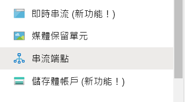
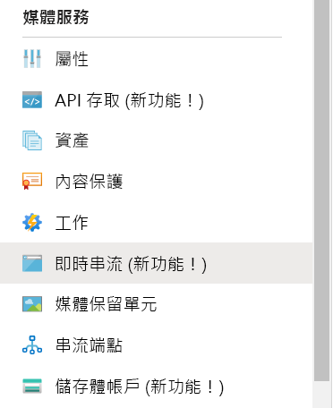
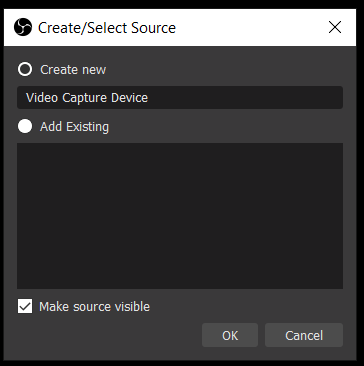

# 使用 OBS 建立 Azure 媒體服務即時串流

本快速入門將協助您使用 Azure 入口網站和 Open Broadcasting Studio (OBS) 來建立 Azure 媒體服務即時串流。 本使用者入門指南假設您有 Azure 訂用帳戶，並已建立媒體服務帳戶。

本快速入門的內容涵蓋：

- 使用 OBS 設定內部部署編碼器。
- 設定即時串流。
- 設定即時串流輸出。
- 執行預設串流端點。
- 使用 Azure 媒體播放器來檢視即時串流和隨選輸出。

## Prerequisites

如果您沒有 Azure 訂用帳戶，請在開始前建立[免費帳戶](https://azure.microsoft.com/free/)。

## 登入 Azure 入口網站

開啟 Web 瀏覽器並移至 [Microsoft Azure 入口網站](https://portal.azure.com/)。 輸入您的認證來登入此入口網站。 預設檢視是您的服務儀表板。

## 使用 OBS 設定內部部署編碼器

1. 在 [Open Broadcaster Software 網站](https://obsproject.com/)下載並安裝適用於您作業系統的 OBS。
1. 啟動應用程式並使其保持開啟狀態。

## 執行預設串流端點

1. 在媒體服務清單中，選取 [串流端點]  。

   
1. 如果預設的串流端點狀態為已停止，請加以選取。 此步驟會帶您前往該端點的頁面。
1. 選取 [開始]  。

   

## 設定 Azure 媒體服務即時串流

1. 在入口網站中移至 Azure 媒體服務帳戶後，請從 [媒體服務]  清單中選取 [即時串流]  。

   
1. 選取 [新增即時活動]  ，以建立新的即時串流活動。

   
1. 在即時活動的 [名稱]  方塊中，輸入新活動的名稱，例如 *TestLiveEvent*。

   
1. 您可以選擇在**描述**方塊中輸入活動描述。
1. 選取 [傳遞 - 沒有雲端編碼]  選項。

   
1. 選取 [RTMP]  選項。
1. 請確定已在**開始即時活動**中選取 [否]  選項，避免系統在即時活動準備就緒之前計費。 (啟動即時活動後就會開始計費。)

   
1. 選取 [檢閱 + 建立]  按鈕以檢閱設定。
1. 選取 [建立]  按鈕以建立即時活動。 您接著會回到即時活動清單。
1. 選取您剛建立的即時活動連結。 請注意，您的活動已停止。
1. 將在瀏覽器中將此頁面狀態保持為開啟。 我們稍後會再回來。

## 使用 OBS Studio 設定即時串流

OBS 會從預設場景開始，但不會選取任何輸入。

   

### 新增影片來源

1. 從 [來源]  面板，按一下**新增**圖示以選取新的來源裝置。 [來源]  功能表將會開啟。

1. 從來源裝置功能表中選取 [影片擷取裝置]  。 [建立/選取來源]  功能表將會開啟。

   

1. 選取 [新增現有]  選項按鈕，然後按一下 [確定]  。 [影片裝置的屬性]  功能表將會開啟。

   

1. 從 [裝置]  下拉式清單中，選取您想要用於直播的影片輸入。 請立即保留其餘的設定，然後按一下 [確定]  。 輸入來源會新增至 [來源]  面板，而影片輸入檢視會顯示在 [預覽]  區域中。

   

### 新增音訊來源

1. 從 [來源]  面板，按一下**新增**圖示以選取新的來源裝置。 [來源裝置] 功能表將會開啟。

1. 從來源裝置功能表中選取 [影片輸入擷取]  。 [建立/選取來源]  功能表將會開啟。

   

1. 選取 [新增現有]  選項按鈕，然後按一下 [確定]  。 [音訊輸入擷取的屬性]  功能表將會開啟。

   

1. 從 [裝置]  下拉式清單中，選取您想要用於直播的音訊擷取裝置。 請立即保留其餘的設定，然後按一下 [確定]。 音訊擷取裝置將會新增至音訊混音器面板。

   

### 在 OBS 中設定串流

在下一個程序中，您將回到瀏覽器中的 Azure 媒體服務，以複製輸入 URL 並在輸出設定中輸入該值：

1. 在入口網站的 Azure 媒體服務頁面，選取 [開始]  來啟動即時串流活動。 (此時會開始計費。)

   
1. 將 [RTMP]  切換為 [RTMPS]  。
1. 在 [輸入 URL]  方塊中，將 URL 複製到剪貼簿。

   

1. 切換至 OBS 應用程式。

1. 按一下 [控制項]  面板中的 [設定]  按鈕。 [設定] 選項將會開啟。

   

1. 從 [設定]  功能表中選取 [資料流]  。

1. 從 [服務]  下拉式清單中，選取 [全部顯示]，然後選取 [自訂...]  。

1. 在 [伺服器]  欄位中，貼上您複製到剪貼簿的 RTMPS URL。

1. 在 [資料流金鑰]  欄位中輸入資料。  其內容真的不重要，但需要有一個值。

    

1. 從 [設定]  功能表中選取 [輸出]  。

1. 在 [主要畫面格間隔]  欄位中輸入 *2*。 這會將片段長度設定為 2 秒。 針對較低的延遲即時傳遞，使用的值為 1 秒。

1. 選擇性：如果所用電腦的處理能力不足，請將 [CPU 使用量預設值]  設定為 [veryfast]  。 選擇性，如果有不想要的網路狀況，可將 kbps 設定為較低的值。

   

1. 讓其餘的設定維持不變，然後按一下 [確定]  。

### 開始串流

1. 在 [控制項]  面板中，按一下 [開始串流]  。

    

2. 切換至瀏覽器中的 Azure 媒體服務即時事件畫面，然後按一下 [重新載入播放器]  連結。 您現在應會在 [預覽] 播放器中看到您的資料流。

## 設定輸出

此部分會設定您的輸出，並可讓您儲存即時串流的記錄。  

> [!NOTE]
> 為了串流此輸出，串流端點必須正在執行。 請參閱之後的[執行預設串流端點](#run-the-default-streaming-endpoint)一節。

1. 選取 [輸出]  影片檢視器下方的 [建立輸出]  連結。
1. 您也可以在 [名稱]  方塊中編輯輸出的名稱，讓使用者更容易了解，以便稍後能輕鬆找到。

   
1. 目前請先讓其餘所有方塊保持原狀。
1. 請選取 [下一步]  以新增串流定位器。
1. 如有需要，請變更定位器的名稱，讓使用者更容易了解。

   
1. 目前請讓此畫面上的所有其他項目保持原狀。
1. 選取 [建立]  。

## 使用 Azure 媒體播放器播放輸出直播

1. 複製 [輸出]  影片播放機下的串流 URL。
1. 在網頁瀏覽器中，開啟 [Azure 媒體播放器示範](https://ampdemo.azureedge.net/azuremediaplayer.html)。
1. 將串流 URL 貼到 Azure 媒體播放器的 [URL]  方塊中。
1. 選取 [更新播放機]  按鈕。
1. 選取影片上的 [播放]  圖示，以查看您的即時串流。

## 停止直播

當您認為已經串流足夠的內容時，請停止直播。

1. 在入口網站中，選取 [停止]  。

1. 在 OBS 中，選取 [控制項]  面板中的 [停止串流]  按鈕。 此步驟會停止來自 OBS 的直播。

## 使用 Azure 媒體播放器播放隨選輸出

只要您的串流端點持續執行，您建立的輸出目前就可供隨選串流處理。

1. 移至媒體服務清單，然後選取 [資產]  。
1. 尋找您稍早建立的活動輸出，並選取資產的連結。 資產輸出頁面隨即開啟。
1. 複製影片播放機下資產的串流 URL。
1. 返回瀏覽器中的 Azure 媒體播放器，並將串流 URL 貼至 URL 方塊中。
1. 選取 [更新播放程式]  。
1. 選取影片上的 [播放]  圖示，以查看隨選資產。

## 清除資源

> [!IMPORTANT]
> 停止服務！ 完成本快速入門中的步驟後，請務必停止即時活動和串流端點，否則系統會繼續以持續執行的時間計費。 要停止即時活動，請參閱[停止直播](#stop-the-broadcast)程序中的步驟 2 和 3。

要停止串流端點：

1. 從媒體服務清單中，選取 [串流端點]  。
2. 選取您稍早啟動的預設串流端點。 此步驟會開啟端點的頁面。
3. 選取 [停止]  。

> [!TIP]
> 如果不想保留此活動的資產，請務必將其刪除，以防止系統對儲存體計費。

## 後續步驟

> [!div class="nextstepaction"]
> [媒體服務中的即時活動和即時輸出](./live-events-outputs-concept.md)
