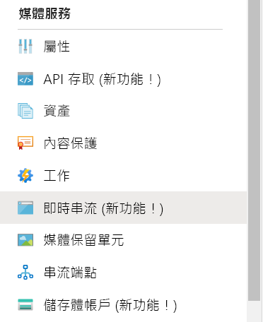
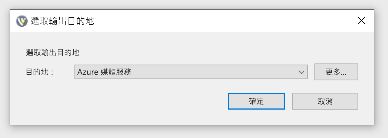
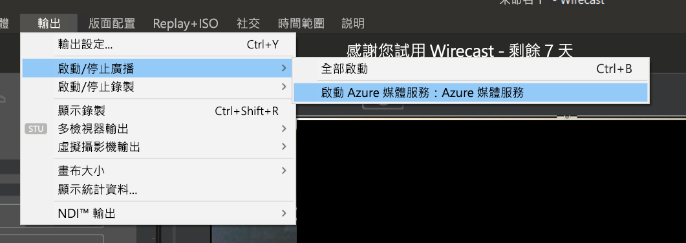

# 建立 Azure 媒體服務即時串流

[!INCLUDE [media services api v3 logo](./includes/v3-hr.md)]

本快速入門將協助您使用 Azure 入口網站和 Telestream Wirecast 來建立 Azure 媒體服務即時串流。 本使用者入門指南假設您有 Azure 訂用帳戶，並已建立媒體服務帳戶。

如果您沒有 Azure 訂用帳戶，請在開始前建立[免費帳戶](https://azure.microsoft.com/free/)。

## 登入 Azure 入口網站

開啟 Web 瀏覽器並移至 [Microsoft Azure 入口網站](https://portal.azure.com/)。 輸入您的認證來登入此入口網站。 預設檢視是您的服務儀表板。

本快速入門的內容涵蓋：

- 使用 Telestream Wirecast 免費試用版來設定內部部署編碼器。
- 設定即時串流。
- 設定即時串流輸出。
- 執行預設串流端點。
- 使用 Azure 媒體播放器來檢視即時串流和隨選輸出。

為了簡單起見，我們將針對 Wirecast 中的 Azure 媒體服務使用編碼預設值，包括傳遞雲端編碼和 RTMP。

## 使用 Wirecast 設定內部部署編碼器

1. 請在 [Telestream 網站](https://www.telestream.net)下載並安裝適用於您作業系統的 Wirecast。
1. 啟動應用程式，並使用您最愛的電子郵件地址來註冊產品。 讓應用程式保持開啟狀態。
1. 在收到的電子郵件中，確認您的電子郵件地址。 然後，應用程式會開始免費試用。
1. 建議使用：觀賞應用程式開啟畫面中的影片教學課程。

## 設定 Azure 媒體服務即時串流

1. 在入口網站中移至 Azure 媒體服務帳戶後，請從 [媒體服務]  清單中選取 [即時串流]  。

   
1. 選取 [新增即時活動]  ，以建立新的即時串流活動。

   
1. 在即時活動的 [名稱]  方塊中，輸入新活動的名稱，例如 *TestLiveEvent*。

   
1. 您可以選擇在**描述**方塊中輸入活動描述。
1. 選取 [傳遞 - 沒有雲端編碼]  選項。

   
1. 選取 [RTMP]  選項。
1. 請確定已在**開始即時活動**中選取 [否]  選項，避免系統在即時活動準備就緒之前計費。 (啟動即時活動後就會開始計費。)

   
1. 選取 [檢閱 + 建立]  按鈕以檢閱設定。
1. 選取 [建立]  按鈕以建立即時活動。 您接著會回到即時活動清單。
1. 選取您剛建立的即時活動連結。 請注意，您的活動已停止。
1. 將在瀏覽器中將此頁面狀態保持為開啟。 我們稍後會再回來。

## 使用 Wirecast Studio 設定即時串流

1. 在 Wirecast 應用程式的主功能表選取 [建立空白文件]  ，然後選取 [繼續]  。

   
1. 將滑鼠停留在 **Wirecast 圖層**區域中的第一個圖層。  選取顯示的 [新增]  圖示，然後選取您要串流的影片輸入。

   

   [主圖層 1]  對話方塊隨即開啟。
1. 從功能表中選取 [影片擷取]  ，然後選取您要使用的相機。

   

   相機中的檢視會顯示在預覽區域中。
1. 將滑鼠停留在 **Wirecast 圖層**區域中的第二個圖層。 選取顯示的 [新增]  圖示，然後選取您要串流的音訊輸入。 [主圖層 2]  對話方塊隨即開啟。
1. 從功能表中選取 [音訊擷取]  ，然後選取您要使用的音訊輸入。

   
1. 從主功能表中，選取 [輸出設定]  。 在 [選取輸出目的地]  對話方塊隨即顯示。
1. 從 [目的地]  下拉式清單中選取 [Azure 媒體服務]  。 Azure 媒體服務的輸出設定會自動填入「大部分」  的輸出設定。

   

在下一個程序中，您將回到瀏覽器中的 Azure 媒體服務，以複製輸入 URL 並在輸出設定中輸入該值：

1. 在入口網站的 Azure 媒體服務頁面，選取 [開始]  來啟動即時串流活動。 (此時會開始計費。)

   
2. 將 [安全/不安全]  切換為 [不安全]  。 此步驟會將通訊協定設定為 RTMP，而不是 RTMPS。
3. 在 [輸入 URL]  方塊中，將 URL 複製到剪貼簿。

   
4. 切換至 Wirecast 應用程式，並將**輸入 URL** 貼到輸出設定的 [位址]  方塊中。

   
5. 選取 [確定]  。

## 設定輸出

此部分會設定您的輸出，並可讓您儲存即時串流的記錄。  

> [!NOTE]
> 為了串流此輸出，串流端點必須正在執行。 請參閱之後的[執行預設串流端點](#run-the-default-streaming-endpoint)一節。

1. 選取 [輸出]  影片檢視器下方的 [建立輸出]  連結。
1. 您也可以在 [名稱]  方塊中編輯輸出的名稱，讓使用者更容易了解，以便稍後能輕鬆找到。
   
   
1. 目前請先讓其餘所有方塊保持原狀。
1. 請選取 [下一步]  以新增串流定位器。
1. 如有需要，請變更定位器的名稱，讓使用者更容易了解。
   
   
1. 目前請讓此畫面上的所有其他項目保持原狀。
1. 選取 [建立]  。

## 開始直播

1. 在 Wirecast 中，選取 [輸出]   > [ 開始/停止直播]   > [開始 Azure 媒體服務 **：** Azure 媒體服務]，您可在主功能表中找到這些選項。

   

   當串流傳送至即時活動時，Wirecast 中的 [即時]  視窗會出現在 Azure 媒體服務中即時活動頁面的影片播放機中。

1. 選取 [預覽] 視窗下的 [開始]  按鈕，開始直播您為 Wirecast 圖層選取的影片和音訊。

   

   > [!TIP]
   > 如果發生錯誤，請選取播放機上方的**重新載入播放機**連結，嘗試重新載入播放機。

## 執行預設串流端點

1. 在媒體服務清單中，選取 [串流端點]  。

   
1. 如果預設的串流端點狀態為已停止，請加以選取。 此步驟會帶您前往該端點的頁面。
1. 選取 [開始]  。
   
   

## 使用 Azure 媒體播放器播放輸出直播

1. 複製 [輸出]  影片播放機下的串流 URL。
1. 在網頁瀏覽器中，開啟 [Azure 媒體播放器示範](https://ampdemo.azureedge.net/azuremediaplayer.html)。
1. 將串流 URL 貼到 Azure 媒體播放器的 [URL]  方塊中。
1. 選取 [更新播放機]  按鈕。
1. 選取影片上的 [播放]  圖示，以查看您的即時串流。

## 停止直播

當您認為已經串流足夠的內容時，請停止直播。

1. 在 Wirecast 中，選取 [直播]  按鈕。 此步驟會停止來自 Wirecast 的直播。
1. 在入口網站中，選取 [停止]  。 您接著會收到一則警告訊息，指出即時串流已停止，但輸出現在會成為隨選資產。
1. 選取警告訊息中的 [停止]  。 Azure 媒體播放器現在會顯示錯誤，因為無法再使用即時串流。

## 使用 Azure 媒體播放器播放隨選輸出

只要您的串流端點持續執行，您建立的輸出目前就可供隨選串流處理。

1. 移至媒體服務清單，然後選取 [資產]  。
1. 尋找您稍早建立的活動輸出，並選取資產的連結。 資產輸出頁面隨即開啟。
1. 複製影片播放機下資產的串流 URL。
1. 返回瀏覽器中的 Azure 媒體播放器，並將串流 URL 貼至 URL 方塊中。
1. 選取 [更新播放程式]  。
1. 選取影片上的 [播放]  圖示，以查看隨選資產。

## 清除資源

> [!IMPORTANT]
> 停止服務！ 完成本快速入門中的步驟後，請務必停止即時活動和串流端點，否則系統會繼續以持續執行的時間計費。 要停止即時活動，請參閱[停止直播](#stop-the-broadcast)程序中的步驟 2 和 3。

要停止串流端點：

1. 從媒體服務清單中，選取 [串流端點]  。
2. 選取您稍早啟動的預設串流端點。 此步驟會開啟端點的頁面。
3. 選取 [停止]  。

> [!TIP]
> 如果不想保留此活動的資產，請務必將其刪除，以防止系統對儲存體計費。

## 後續步驟
> [!div class="nextstepaction"]
> [媒體服務中的即時活動和即時輸出](./live-events-outputs-concept.md)
