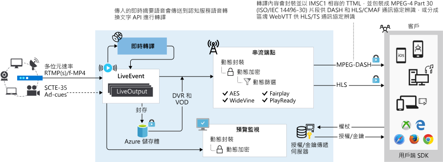

# 使用 Azure 媒體服務 v3 進行即時串流

Azure 媒體服務可讓您在 Azure 雲端上將實況活動傳遞給客戶。 若要使用媒體服務串流實況活動，您需要下列項目：  

- 拍攝實況活動用的相機。 如需了解裝備，請參閱[簡單的可攜式活動視訊器材裝備]( https://link.medium.com/KNTtiN6IeT) \(英文\)。

    如果您無法訪問攝像機，可以使用[遠端有線廣播](https://www.telestream.net/wirecast/overview.htm)等工具從視頻檔生成即時源。
- 即時視訊編碼器，可將來自相機 (或另一部裝置，例如膝上型電腦) 的訊號轉換成發佈摘要以傳送給「媒體服務」。 發佈摘要可以包含廣告相關訊號，例如 SCTE-35 標記。 如需建議的即時串流編碼器清單，請參閱[即時串流編碼器](recommended-on-premises-live-encoders.md)。 此外，看看這個博客：[使用OBS進行即時流式處理](https://link.medium.com/ttuwHpaJeT)。
- 媒體服務中的元件可讓您內嵌、預覽、封裝、記錄、加密實況活動，並向客戶廣播這些活動，或是向 CDN 廣播以進一步發佈。

本文概述了使用媒體服務進行即時流式處理以及指向其他相關文章的連結。
 
> [!NOTE]
> 您可以使用 Azure[門戶](https://portal.azure.com/)管理 v3[即時事件](live-events-outputs-concept.md)、查看 v3[資產](assets-concept.md)、獲取有關訪問 API 的資訊。 對於所有其他管理工作（例如，轉換和作業），請使用[REST API](https://docs.microsoft.com/rest/api/media/) [、CLI](https://aka.ms/ams-v3-cli-ref)或受支援的[SDK](media-services-apis-overview.md#sdks)之一。

## 動態封裝

使用媒體服務，您可以利用[動態打包](dynamic-packaging-overview.md)，它允許您從發送到服務的貢獻源中預覽和廣播[MPEG DASH、HLS 和平滑流格式的即時流](https://en.wikipedia.org/wiki/Adaptive_bitrate_streaming)。 您的檢視者可以搭配支援 HLS、DASH 或 Smooth Streaming 的播放器播放即時串流。 您可以在網路或行動應用程式中使用 [Azure 媒體播放器](https://amp.azure.net/libs/amp/latest/docs/index.html)，透過這些通訊協定中的任何一個傳遞串流。

## 動態加密

動態加密使您能夠使用 AES-128 或三大數位版權管理 （DRM） 系統中的任何一個動態加密您的即時或點播內容：微軟 PlayReady、Google Widevine 和 Apple FairPlay。 媒體服務也提供服務，可傳遞 AES 金鑰和 DRM (PlayReady、Widevine 和 FairPlay) 授權給授權用戶端。 有關詳細資訊，請參閱[動態加密](content-protection-overview.md)。

> [!NOTE]
> Widevine 是 Google Inc. 所提供的服務，並受到 Google Inc. 的服務條款和隱私權原則所約束。

## 動態清單

動態篩選用於控制發送給玩家的軌道、格式、位元速率和演示時間視窗的數量。 有關詳細資訊，請參閱[篩選器和動態清單](filters-dynamic-manifest-overview.md)。

## 實況活動類型

[實況活動](https://docs.microsoft.com/rest/api/media/liveevents)負責內嵌和處理即時視訊摘要。 即時事件可以設置為*傳遞*（本地即時編碼器發送多個位元速率流）或*即時編碼*（本地即時編碼器發送單個位元速率流）。 有關媒體服務 v3 中即時流的詳細資訊，請參閱[即時事件和即時輸出](live-events-outputs-concept.md)。

### 傳遞

使用傳遞**即時事件**時，您依靠本地即時編碼器生成多個位元速率視頻流，並將其作為貢獻源發送到即時事件（使用 RTMP 或碎片 MP4 輸入協定）。 然後，即時事件將傳入的視頻流傳遞到動態打包器（流端點），而無需任何進一步的轉碼。 這種傳遞即時事件針對長時間運行的即時事件或 24x365 線性即時流進行了優化。 

### 即時編碼  

將雲編碼與媒體服務一起使用時，您將配置本地即時編碼器，以便向即時事件（使用 RTMP 或碎片 MP4 輸入協定）發送單個位元速率視頻作為貢獻源（最多 32Mbps 聚合）。 Live Event 以不同解析度將傳入的單位元速率流轉碼到[多個位元速率視頻流](https://en.wikipedia.org/wiki/Adaptive_bitrate_streaming)中，以提高交付率，並通過行業標準協定（如 MPEG-DASH、Apple HTTP 即時流式處理 （HLS） 和 Microsoft 平滑流流（Microsoft 平滑流）將其交付到播放設備。 

### 即時轉錄（預覽）

即時轉錄是一種功能，可用於傳遞或即時編碼的即時事件。 有關詳細資訊，請參閱[即時轉錄](live-transcription.md)。 啟用此功能後，該服務將使用認知服務的["語音到文本](../../cognitive-services/speech-service/speech-to-text.md)"功能將傳入音訊中的口語轉錄為文本。 然後，在 MPEG-DASH 和 HLS 協定中，此文本與視頻和音訊一起提供。

> [!NOTE]
> 目前，即時轉錄作為預覽功能在美國西部 2 中提供。

## 即時串流工作流程

要瞭解媒體服務 v3 中的即時流式處理工作流，您必須首先查看並理解以下概念： 

- [流式處理終結點](streaming-endpoint-concept.md)
- [實況活動與實況輸出](live-events-outputs-concept.md)
- [串流定位器](streaming-locators-concept.md)

### 一般步驟

1. 在媒體服務帳戶中，請確保**流式處理終結點**（源）正在運行。 
2. 創建[即時事件](live-events-outputs-concept.md)。  在建立事件時，您可以指定要自動啟動它。 或者，您可以在準備好開始進行串流處理時啟動事件。  當自動啟動設定為 true 時，即時事件將會在建立後隨即啟動。 只要即時事件一執行，就會立即開始計費。 您必須對「實況活動」資源明確呼叫「停止」，才能終止進一步計費。 如需詳細資訊，請參閱[實況活動狀態和計費](live-event-states-billing.md)。
3. 獲取引入 URL 並將本地編碼器配置為使用 URL 發送貢獻源。 請參閱[建議的即時編碼器](recommended-on-premises-live-encoders.md)。
4. 取得預覽 URL 並使用它來確認實際上已收到來自編碼器的輸入。
5. 創建新**的資產**物件。 

    每個即時輸出都與資產相關聯，該資產用於將視頻錄製到關聯的 Azure Blob 存儲容器中。 
6. 創建**即時輸出**並使用您創建的資產名稱，以便可以將流存檔到資產中。

    「實況輸出」會在建立時開始，並在刪除時結束。 刪除即時輸出時，不會刪除資產中的基礎資產和內容。
7. 使用[內置流式處理策略類型](streaming-policy-concept.md)創建**流式處理器**。

    要發佈即時輸出，必須為關聯的資產創建流式處理器。 
8. 列出 [串流定位器]**** 上的路徑，以取得要使用的 URL (這些具有決定性)。
9. 獲取要從**流式處理終結點**（源）的主機名稱。
10. 結合步驟 8 的 URL 和步驟 9 的主機名稱，即可取得完整的 URL。
11. 如果想要停止讓**實況活動**可供檢視，您必須將該活動停止串流並刪除**串流定位器**。
12. 如果您完成串流處理事件，而且想要清除先前佈建的資源，請遵循下列程序。

    * 停止從編碼器發送串流。
    * 停止即時事件。 即時事件在停止之後，就不會產生任何費用。 當您需要重新啟動它時，它會具有相同的內嵌 URL，因此您不需要重新設定編碼器。
    * 除非您想要繼續將即時事件封存為隨選串流，否則您可以停止「串流端點」。 如果即時事件處於已停止狀態，就不會產生任何費用。

刪除即時輸出時，即時輸出存檔到的資產將自動成為按需資產。 必須先刪除所有即時輸出，然後才能停止即時事件。 您可以使用可選標誌[刪除輸出OnStop](https://docs.microsoft.com/rest/api/media/liveevents/stop#request-body)以自動刪除停止時的即時輸出。 

> [!TIP]
> 請參閱[即時流式處理教程](stream-live-tutorial-with-api.md)，本文將檢查實現上述步驟的代碼。

## 其他重要文章

- [建議的即時編碼器](recommended-on-premises-live-encoders.md)
- [使用雲端 DVR](live-event-cloud-dvr.md)
- [即時事件類型功能比較](live-event-types-comparison.md)
- [狀態與計費](live-event-states-billing.md)
- [延遲](live-event-latency.md)

## 常見問題集

請參閱[常見問題](frequently-asked-questions.md#live-streaming)文章。

## 提出問題、提供意見反應、取得更新

請參閱 [Azure 媒體服務社群](media-services-community.md)文章，以了解詢問問題、提供意見反應及取得媒體服務相關更新的不同方式。

## 後續步驟

* [即時流式處理快速入門]（live-events-wirecast-quickstart.md）
* [即時串流教學課程](stream-live-tutorial-with-api.md)
* [從媒體服務 v2 移動至 v3 的移轉指導](migrate-from-v2-to-v3.md)
