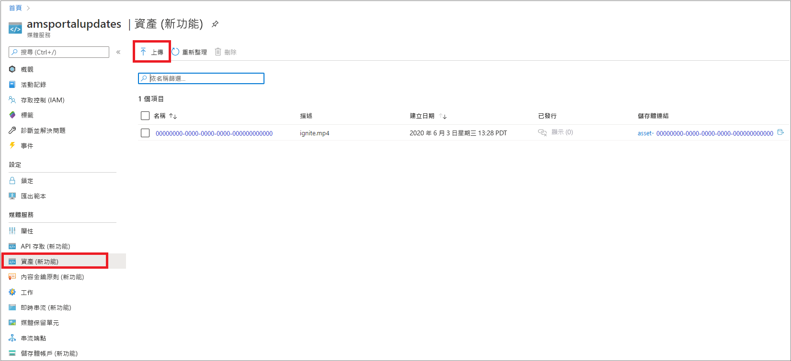
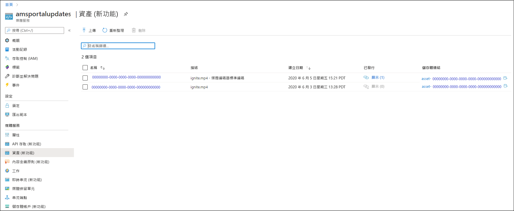
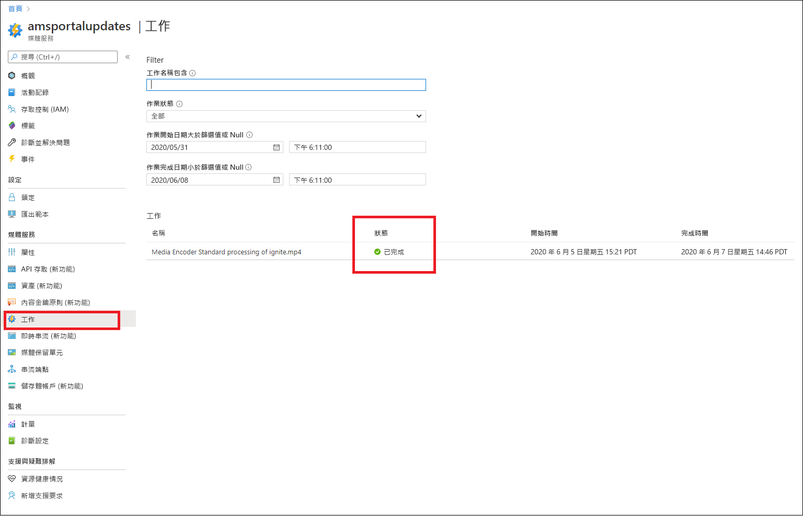

# 快速入門：使用入口網站上傳、編碼和串流內容

本快速入門說明如何搭配 Azure 媒體服務使用 Azure 入口網站來上傳、編碼和串流內容。

> [!NOTE]
> 請務必檢閱：[媒體服務 v3 的 Azure 入口網站限制](frequently-asked-questions.md#what-are-the-azure-portal-limitations-for-media-services-v3)。
  
## 概觀

* 若要在 Azure 中開始管理、加密、編碼、分析和串流媒體內容，您需要建立媒體服務帳戶，並將您的高品質數位媒體檔案上傳至**資產**。 
    
    > [!NOTE]
    > 如果您的影片先前已使用媒體服務 v3 API 上傳至媒體服務帳戶，或已根據即時輸出產生內容，則不會在 Azure 入口網站中看到 [編碼]、[分析] 或 [加密] 按鈕。 使用媒體服務 v3 API 來執行這些工作。

    請檢閱下列各項： 

  * [雲端上傳和儲存體](storage-account-concept.md)
  * [資產概念](assets-concept.md)
  * [管理資產](manage-asset-concept.md)
* 一旦您將高品質數位媒體檔案上傳至資產 (輸入資產)，就可以處理此檔案 (編碼或分析)。 處理的內容會進入另一個資產 (輸出資產)。 
    * 將您上傳的檔案[編碼](encoding-concept.md)成可在各種不同瀏覽器和裝置上播放的格式。
    * [分析](analyzing-video-audio-files-concept.md)您上傳的檔案。 

        目前，使用 Azure 入口網站時，您可以執行下列動作：產生 TTML 和 WebVTT 隱藏式輔助字幕檔案。 這些格式的檔案可以用來讓具有聽力障礙的人存取音訊和視訊檔案。 您也可以從內容中擷取關鍵字。

        如需可讓您從影片和音訊檔案擷取深入解析的豐富體驗，請使用媒體服務 v3 預設值 (如[教學課程：透過媒體服務 v3 分析影片](analyze-videos-tutorial-with-api.md)中所述)。  如果您想要更多詳細的深入解析，請直接使用[影片索引子](https://docs.microsoft.com/azure/media-services/video-indexer/)。    
* 一旦處理了您的內容，您就可以將媒體內容提供給用戶端播放程式。 若要讓輸出資產中的影片可供用戶端播放，您必須建立**串流定位器**。 建立**串流定位器**時，您必須指定**串流原則**。 **串流原則**可讓您定義**串流定位器**的串流通訊協定和加密選項 (如果有的話)。
    
    檢閱：

    * [串流定位器](streaming-locators-concept.md)
    * [串流原則](streaming-policy-concept.md)
    * [封裝和交付](dynamic-packaging-overview.md)
    * [篩選條件](filters-concept.md)
* 您可以使用進階加密標準 (AES-128) 或/和三個主要 DRM 系統的任何一個來加密您的內容，藉以保護您的內容：Microsoft PlayReady、Google Widevine 和 Apple FairPlay。 [使用 Azure 入口網站加密內容](encrypt-content-quickstart.md)快速入門說明如何設定內容保護。
        
## 必要條件

[!INCLUDE [quickstarts-free-trial-note](../../../includes/quickstarts-free-trial-note.md)]

[建立媒體服務帳戶](create-account-howto.md#use-the-azure-portal)

## 上傳

1. 登入 [Azure 入口網站](https://portal.azure.com/)。
1. 找出並按一下您的媒體服務帳戶。
1. 選取 [資產 (新增)]。
1. 按下視窗頂端的 [上傳]。 
1. 拖放或瀏覽至您想要上傳的檔案。

如果瀏覽至資產視窗，您會看到新的資產已新增至清單：

## 編碼

1. 選取 [資產 (新增)]。
1. 選取您的新資產 (在最後一個步驟中新增的資產)。
1. 按一下視窗頂端的 [編碼]。

    按下此按鈕會啟動編碼作業。 成功完成時，會產生包含編碼內容的輸出資產。

如果瀏覽至資產視窗，您會看到輸出資產已新增至清單：

## 監視作業進度

若要檢視作業狀態，請瀏覽至 [作業]。 作業通常會經歷下列狀態：已排程、已排入佇列、已完成 (最終狀態)。 如果作業發生錯誤，您會收到錯誤狀態。

## 發佈並串流

若要發佈資產，您現在必須將串流定位器新增至資產。

### 串流定位器 

1. 在 [串流定位器] 區段中，按下 [+ 新增串流定位器]。
    這會發佈資產並產生串流 URL。

    > [!NOTE]
    > 如果想要將串流加密，您必須建立內容金鑰原則，並在串流定位器上設定此原則。 如需詳細資訊，請參閱[使用 Azure 入口網站加密內容](encrypt-content-quickstart.md)。
1. 在 [新增串流定位器] 視窗中，您可以選擇其中一個預先定義的串流原則。 如需詳細資訊，請參閱[串流原則](streaming-policy-concept.md)

    

一旦發佈了資產，您就可以直接在入口網站中串流該資產。 

或者，複製串流 URL，並在您的用戶端播放程式中使用此 URL。

> [!NOTE]
> 確定[串流端點](streaming-endpoint-concept.md)執行中。 第一次建立媒體服務帳戶時，會建立預設串流端點且其會處於停止狀態，因此您必須先啟動該串流端點，才能串流您的內容。 只有當串流端點處於執行中狀態時，才會向您收取費用。

## 清除資源

如果您想要嘗試其他快速入門，應該保留所建立的資源。 否則，請移至 Azure 入口網站，瀏覽至您的資源群組並選取您執行本快速入門所用的資源群組，然後刪除所有資源。

## 後續步驟

[使用入口網站加密內容](encrypt-content-quickstart.md)
