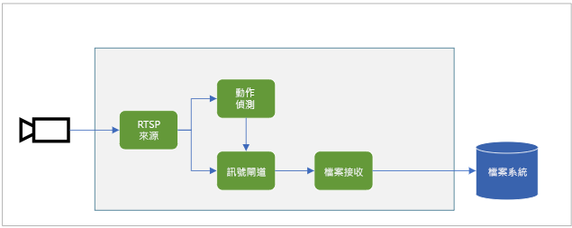

# <a name="quickstart-detect-motion-record-video-on-edge-devices"></a>快速入門：在邊緣裝置上偵測動作、錄製影片
 
本快速入門說明如何在 IoT Edge 上使用 Live Video Analytics，從 (模擬的) IP 攝影機分析即時影片摘要、偵測是否有任何動作，如果有，則將 MP4 視訊剪輯錄製到邊緣裝置上的本機檔案系統。 這裡使用 Azure VM 作為 IoT Edge 裝置，以及模擬的即時影片串流。 本文是以利用 C# 撰寫的範例程式碼為基礎。

本文建立在[此](detect-motion-emit-events-quickstart.md)快速入門之上。 

## <a name="prerequisites"></a>必要條件

* 具有有效訂用帳戶的 Azure 帳戶。 [免費建立帳戶](https://azure.microsoft.com/free/?WT.mc_id=A261C142F)。
* 您電腦上的 [Visual Studio Code](https://code.visualstudio.com/)，搭配下列延伸模組：
    * [Azure IoT 工具組](https://marketplace.visualstudio.com/items?itemName=vsciot-vscode.azure-iot-tools)
    * [C#](https://marketplace.visualstudio.com/items?itemName=ms-dotnettools.csharp)
* [.NET Core 3.1 SDK](https://dotnet.microsoft.com/download/dotnet-core/3.1) 已安裝在您的系統上
* 如果您先前未完成[此](detect-motion-emit-events-quickstart.md)快速入門，請完成下列步驟：
     * [設定 Azure 資源](detect-motion-emit-events-quickstart.md#set-up-azure-resources)
     * [設定您的開發環境](detect-motion-emit-events-quickstart.md#set-up-your-development-environment)
     * [產生及部署 IoT Edge 部署資訊清單](detect-motion-emit-events-quickstart.md#generate-and-deploy-the-iot-edge-deployment-manifest)
     * [準備監視事件](detect-motion-emit-events-quickstart.md#prepare-for-monitoring-events)

> [!TIP]
> 安裝 Azure IoT Tools 時，系統可能會提示您安裝 Docker。 您可以視需要予以略過。

## <a name="review-the-sample-video"></a>檢閱範例影片
在設定 Azure 資源的上述步驟中，會將停車場的 (簡短) 影片複製到 Azure 中作為 IoT Edge 裝置使用的 Linux VM。 此影片檔案將用來模擬本教學課程的即時串流。

您可以使用 [VLC Player](https://www.videolan.org/vlc/) 之類的應用程式、加以啟動、按 Control+N，然後將[此](https://lvamedia.blob.core.windows.net/public/lots_015.mkv)連結貼到停車場影片以開始播放。 在大約 5 秒標記處，一輛白色汽車駛進停車場。

當您完成下列步驟時，將在 IoT Edge 上使用 Live Video Analytics 來偵測汽車的移動，並從大約 5 秒標記處開始錄製影片剪輯。

## <a name="overview"></a>概觀



上圖顯示此快速入門中的信號流動方式。 邊緣模組 (如[這裡](https://github.com/Azure/live-video-analytics/tree/master/utilities/rtspsim-live555)所述) 會模擬主控 RTSP 伺服器的 IP 攝影機。 [RTSP 來源](media-graph-concept.md#rtsp-source)節點會從這部伺服器提取影片摘要，然後將影片畫面傳送至[動作偵測處理器](media-graph-concept.md#motion-detection-processor)節點。 RTSP 來源會將相同的影片畫面傳送至[信號閘道處理器](media-graph-concept.md#signal-gate-processor)節點，這會保持關閉，直到有事件觸發為止。

當動作偵測處理器判斷影片中有動作時，就會將事件傳送至信號閘道處理器節點，並加以觸發。 閘道會在設定的持續時間內保持開啟，並將影片畫面傳送至[檔案接收](media-graph-concept.md#file-sink)節點。 此接收節點會將影片以 MP4 檔案格式錄製到您邊緣裝置之本機檔案系統的設定位置。

在本快速入門中，您將：

1. 建立和部署媒體圖表
1. 解譯結果
1. 清除資源

## <a name="examine-and-edit-the-sample-files"></a>查看和編輯範例檔案
作為必要條件的一部分，您會將範例程式碼下載至資料夾。 啟動 Visual Studio Code，然後開啟資料夾。

1. 在 Visual Studio Code 中，瀏覽至 "src/edge"。 您會看到您所建立的 .env 檔案，以及一些部署範本檔案
    * 部署範本會使用一些預留位置值來參考邊緣裝置的部署資訊清單。 .env 檔案具有這些變數的值。
1. 接下來，瀏覽至 "src/cloud-to-device-console-app" 資料夾。 您在這裡會看到您所建立的 appsettings.json 檔案，以及一些其他檔案：
    * c2d-console-app.csproj - 這是 Visual Studio Code 的專案檔
    * operations.json - 此檔案會列出您需要程式執行的不同作業
    * Program.cs - 這是執行下列動作的範例程式碼：

        * 載入應用程式設定
        * 叫用 IoT Edge 模組上 Live Video Analytics 所公開的直接方法。 您可以使用模組，藉由叫用其[直接方法](direct-methods.md)來分析即時影片串流 
        * 暫停以讓您在終端機視窗中查看程式的輸出，並在 [輸出] 視窗中查看模組所產生的事件
        * 叫用直接方法來清除資源   

1. 對 operations.json 檔案進行下列編輯
    * 變更圖表拓撲的連結：`"topologyUrl" : "https://raw.githubusercontent.com/Azure/live-video-analytics/master/MediaGraph/topologies/evr-motion-files/topology.json"`
    * 在 GraphInstanceSet 底下，編輯圖表拓撲的名稱，使其符合上述連結中的值 `"topologyName" : "EVRToFilesOnMotionDetection"`
    * 另請編輯 RTSP URL，以指向所需的影片檔案 `"value": "rtsp://rtspsim:554/media/lots_015.mkv"`
    * 在 GraphTopologyDelete 底下，編輯名稱 `"name": "EVRToFilesOnMotionDetection"`

## <a name="review---check-status-of-the-modules"></a>檢閱 - 檢查模組的狀態
在[產生及部署 IoT Edge 部署資訊清單](detect-motion-emit-events-quickstart.md#generate-and-deploy-the-iot-edge-deployment-manifest)步驟中，如果您在 Visual Studio Code 中 AZURE IOT 中樞底下展開 [lva-sample-device] 節點 (位於左下方區段)，您應該會看到下列模組已部署

    1. 名為 “lvaEdge” 的 Live Video Analytics 模組
    1. 名為 “rtspsim” 的模組，其會模擬 RTSP 伺服器，作為即時影片摘要的來源

        


## <a name="review---prepare-for-monitoring-events"></a>檢閱 - 準備監視事件
檢查您是否已完成[準備監視事件](detect-motion-emit-events-quickstart.md#prepare-for-monitoring-events)的步驟


## <a name="run-the-sample-program"></a>執行範例程式

1. 啟動偵錯工作階段 (按 F5 鍵)。 您會開始看到 [終端機] 視窗中列印出一些訊息。
1. operations.json 會從呼叫直接方法 GraphTopologyList 和 GraphInstanceList 開始。 如果您已在先前的快速入門之後清除資源，這會傳回空白清單，然後暫停以讓您按下 Enter 鍵
```
--------------------------------------------------------------------------
Executing operation GraphTopologyList
-----------------------  Request: GraphTopologyList  --------------------------------------------------
{
  "@apiVersion": "1.0"
}
---------------  Response: GraphTopologyList - Status: 200  ---------------
{
  "value": []
}
--------------------------------------------------------------------------
Executing operation WaitForInput
Press Enter to continue
```
1. 當您在 [終端機] 視窗中按下 "Enter" 鍵時，將會呼叫下一組直接方法
     * 使用上述 topologyUrl 呼叫 GraphTopologySet
     * 使用下列主體呼叫 GraphInstanceSet
     ```
     {
       "@apiVersion": "1.0",
       "name": "Sample-Graph",
       "properties": {
         "topologyName": "EVRToFilesOnMotionDetection",
         "description": "Sample graph description",
         "parameters": [
           {
             "name": "rtspUrl",
             "value": "rtsp://rtspsim:554/media/lots_015.mkv"
           },
           {
             "name": "rtspUserName",
             "value": "testuser"
           },
           {
             "name": "rtspPassword",
             "value": "testpassword"
           }
         ]
       }
     }
     ```
     * 呼叫 GraphInstanceActivate 以啟動圖表執行個體，然後啟動影片流程
     * 再次呼叫 GraphInstanceList，以顯示圖表執行個體確實處於執行中狀態
1. [終端機] 視窗中的輸出現在會在出現「按 Enter 繼續」提示時暫停。 此時不要按 "Enter" 鍵。 您可以向上捲動查看您所叫用直接方法的 JSON 回應承載
1. 如果您現在於 Visual Studio Code 中切換到 [輸出] 視窗，將會看到 IoT Edge 模組上 Live Video Analytics 傳送至 IoT 中樞的訊息。
     * 下列各節將討論這些訊息
1. 媒體圖表會繼續執行，並列印結果 - RTSP 模擬器會持續循環播放來源影片。 若要停止媒體圖表，請回到 [終端機] 視窗，然後按 "Enter" 鍵。 這會進行下一系列的呼叫以清除資源：
     * 呼叫 GraphInstanceDeactivate 以停用圖表執行個體
     * 呼叫 GraphInstanceDelete 以刪除執行個體
     * 呼叫 GraphTopologyDelete 以刪除拓撲
     * 最後一次呼叫 GraphTopologyList 以顯示清單現在是空的

## <a name="interpret-results"></a>解譯結果 
當您執行媒體圖表時，來自動作偵測處理器節點的結果會透過 IoT 中樞接收節點傳送至 IoT 中樞。 您在 Visual Studio Code 的 [輸出] 視窗中看到的訊息包含 "body" 區段和 "applicationProperties" 區段。 若要了解這些區段所代表的意思，請參閱[這篇](https://docs.microsoft.com/azure/iot-hub/iot-hub-devguide-messages-construct)文章 (機器翻譯)。

在下列訊息中，Live Video Analytics 模組會定義應用程式屬性和主體的內容。

## <a name="mediasession-established-event"></a>MediaSessionEstablished 事件

具現化媒體圖表時，RTSP 來源節點會嘗試連線到在 rtspsim-live555 容器中執行的 RTSP 伺服器。 如果成功，則會列印此事件：

```
[IoTHubMonitor] [05:37:21 AM] Message received from [lva-sample-device/lvaEdge]:
{  
"body": {
"sdp": "SDP:\nv=0\r\no=- 1586450538111534 1 IN IP4 xxx.xxx.xxx.xxx\r\ns=Matroska video+audio+(optional)subtitles, streamed by the LIVE555 Media Server\r\ni=media/camera-300s.mkv\r\nt=0 0\r\na=tool:LIVE555 Streaming Media v2020.03.06\r\na=type:broadcast\r\na=control:*\r\na=range:npt=0-300.000\r\na=x-qt-text-nam:Matroska video+audio+(optional)subtitles, streamed by the LIVE555 Media Server\r\na=x-qt-text-inf:media/camera-300s.mkv\r\nm=video 0 RTP/AVP 96\r\nc=IN IP4 0.0.0.0\r\nb=AS:500\r\na=rtpmap:96 H264/90000\r\na=fmtp:96 packetization-mode=1;profile-level-id=4D0029;sprop-parameter-sets={SPS}\r\na=control:track1\r\n"  
},  
"applicationProperties": {  
    "dataVersion": "1.0",  
    "topic": "/subscriptions/{subscriptionID}/resourceGroups/{name}/providers/microsoft.media/mediaservices/hubname",  
    "subject": "/graphInstances/Sample-Graph-1/sources/rtspSource",  
    "eventType": "Microsoft.Media.MediaGraph.Diagnostics.MediaSessionEstablished",  
    "eventTime": "2020-05-21T05:37:21.398Z",
    }  
}
```

* 此訊息為診斷事件 MediaSessionEstablished，表示 RTSP 來源節點 (主體) 能夠與 RTSP 模擬器建立連線，並開始接收 (模擬的) 即時摘要。
* applicationProperties 中的 "subject" 會參考產生訊息之圖表拓撲中的節點。 在此案例中，訊息是來自 RTSP 來源節點。
* applicationProperties 中的 "eventType" 表示這是診斷事件。
* "eventTime" 表示事件發生的時間。
* "body" 包含診斷事件的相關資料，在此案例中為 [SDP](https://en.wikipedia.org/wiki/Session_Description_Protocol) 詳細資料。


## <a name="recording-started-event"></a>RecordingStarted 事件

如[這裡](#overview)所述，當偵測到動作時，就會啟動信號閘道處理器節點，而且媒體圖表中的檔案接收節點會開始寫入 MP4 檔案。 檔案接收節點會傳送操作事件。 類型會設定為 “motion”，表示這是來自動作偵測處理器的結果，而 eventTime 會告訴您發生動作的時間 (UTC)。 以下是範例：

```
[IoTHubMonitor] [05:37:27 AM] Message received from [lva-sample-device/lvaEdge]:
{
  "body": {
    "outputType": "filePath",
    "outputLocation": "/var/media/sampleFilesFromEVR-filesinkOutput-20200521T053726Z.mp4"
  },
  "applicationProperties": {
    "topic": "/subscriptions/{subscriptionID}/resourceGroups/{name}/providers/microsoft.media/mediaservices/hubname",  
    "subject": "/graphInstances/Sample-Graph-1/sinks/fileSink",
    "eventType": "Microsoft.Media.Graph.Operational.RecordingStarted",
    "eventTime": "2020-05-21T05:37:27.713Z",
    "dataVersion": "1.0"
  }
}
```

* applicationProperties 中的 "subject" 會參考產生訊息之媒體圖表中的節點。 在此案例中，訊息是來自檔案接收節點。
* applicationProperties 中的 "eventType" 表示這是操作事件。
* "eventTime" 表示事件發生的時間。 請注意，這是 MediaSessionEstablished 後的 5-6 秒，而且影片會開始播放。 這會對應至[汽車開始駛進](#review-the-sample-video)停車場的 5-6 秒處標記
* "body" 包含操作事件的相關資料，在此案例中為 "outputType" 和 "outputLocation" 資料。
* "outputType" 表示這是關於檔案路徑的資訊
* "outputLocation" 會提供 MP4 檔案在邊緣模組中的位置

## <a name="recording-stopped-and-available-events"></a>RecordingStopped 和 RecordingAvailable 事件

如果您在[圖表拓撲](https://github.com/Azure/live-video-analytics/blob/master/MediaGraph/topologies/evr-motion-files/topology.json)中查看信號閘道處理器節點的屬性，就會看到啟動時間已設定為 5 秒。 因此在收到 RecordingStarted 事件後大約 5 秒，您會收到
* RecordingStopped 事件，表示錄製已停止
* RecordingAvailable 事件，表示現在可以使用 MP4 檔案來觀看

這兩個事件通常會相隔幾秒發出。

### <a name="playing-back-the-mp4-clip"></a>播放 MP4 剪輯

1. MP4 檔案會寫入您透過此機碼 OUTPUT_VIDEO_FOLDER_ON_DEVICE 在 .env 檔案中設定的邊緣裝置目錄。 如果您保留預設值，則結果應該會在 /home/lvaadmin/samples/output/ 中
1. 移至您的資源群組，找到此 VM 並使用 Bastion 連線

    
 
    
1. 登入後 (使用在[這個](detect-motion-emit-events-quickstart.md#set-up-azure-resources)步驟期間所產生的認證)，在命令提示下，移至相關的目錄 (預設值：/home/lvaadmin/samples/output)，您應該會在此看到 MP4 檔案。 您可以 [SCP 檔案](https://docs.microsoft.com/azure/virtual-machines/linux/copy-files-to-linux-vm-using-scp)到您的本機電腦，然後透過 [VLC Player](https://www.videolan.org/vlc/) 或任何其他 MP4 播放器進行播放。

    

## <a name="clean-up-resources"></a>清除資源

如果您想要嘗試其他快速入門，應該保留所建立的資源。 否則，請移至 Azure 入口網站，瀏覽至您的資源群組並選取您執行本快速入門所用的資源群組，然後刪除所有資源。

## <a name="next-steps"></a>後續步驟

* 執行[使用您自己的模型執行 Live Video Analytics](use-your-model-quickstart.md) 快速入門，其中說明如何將 AI 應用於即時影片摘要。
* 檢閱進階使用者的其他挑戰：

    * 使用具有 RTSP 支援的 [IP 攝影機](https://en.wikipedia.org/wiki/IP_camera)，而非使用 RTSP 模擬器。 您可以藉由尋找符合設定檔 G、S 或 T 的裝置，在[符合 ONVIF 標準的產品](https://en.wikipedia.org/wiki/IP_camera)頁面上搜尋具有 RTSP 支援的 IP 攝影機。
    * 使用 AMD64 或 X64 Linux 裝置 (相較於使用 Azure Linux VM)。 此裝置必須與 IP 攝影機位於相同的網路中。 您可以遵循[在 Linux 上安裝 Azure IoT Edge 執行階段](https://docs.microsoft.com/azure/iot-edge/how-to-install-iot-edge-linux) (機器翻譯) 中的指示，然後遵循[將您的第一個 IoT Edge 模組部署至虛擬 Linux 裝置](https://docs.microsoft.com/azure/iot-edge/quickstart-linux)快速入門中的指示，向 Azure IoT 中樞註冊裝置。
