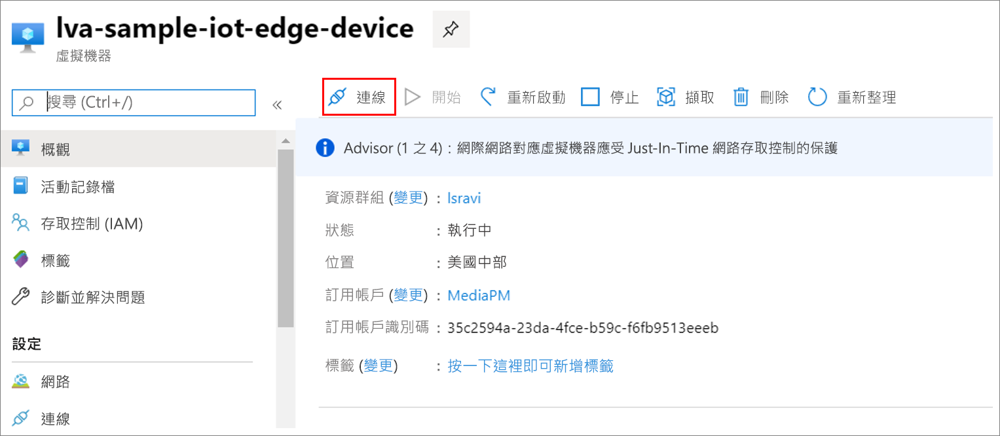

# <a name="quickstart-detect-motion-and-record-video-on-edge-devices"></a>快速入門：在邊緣裝置上偵測動作及錄製影片
 
本快速入門說明如何在 IoT Edge 上使用 Live Video Analytics，從 (模擬) IP 攝影機分析即時影片摘要。 其會示範如何偵測是否有任何動作存在，如果是的話，則會將 MP4 影片剪輯錄製到邊緣裝置上的本機檔案系統中。 快速入門會使用 Azure VM 作為 IoT Edge 裝置，以及使用模擬的即時影片串流。 

本文是以利用 C# 撰寫的範例程式碼為基礎。 其奠基於[偵測動作並發出事件](detect-motion-emit-events-quickstart.md)快速入門。 

## <a name="prerequisites"></a>必要條件

* 具有有效訂用帳戶的 Azure 帳戶。 如果您還未擁有帳戶，請[建立免費帳戶](https://azure.microsoft.com/free/?WT.mc_id=A261C142F)。
* 具有下列擴充功能的 [Visual Studio Code](https://code.visualstudio.com/)：
    * [Azure IoT 工具組](https://marketplace.visualstudio.com/items?itemName=vsciot-vscode.azure-iot-tools)
    * [C#](https://marketplace.visualstudio.com/items?itemName=ms-dotnettools.csharp)
* [.NET Core 3.1 SDK](https://dotnet.microsoft.com/download/dotnet-core/3.1)。
* 如果您尚未完成[偵測動作並發出事件](detect-motion-emit-events-quickstart.md)快速入門，請遵循下列步驟：
     1. [設定 Azure 資源](detect-motion-emit-events-quickstart.md#set-up-azure-resources)
     1. [設定您的開發環境](detect-motion-emit-events-quickstart.md#set-up-your-development-environment)
     1. [產生及部署 IoT Edge 部署資訊清單](detect-motion-emit-events-quickstart.md#generate-and-deploy-the-deployment-manifest)
     1. [準備監視事件](detect-motion-emit-events-quickstart.md#prepare-to-monitor-events)

> [!TIP]
> 安裝 Azure IoT Tools 時，系統可能會提示您安裝 Docker。 請放心地忽略提示。

## <a name="review-the-sample-video"></a>檢閱範例影片
當您在本快速入門中設定 Azure 資源時，一部停車場的短片將會複製到 Azure 中用來做為 IoT Edge 裝置的 Linux VM。 此影片檔案將用來模擬本教學課程的即時串流。

開啟 [VLC 媒體播放器](https://www.videolan.org/vlc/)之類的應用程式，選取 Ctrl + N，然後將[此連結](https://lvamedia.blob.core.windows.net/public/lots_015.mkv)貼到停車場影片以開始播放。 在大約 5 秒標記處，一輛白色汽車駛進停車場。

請完成下列步驟，以在 IoT Edge 上使用 Live Video Analytics 來偵測汽車的運動，並在大約 5 秒的標記處開始錄製影片剪輯。

## <a name="overview"></a>概觀


上圖顯示此快速入門中的信號流動方式。 [邊緣模組](https://github.com/Azure/live-video-analytics/tree/master/utilities/rtspsim-live555)會模擬裝載即時串流通訊協定 (RTSP) 伺服器的 IP 攝影機。 [RTSP 來源](media-graph-concept.md#rtsp-source)節點會從這部伺服器提取影片摘要，然後將影片畫面傳送至[動作偵測處理器](media-graph-concept.md#motion-detection-processor)節點。 RTSP 來源會將相同的影片畫面傳送至[信號閘道處理器](media-graph-concept.md#signal-gate-processor)節點，這會保持關閉，直到有事件觸發為止。

當動作偵測處理器偵測到影片中有動作時，就會將事件傳送至信號閘道處理器節點，並加以觸發。 閘道會在設定的持續時間內保持開啟，並將影片畫面傳送至[檔案接收](media-graph-concept.md#file-sink)節點。 此接收節點會將影片以 MP4 檔案格式錄製到您邊緣裝置的本機檔案系統。 檔案會儲存在設定的位置。

在本快速入門中，您將：

1. 建立和部署媒體圖表。
1. 解譯解譯。
1. 清除資源。

## <a name="examine-and-edit-the-sample-files"></a>查看和編輯範例檔案
在本快速入門的必要條件中，您已將範例程式碼下載至資料夾。 請遵循下列步驟來檢查和編輯範例程式碼。

1. 在 Visual Studio Code 中，移至 *src/edge*。 您會看到 *.env* 檔案和一些部署範本檔案。

    部署範本會參照邊緣裝置的部署資訊清單，其中會使用變數來代表某些屬性。 *.env* 檔案包含這些變數的值。
1. 移至 *src/cloud-to-device-console-app* 資料夾。 在這裡，您會看到 *appsettings.json* 檔案和其他幾個檔案：
    * ***c2d-console-app.csproj*** - Visual Studio Code 的專案檔。
    * ***operations.json*** - 您想要讓程式執行的作業清單。
    * ***Program.cs*** - 範例程式碼。 此程式碼：

        * 載入應用程式設定。
        * 叫用 IoT Edge 模組上 Live Video Analytics 所公開的直接方法。 您可以使用模組，藉由叫用其[直接方法](direct-methods.md)來分析即時影片串流。 
        * 會暫停，讓您可以在 [終端機] 視窗中檢查程式的輸出，並在 [輸出] 視窗中檢查模組所產生的事件。
        * 叫用直接方法來清除資源。

1. 編輯 *operations.json* 檔案：
    * 變更圖表拓撲的連結：

        `"topologyUrl" : "https://raw.githubusercontent.com/Azure/live-video-analytics/master/MediaGraph/topologies/evr-motion-files/topology.json"`
    * 在 `GraphInstanceSet` 底下，編輯圖形拓撲的名稱，使其符合前一個連結中的值：
    
      `"topologyName" : "EVRToFilesOnMotionDetection"`

    * 編輯 RTSP URL，以指向影片檔案：

        `"value": "rtsp://rtspsim:554/media/lots_015.mkv"`

    * 在 `GraphTopologyDelete` 底下，編輯名稱：

        `"name": "EVRToFilesOnMotionDetection"`

## <a name="review---check-the-modules-status"></a>檢閱 - 檢查模組的狀態

在[產生和部署 IoT Edge 部署資訊清單](detect-motion-emit-events-quickstart.md#generate-and-deploy-the-deployment-manifest)步驟中，於 Visual Studio Code 中展開 [AZURE IOT 中樞] 底下的 [lva-sample-device] 節點 (位於左下方區段)。 您應該會看到下列部署的模組：

* 名為 **lvaEdge** 的 Live Video Analytics 模組
* 名為 **rtspsim** 的模組，其會模擬作為即時影片摘要來源的 RTSP 伺服器

  


## <a name="review---prepare-for-monitoring-events"></a>檢閱 - 準備監視事件
請確定您已完成[準備監視事件](detect-motion-emit-events-quickstart.md#prepare-to-monitor-events)的步驟。


## <a name="run-the-sample-program"></a>執行範例程式

1. 選取 F5 來啟動偵錯工作階段。 [終端機] 視窗會列印一些訊息。
1. *operations.json* 程式碼會呼叫直接方法 `GraphTopologyList` 和 `GraphInstanceList`。 如果您在完成先前的快速入門之後清除了資源，則此程序會傳回空的清單，然後暫停。 選取 Enter 鍵。

    ```
    --------------------------------------------------------------------------
    Executing operation GraphTopologyList
    -----------------------  Request: GraphTopologyList  --------------------------------------------------
    {
      "@apiVersion": "1.0"
    }
    ---------------  Response: GraphTopologyList - Status: 200  ---------------
    {
      "value": []
    }
    --------------------------------------------------------------------------
    Executing operation WaitForInput
    Press Enter to continue
    ```

    [終端機] 視窗會顯示下一組直接方法呼叫：

     * 呼叫 `topologyUrl` 以使用 `GraphTopologySet` 
     * 呼叫 `GraphInstanceSet` 以使用下列主體：

         ```
         {
           "@apiVersion": "1.0",
           "name": "Sample-Graph",
           "properties": {
             "topologyName": "EVRToFilesOnMotionDetection",
             "description": "Sample graph description",
             "parameters": [
               {
                 "name": "rtspUrl",
                 "value": "rtsp://rtspsim:554/media/lots_015.mkv"
               },
               {
                 "name": "rtspUserName",
                 "value": "testuser"
               },
               {
                 "name": "rtspPassword",
                 "value": "testpassword"
               }
             ]
           }
         }
         ```
     * 呼叫 `GraphInstanceActivate` 以啟動圖表執行個體和影片流程
     * 第二次呼叫 `GraphInstanceList` 以顯示圖表執行個體處於執行中狀態
1. [終端機] 視窗中的輸出會在 `Press Enter to continue` 暫停。 還不要選取 Enter 鍵。 請向上捲動，查看您所叫用直接方法的 JSON 回應承載。
1. 切換至 Visual Studio Code 中的 [輸出] 視窗。 您會看到訊息指出 IoT Edge 模組上的 Live Video Analytics 正在傳送到 IoT 中樞。 本快速入門的下一節會討論這些訊息。

1. 媒體圖表會繼續執行並列印結果。 RTSP 模擬器會持續循環播放來源影片。 若要停止媒體圖表，請返回 [終端機] 視窗，然後選取 Enter 鍵。 

    下一系列的呼叫會清除資源：
     * 對 `GraphInstanceDeactivate` 的呼叫會停用圖形實例。
     * 對 `GraphInstanceDelete` 的呼叫會刪除執行個體。
     * 對 `GraphTopologyDelete` 的呼叫會刪除拓撲。
     * 最後對 `GraphTopologyList` 的呼叫會顯示清單現在是空的。

## <a name="interpret-results"></a>解譯結果 
當您執行媒體圖表時，來自動作偵測器處理器節點的結果會透過 IoT 中樞接收節點傳遞至 IoT 中樞。 您在 Visual Studio Code 的 [輸出] 視窗中看到的訊息包含 `body` 區段和 `applicationProperties` 區段。 如需詳細資訊，請參閱[建立及讀取 IoT 中樞訊息](https://docs.microsoft.com/azure/iot-hub/iot-hub-devguide-messages-construct)。

在下列訊息中，Live Video Analytics 模組會定義應用程式屬性和主體內容。

### <a name="mediasessionestablished-event"></a>MediaSessionEstablished 事件

具現化媒體圖表時，RTSP 來源節點會嘗試連線到在 rtspsim-live555 容器中執行的 RTSP 伺服器。 如果連線成功，則會列印下列事件。

```
[IoTHubMonitor] [05:37:21 AM] Message received from [lva-sample-device/lvaEdge]:
{  
"body": {
"sdp": "SDP:\nv=0\r\no=- 1586450538111534 1 IN IP4 xxx.xxx.xxx.xxx\r\ns=Matroska video+audio+(optional)subtitles, streamed by the LIVE555 Media Server\r\ni=media/camera-300s.mkv\r\nt=0 0\r\na=tool:LIVE555 Streaming Media v2020.03.06\r\na=type:broadcast\r\na=control:*\r\na=range:npt=0-300.000\r\na=x-qt-text-nam:Matroska video+audio+(optional)subtitles, streamed by the LIVE555 Media Server\r\na=x-qt-text-inf:media/camera-300s.mkv\r\nm=video 0 RTP/AVP 96\r\nc=IN IP4 0.0.0.0\r\nb=AS:500\r\na=rtpmap:96 H264/90000\r\na=fmtp:96 packetization-mode=1;profile-level-id=4D0029;sprop-parameter-sets={SPS}\r\na=control:track1\r\n"  
},  
"applicationProperties": {  
    "dataVersion": "1.0",  
    "topic": "/subscriptions/{subscriptionID}/resourceGroups/{name}/providers/microsoft.media/mediaservices/hubname",  
    "subject": "/graphInstances/Sample-Graph-1/sources/rtspSource",  
    "eventType": "Microsoft.Media.MediaGraph.Diagnostics.MediaSessionEstablished",  
    "eventTime": "2020-05-21T05:37:21.398Z",
    }  
}
```

在上述輸出中： 

* 此訊息為診斷事件 `MediaSessionEstablished`。 這表示 RTSP 來源節點 (主體) 已建立與 RTSP 模擬器的連線，並開始接收 (模擬) 即時摘要。
* 在 `applicationProperties` 中，`subject` 會參考訊息產生來源圖表拓撲中的節點。 在此案例中，訊息來自 RTSP 來源節點。
* 在 `applicationProperties` 中，`eventType` 表示此事件是診斷事件。
* `eventTime` 值是事件的發生時間。
* `body` 區段包含診斷事件的相關資料。 在此情況下，資料包含[工作階段描述通訊協定 (SDP)](https://en.wikipedia.org/wiki/Session_Description_Protocol) 詳細資料。

### <a name="recordingstarted-event"></a>RecordingStarted 事件

當偵測到動作時，就會啟動信號閘道處理器節點，而且媒體圖表中的檔案接收節點會開始寫入 MP4 檔案。 檔案接收節點會傳送操作事件。 `type` 會設定為 `motion` 以表示這是來自動作偵測處理器的結果。 `eventTime` 值是發生動作的 UTC 時間。 如需有關此程序的詳細資訊，請參閱本快速入門中的＜[概述](#overview)＞一節。

這個訊息的範例如下：

```
[IoTHubMonitor] [05:37:27 AM] Message received from [lva-sample-device/lvaEdge]:
{
  "body": {
    "outputType": "filePath",
    "outputLocation": "/var/media/sampleFilesFromEVR-filesinkOutput-20200521T053726Z.mp4"
  },
  "applicationProperties": {
    "topic": "/subscriptions/{subscriptionID}/resourceGroups/{name}/providers/microsoft.media/mediaservices/hubname",  
    "subject": "/graphInstances/Sample-Graph-1/sinks/fileSink",
    "eventType": "Microsoft.Media.Graph.Operational.RecordingStarted",
    "eventTime": "2020-05-21T05:37:27.713Z",
    "dataVersion": "1.0"
  }
}
```

在上述訊息中： 

* 在 `applicationProperties` 中，`subject` 會參考訊息產生來源媒體圖表中的節點。 在此案例中，訊息是來自檔案接收節點。
* 在 `applicationProperties` 中，`eventType` 表示此事件是可運作的。
* `eventTime` 值是事件的發生時間。 此時間是 `MediaSessionEstablished` 之後，以及影片開始串流後的 5 到 6 秒。 此時間會對應至[汽車開始駛進](#review-the-sample-video)停車場的 5 至 6 秒處標記。
* `body` 區段包含操作事件的相關資料。 在此案例中，資料會由 `outputType` 和 `outputLocation` 組成。
* `outputType` 變數表示這是關於檔案路徑的資訊。
* `outputLocation` 值是邊緣模組中的 MP4 檔案位置。

### <a name="recordingstopped-and-recordingavailable-events"></a>RecordingStopped 和 RecordingAvailable 事件

如果您在[圖表拓撲](https://github.com/Azure/live-video-analytics/blob/master/MediaGraph/topologies/evr-motion-files/topology.json)中查看信號閘道處理器節點的屬性，就會看到啟動時間已設定為 5 秒。 因此，在收到 `RecordingStarted` 事件之後大約 5 秒，您會收到：

* `RecordingStopped` 事件，表示錄製已停止。
* `RecordingAvailable` 事件，表示現在可以使用 MP4 檔案來觀看。

這兩個事件通常會相隔幾秒發出。

## <a name="play-the-mp4-clip"></a>播放 MP4 剪輯

MP4 檔案會寫入您使用 OUTPUT_VIDEO_FOLDER_ON_DEVICE 機碼在 *.env* 檔案中設定的邊緣裝置目錄。 如果您使用預設值，則結果應該會在 */home/lvaadmin/samples/output/* 資料夾中。

若要播放 MP4 剪輯：

1. 移至您的資源群組，尋找 VM，然後使用 Azure Bastion 連線。

    
    
    

1. 使用您在[設定 Azure 資源](detect-motion-emit-events-quickstart.md#set-up-azure-resources)時所產生的認證來登入。 
1. 在命令提示字元中，移至相關目錄。 預設位置為 */home/lvaadmin/samples/output*。 您應該會在目錄中看到 MP4 檔案。

     

1. 使用[安全複製 (SCP)](https://docs.microsoft.com/azure/virtual-machines/linux/copy-files-to-linux-vm-using-scp)，將檔案複製到本機電腦。 
1. 藉由使用 [VLC 媒體播放器](https://www.videolan.org/vlc/)或任何其他 MP4 播放器來播放檔案。

## <a name="clean-up-resources"></a>清除資源

如果您想要嘗試其他快速入門，請保留您建立的資源。 否則，請在 Azure 入口網站中移至您的資源群組、選取您執行本快速入門時所用的資源群組，然後刪除所有資源。

## <a name="next-steps"></a>後續步驟

* 遵循[使用您自己的模型執行 Live Video Analytics](use-your-model-quickstart.md) 快速入門，將 AI 應用於即時影片摘要。
* 檢閱進階使用者的其他挑戰：

    * 使用支援 RTSP 的 [IP 攝影機](https://en.wikipedia.org/wiki/IP_camera)，而非使用 RTSP 模擬器。 您可以在[符合 ONVIF 標準的](https://www.onvif.org/conformant-products)產品頁面上，尋找支援 RTSP 的 IP 攝影機。 尋找符合設定檔 G、S 或 T 的裝置。
    * 使用 AMD64 或 x64 Linux 裝置，而不是在 Azure 中使用 Linux VM。 此裝置必須與 IP 攝影機位於相同的網路中。 遵循[在 Linux 上安裝 Azure IoT Edge 執行階段](https://docs.microsoft.com/azure/iot-edge/how-to-install-iot-edge-linux)中的指示。 然後按照[將您的第一個 IoT Edge 模組部署至虛擬 Linux 裝置](https://docs.microsoft.com/azure/iot-edge/quickstart-linux)中的指示操作，向 Azure IoT 中樞註冊裝置。
