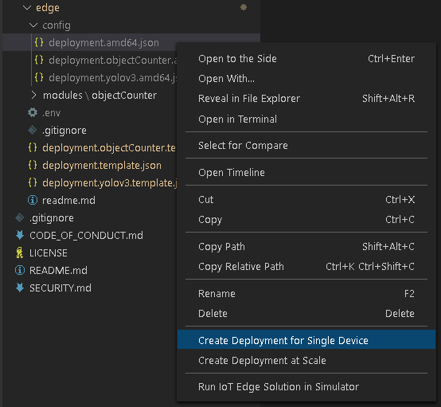

## <a name="generate-and-deploy-the-deployment-manifest"></a>產生和部署部署資訊清單

部署資訊清單會定義要將哪些模組部署至邊緣裝置。 其也會定義這些模組的組態設定。 

請遵循下列步驟，從範本檔案產生資訊清單，然後將其部署到邊緣裝置。

1. 開啟 Visual Studio Code。
1. 在 [Azure IoT 中樞] 窗格旁，選取 [其他動作] 圖示，以設定 IoT 中樞的連接字串。 您可以從 *src/cloud-to-device-console-app/appsettings.json* 檔案複製字串。 

    
1. 以滑鼠右鍵按一下 **src/edge/deployment.template.json**，然後選取 [產生 IoT Edge 部署資訊清單]。

    

    此動作應該會在 *src/edge/config* 資料夾中，建立名為 *deployment.amd64.json* 的資訊清單檔。
1. 以滑鼠右鍵按一下 **src/edge/config/deployment.amd64.json**、選取 [建立單一裝置的部署]，然後選取您的邊緣裝置名稱。

    

1. 當系統提示您選取 IoT 中樞裝置時，請從下拉式功能表中選擇 [lva-sample-device]。
1. 大約 30 秒之後，請在視窗左下角重新整理 Azure IoT 中樞。 邊緣裝置現在會顯示下列已部署的模組：

    * IoT Edge 上的 Live Video Analytics (模組名稱 `lvaEdge`)
    * 即時串流通訊協定 (RTSP) 模擬器 (模組名稱 `rtspsim`)

RTSP 模擬器模組會在您執行 [Live Video Analytics 資源設定指令碼](https://github.com/Azure/live-video-analytics/tree/master/edge/setup)時，使用複製到您邊緣裝置的影片檔案來模擬即時影片串流。 

> [!NOTE]
> 如果您使用自己的邊緣裝置，而不是我們的設定指令碼所佈建的裝置，請移至您的邊緣裝置，並以**管理員權限**執行下列命令，以提取並儲存用於本快速入門的範例影片檔案：  

```
mkdir /home/lvaadmin/samples      
mkdir /home/lvaadmin/samples/input    
curl https://lvamedia.blob.core.windows.net/public/camera-300s.mkv > /home/lvaadmin/samples/input/camera-300s.mkv  
chown -R lvaadmin /home/lvaadmin/samples/  
```
在這個階段，模組已完成部署，但沒有任何媒體圖表處於作用中狀態。
