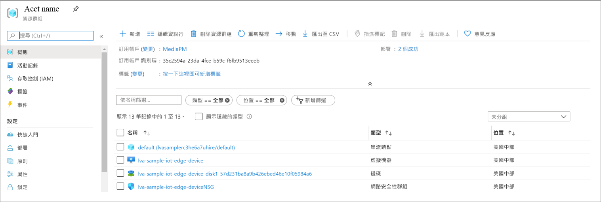

MP4 檔案會寫入您使用 OUTPUT_VIDEO_FOLDER_ON_DEVICE 機碼在 *.env* 檔案中設定的邊緣裝置目錄。 如果您使用預設值，則結果應該會在 */var/media/* 資料夾中。

若要播放 MP4 剪輯：

1. 移至您的資源群組，尋找 VM，然後使用 Azure Bastion 連線。

    
    
    
1. 使用您在[設定 Azure 資源](../../../detect-motion-emit-events-quickstart.md#set-up-azure-resources)時所產生的認證來登入。 
1. 在命令提示字元中，移至相關目錄。 預設位置是 */var/media*。 您應該會在目錄中看到 MP4 檔案。

     

1. 使用[安全複製 (SCP)](../../../../../virtual-machines/linux/copy-files-to-linux-vm-using-scp.md)，將檔案複製到本機電腦。 
1. 藉由使用 [VLC 媒體播放器](https://www.videolan.org/vlc/)或任何其他 MP4 播放器來播放檔案。
