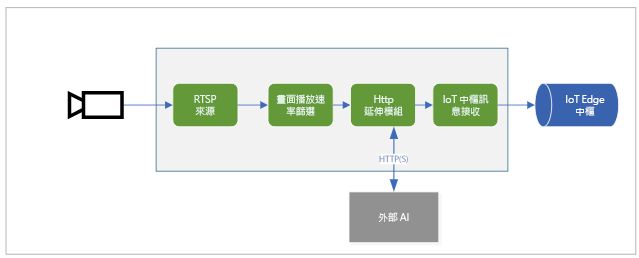

# <a name="quickstart-analyze-live-video-with-your-own-model"></a>快速入門：使用您自己的模型分析即時影片

本快速入門說明如何在 IoT Edge 上使用 Live Video Analytics，藉由套用電腦視覺模型來偵測物件，以從 (模擬) IP 攝影機分析即時影片摘要。 即時影片摘要中的框架子集會傳送至推斷服務，並將其結果傳送至 IoT Edge 中樞。 這裡使用 Azure VM 做為 IoT Edge 裝置和模擬的即時影片串流。 本文是以利用 C# 撰寫的範例程式碼為基礎。

本文是以[此](detect-motion-emit-events-quickstart.md)快速入門為基礎。 

## <a name="prerequisites"></a>必要條件

* 具有有效訂用帳戶的 Azure 帳戶。 [免費建立帳戶](https://azure.microsoft.com/free/?WT.mc_id=A261C142F)。
* 具有您電腦上下列延伸模組的 [Visual Studio Code](https://code.visualstudio.com/) \(英文\)：
    * [Azure IoT 工具組](https://marketplace.visualstudio.com/items?itemName=vsciot-vscode.azure-iot-tools)
    * [C#](https://marketplace.visualstudio.com/items?itemName=ms-dotnettools.csharp)
* [.NET Core 3.1 SDK](https://dotnet.microsoft.com/download/dotnet-core/3.1) 已安裝在您的系統上
* 如果您先前未完成[此](detect-motion-emit-events-quickstart.md)快速入門，請完成下列步驟：
     * [設定 Azure 資源](detect-motion-emit-events-quickstart.md#set-up-azure-resources)

> [!TIP]
> 安裝 Azure IoT Tools 時，系統可能會提示您安裝 Docker。 您可以視需要予以略過。

## <a name="review-the-sample-video"></a>檢閱範例影片
在設定 Azure 資源的上述步驟中，會將高速公路流量的 (簡短) 影片複製到 Azure 中做為 IoT Edge 裝置使用的 Linux VM。 此影片檔案將用來模擬本教學課程的即時串流。

您可以使用如 [VLC Player](https://www.videolan.org/vlc/) 的應用程式、加以啟動、按 Control+N，然後將[此](https://lvamedia.blob.core.windows.net/public/camera-300s.mkv)連結貼到影片以開始播放。 您會看到畫面為高速公路上的流量，其中有許多車輛往來。

當您完成下列步驟時，將在 IoT Edge 上使用 Live Video Analytics 來偵測物件 (例如車輛、人員等等)，並將相關聯的推斷事件發佈到 IoT Edge 中樞。

## <a name="overview"></a>概觀



上圖顯示此快速入門中的信號流動方式。 邊緣模組 (在[此](https://github.com/Azure/live-video-analytics/tree/master/utilities/rtspsim-live555)詳述) 會模擬主控 RTSP 伺服器的 IP 攝影機。 [RTSP 來源](media-graph-concept.md#rtsp-source)節點會從這部伺服器提取影片摘要，並將影片畫面傳送到[畫面播放速率篩選處理器](media-graph-concept.md#frame-rate-filter-processor)節點。 此處理器會限制影片串流達到 [HTTP 延伸模組處理器](media-graph-concept.md#http-extension-processor)節點的畫面播放速率。 

HTTP 延伸模組節點會將影片畫面轉換成指定的映像類型，並將映像透過 REST 轉送至另一個在 HTTP 端點後方執行 AI 模型的 Edge 模組，來扮演 Proxy 的角色。 在此範例中，Edge 模組是使用 [YOLOv3](https://github.com/Azure/live-video-analytics/tree/master/utilities/video-analysis/yolov3-onnx) 模型所建置，其能夠偵測許多類型的物件。 HTTP 延伸模組處理器節點會收集偵測結果，並將事件發佈至 [IoT 中樞接收](media-graph-concept.md#iot-hub-message-sink )節點，然後將這些事件傳送至 [IoT Edge 中樞](../../iot-edge/iot-edge-glossary.md#iot-edge-hub)。

在本快速入門中，您將：

1. 建立和部署媒體圖表。
1. 解譯解譯。
1. 清除資源。


## <a name="create-and-deploy-the-media-graph"></a>建立和部署媒體圖表
    
### <a name="examine-and-edit-the-sample-files"></a>檢查和編輯範例檔案

作為必要條件的一部分，您會將範例程式碼下載至資料夾。 啟動 Visual Studio Code，然後開啟資料夾。

1. 在 Visual Studio Code 中，瀏覽至「src/edge」。 您會看到您所建立的 .env 檔案以及一些部署範本檔案。

    * 部署範本會使用一些預留位置值來參考邊緣裝置的部署資訊清單。 .env 檔案具有這些變數的值。
1. 接下來，瀏覽至「src/cloud-to-device-console-app」資料夾。 您在這裡會看到您建立的 appsettings.json 檔案，以及一些其他檔案：

    * c2d-console-app.csproj - 這是 Visual Studio Code 的專案檔。
    * operations.json - 此檔案會列出您需要程式執行的不同作業。
    * Program.cs - 這是執行下列動作的範例程式碼：

        * 載入應用程式設定。
        *  叫用 IoT Edge 模組上 Live Video Analytics 所公開的直接方法。 您可以使用模組來分析即時影片串流，方法是叫用其[直接方法](direct-methods.md) 
        * 暫停可讓您在 [終端機] 視窗中檢查程式的輸出，以及在 [輸出] 視窗中檢查模組所產生的事件
        * 叫用直接方法來清除資源   


1. 對 operations.json 檔案進行下列編輯
    * 變更圖表拓撲的連結：`"topologyUrl" : "https://raw.githubusercontent.com/Azure/live-video-analytics/master/MediaGraph/topologies/httpExtension/topology.json"`
    * 在 GraphInstanceSet 底下，編輯圖表拓撲的名稱，使其符合上述連結中的值 `"topologyName" : "InferencingWithHttpExtension"`
    * 在 GraphTopologyDelete 底下，編輯名稱 `"name": "InferencingWithHttpExtension"`

### <a name="generate-and-deploy-the-iot-edge-deployment-manifest"></a>產生及部署 IoT Edge 部署資訊清單

1. 以滑鼠右鍵按一下「src/edge/ deployment.yolov3.template.json」檔案，然後按一下 [產生 IoT Edge 部署資訊清單]。

      
1. 這應該會在 src/edge/config 資料夾中建立名為「deployment.yolov3.amd64.json」的資訊清單檔。
1. 如果您先前已完成[快速入門](detect-motion-emit-events-quickstart.md)，請略過此步驟。 否則，請按一下左下角 [AZURE IOT 中樞] 窗格旁的 [其他動作] 圖示，以設定 IoT 中樞連接字串。 您可以從 appsettings.json 檔案複製字串。 (以下是另一個建議的方法，可確保您在 Visual Studio Code 內透過[選取 IoT 中樞命令](https://github.com/Microsoft/vscode-azure-iot-toolkit/wiki/Select-IoT-Hub) 設定適當的 IoT 中樞)。
    
    
1. 接下來，以滑鼠右鍵按一下「src/edge/config/ deployment.yolov3.amd64.json」，然後按一下 [建立單一裝置的部署]。 

    
1. 接著，系統會要求您選取 IoT 中樞裝置。 從下拉式選單中選取 [lva-sample-device]。
1. 在大約 30 秒內，重新整理左下方區段的 Azure IoT 中樞，您應該會看到邊緣裝置已部署下列模組：

    1. Live Video Analytics 模組，名稱為「lvaEdge」。
    1. 名為「rtspsim」的模組會模擬 RTSP 伺服器，做為即時影片摘要的來源。
    1. 名為「yolov3」的模組 (如其名稱所示) 是將電腦視覺套用至映像，並傳回多個物件類型類別的 YOLOv3 物件偵測模型。
 
        

### <a name="prepare-for-monitoring-events"></a>準備進行監視事件

以滑鼠右鍵按一下 Live Video Analytics 裝置，然後按一下 [開始監視內建事件端點]。 需要執行此步驟，才能監視 IoT 中樞事件，並在 Visual Studio Code 的 [輸出] 視窗中看到。 

 

### <a name="run-the-sample-program"></a>執行範例程式

1. 啟動偵錯工作階段 (按 F5)。 您會開始看到列印在 [終端機] 視窗中某些訊息。
1. 在呼叫直接方法 GraphTopologyList 和 GraphInstanceList 時，會開始使用 operations.json。 如果您已在先前的快速入門之後清除資源，這會傳回空白清單，然後暫停以讓您按下 Enter 鍵
   ```
   --------------------------------------------------------------------------
   Executing operation GraphTopologyList
   -----------------------  Request: GraphTopologyList  --------------------------------------------------
   {
   "@apiVersion": "1.0"
   }
   ---------------  Response: GraphTopologyList - Status: 200  ---------------
   {
   "value": []
   }
   --------------------------------------------------------------------------
   Executing operation WaitForInput
   Press Enter to continue
   ```

1. 當您在 [終端機] 視窗中按下 Enter 鍵時，將會進行下一組直接方法呼叫
     * 使用上述 topologyUrl 呼叫 GraphTopologySet
     * 使用下列主體呼叫 GraphInstanceSet
     ```
     {
       "@apiVersion": "1.0",
       "name": "Sample-Graph-1",
       "properties": {
         "topologyName": "InferencingWithHttpExtension",
         "description": "Sample graph description",
         "parameters": [
           {
             "name": "rtspUrl",
             "value": "rtsp://rtspsim:554/media/camera-300s.mkv"
           },
           {
             "name": "rtspUserName",
             "value": "testuser"
           },
           {
             "name": "rtspPassword",
             "value": "testpassword"
           }
         ]
       }
     }
     ```
     * 呼叫 GraphInstanceActivate 以啟動圖表執行個體，並啟動影片流程
     * 第二次呼叫 GraphInstanceList，以顯示圖表執行個體確實處於執行中狀態
1. [終端機] 視窗中的輸出現在會在「按下 Enter 以繼續」提示時暫停。 此時不要按 Enter。 您可以向上捲動查看您所叫用直接方法的 JSON 回應承載
1. 如果您現在在 Visual Studio Code 中切換到 [輸出] 視窗，將會看到 IoT Edge 模組上的 Live Video Analytics 傳送至 IoT 中樞的訊息。
     * 下列各節將討論這些訊息
1. 媒體圖表會繼續執行，並列印結果 – RTSP 模擬器會持續迴圈來源影片。 若要停止媒體圖表，請回到 [終端機] 視窗，然後按 Enter。 會進行下一系列的呼叫以清除資源：
     * 呼叫 GraphInstanceDeactivate 以停用 Graph 執行個體
     * 呼叫 GraphInstanceDelete 以刪除執行個體
     * 呼叫 GraphTopologyDelete 以刪除拓撲
     * 最後一次呼叫 GraphTopologyList 以顯示清單現在是空的

## <a name="interpret-results"></a>解譯結果

當您執行媒體圖表時，來自 HTTP 延伸模組處理器節點的結果會透過 IoT 中樞接收節點傳送至 IoT 中樞。 您在 Visual Studio Code 的 [輸出] 視窗中看到的訊息包含「body」區段和「applicationProperties」區段。 若要了解這些章節所代表的內容，請閱讀[此](https://docs.microsoft.com/azure/iot-hub/iot-hub-devguide-messages-construct)文章。

在下列訊息中，Live Video Analytics 模組會定義應用程式屬性和主體的內容。 


### <a name="mediasession-established-event"></a>MediaSession 建立的事件

具現化媒體圖表時，RTSP 來源節點會嘗試連線到在 rtspsim-live55 容器中執行的 RTSP 伺服器。 如果成功，則會列印此事件。 事件類型為 Microsoft.Media.MediaGraph.Diagnostics.MediaSessionEstablished。

```
[IoTHubMonitor] [9:42:18 AM] Message received from [lvaedgesample/lvaEdge]:
{
  "body": {
    "sdp": "SDP:\nv=0\r\no=- 1586450538111534 1 IN IP4 nnn.nn.0.6\r\ns=Matroska video+audio+(optional)subtitles, streamed by the LIVE555 Media Server\r\ni=media/camera-300s.mkv\r\nt=0 0\r\na=tool:LIVE555 Streaming Media v2020.03.06\r\na=type:broadcast\r\na=control:*\r\na=range:npt=0-300.000\r\na=x-qt-text-nam:Matroska video+audio+(optional)subtitles, streamed by the LIVE555 Media Server\r\na=x-qt-text-inf:media/camera-300s.mkv\r\nm=video 0 RTP/AVP 96\r\nc=IN IP4 0.0.0.0\r\nb=AS:500\r\na=rtpmap:96 H264/90000\r\na=fmtp:96 packetization-mode=1;profile-level-id=4D0029;sprop-parameter-sets=Z00AKeKQCgC3YC3AQEBpB4kRUA==,aO48gA==\r\na=control:track1\r\n"
  },
  "applicationProperties": {
    "dataVersion": "1.0",
    "topic": "/subscriptions/{subscriptionID}/resourceGroups/{name}/providers/microsoft.media/mediaservices/hubname",
    "subject": "/graphInstances/GRAPHINSTANCENAMEHERE/sources/rtspSource",
    "eventType": "Microsoft.Media.MediaGraph.Diagnostics.MediaSessionEstablished",
    "eventTime": "2020-04-09T16:42:18.1280000Z"
  }
}
```

請注意上述訊息中的下列事項：
* 此訊息為診斷事件 MediaSessionEstablished，表示 RTSP 來源節點 (主體) 能夠與 RTSP 模擬器建立連線，並開始接收 (模擬) 即時摘要。
* applicationProperties 中的「主體」表示訊息是從媒體圖表中的 RTSP 來源節點所產生。
* applicationProperties 中的「eventType」表示這是診斷事件。
* 「eventTime」表示事件發生的時間。
* 「主體」包含診斷事件的相關資料，在此案例中為 [SDP](https://en.wikipedia.org/wiki/Session_Description_Protocol) 詳細資料。

### <a name="inference-event"></a>推斷事件

HTTP 延伸模組處理器節點會接收來自 yolov3 模組的推斷結果，並透過 IoT 中樞接收節點以推斷事件的形式發出。 在這些事件中，類型會設定為「實體」，表示其為一個實體 (例如汽車或卡車)，而 eventTime 會告訴您偵測到該物件的時間 (UTC)。 以下是在相同的影片畫面中偵測到兩部不同層級可信度之車輛的範例。

```
[IoTHubMonitor] [11:37:17 PM] Message received from [lva-sample-device/lvaEdge]:
{
  "body": {
    "inferences": [
      {
        "entity": {
          "box": {
            "h": 0.0344108157687717,
            "l": 0.5756940841674805,
            "t": 0.5929375966389974,
            "w": 0.04484643936157227
          },
          "tag": {
            "confidence": 0.8714089393615723,
            "value": "car"
          }
        },
        "type": "entity"
      },
      {
        "entity": {
          "box": {
            "h": 0.03960910373263889,
            "l": 0.2750667095184326,
            "t": 0.6102327558729383,
            "w": 0.031027007102966308
          },
          "tag": {
            "confidence": 0.7042660713195801,
            "value": "car"
          }
        },
        "type": "entity"
      }
    ]
  },
  "applicationProperties": {
    "topic": "/subscriptions/{subscriptionID}/resourceGroups/{name}/providers/microsoft.media/mediaservices/hubname",
    "subject": "/graphInstances/GRAPHINSTANCENAMEHERE/processors/inferenceClient",
    "eventType": "Microsoft.Media.Graph.Analytics.Inference",
    "eventTime": "2020-04-23T06:37:16.097Z"
  }
}
```

請注意上述訊息中的下列事項：

* ApplicationProperties 中的「主體」會參考產生訊息之圖表拓撲中的節點。 
* applicationProperties 中的「eventType」表示這是分析事件。
* 「eventTime」表示事件發生的時間。
* 「主體」包含有關分析事件的資料。 在此情況下，事件為推斷事件，因此主體包含「推斷」資料。
* 「推斷」區段表示「類型」為「實體」，且有關於「實體」的其他資料。

## <a name="clean-up-resources"></a>清除資源

如果您想要嘗試其他快速入門，應該保留所建立的資源。 否則，請移至 [Azure 入口網站]、瀏覽至您的資源群組、選取您執行本快速入門所用的資源群組，並刪除所有資源。

## <a name="next-steps"></a>後續步驟

檢閱進階使用者的其他挑戰：

* 使用具有 RTSP 支援的 [IP 攝影機](https://en.wikipedia.org/wiki/IP_camera)，而非使用 RTSP 模擬器。 您可以藉由尋找符合設定檔 G、S 或 T 的裝置，在 [符合 ONVIF 標準](https://www.onvif.org/conformant-products/)產品頁面上搜尋具有 RTSP 支援的 IP 攝影機。
* 使用 AMD64 或 X64 Linux 裝置 (相較於使用 Azure Linux VM)。 此裝置必須與 IP 攝影機位於相同的網路中。 您可以遵循[在 Linux 上安裝 Azure IoT Edge 執行階段](https://docs.microsoft.com/azure/iot-edge/how-to-install-iot-edge-linux)中的指示，然後遵循此[將您的第一個 IoT Edge 模組部署至虛擬 Linux 裝置](https://docs.microsoft.com/azure/iot-edge/quickstart-linux)快速入門中的指示，向 Azure IoT 中樞註冊裝置。

