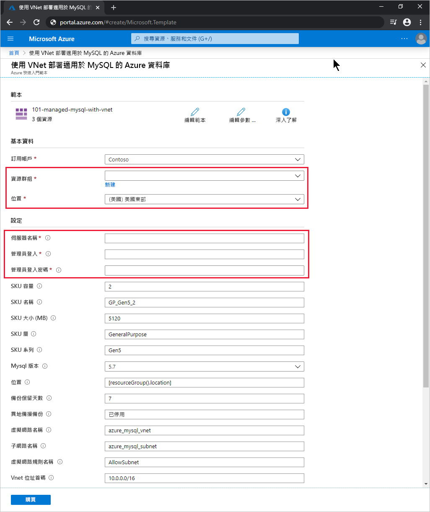

# <a name="quickstart-use-an-arm-template-to-create-an-azure-database-for-mysql-server"></a>快速入門：使用 ARM 範本來建立適用於 MySQL 伺服器的 Azure 資料庫

適用於 MySQL 的 Azure 資料庫是一個受控服務，您可用來在雲端執行、管理及調整高可用性 MySQL 資料庫。 在本快速入門中，您會使用 Azure Resource Manager 範本 (ARM 範本) 來建立具有虛擬網路整合且適用於 MySQL 的 Azure 資料庫伺服器。 您可以在 Azure 入口網站、Azure CLI 或 Azure PowerShell 中建立伺服器。

[!INCLUDE [About Azure Resource Manager](../../includes/resource-manager-quickstart-introduction.md)]

如果您的環境符合必要條件，而且您很熟悉 ARM 範本，請選取 [部署至 Azure] 按鈕。 範本會在 Azure 入口網站中開啟。

[](https://portal.azure.com/#create/Microsoft.Template/uri/https%3a%2f%2fraw.githubusercontent.com%2fAzure%2fazure-quickstart-templates%2fmaster%2f101-managed-mysql-with-vnet%2fazuredeploy.json)

## <a name="prerequisites"></a>必要條件

# <a name="portal"></a>[入口網站](#tab/azure-portal)

具有有效訂用帳戶的 Azure 帳戶。 [建立免費帳戶](https://azure.microsoft.com/free/)。

# <a name="powershell"></a>[PowerShell](#tab/PowerShell)

* 具有有效訂用帳戶的 Azure 帳戶。 [建立免費帳戶](https://azure.microsoft.com/free/)。
* 如果要在本機執行程式碼，請使用 [Azure PowerShell](/powershell/azure/)。

# <a name="cli"></a>[CLI](#tab/CLI)

* 具有有效訂用帳戶的 Azure 帳戶。 [建立免費帳戶](https://azure.microsoft.com/free/)。
* 如果要在本機執行程式碼，請使用 [Azure CLI](/cli/azure/)。

---

## <a name="review-the-template"></a>檢閱範本

您可使用一組已定義的計算和儲存體資源來建立「適用於 MySQL 的 Azure 資料庫」伺服器。 如需深入了解，請參閱[適用於 MySQL 的 Azure 資料庫定價層](concepts-pricing-tiers.md)。 您可在 [Azure 資源群組](../azure-resource-manager/management/overview.md)內建立伺服器。

本快速入門中使用的範本是來自 [Azure 快速入門範本](https://azure.microsoft.com/resources/templates/101-managed-mysql-with-vnet/)。

:::code language="json" source="~/quickstart-templates/101-managed-mysql-with-vnet/azuredeploy.json" range="001-231" highlight="149,162,176,199,213":::

範本會定義五個 Azure 資源：

* [**Microsoft.Network/virtualNetworks**](/azure/templates/microsoft.network/virtualnetworks)
* [**Microsoft.Network/virtualNetworks/subnets**](/azure/templates/microsoft.network/virtualnetworks/subnets)
* [**Microsoft.DBforMySQL/servers**](/azure/templates/microsoft.dbformysql/servers)
* [**Microsoft.DBforMySQL/servers/virtualNetworkRules**](/azure/templates/microsoft.dbformysql/servers/virtualnetworkrules)
* [**Microsoft.DBforMySQL/servers/firewallRules**](/azure/templates/microsoft.dbformysql/servers/firewallrules)

您可以在[快速入門範本資源庫](https://azure.microsoft.com/resources/templates/?resourceType=Microsoft.Dbformysql&pageNumber=1&sort=Popular)中找到更多適用於 MySQL 的 Azure 資料庫範本的範例。

## <a name="deploy-the-template"></a>部署範本

# <a name="portal"></a>[入口網站](#tab/azure-portal)

選取下列連結，以在 Azure 入口網站中部署適用於 MySQL 的 Azure 資料庫伺服器範本：

[](https://portal.azure.com/#create/Microsoft.Template/uri/https%3a%2f%2fraw.githubusercontent.com%2fAzure%2fazure-quickstart-templates%2fmaster%2f101-managed-mysql-with-vnet%2fazuredeploy.json)

在**使用 VNet 部署適用於 MySQL 的 Azure 資料庫**頁面：

1. 針對 [資源群組]，選取 [新建]，然後輸入新資源群組的名稱並選取 [確認]。

2. 如果您已建立新的資源群組，請選取資源群組和新伺服器的**位置**。

3. 輸入**伺服器名稱**、**管理員登入**，以及**管理員登入密碼**。

    

4. 如有需要，請變更其他預設設定：

    * **訂用帳戶**：選取您要讓伺服器使用的 Azure 訂用帳戶。
    * **SKU 容量**：虛擬核心容量，可以是 2 (預設值)、4、8、16、32或 64。
    * **SKU 名稱**：SKU 層前置詞、SKU 系列和 SKU 容量 (以底線連在一起)，例如 B_Gen5_1、GP_Gen5_2 (預設值) 或 MO_Gen5_32。
    * **SKU 大小 MB**：適用於 MySQL 的 Azure 資料庫伺服器的儲存體大小 (以 MB 為單位，預設為 5120)。
    * **SKU 層**：部署層，例如基本、GeneralPurpose (預設值) 或 *MemoryOptimized*。
    * **SKU 系列**：Gen4 或 Gen5 (預設值)，表示伺服器部署的硬體世代。
    * **Mysql 版本**：要部署的 MySQL server 版本，例如 5.6 或 5.7 (預設值)。
    * **備份保留天數**：異地備援備份保留的所需期間 (以天為單位，預設值為 7)。
    * **異地備援備份**：根據異地災害復原 (Geo-DR) 需求，啟用或停用 (預設值)。
    * **虛擬網路名稱**：虛擬網路的名稱 (預設為 azure_mysql_vnet)。
    * **子網路名稱**：子網路的名稱 (預設為 azure_mysql_subnet)。
    * **虛擬網路規則名稱**：允許子網路的虛擬網路規則名稱 (預設為 AllowSubnet)。
    * **VNet 位址前置詞**：虛擬網路的位址前置詞 (預設為 10.0.0.0/16)。
    * **子網路前置詞**：子網路的位址前置詞 (預設為 10.0.0.0/16)。

5. 讀取條款及條件，然後選取 [我同意上方所述的條款及條件]。

6. 選取 [購買]。

# <a name="powershell"></a>[PowerShell](#tab/PowerShell)

使用下列互動式程式碼，使用範本建立新的適用於 MySQL 的 Azure 資料庫伺服器。 程式碼會提示您輸入新的伺服器名稱、新資源群組的名稱和位置，以及管理帳戶名稱和密碼。

若要在 Azure Cloud Shell 中執行程式碼，請在任何程式碼區塊的右上角選取 [試用]。

```azurepowershell-interactive
$serverName = Read-Host -Prompt "Enter a name for the new Azure Database for MySQL server"
$resourceGroupName = Read-Host -Prompt "Enter a name for the new resource group where the server will exist"
$location = Read-Host -Prompt "Enter an Azure region (for example, centralus) for the resource group"
$adminUser = Read-Host -Prompt "Enter the Azure Database for MySQL server's administrator account name"
$adminPassword = Read-Host -Prompt "Enter the administrator password" -AsSecureString

New-AzResourceGroup -Name $resourceGroupName -Location $location # Use this command when you need to create a new resource group for your deployment
New-AzResourceGroupDeployment -ResourceGroupName $resourceGroupName `
    -TemplateUri https://raw.githubusercontent.com/Azure/azure-quickstart-templates/master/101-managed-mysql-with-vnet/azuredeploy.json `
    -serverName $serverName `
    -administratorLogin $adminUser `
    -administratorLoginPassword $adminPassword

Read-Host -Prompt "Press [ENTER] to continue ..."
```

# <a name="cli"></a>[CLI](#tab/CLI)

使用下列互動式程式碼，使用範本建立新的適用於 MySQL 的 Azure 資料庫伺服器。 程式碼會提示您輸入新的伺服器名稱、新資源群組的名稱和位置，以及管理帳戶名稱和密碼。

若要在 Azure Cloud Shell 中執行程式碼，請在任何程式碼區塊的右上角選取 [試用]。

```azurecli-interactive
echo "Enter a name for the new Azure Database for MySQL server:" &&
read serverName &&
echo "Enter a name for the new resource group where the server will exist:" &&
read resourceGroupName &&
echo "Enter an Azure region (for example, centralus) for the resource group:" &&
read location &&
echo "Enter the Azure Database for MySQL server's administrator account name:" &&
read adminUser &&
echo "Enter the administrator password:" &&
read adminPassword &&
params='serverName='$serverName' administratorLogin='$adminUser' administratorLoginPassword='$adminPassword &&
az group create --name $resourceGroupName --location $location &&
az deployment group create --resource-group $resourceGroupName --parameters $params --template-uri https://raw.githubusercontent.com/Azure/azure-quickstart-templates/master/101-managed-mysql-with-vnet/azuredeploy.json &&
echo "Press [ENTER] to continue ..."
```

---

## <a name="review-deployed-resources"></a>檢閱已部署的資源

# <a name="portal"></a>[入口網站](#tab/azure-portal)

請依照這些步驟查看新適用於 MySQL 的 Azure 資料庫伺服器的概觀：

1. 在 [Azure 入口網站](https://portal.azure.com)中，搜尋並選取 [適用於 MySQL 的 Azure 資料庫伺服器]。

2. 在資料庫清單中，選取您的新伺服器。 新適用於 MySQL 的 Azure 資料庫伺服器的 [概觀] 頁面隨即出現。

# <a name="powershell"></a>[PowerShell](#tab/PowerShell)

執行下列互動式程式碼以檢視適用於 MySQL 的 Azure 資料庫伺服器詳細資料。 您必須輸入新伺服器的名稱。

```azurepowershell-interactive
$serverName = Read-Host -Prompt "Enter the name of your Azure Database for MySQL server"
Get-AzResource -ResourceType "Microsoft.DBforMySQL/servers" -Name $serverName | ft
Write-Host "Press [ENTER] to continue..."
```

# <a name="cli"></a>[CLI](#tab/CLI)

執行下列互動式程式碼以檢視適用於 MySQL 的 Azure 資料庫伺服器詳細資料。 您必須輸入新伺服器的名稱和資源群組。

```azurecli-interactive
echo "Enter your Azure Database for MySQL server name:" &&
read serverName &&
echo "Enter the resource group where the Azure Database for MySQL server exists:" &&
read resourcegroupName &&
az resource show --resource-group $resourcegroupName --name $serverName --resource-type "Microsoft.DbForMySQL/servers"
```

---

## <a name="clean-up-resources"></a>清除資源

如果不再需要，請刪除資源群組，這會刪除資源群組中的資源。

# <a name="portal"></a>[入口網站](#tab/azure-portal)

1. 在 [Azure 入口網站](https://portal.azure.com)中，搜尋並選取 [資源群組]。

2. 在 [資源群組] 清單中，選擇資源群組的名稱。

3. 在資源群組的 [概觀] 頁面中，選取 [刪除資源群組]。

4. 在確認對話方塊凹輸入您的資源群組名稱，然後選取 [刪除]。

# <a name="powershell"></a>[PowerShell](#tab/PowerShell)

```azurepowershell-interactive
$resourceGroupName = Read-Host -Prompt "Enter the Resource Group name"
Remove-AzResourceGroup -Name $resourceGroupName
Write-Host "Press [ENTER] to continue..."
```

# <a name="cli"></a>[CLI](#tab/CLI)

```azurecli-interactive
echo "Enter the Resource Group name:" &&
read resourceGroupName &&
az group delete --name $resourceGroupName &&
echo "Press [ENTER] to continue ..."
```

---

## <a name="next-steps"></a>後續步驟

如需逐步教學課程，以引導您完成建立 ARM 範本的流程，請參閱：

> [!div class="nextstepaction"]
> [教學課程：建立及部署您的第一個 ARM 範本](../azure-resource-manager/templates/template-tutorial-create-first-template.md)
