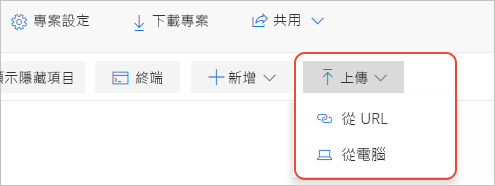

# 快速入門：在 Azure Notebooks 預覽中遷移本機 Jupyter Notebook

在本快速入門中，您會將 Jupyter Notebook 從本機電腦或另一個可存取檔案 URL 遷移至 Azure Notebooks。 

只有您可存取自有電腦上的 Jupyter Notebook。 您可以共用檔案，但收件者接著會有自己的本機 Notebook 複本，且難以併入其變更。 即使您將 Notebook 儲存在 GitHub 等共用線上存放庫中，每個共同作業者都必須像您一樣設定本機 Jupyter 安裝。

將您的本機或以存放庫為基礎的 Notebook 遷移至 Azure Notebooks，您可立即將其與共同作業者共用，他們只需要瀏覽器即可檢視和執行您的 Notebook。 如果他們登入 Azure Notebooks，也可以進行變更。

## Prerequisites

- 本機電腦或另一個可存取檔案 URL 上的 [Jupyter Notebook](https://jupyter-notebook.readthedocs.io)。 

## 在 Azure Notebooks 上建立專案

本快速入門示範如何從您的本機電腦或另一個可存取檔案 URL 遷移 Notebook。 若要從 GitHub 存放庫移轉 Notebook，請參閱[快速入門：複製 Notebook](quickstart-clone-jupyter-notebook.md)。

[!INCLUDE [notebooks-status](../../includes/notebooks-status.md)]

1. 前往 [Azure Notebooks](https://notebooks.azure.com) 並登入。 (如需詳細資訊，請參閱[快速入門 - 登入 Azure Notebooks](quickstart-sign-in-azure-notebooks.md))。

1. 從您的公用設定檔頁面中，選取頁面頂端的 [我的專案]  ：

    ![瀏覽器視窗頂端的 [我的專案] 連結](media/quickstarts/my-projects-link.png)

1. 在 [我的專案]  頁面上，選取 [新增專案]  (鍵盤快速鍵：n)。 如果瀏覽器視窗很窄，按鈕可能只會顯示 **+** ：

    ![[我的專案] 頁面上的 [新增專案] 命令](media/quickstarts/new-project-command.png)

1. 在顯示的 [建立新的專案]  快顯視窗中，在 [專案名稱]  和 [專案識別碼]  欄位中為您要移轉的 Notebook 輸入適當的值，並清除 [公用專案]  和 [建立 README.md]  的選項，然後選取 [建立]  。

## 上傳本機 Notebook

1. 在 [專案] 頁面上選取 [上傳]  (如果您的瀏覽器視窗較小，可能會顯示為向上箭號)，然後選取 1。 在顯示的快顯視窗中，選取 [從電腦]  (如果您的 Notebook 位於本機檔案系統) 或 [從 URL]  (如果 Notebook 位於線上)：

    

   同樣地，如果您的 Notebook 位於 GitHub 存放庫中，請改為遵循[快速入門：複製 Notebook](quickstart-clone-jupyter-notebook.md) 中的步驟。

   - 如果您使用 [從電腦]  ，請將 *.ipynb* 檔案拖放到快顯視窗中，或選取 [選擇檔案]  ，然後瀏覽至您要匯入的檔案，並加以選取。 然後選取 [上傳]  。 上傳的檔案會獲得與本機檔案相同的名稱。 您不需要上傳 *.ipynb_checkpoints* 資料夾的任何內容。

     

   - 如果您使用 [從 URL]  ，請在 [檔案 URL]  欄位中輸入來源位址，然後在 [檔案名稱]  欄位中，輸入要指派給專案中 Notebook 的檔案名稱。 然後選取 [上傳]  。 如果您有多個具有不同 URL 的檔案，請使用 [新增檔案]  命令來檢查您輸入的第一個 URL，其後快顯視窗將會提供另一個檔案的新欄位。

     

1. 開啟並執行您剛上傳的 Notebook，以確認其內容和作業。 完成之後，請選取 [檔案]   > [終止並關閉]  以關閉 Notebook。

1. 若要共用已上傳 Notebook 的連結，請以滑鼠右鍵按一下專案中的檔案，並選取 [複製連結]  (鍵盤快速鍵：y)，然後將該連結貼到適當的訊息中。 或者，您可以使用專案頁面上的 [共用]  控制項共用整個專案。

1. 若要編輯筆記本以外的檔案，以滑鼠右鍵按一下專案中的檔案，然後選取 **編輯檔案** (鍵盤快速鍵：i)。 預設動作 **執行** (鍵盤快速鍵：r) 只會顯示檔案內容，而且不允許編輯。

## 後續步驟

> [!div class="nextstepaction"]
> [教學課程：建立和執行 Jupyter Notebook 來執行線性迴歸](tutorial-create-run-jupyter-notebook.md)
