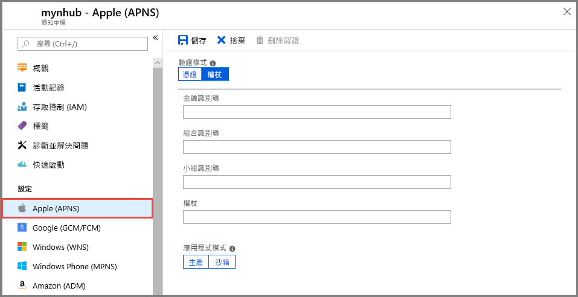

# <a name="quickstart-set-up-push-notifications-in-a-notification-hub"></a>快速入門：設定通知中樞中的推播通知

Azure 通知中樞提供易於使用並可相應放大的推播引擎。使用通知中樞將通知傳送至任何平台 (iOS、Android、Windows、百度)，以及任何後端 (雲端或內部部署)。 如需詳細資訊，請參閱[什麼是 Azure 通知中樞](notification-hubs-push-notification-overview.md)。

在本快速入門中，您將使用通知中樞內的平台通知系統 (PNS) 設定，來設定多個平台的推播通知。 本快速入門會說明要在 Azure 入口網站中採取的步驟。  [Google Firebase 雲端通訊](/azure/notification-hubs/configure-notification-hub-portal-pns-settings?tabs=azure-cli#google-firebase-cloud-messaging-fcm)包含如何使用 Azure CLI 的指示。

如果您尚未建立通知中樞，立即建立一個。 如需詳細資訊，請參閱[在 Azure 入口網站中建立 Azure 通知中樞](create-notification-hub-portal.md)或[使用 Azure CLI 建立 Azure 通知中樞](create-notification-hub-azure-cli.md)

## <a name="apple-push-notification-service"></a>Apple Push Notification Service

設定 Apple Push Notification Service (APNS)：

1. 在 Azure 入口網站中的 [通知中樞]  頁面上，從左側功能表中選取 [Apple (APNS)]  。

1. 針對 [驗證模式]  ，選取 [憑證]  或 [權杖]  。

   a. 如果您選取 [憑證]  ：
   * 選取檔案圖示，然後選取您要上傳的 [.p12]  檔案。
   * 輸入密碼。
   * 選取 [沙箱]  模式。 或者，若要傳送推播通知給從市集購買應用程式的使用者，請選取 [生產]  模式。

     

   b. 如果您選取 [權杖]  ：

   * 輸入 [金鑰識別碼]  、[搭售方案識別碼]  、[小組識別碼]  和 [權杖]  的值。
   * 選取 [沙箱]  模式。 或者，若要傳送推播通知給從市集購買應用程式的使用者，請選取 [生產]  模式。

     

如需詳細資訊，請參閱[使用 Azure 通知中樞將通知推播至 iOS](notification-hubs-ios-apple-push-notification-apns-get-started.md)。

## <a name="google-firebase-cloud-messaging-fcm"></a>Google Firebase 雲端傳訊 (FCM)

# <a name="portal"></a>[入口網站](#tab/azure-portal)

設定 Google FCM 的推播通知：

1. 在 Azure 入口網站中的 [通知中樞]  頁面上，從左側功能表中選取 [Google (GCM/FCM)]  。
2. 針對您稍早儲存的 Google FCM 專案，貼上 **API 金鑰**。
3. 選取 [儲存]  。

   

當您完成這些步驟時，會有一個警示表示已成功更新通知中樞。 [儲存]  按鈕已停用。

# <a name="azure-cli"></a>[Azure CLI](#tab/azure-cli)

### <a name="prerequisites"></a>Prerequisites

開始之前，您必須具備下列條件：

* [Azure CLI](/cli/azure/install-azure-cli) 2.0.67 版或更新版本。

* [適用於通知中樞的 Azure CLI 擴充功能](/cli/azure/ext/notification-hub/notification-hub)。
* Google Firebase 雲端通訊 (FCM) 專案的 **API 金鑰**。

### <a name="set-up-push-notifications-for-google-fcm"></a>設定 Google FCM 的推播通知

1. 使用 [az notification-hub credential gcm update](/cli/azure/ext/notification-hub/notification-hub/credential/gcm#ext-notification-hub-az-notification-hub-credential-gcm-update) 命令將您的 Google API 金鑰新增至通知中樞。

   ```azurecli
   az notification-hub credential gcm update --resource-group spnhubrg --namespace-name spnhubns    --notification-hub-name spfcmtutorial1nhub --google-api-key myKey
   ```

2. Android 應用程式需要連接字串來以與通知中樞連線。  使用 [az notification-hub authorization-rule list](/cli/azure/ext/notification-hub/notification-hub/authorization-rule#ext-notification-hub-az-notification-hub-authorization-rule-list) 命令來列出可用的存取原則。  使用 [az notification-hub authorization-rule list-keys](/cli/azure/ext/notification-hub/notification-hub/authorization-rule#ext-notification-hub-az-notification-hub-authorization-rule-list-keys) 命令來取得存取原則的連接字串。  在 `--query` 參數中指定 **primaryConnectionString** 或 **secondaryConnectionString**，以直接取得主要連接字串。

   ```azurecli
   #list access policies for a notification hub
   az notification-hub authorization-rule list --resource-group spnhubrg --namespace-name spnhubns --notification-hub-name spfcmtutorial1nhub --output table

   #list keys and connection strings for a notification hub access policy
   az notification-hub authorization-rule list-keys --resource-group spnhubrg --namespace-name spnhubns --notification-hub-name spfcmtutorial1nhub --name myAccessPolicyName --output json

   #get the primaryConnectionString for an access policy
   az notification-hub authorization-rule list-keys --resource-group spnhubrg --namespace-name spnhubns --notification-hub-name spfcmtutorial1nhub --name myAccessPolicyName --query primaryConnectionString
   ```

3. 使用 [az notification-hub test-send](/cli/azure/ext/notification-hub/notification-hub#ext-notification-hub-az-notification-hub-test-send) 命令來測試是否能將訊息傳送至 Android 應用程式。

   ```azurecli
   #test with message body
   az notification-hub test-send --resource-group spnhubrg --namespace-name spnhubns --notification-hub-name spfcmtutorial1nhub --notification-format gcm --message "my message body"

   #test with JSON string
   az notification-hub test-send --resource-group spnhubrg --namespace-name spnhubns --notification-hub-name spfcmtutorial1nhub --notification-format gcm --payload "{\"data\":{\"message\":\"my JSON string\"}}"
   ```

使用 [az notification-hub credential](/cli/azure/ext/notification-hub/notification-hub/credential) 命令取得其他平台的 Azure CLI 參考。

---

如需將通知推送至 Android 應用程式的詳細資訊，請參閱[使用 Firebase 將推播通知傳送至 Android 裝置](notification-hubs-android-push-notification-google-fcm-get-started.md)。

## <a name="windows-push-notification-service"></a>Windows 推播通知服務

設定 Windows 推播通知服務 (WNS)：

1. 在 Azure 入口網站中的 [通知中樞]  頁面上，從左側功能表中選取 [Windows (WNS)]  。
2. 輸入 [套件 SID]  和 [安全性金鑰]  的值。
3. 選取 [儲存]  。

   

如需詳細資訊，請參閱[使用 Azure 通知中樞將通知傳送至 UWP 應用程式](notification-hubs-windows-store-dotnet-get-started-wns-push-notification.md)。

## <a name="microsoft-push-notification-service-for-windows-phone"></a>Windows Phone 的 Microsoft 推播通知服務

設定適用於 Windows Phone 的 Microsoft 推播通知服務 (MPNS)：

1. 在 Azure 入口網站中的 [通知中樞]  頁面上，從左側功能表中選取 [Windows Phone (MPNS)]  。
1. 啟用未經驗證或已驗證的推播通知：

   a. 若要啟用未經驗證的推播通知，請選取 [啟用未經驗證的推播通知]   >  [儲存]  。

      

   b. 啟用已驗證推播通知：
      * 在工具列上選取 [上傳憑證]  。
      * 選取檔案圖示，然後選取憑證檔案。
      * 輸入憑證的密碼。
      * 選取 [確定]  。
      * 在 [Windows Phone (MPNS)]  頁面上，選取 [儲存]  。

如需詳細資訊，請參閱[使用通知中樞將通知推播至 Windows Phone 應用程式](notification-hubs-windows-mobile-push-notifications-mpns.md)。

## <a name="baidu-android-china"></a>百度 (Android China)

設定百度的推播通知：

1. 在 Azure 入口網站中的 [通知中樞]  頁面上，從左側功能表中選取 [百度 (Android China)]  。
2. 在百度雲推送專案中，輸入從百度主控台取得的 **API 金鑰**。
3. 在百度雲推送專案中，輸入從百度主控台取得的**祕密金鑰**。
4. 選取 [儲存]  。

    

當您完成這些步驟時，會有一個警示表示已成功更新通知中樞。 [儲存]  按鈕已停用。

如需詳細資訊，請參閱[使用百度開始使用通知中樞](notification-hubs-baidu-china-android-notifications-get-started.md)。

## <a name="next-steps"></a>後續步驟

在本快速入門中，您已了解如何在 Azure 入口網站中為通知中樞設定平台通知系統設定。

若要深入了解如何將通知推播至各種平台，請參閱這些教學課程：

-[使用通知中樞和 APNS 將通知推送至 iOS 裝置](notification-hubs-ios-apple-push-notification-apns-get-started.md)
-[使用通知中樞和 Google FCM 將通知推送至 Android 裝置](notification-hubs-android-push-notification-google-fcm-get-started.md)
-[將通知推送至 Windows 裝置上執行的 UWP 應用程式](notification-hubs-windows-store-dotnet-get-started-wns-push-notification.md)
-[使用 MPNS 將通知推送至 Windows Phone 8 應用程式](notification-hubs-windows-mobile-push-notifications-mpns.md)
-[使用通知中樞和百度雲推送來推送通知](notification-hubs-baidu-china-android-notifications-get-started.md)
