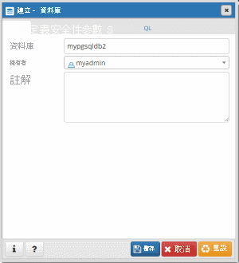

# <a name="quickstart-create-an-azure-database-for-postgresql---single-server-using-powershell"></a>快速入門：使用 PowerShell 建立適用於 PostgreSQL 的 Azure 資料庫 - 單一伺服器

本快速入門說明如何使用 PowerShell 在 Azure 資源群組中建立適用於 PostgreSQL 的 Azure 資料庫伺服器。 您可以使用 PowerShell，以互動方式或在指令碼中建立和管理 Azure 資源。

## <a name="prerequisites"></a>必要條件

如果您沒有 Azure 訂用帳戶，請在開始前建立[免費帳戶](https://azure.microsoft.com/free/)。

如果您選擇在本機使用 PowerShell，本文會要求您安裝 Az PowerShell 模組，並使用 [Connect-AzAccount](https://docs.microsoft.com/powershell/module/az.accounts/connect-azaccount) Cmdlet 連線到您的 Azure 帳戶。 如需安裝 Az PowerShell 模組的詳細資訊，請參閱[安裝 Azure PowerShell](https://docs.microsoft.com/powershell/azure/install-az-ps)。

> [!IMPORTANT]
> 雖然 Az.PostgreSql PowerShell 模組處於預覽狀態，但您仍必須使用下列命令，將其與 Az PowerShell 模組分開安裝：`Install-Module -Name Az.PostgreSql -AllowPrerelease`。
> 在 Az.PostgreSql PowerShell 模組正式推出後，其會成為未來 Az PowerShell 模組版本的一部分，並可從 Azure Cloud Shell 內以原生方式使用。

如果這是您第一次使用適用於 PostgreSQL 的 Azure 資料庫服務，則必須註冊 **Microsoft.DBforPostgreSQL** 資源提供者。

```azurepowershell-interactive
Register-AzResourceProvider -ProviderNamespace Microsoft.DBforPostgreSQL
```

[!INCLUDE [cloud-shell-try-it](../../includes/cloud-shell-try-it.md)]

如果您有多個 Azure 訂用帳戶，請選擇資源計費的適當訂用帳戶。 使用 [Set-AzContext](https://docs.microsoft.com/powershell/module/az.accounts/set-azcontext) Cmdlet 來選取特定的訂用帳戶識別碼。

```azurepowershell-interactive
Set-AzContext -SubscriptionId 00000000-0000-0000-0000-000000000000
```

## <a name="create-a-resource-group"></a>建立資源群組

使用 [New-AzResourceGroup](https://docs.microsoft.com/powershell/module/az.resources/new-azresourcegroup) Cmdlet 來建立 [Azure 資源群組](https://docs.microsoft.com/azure/azure-resource-manager/resource-group-overview)。 資源群組是一個邏輯容器，Azure 資源會在其中以群組方式部署及管理。

下列範例會在 [美國西部]**** 區域中建立名為 myresourcegroup**** 的資源群組。

```azurepowershell-interactive
New-AzResourceGroup -Name myresourcegroup -Location westus
```

## <a name="create-an-azure-database-for-postgresql-server"></a>建立適用於 PostgreSQL 的 Azure 資料庫伺服器

使用 `New-AzPostgreSqlServer` Cmdlet 建立適用於 PostgreSQL 的 Azure 資料庫伺服器。 一部伺服器可以管理多個資料庫。 一般而言，每個專案或每個使用者會使用個別的資料庫。

下表包含 `New-AzPostgreSqlServer` Cmdlet 常用的參數和範例值清單。

|        **設定**         | **範例值** |                                                                                                                                                             **說明**                                                                                                                                                              |
| -------------------------- | ---------------- | ---------------------------------------------------------------------------------------------------------------------------------------------------------------------------------------------------------------------------------------------------------------------------------------------------------------------------------------- |
| 名稱                       | mydemoserver     | 選擇 Azure 中可識別適用於 PostgreSQL 的 Azure 資料庫伺服器的全域唯一名稱。 伺服器名稱只能包含字母、數字及連字號 (-) 字元。 在建立過程中，指定的任何大寫字元都會自動轉換成小寫。 此名稱必須包含 3 到 63 個字元。 |
| resourceGroupName          | myresourcegroup  | 提供 Azure 資源群組的名稱。                                                                                                                                                                                                                                                                                            |
| SKU                        | GP_Gen5_2        | SKU 的名稱。 遵循簡短形式的慣例 **pricing-tier\_compute-generation\_vCores**。 如需 Sku 參數的詳細資訊，請參閱此表格後面的資訊。                                                                                                                                           |
| BackupRetentionDay         | 7                | 備份應保留的時間長度。 單位為天。 範圍為 7-35 天。                                                                                                                                                                                                                                                                       |
| GeoRedundantBackup         | 啟用          | 是否應針對此伺服器啟用異地備援備份。 此值無法針對基本定價層中的伺服器啟用，而且在伺服器建立之後就無法變更。 允許的值：Enabled、Disabled。                                                                                                      |
| Location                   | westus           | 伺服器的 Azure 區域。                                                                                                                                                                                                                                                                                                         |
| SslEnforcement             | 啟用          | 是否應針對此伺服器啟用 SSL。 允許的值：Enabled、Disabled。                                                                                                                                                                                                                                                 |
| StorageInMb                | 51200            | 伺服器的儲存體容量 (單位為 MB)。 有效的 StorageInMb 最小值為 5120 MB，並以 1024 MB 的增量增加。 如需儲存體大小限制的詳細資訊，請參閱[適用於 PostgreSQL 的 Azure 資料庫定價層](./concepts-pricing-tiers.md)。                                                                               |
| 版本                    | 9.6              | PostgreSQL 主要版本。                                                                                                                                                                                                                                                                                                                 |
| AdministratorUserName      | myadmin          | 適用於系統管理員登入的使用者名稱。 此名稱不得為 **azure_superuser**、**admin**、**administrator**、**root**、**guest** 或 **public**。                                                                                                                                                                                            |
| AdministratorLoginPassword | `<securestring>` | 系統管理員使用者的密碼，其格式為安全字串。 其必須包含 8 到 128 個字元。 您的密碼必須包含下列類別中三種類別的字元：英文大寫字母、英文小寫字母、數字及非英數字元。                                       |

**Sku** 參數值會遵循慣例 **pricing-tier\_compute-generation\_vCores**，如下列範例所示。

- `-Sku B_Gen5_1` 對應於基本、第 5 代和 1 個虛擬核心。 此選項是最小的可用 SKU。
- `-Sku GP_Gen5_32` 對應於一般用途、第 5 代和 32 個 vCore。
- `-Sku MO_Gen5_2` 對應於記憶體最佳化、第 5 代和 2 個 vCore。

如需各區域和各層有效 **Sku**值的相關資訊，請參閱[適用於 PostgreSQL 的 Azure 資料庫定價層](./concepts-pricing-tiers.md)。

下列範例會在**美國西部**區域中建立名為 **mydemoserver**的 PostgreSQL 伺服器，其位於 **myresourcegroup** 資源群組中，且伺服器系統管理員登入為 **myadmin**。 這是一般用途定價層中的 Gen 5 伺服器，已啟用 2 個虛擬核心和異地備援備份。 記錄範例第一行中使用的密碼，因為這是 PostgreSQL 伺服器系統管理員帳戶的密碼。

> [!TIP]
> 伺服器名稱會對應至 DNS 名稱，而且在 Azure 中必須是全域唯一的。

```azurepowershell-interactive
$Password = Read-Host -Prompt 'Please enter your password' -AsSecureString
New-AzPostgreSqlServer -Name mydemoserver -ResourceGroupName myresourcegroup -Sku GP_Gen5_2 -GeoRedundantBackup Enabled -Location westus -AdministratorUsername myadmin -AdministratorLoginPassword $Password
```

如果您的工作負載只需要輕量計算和 I/O，請考慮使用基本定價層。

> [!IMPORTANT]
> 在基本定價層中建立的伺服器後續無法調整為一般用途或記憶體最佳化，而且無法進行異地複寫。

## <a name="configure-a-firewall-rule"></a>設定防火牆規則

使用 `New-AzPostgreSqlFirewallRule`Cmdlet 建立適用於 PostgreSQL 的 Azure 資料庫伺服器層級防火牆規則。 伺服器層級的防火牆規則允許外部應用程式 (例如 `psql` 命令列工具或 PostgreSQL Workbench) 透過適用於 PostgreSQL 的 Azure 資料庫服務防火牆連線到您的伺服器。

下列範例會建立名為 **AllowMyIP** 的防火牆規則，以允許來自特定 IP 位址 192.168.0.1 的連線。 請替換為與您的連線來源位置相對應的 IP 位址或 IP 位址範圍。

```azurepowershell-interactive
New-AzPostgreSqlFirewallRule -Name AllowMyIP -ResourceGroupName myresourcegroup -ServerName mydemoserver -StartIPAddress 192.168.0.1 -EndIPAddress 192.168.0.1
```

> [!NOTE]
> 適用於 PostgreSQL 的 Azure 資料庫的連線會透過連接埠 5432 進行通訊。 如果您嘗試從公司網路內進行連線，可能不允許透過連接埠 5432 的輸出流量。 在此案例中，唯有 IT 部門開啟連接埠 5432，您才能連線到伺服器。

## <a name="get-the-connection-information"></a>取得連線資訊

若要連線到您的伺服器，您必須提供主機資訊和存取認證。 使用下列範例來判斷連線資訊。 請記下 **FullyQualifiedDomainName** 和 **AdministratorLogin** 的值。

```azurepowershell-interactive
Get-AzPostgreSqlServer -Name mydemoserver -ResourceGroupName myresourcegroup |
  Select-Object -Property FullyQualifiedDomainName, AdministratorLogin
```

```Output
FullyQualifiedDomainName                    AdministratorLogin
------------------------                    ------------------
mydemoserver.postgres.database.azure.com       myadmin
```

## <a name="connect-to-postgresql-database-using-psql"></a>使用 psql 連線到 PostgreSQL 資料庫

如果您的用戶端電腦已安裝 PostgreSQL，您可以使用 [psql](https://www.postgresql.org/docs/current/static/app-psql.html) 的本機執行個體來連線到 Azure PostgreSQL 伺服器。 對本文中的程式碼範例選取 [試試看] **`psql` 按鈕，也可以存取 Azure Cloud Shell 中預先安裝的**  命令列工具版本。 其他存取 Azure Cloud Shell 的方法是選取 Azure 入口網站右上方工具列上的 **>_** 按鈕，或造訪 [shell.azure.com](https://shell.azure.com/)。

1. 使用 `psql` 命令列公用程式連線到您的 Azure PostgreSQL 伺服器。

   ```azurepowershell-interactive
   psql --host=<servername> --port=<port> --username=<user@servername> --dbname=<dbname>
   ```

   例如，下列命令會使用存取認證，連線到 PostgreSQL 伺服器 `mydemoserver.postgres.database.azure.com` 上名為 **postgres** 的預設資料庫。 系統提示輸入密碼時，請輸入您選擇的 `<server_admin_password>`。

   ```azurepowershell-interactive
   psql --host=mydemoserver.postgres.database.azure.com --port=5432 --username=myadmin@mydemoserver --dbname=postgres
   ```

   > [!TIP]
   > 如果您想要使用 URL 路徑來連線到 Postgres，在進行 URL 編碼時，請將使用者名稱中的 @ 符號編碼為 `%40`。 例如，psql 的連線字串會是 `psql postgresql://myadmin%40mydemoserver@mydemoserver.postgres.database.azure.com:5432/postgres`

1. 連線到伺服器後，請在提示字元建立空白資料庫。

   ```sql
   CREATE DATABASE mypgsqldb;
   ```

1. 在提示字元，執行下列命令以將連線切換到新建立的資料庫 **mypgsqldb**：

   ```sql
   \c mypgsqldb
   ```

## <a name="connect-to-the-postgresql-server-using-pgadmin"></a>使用 pgAdmin 連線到 PostgreSQL 伺服器

pgAdmin 是搭配 PostgreSQL 使用的開放原始碼工具。 您可以從 [pgAdmin 網站](https://www.pgadmin.org/)安裝 pgAdmin。 您使用的 pgAdmin 版本可能不同於本快速入門中使用的版本。 如果您需要其他指引，請閱讀 pgAdmin 文件。

1. 在您的用戶端電腦上開啟 pgAdmin 應用程式。

1. 移至工具列中的 [物件]****，將滑鼠停留在 [建立]**** 上方，然後選取 [伺服器]****。

1. 在 [建立 - 伺服器]**** 對話方塊的 [一般]**** 索引標籤上，輸入伺服器的唯一易記名稱，例如 **mydemoserver**。

   ![[一般] 索引標籤](./media/quickstart-create-postgresql-server-database-using-azure-powershell/9-pgadmin-create-server.png)

1. 在 [建立 - 伺服器]**** 對話方塊的 [連線]**** 索引標籤上，填寫設定資料表。

   ![[連線] 索引標籤](./media/quickstart-create-postgresql-server-database-using-azure-powershell/10-pgadmin-create-server.png)

    pgAdmin 參數 |值|描述
    ---|---|---
    主機名稱/位址 | 伺服器名稱 | 您稍早建立 Azure Database for PostgreSQL 伺服器時所用的伺服器名稱值。 我們的範例伺服器是 **mydemoserver.postgres.database.azure.com**。 使用如範例所示的完整網域名稱 ( **\*.postgres.database.azure.com**)。 如果您不記得您的伺服器名稱，請依照上一節中的步驟執行，以取得連線資訊。
    連接埠 | 5432 | 當您連線至 Azure Database for PostgreSQL 伺服器時所要使用的連接埠。
    維護資料庫 | *postgres* | 系統產生的預設資料庫名稱。
    使用者名稱 | 伺服器管理員登入名稱 | 您稍早建立 Azure Database for PostgreSQL 時所提供的伺服器管理員登入使用者名稱。 如果您不記得使用者名稱，請依照上一節中的步驟執行，以取得連線資訊。 格式是 *username\@servername*。
    密碼 | 您的系統管理員密碼 | 您在本快速入門稍早建立伺服器時所選擇的密碼。
    角色 | 保留空白 | 此時不需要提供角色名稱。 將欄位保留空白。
    SSL 模式 | *必要* | 您可以在 pgAdmin 的 [SSL] 索引標籤中設定 TLS/SSL 模式。根據預設，所有適用於 PostgreSQL 的 Azure 資料庫伺服器建立時都會開啟強制執行 TLS。 若要關閉強制執行 TLS，請參閱[設定 TLS 的強制執行](./concepts-ssl-connection-security.md#configure-enforcement-of-tls)。

1. 選取 [儲存]****。

1. 在左側的 [瀏覽器]**** 窗格中，展開 [伺服器]**** 節點。 選取您的伺服器，例如 **mydemoserver**。 按一下以連線到它。

1. 展開伺服器節點，然後展開其下的 [資料庫]****。 此清單應包含現有 postgres** 資料庫和其他您已建立的資料庫。 您可以使用適用於 PostgreSQL 的 Azure 資料庫，為每一部伺服器建立多個資料庫。

1. 以滑鼠右鍵按一下 [資料庫]****，選擇 [建立]**** 功能表，然後選取 [資料庫]****。

1. 在 [資料庫]**** 欄位中輸入您選擇的資料庫名稱，例如 **mypgsqldb2**。

1. 從清單方塊中選取資料庫的 [擁有者]****。 選擇您的伺服器管理員登入名稱，例如範例中的 **my admin**。

   

1. 選取 [儲存]**** 以建立新的空白資料庫。

1. 在 [瀏覽器]**** 窗格中，您可以在伺服器名稱之下的 [資料庫] 清單中看到您所建立的資料庫。

## <a name="clean-up-resources"></a>清除資源

如果其他快速入門或教學課程不需要在本快速入門中建立的資源，您可以執行下列範例加以刪除。

> [!CAUTION]
> 下列範例會刪除指定的資源群組和其中包含的所有資源。
> 如果本快速入門範圍以外的資源存在於指定的資源群組中，則也會一併刪除。

```azurepowershell-interactive
Remove-AzResourceGroup -Name myresourcegroup
```

若只要刪除在本快速入門中建立的伺服器，而不刪除資源群組，請使用 `Remove-AzPostgreSqlServer` Cmdlet。

```azurepowershell-interactive
Remove-AzPostgreSqlServer -Name mydemoserver -ResourceGroupName myresourcegroup
```

## <a name="next-steps"></a>後續步驟

> [!div class="nextstepaction"]
> [使用 PowerShell 來設計適用於 PostgreSQL 的 Azure 資料庫](tutorial-design-database-using-powershell.md)
