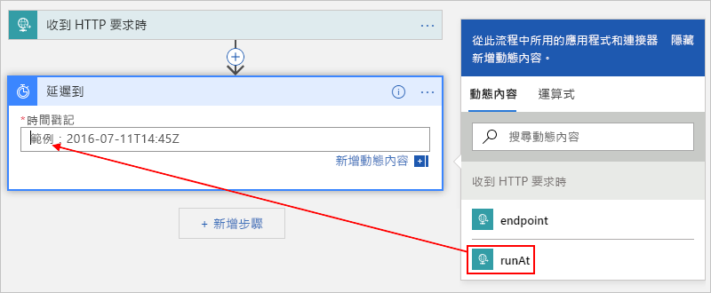

# <a name="migrate-azure-scheduler-jobs-to-azure-logic-apps"></a>將 Azure 排程器作業移轉至 Azure Logic Apps

> [!IMPORTANT]
> [Azure Logic Apps](../logic-apps/logic-apps-overview.md) 將會取代[即將淘汰的 Azure 排程器](#retire-date)。 若要繼續使用您在排程器中設定的作業，請儘快依照本文的指示移轉到 Azure Logic Apps。 
>
> Azure 入口網站中已不再提供排程器，但目前仍然提供 [REST API](/rest/api/scheduler) 和 [Azure 排程器 PowerShell Cmdlets](scheduler-powershell-reference.md)，以便您管理作業和作業集合。

本文說明如何使用 Azure Logic Apps 而非 Azure 排程器來建立自動化工作流程，藉以排程單次和週期性作業。 當您使用 Logic Apps 建立排程作業時，您會獲得下列權益：

* 使用視覺化設計工具以及數百項服務 (如 Azure Blob 儲存體、Azure 服務匯流排、Office 365 Outlook 和 SAP) 中[立即可用的連接器](../connectors/apis-list.md)組建您的作業。

* 將每個排程的工作流程視為第一級 Azure 資源加以管理。 您不需擔心「作業集合」的概念，因為每個邏輯應用程式都是個別的 Azure 資源。

* 使用單一邏輯應用程式來執行多項單次作業。

* 設定可支援時區並自動調整為日光節約時間 (DST) 的排程。

如需深入了解，請參閱[什麼是 Azure Logic Apps？](../logic-apps/logic-apps-overview.md)，或者在本快速入門中嘗試建立第一個邏輯應用程式：[建立第一個邏輯應用程式](../logic-apps/quickstart-create-first-logic-app-workflow.md)。

## <a name="prerequisites"></a>Prerequisites

* Azure 訂用帳戶。 如果您沒有 Azure 訂用帳戶，請先[註冊免費的 Azure 帳戶](https://azure.microsoft.com/free/)。

* 若要藉由傳送 HTTP 要求來觸發邏輯應用程式，請使用 [Postman 桌面應用程式](https://www.getpostman.com/apps) \(英文\) 之類的工具。

## <a name="migrate-by-using-a-script"></a>使用指令碼進行遷移

每項排程器作業都是獨一無二的，因此將排程器作業遷移至 Azure Logic Apps 時，並沒有一體適用的工具。 不過，您可以[編輯此指令碼](https://github.com/Azure/logicapps/tree/master/scripts/scheduler-migration)以符合您的需求。

## <a name="schedule-one-time-jobs"></a>排程單次作業

您可以只建立單一邏輯應用程式來執行多個單次作業。

1. 在 [Azure 入口網站](https://portal.azure.com)中，於邏輯應用程式設計工具中建立空白的邏輯應用程式。

   若要了解基本步驟，請遵循[快速入門：建立第一個邏輯應用程式](../logic-apps/quickstart-create-first-logic-app-workflow.md)。

1. 在 [搜尋] 方塊中，輸入 `when a http request` 以尋找「要求」觸發程序。 從觸發程序清單中，選取此觸發程序：**收到 HTTP 要求時**

   

1. 針對「要求」觸發程序，您可以選擇性地提供 JSON 結構描述，協助邏輯應用程式設計工具了解傳入「要求」觸發程序的呼叫內的輸入結構，讓您稍後可在工作流程中更輕鬆地選取輸出。

   在 [要求本文 JSON 結構描述] 方塊中輸入結構描述，例如：

   

   如果您沒有結構描述，但是有 JSON 格式的範例承載，即可從該承載產生 JSON 結構描述。

   1. 在要求觸發程序中，選取 [使用範例承載來產生結構描述]。

   1. 在 [輸入或貼上範例 JSON 承載] 下方，提供您的範例承載，並選取 [完成]，例如：

      

      ```json
      {
         "runat": "2012-08-04T00:00Z",
         "endpoint": "https://www.bing.com"
      }
      ```

1. 在觸發程序下方，選取 [下一步]。

1. 在搜尋方塊中，輸入 `delay until` 作為篩選條件。 在動作清單下方，選取此動作：[延遲到]

   此動作會暫停您的邏輯應用程式工作流程，直到指定的日期和時間為止。

   

1. 輸入您想要啟動邏輯應用程式工作流程的時間戳記。

   當您按一下 [時間戳記] 方塊內部時，即會出現動態內容清單，讓您可以選擇性地選取觸發程序的輸出。

   

1. 在[數百個立即可用的連接器](../connectors/apis-list.md)中挑選，新增您想要執行的任何其他動作。

   例如，您可以包含將要求傳送至 URL 的 HTTP 動作，或使用儲存體佇列、服務匯流排佇列或服務匯流排主題的動作：

   ![螢幕擷取畫面顯示 [延遲到] 動作，後面接著 H T T P 動作與 POST 方法。](./media/migrate-from-scheduler-to-logic-apps/request-http-action.png)

1. 完成後，儲存邏輯應用程式。

   

   當您第一次儲存邏輯應用程式時，邏輯應用程式要求觸發程序的端點 URL 會出現在 [HTTP POST URL] 方塊中。 當您想要呼叫邏輯應用程式，並將輸入傳送至您的邏輯應用程式進行處理時，請使用此 URL 作為呼叫目的地。

   

1. 複製並儲存此端點 URL，讓您稍後可以傳送手動要求來觸發邏輯應用程式。

## <a name="start-a-one-time-job"></a>啟動單次作業

若要手動執行或觸發單次作業，請針對邏輯應用程式的要求觸發程序傳送對端點 URL 的呼叫。 在此呼叫中，指定要傳送的輸入或承載，而您可能已在稍早藉由指定結構描述來說明此項。

例如，使用 Postman 應用程式，您可以使用類似此範例的設定來建立 POST 要求，然後選取 [Send]\(傳送\) 來提出要求。

| 要求方法 | URL | body | headers |
|----------------|-----|------|---------|
| **POST** | <*endpoint-URL*> | **未經處理** <p>**JSON(application/json)** <p>在 [raw]\(未經處理\) 方塊中，輸入您希望在要求中傳送的承載。 <p>**注意**：此設定會自動設定 [Headers]\(標頭\) 值。 | **金鑰**：Content-Type <br>**值**：application/json |
|||||


當您傳送呼叫之後，來自邏輯應用程式的回應就會出現在 [Body] \(主體\) 索引標籤上的 [raw] \(未經處理\) 方塊下方。 

<a name="workflow-run-id"></a>

> [!IMPORTANT]
>
> 如果您稍後想要取消作業，請選取 [Headers]\(標頭\) 索引標籤。尋找並複製回應中的 **x-ms-workflow-run-id** 標頭值。 
>
> 

## <a name="cancel-a-one-time-job"></a>取消單次作業

在 Logic Apps 中，每個單次作業都會當成單一邏輯應用程式回合執行個體來執行。 若要取消單次作業，您可以在邏輯應用程式 REST API 中使用[工作流程回合 - 取消](/rest/api/logic/workflowruns/cancel) \(英文\)。 當您將呼叫傳送給觸發程序時，請提供[工作流程回合識別碼](#workflow-run-id)。

## <a name="schedule-recurring-jobs"></a>排程週期性作業

1. 在 [Azure 入口網站](https://portal.azure.com)中，於邏輯應用程式設計工具中建立空白的邏輯應用程式。

   若要了解基本步驟，請遵循[快速入門：建立第一個邏輯應用程式](../logic-apps/quickstart-create-first-logic-app-workflow.md)。

1. 在搜尋方塊中，輸入 "recurrence" 作為篩選條件。 從觸發程序清單中，選取此觸發程序：**週期性**

   

1. 視需要來設定更進階的排程。

   

   如需進階排程選項的詳細資訊，請參閱[使用 Azure Logic Apps 建立並執行週期性工作和工作流程](../connectors/connectors-native-recurrence.md)

1. 從[數百個立即可用的連接器](../connectors/apis-list.md)中挑選，以新增您想要執行的其他動作。 在觸發程序下方，選取 [下一步]。 尋找並選取您想要的動作。

   例如，您可以包含將要求傳送至 URL 的 HTTP 動作，或使用儲存體佇列、服務匯流排佇列或服務匯流排主題的動作：

   

1. 完成後，儲存邏輯應用程式。

   

## <a name="advanced-setup"></a>進階設定

以下是您可用來自訂作業的其他方式。

### <a name="retry-policy"></a>重試原則

若要控制在發生間歇性失敗時某個動作嘗試在您邏輯應用程式中重新執行的方式，您可以在每個動作的設定中設定[重試原則](../logic-apps/logic-apps-exception-handling.md#retry-policies)，例如：

1. 開啟動作的省略符號 (...) 功能表，然後選取 [設定]。

   

1. 選取您想要的重試原則。 如需每個原則的詳細資訊，請參閱[重試原則](../logic-apps/logic-apps-exception-handling.md#retry-policies)。

   

## <a name="handle-exceptions-and-errors"></a>處理例外狀況和錯誤

在 Azure 排程器中，如果預設動作無法執行，您可以執行替代的動作來解決錯誤狀況。 在 Azure Logic Apps 中，您也可以執行相同的工作。

1. 在邏輯應用程式設計工具中，於您想要處理的動作上方，將指標移至步驟之間的箭號上方，然後選取 [新增平行分支]。

   

1. 尋找並選取您想要改為替代動作執行的動作。

   

1. 在替代動作中，開啟省略符號 (...) 功能表，然後選取 [設定執行後續]。

   

1. 清除 [已成功] 屬性的方塊。 選取這些屬性：**已失敗**、**已跳過**和**已逾時**

   

1. 完成之後，選取 [完成]。

若要深入了解例外狀況處理，請參閱[處理錯誤和例外狀況 - RunAfter 屬性](../logic-apps/logic-apps-exception-handling.md#control-run-after-behavior)。

## <a name="faq"></a>常見問題集

<a name="retire-date"></a>

**問**：Azure 排程器何時淘汰？ <br>
**答**：Azure 排程器已排定於 2019 年 12 月 31 日完全淘汰。 關於在該日期前需採取的重要步驟，以及詳細的時間表，請參閱[延長排程器的淘汰日期至 2019 年 12 月 31 日](https://azure.microsoft.com/updates/extending-retirement-date-of-scheduler/)。 關於一般更新資訊，請參閱 [Azure 更新 - 排程器](https://azure.microsoft.com/updates/?product=scheduler)。

**問**：我的作業集合和作業在該服務淘汰之後會發生什麼事？ <br>
**答**：所有排程器作業集合和作業都將停止執行並從系統中刪除。

**問**：我是否需要先備份或執行任何其他工作，然後才能將排程器作業移轉至 Logic Apps？ <br>
**答**：最佳做法是一律備份您的工作。 請先檢查您所建立的邏輯應用程式均如預期般執行，然後再刪除或停用排程器作業。

**問**：是否有工具可協助我將作業從排程器移轉至 Logic Apps？ <br>
**答**：每個排程器作業都是唯一的，因此沒有一體適用的工具。 不過，根據您的需求，您可以[編輯此指令碼，將 Azure 排程器作業遷移至 Azure Logic Apps](https://github.com/Azure/logicapps/tree/master/scripts/scheduler-migration) (英文)。

**問**：哪裡可以取得移轉排程器作業的支援？ <br>
**答**：以下是一些取得支援的方式：

**Azure 入口網站**

如果您的 Azure 訂用帳戶具備付費的支援方案，則您可以在 Azure 入口網站中建立技術支援要求。 否則，您可以選取不同的支援選項。

1. 在 [Azure 入口網站](https://portal.azure.com)主功能表上，選取 [説明 + 支援]。

1. 從 [支援] 功能表選取 [新增支援要求]。 為您的要求提供下列資訊：

   | 屬性 | 值 |
   |---------|-------|
   | **問題類型** | **技術** |
   | **訂用帳戶** | <您的 Azure 訂用帳戶> |
   | **服務** | 在 [監視與管理] 下方，選取 [排程器]。 如果您找不到 [排程器]，請先選取 [所有服務]。 |
   ||| 

1. 選取您想要的支援選項。 如果您具備付費的支援方案，請選取 [下一步]。

**社群**

* [Microsoft 的 Azure Logic Apps 問與答頁面](/answers/topics/azure-logic-apps.html)
* [Stack Overflow](https://stackoverflow.com/questions/tagged/azure-scheduler)

## <a name="next-steps"></a>後續步驟

* [使用 Azure Logic Apps 建立定期執行的工作和工作流程](../connectors/connectors-native-recurrence.md)