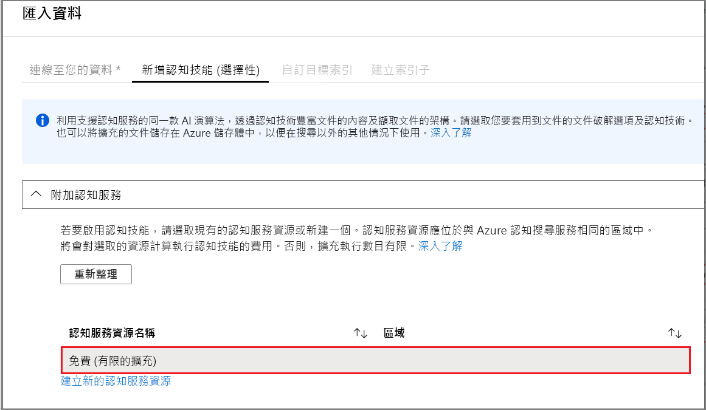
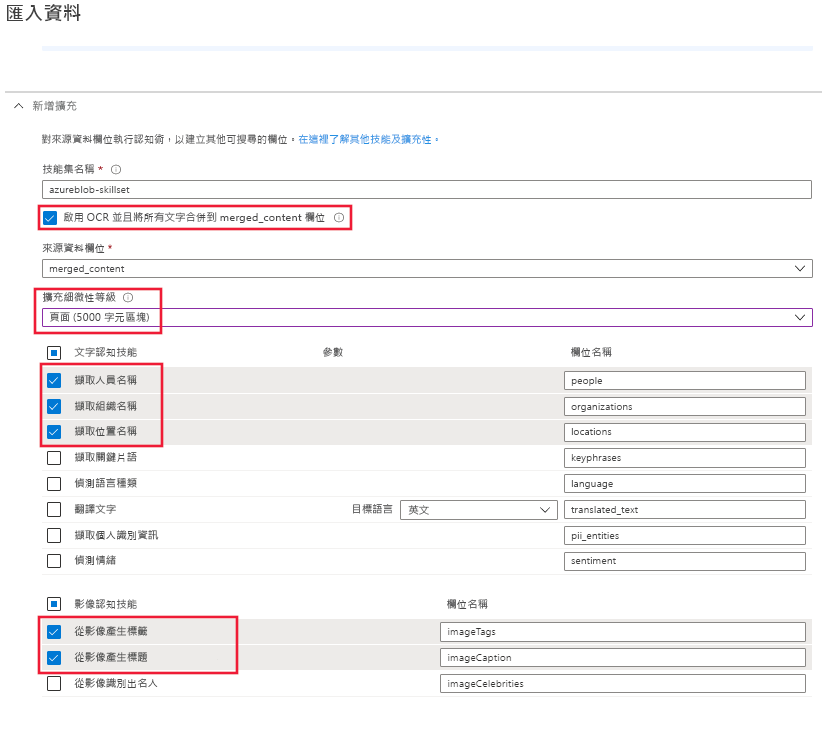
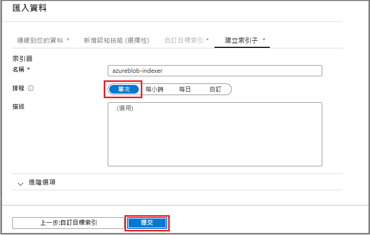
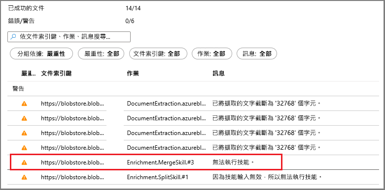
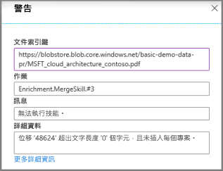
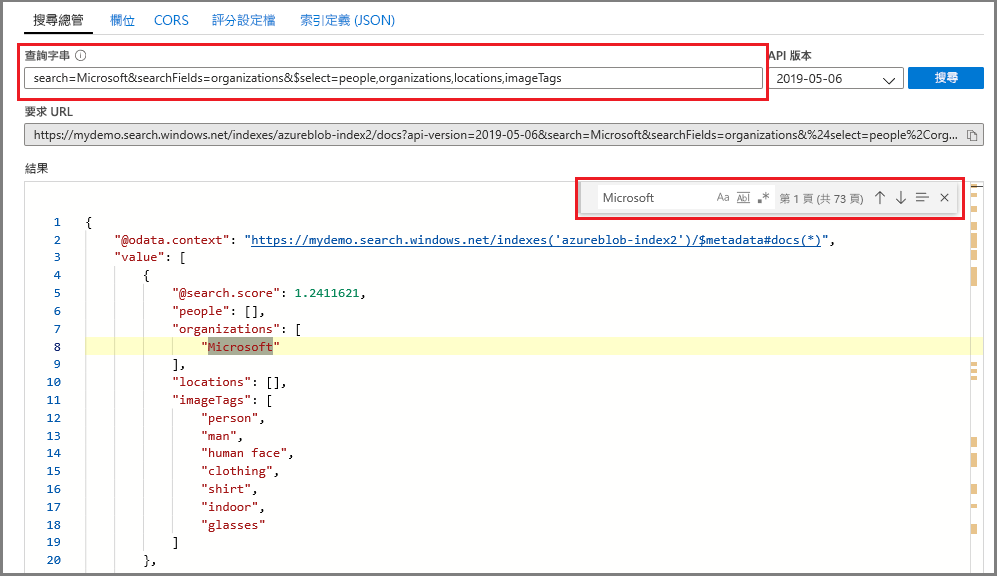

# 快速入門：在 Azure 入口網站中建立 Azure 認知搜尋的認知技能集

技能集是一項 AI 功能，可從大型的無差異文字或影像檔案中擷取資訊和結構，並使其可供編製索引和接受搜尋，以在 Azure 認知搜尋中進行全文檢索搜尋查詢。 

在本快速入門中，您將結合 Azure 雲端中的服務和資料以建立技能集。 一切都備妥之後，您即可在入口網站中執行**匯入資料**精靈，以將其全部提取。 其最終結果將是可搜尋的索引，其中填入在 AI 處理後建立、可在入口網站 ([搜尋總管](search-explorer.md)) 中查詢的資料。

如果您沒有 Azure 訂用帳戶，請在開始前建立[免費帳戶](https://azure.microsoft.com/free/?WT.mc_id=A261C142F)。

## 建立服務並載入資料

本快速入門會使用 Azure 認知搜尋、[Azure Blob 儲存體](https://docs.microsoft.com/azure/storage/blobs/)和 [Azure 認知服務](https://azure.microsoft.com/services/cognitive-services/)進行 AI 處理。 

由於工作負載很小，因此認知服務會在幕後連線以提供免費處理，最多 20 筆交易。 對於這類小型資料集，您可以略過建立或連結認知服務資源的步驟。

1. [下載範例資料](https://1drv.ms/f/s!As7Oy81M_gVPa-LCb5lC_3hbS-4)，其中有不同類型的小型檔案集。 將檔案解壓縮。

1. [建立 Azure 儲存體帳戶](https://docs.microsoft.com/azure/storage/common/storage-quickstart-create-account?tabs=azure-portal)，或[尋找現有帳戶](https://ms.portal.azure.com/#blade/HubsExtension/BrowseResourceBlade/resourceType/Microsoft.Storage%2storageAccounts/)。 

   選擇與 Azure 認知搜尋相同的區域，以避免產生頻寬費用。 
   
   如果您想要稍後在另一個逐步解說中試用知識存放區功能，請選擇 [StorageV2 (一般用途 V2)] 帳戶類型。 否則，請選擇任何類型。

1. 開啟 Blob 服務頁面，並建立容器。 您可以使用預設的公用存取層級。 

1. 在容器中按一下 [上傳]  ，以上傳您在第一個步驟中下載的範例檔案。 請注意，您有多種不同的內容類型，包括無法以原生格式全文檢索搜尋的影像和應用程式檔案。

   

1. [建立 Azure 認知搜尋服務](search-create-service-portal.md)，或[尋找現有服務](https://ms.portal.azure.com/#blade/HubsExtension/BrowseResourceBlade/resourceType/Microsoft.Search%2FsearchServices)。 您可以使用本快速入門的免費服務。

現在您已準備就緒，可移至「匯入資料」精靈。

## 執行匯入資料精靈

在搜尋服務的 [概觀] 頁面中，按一下命令列上的 [匯入資料]  ，以四個步驟設定認知擴充。

  

### 步驟 1 - 建立資料來源

1. 在 [連線到您的資料]  中，選擇 [Azure Blob 儲存體]  ，然後選取您建立的儲存體帳戶和容器。 指定資料來源的名稱，其餘部分則使用預設值。 

   

    繼續進行下一頁。

### 步驟 2 - 新增認知技能

接下來，設定 AI 擴充來叫用 OCR、影像分析和自然語言處理。 

1. 在本快速入門中，我們將使用**免費**的認知服務資源。 範例資料包含 14 個檔案，因此認知服務20 筆交易的免費配額就足以供本快速入門使用。 

   

1. 展開 [新增擴充]  ，然後進行四項選擇。 

   啟用 OCR 以將影像分析技能新增至精靈頁面。

   將 [細微性] 設定為 [頁面]，以將文字分解成較小的區塊。 有數個文字技能限制只能有 5 KB 的輸入。

   選擇實體辨識 (人員、組織、位置) 和影像分析技能。

   

   繼續進行下一頁。

### 步驟 3 - 設定索引

索引會包含可搜尋的內容，而**匯入資料**精靈通常可藉由資料來源的取樣為您建立結構描述。 在此步驟中，請檢閱產生的結構描述，並視需要修改任何設定。 以下是針對示範 Blob 資料集而建立的預設結構描述。

在本快速入門中，精靈會妥善地設定好合理的預設值：  

+ 預設欄位所根據的是現有 Blob 的屬性，以及含有擴充輸出的新欄位 (例如，`people`、`organizations`、`locations`)。 從中繼資料與資料取樣可推斷資料類型。

+ 預設文件索引鍵是 *metadata_storage_path* (因欄位包含唯一值而選取)。

+ 預設屬性為 [可擷取]  和 [可搜尋]  。 [可搜尋]  會允許對欄位進行全文檢索搜尋。 [可擷取]  表示可在結果中傳回欄位值。 精靈假設您希望這些欄位為可擷取並可搜尋，因為您是透過技能集來建立欄位。

  

請注意，依 `content` 欄位顯示的 [可擷取]  屬性上的刪除線和問號。 在大量文字的 Blob 文件中，`content` 欄位包含檔案主體，有可能遇到數千行。 這類欄位在搜尋結果中會很難處理，因此請在此示範中予以排除。 

不過，如果您需要將檔案內容傳遞給用戶端程式碼，請確定 [可擷取]  保持已選取狀態。 否則，如果您覺得所擷取的元素 (例如 `people`、`organizations`、`locations` 等等) 就已足夠，則可考慮在 `content` 上清除這個屬性。

將欄位標示為 [可擷取]  不表示該欄位「必須」  出現在搜尋結果中。 您可以使用 **$select** 查詢參數來指定要包含的欄位，精確地控制搜尋結果組合。 對於大量文字的欄位 (如`content`)， **$select** 參數可讓您將可管理的搜尋結果提供給您應用程式的人類使用者，同時確保用戶端程式碼可透過 [可擷取]  屬性存取其所需的所有資訊。
  
繼續進行下一頁。

### 步驟 4 - 設定索引子

索引子是會驅動索引編製程序的高階資源。 它會指定資料來源名稱、目標索引和執行頻率。 **匯入資料**精靈會建立數個物件，且一定是您可以重複執行的索引子。

1. 在 [索引子]  頁面上，您可以接受預設名稱，並按一下 [一次]  排程選項立即加以執行。 

   

1. 按一下 [提交]  以建立並同時執行索引子。

## 監視狀態

認知技能的索引編製需要比一般文字的索引編製更長的時間來完成，OCR 和影像分析更是如此。 若要監視進度，請移至 [概觀] 頁面，然後按一下頁面中央的 [索引子]  。

  

由於內容類型的種類繁多，所以出現警告是很正常的事。 某些內容類型會對特定技能無效，而且在較低的層級中，常常會遇到[索引子限制](search-limits-quotas-capacity.md#indexer-limits)。 例如，32,000 個字元的截斷通知就是免費層的索引子限制。 如果您在較高的層級執行此示範，許多截斷警告便會消失。

若要檢查警告或錯誤，請按一下 [索引子] 清單上的 [警告] 狀態，以開啟 [執行歷程記錄] 頁面。

在該頁面上，再次按一下 [警告] 狀態，以檢視類似下面所示警告的清單。 

  

當您按一下特定狀態行時，就會顯示詳細資料。 此警告指出在達到最大閾值 (這個特殊的 PDF 很大) 後，合併作業已停止。

  

## 在搜尋總管中查詢

索引建立完成後，您就可以執行查詢以傳回結果。 在入口網站中，使用**搜尋總管**來進行這項工作。 

1. 在搜尋服務儀表板頁面上，按一下命令列上的 [搜尋總管]  。

1. 選取頂端的 [變更索引]  以選取您建立的索引。

1. 輸入搜尋字串以查詢索引，例如 `search=Microsoft&$select=people,organizations,locations,imageTags`。

結果會以 JSON 傳回，內容可能很詳細但也很難閱讀，尤其是源自於 Azure Blob 的大型文件更是如此。 在此工具中進行搜尋的一些秘訣包括下列技巧：

+ 附加 `$select` 以指定要包含在結果中的欄位。 
+ 使用 CTRL-F 在 JSON 中搜尋特定屬性或字詞。

查詢字串會區分大小寫，因此如果您收到「未知的欄位」訊息，請檢查 [欄位]  或 [索引定義 (JSON)]  以確認名稱和大小寫。 

  

## 重要心得

您現在已建立第一個技能集，並了解使用您自己的資料為擴充的搜尋解決方案設計原型所需的重要概念。

我們希望您了解的一些重要概念包括 Azure 資料來源上的相依性。 技能集會繫結至索引子，而索引子則專屬於 Azure 與來源。 雖然本快速入門使用 Azure Blob 儲存體，但您也可使用其他 Azure 資料來源。 如需詳細資訊，請參閱 [Azure 認知搜尋中的索引子](search-indexer-overview.md)。 

另一個重要概念是，技能會針對內容類型來運作，因此在處理異質性內容時，將會略過某些輸入。 此外，大型檔案或欄位可能會超過服務層級的索引子限制。 一旦發生這些事件，看到警告是很正常的事。 

輸出會導向至搜尋索引，且在編製索引期間建立的名稱/值配對會與索引中的個別欄位相對應。 就內部而言，入口網站會設定[註解](cognitive-search-concept-annotations-syntax.md)並定義[技能集](cognitive-search-defining-skillset.md)，以建立作業順序和一般流程。 這些步驟會隱藏在入口網站中，但是當您開始撰寫程式碼時，這些概念就會變得很重要。

最後，您已了解可以藉由查詢索引來驗證內容。 最終，Azure 認知搜尋所提供的就是可搜尋的索引，且您可以使用[簡單](https://docs.microsoft.com/rest/api/searchservice/simple-query-syntax-in-azure-search)或[完全展開的查詢語法](https://docs.microsoft.com/rest/api/searchservice/lucene-query-syntax-in-azure-search)加以查詢。 包含擴充欄位的索引都彼此類似。 無論您想要加入標準或[自訂分析器](search-analyzers.md)、[評分設定檔](https://docs.microsoft.com/rest/api/searchservice/add-scoring-profiles-to-a-search-index)、[同義字](search-synonyms.md)、[多面向篩選](search-filters-facets.md)、地理搜尋，或任何其他 Azure 認知搜尋功能，全都沒有問題。

## 清除資源

使用您自己的訂用帳戶時，在專案結束後確認您是否還需要您建立的資源，是很好的做法。 讓資源繼續執行可能會產生費用。 您可以個別刪除資源，或刪除資源群組以刪除整組資源。

您可以使用左導覽窗格中的 [所有資源]  或 [資源群組]  連結，在入口網站中尋找和管理資源。

如果您使用免費服務，請記住您會有三個索引、索引子和資料來源的限制。 您可以在入口網站中刪除個別項目，以避免超出限制。 

## 後續步驟

您可以使用入口網站、.NET SDK 或 REST API 來建立技能集。 若要進一步精進知識，請使用 Postman 和更多範例資料來試用 REST API。

> [!div class="nextstepaction"]
> [教學課程：使用 REST API 從 JSON Blob 擷取文字和結構](cognitive-search-tutorial-blob.md)

> [!Tip]
> 如果您想要重複此練習，或嘗試不同的 AI 擴充逐步解說，請刪除入口網站中的索引子。 刪除索引子，會將認知服務處理的免費每日交易計數器重設回零。