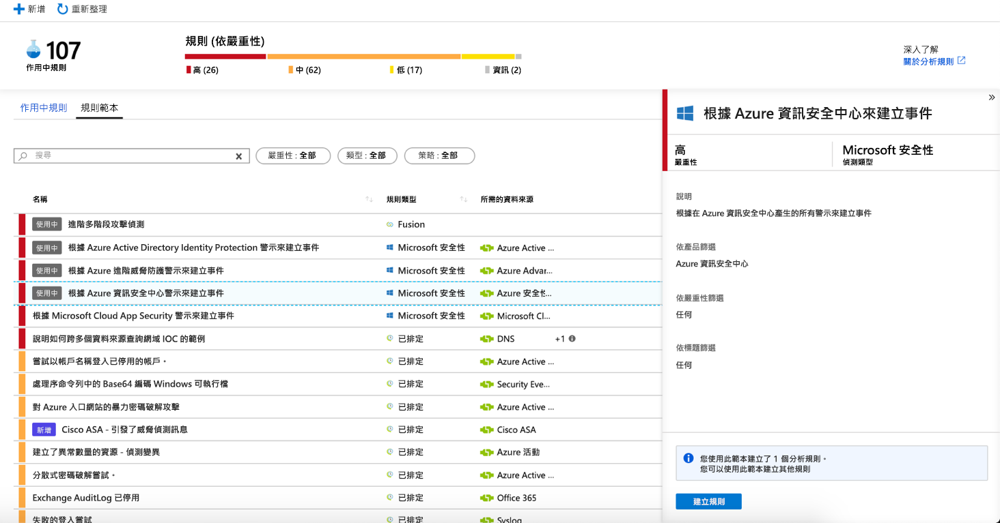
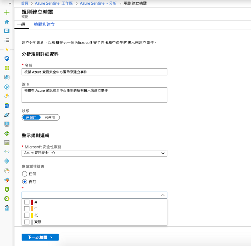
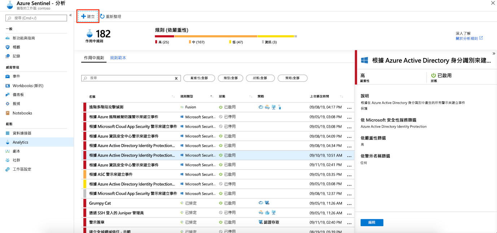
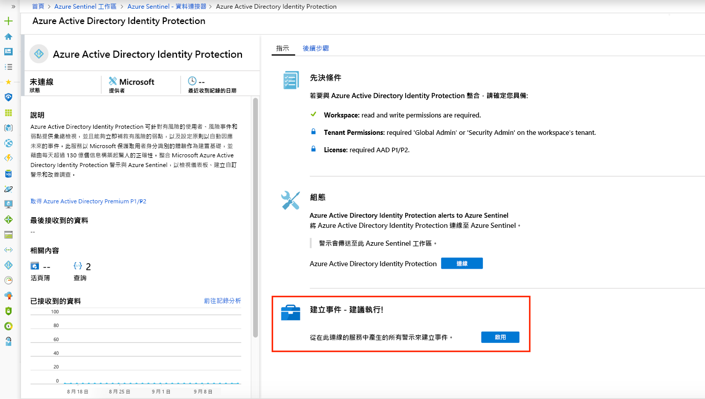

# 自動從 Microsoft 安全性警示建立事件

在連線至 Azure Sentinel 的 Microsoft 安全性解決方案 (例如 Microsoft Cloud App Security 和 Azure 進階威脅防護) 中觸發的警示，不會在 Azure Sentinel 中自動建立事件。 根據預設，當您將 Microsoft 解決方案連線到 Azure Sentinel 時，任何在該服務中產生的警示都會以原始資料的形式儲存在 Azure Sentinel 中 (在 Azure Sentinel 工作區的 [安全性警示] 資料表中)。 然後您可以使用該資料，就像您連線到 Sentinel 中的任何其他原始資料一樣。

您可以遵循本文中的指示，輕鬆地將 Azure Sentinel 設定為每次在已連線 Microsoft 安全性解決方案中觸發警示時自動建立事件。

## Prerequisites
您必須[連線 Microsoft 安全性解決方案](connect-data-sources.md#data-connection-methods)，才能從安全性服務警示啟用事件建立。

## 使用 Microsoft 安全性事件建立分析規則

使用 Azure Sentinel 中提供的內建規則，選擇哪些已連線的 Microsoft 安全性解決方案應該即時自動建立 Azure Sentinel 事件。 您也可以編輯這些規則來定義更具體的選項，以便篩選 Microsoft 安全性解決方案所產生的哪些警示應該在 Azure Sentinel 中建立事件。 例如，您可以選擇只從高嚴重性的 Azure 資訊安全中心警示，自動建立 Azure Sentinel 事件。

1. 在 Azure 入口網站的 [Azure Sentinel] 底下，選取 [分析]  。

1. 選取 [規則範本]  索引標籤，以查看所有內建的分析規則。

    

1. 選擇您要使用的 [Microsoft 安全性]  分析規則範本，然後按一下 [建立規則]  。

    

1. 您可以修改規則詳細資料，然後選擇篩選將會依警示嚴重性或依警示名稱內含文字建立事件的警示。  
      
    例如，如果您在 [Microsoft 安全性服務]  欄位中選擇 [Azure 資訊安全中心]  ，然後在 [依嚴重性篩選]  欄位中選擇 [高]  ，則只有高嚴重性 Azure 資訊安全中心警示會在 Azure Sentinel 中自動建立事件。  

    

1. 按一下 [+建立]  ，然後選取 [Microsoft 事件建立規則]  ，也可以建立新的 [Microsoft 安全性]  規則，以篩選來自不同 Microsoft 安全性服務的警示。

    

  您可以針對每種 [Microsoft 安全性服務]  類型，建立一個以上的 [Microsoft 安全性]  分析規則。 這不會建立重複的事件，因為每個規則都當作篩選條件使用。 即使警示符合一個以上的 [Microsoft 安全性]  分析規則，也只會建立一個 Azure Sentinel 事件。

## 在連線期間自動啟用事件產生
 當您連線到 Microsoft 安全性解決方案時，您可以選擇是否要讓來自安全性解決方案的警示自動在 Azure Sentinel 中自動產生事件。

1. 連線 Microsoft 安全性解決方案資料來源。 

   

1. 在 [建立事件]  底下，選取 [啟用]  來啟用預設分析規則，以自動從已連線安全性服務中產生的警示建立事件。 接著，您可以在 [分析]  下編輯此規則，然後編輯 [有效規則]  。

## 後續步驟

- 若要開始使用 Azure Sentinel，您需要 Microsoft Azure 訂用帳戶。 如果您沒有訂用帳戶，可以註冊[免費試用](https://azure.microsoft.com/free/)。
- 了解如何[將資料上架到 Azure Sentinel](quickstart-onboard.md)，並[掌握您的資料和潛在威脅](quickstart-get-visibility.md)。
