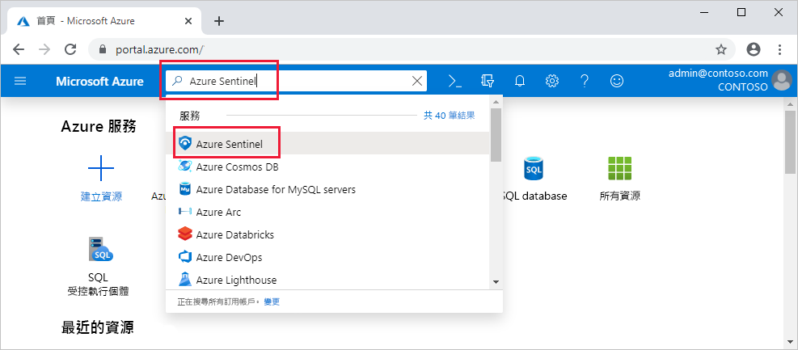

# 快速入門：使 Azure Sentinel 上線

在本快速入門中，您將了解如何使 Azure Sentinel 上線。 

若要讓 Azure Sentinel 上線，必須先啟用 Azure Sentinel，然後連線到您的資料來源。 Azure Sentinel 隨附多種適用於 Microsoft 解決方案的連接器，現成可用且提供即時整合，包括 Microsoft 威脅防護解決方案、Microsoft 365 來源，例如 Office 365、Azure AD、Azure ATP 和 Microsoft Cloud App Security 等等。 此外，還有適用於非 Microsoft 解決方案的內建連接器，用於連線至更廣泛的安全性生態系統。 您也可以使用常見事件格式 (Syslog 或 REST API) 來連線資料來源與 Azure Sentinel。  

連線您的資料來源之後，請從建立的活頁簿 (以您的資料為基礎進行深入解析) 資源庫中選擇。 這些活頁簿可以根據您的需求輕鬆地進行自訂。

>[!IMPORTANT] 
> 如需使用 Azure Sentinel 時所產生費用的相關資訊，請參閱 [Azure Sentinel 定價](https://azure.microsoft.com/pricing/details/azure-sentinel/)。
  

## 全域必要條件

- 如果您沒有使用中的 Azure 訂用帳戶，請在開始前建立[免費帳戶](https://azure.microsoft.com/free/?WT.mc_id=A261C142F)。

- Log Analytics 工作區。 了解如何[建立 Log Analytics 工作區](../log-analytics/log-analytics-quick-create-workspace.md)。 如需 Log Analytics 工作區的詳細資訊，請參閱[設計您的 Azure 監視器記錄部署](../azure-monitor/platform/design-logs-deployment.md)。

- 若要啟用 Azure Sentinel，您需要 Azure Sentinel 工作區所在之訂用帳戶的參與者權限。 
- 若要使用 Azure Sentinel，您需要工作區所屬資源群組的參與者或讀者權限。
- 連線特定資料來源可能需要其他權限。
- Azure Sentinel 是付費服務。 如需價格相關資訊，請參閱[關於 Azure Sentinel](https://go.microsoft.com/fwlink/?linkid=2104058)。
 
## 啟用 Azure Sentinel

1. 登入 Azure 入口網站。 請確定已選取 Azure Sentinel 建立所在的訂用帳戶。

1. 搜尋並選取 [Azure Sentinel]。

   

1. 選取 [新增]。

1. 選取您想要使用的工作區，或建立一個新的工作區。 您可以在一個以上的工作區上執行 Azure Sentinel，但資料會隔離到單一工作區。

   

   >[!NOTE] 
   > - Azure 資訊安全中心所建立的預設工作區不會出現在清單中；您無法在其上安裝 Azure Sentinel。
   > - Azure Sentinel 可以在任何 [Log Analytics 的 GA 區域](https://azure.microsoft.com/global-infrastructure/services/?products=monitor)的工作區上執行，中國和德國 (主權) 區域除外。 Azure Sentinel 所產生的資料 (例如事件、書籤和警示規則，其中可能包含來自這些工作區的一些客戶資料) 會儲存在歐洲 (適用於位於歐洲的工作區)、澳洲 (適用於位於澳洲的工作區) 或美國東部 (適用於位於任何其他區域的工作區)。

   >[!IMPORTANT]
   > - 在工作區上啟用 Azure Sentinel 之後，即不支援將該工作區移至其他資源群組或訂用帳戶。 如果您需要移動工作區，請連絡支援服務以取得指導方針。

1. 選取 [新增 Azure Sentinel]。
  

## 連線資料來源

Azure Sentinel 藉由連線到服務並將事件和記錄轉送至 Azure Sentinel，來建立與服務和應用程式的連線。 針對電腦和虛擬機器，您可以安裝 Azure Sentinel 代理程式，代理程式會收集記錄然後轉送至 Azure Sentinel。 對於防火牆和 Proxy，Azure Sentinel 利用 Linux Syslog 伺服器。 代理程式會安裝在伺服器上、從該伺服器收集記錄檔，並將其轉送至 Azure Sentinel。 
 
1. 按一下 [資料連接器]。
1. 您可以連線的每個資料來源都有一個圖格。 
例如，按一下 [Azure Active Directory]。 如果與此資料來源連線，您可以將 Azure AD 的所有記錄串流至 Azure Sentinel。 您可以選取想要取得的記錄類型 - 登入記錄及/或稽核記錄。  
在底部，Azure Sentinel 會建議您應該為每個連接器安裝哪些活頁簿，讓您可以立即取得資料的相關深入解析。   依照安裝指示或[參閱相關的連線指南](connect-data-sources.md)以取得詳細資訊。 如需資料連接器的詳細資訊，請參閱[連線 Microsoft 服務](connect-data-sources.md)。

與資料來源連線之後，您的資料就會開始串流至 Azure Sentinel，並準備好讓您開始使用。 您可以在[內建儀表板](quickstart-get-visibility.md)中檢視記錄，並且開始在 Log Analytics 中建置查詢以[調查資料](tutorial-investigate-cases.md)。

## 後續步驟
在本文件中，您已了解如何將資料來源連線到 Azure Sentinel。 若要深入了解 Azure Sentinel，請參閱下列文章：
- 深入了解如何[取得資料的可見度以及潛在威脅](quickstart-get-visibility.md)。
- 開始[使用 Azure Sentinel 偵測威脅](tutorial-detect-threats-built-in.md)。
- 從[常見的事件格式設備](connect-common-event-format.md)將資料串流至 Azure Sentinel。
