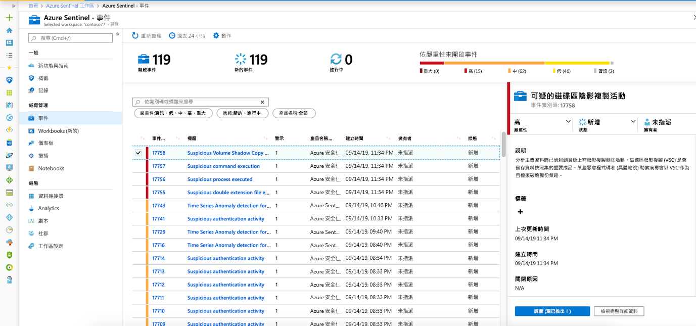

# 教程：使用 Azure 哨兵調查事件

> [!IMPORTANT]
> 調查圖當前處於公共預覽版中。
> 此功能在沒有服務等級協定的情況下提供，不建議用於生產工作負載。
> 如需詳細資訊，請參閱 [Microsoft Azure 預覽版增補使用條款](https://azure.microsoft.com/support/legal/preview-supplemental-terms/)。

本教程可説明您使用 Azure Sentinel 調查事件。 將資料來源連接到 Azure Sentinel 後，希望在發生可疑情況時收到通知。 為了使您能夠執行此操作，Azure Sentinel 允許您創建高級警報規則，這些規則可生成可以分配和調查的事件。

本文將說明：
> [!div class="checklist"]
> * 調查事件
> * 使用調查圖
> * 回應威脅

事件可以包括多個警報。 它是特定調查的所有相關證據的聚合。 事件是根據您在 **"分析"** 頁中創建的分析規則創建的。 與警報相關的屬性（如嚴重性）和狀態在事件級別設置。 讓 Azure Sentinel 知道要查找哪些類型的威脅以及如何查找這些威脅後，可以通過調查事件來監視檢測到的威脅。

## Prerequisites
只有在設置分析規則時使用實體映射欄位，才能調查事件。 調查圖要求您的原始事件包括實體。

## 如何調查事件

1. 選擇**事件**。 通過"**事件"** 頁，您可以知道發生了多少次事件、打開的事件數、已設置為"**正在進行中**"的事件數以及已關閉的事件數。 對於每個事件，您可以看到事件發生的時間以及事件的狀態。 查看嚴重性，決定首先處理哪些事件。

    

1. 您可以根據需要篩選事件，例如按狀態或嚴重性進行篩選。

1. 要開始調查，請選擇特定事件。 在右側，您可以看到事件的詳細資訊，包括其嚴重性、涉及的實體數摘要、觸發此事件的原始事件以及事件的唯一 ID。

1. 要查看事件中的警報和實體的更多詳細資訊，請選擇 **"查看事件頁面中的完整詳細資訊**"，並查看匯總事件資訊的相關選項卡。 在 **"警報"** 選項卡中，查看警報本身。 您可以看到有關警報的所有相關資訊 - 觸發警報的查詢、每個查詢返回的結果數以及在警報上運行行動手冊的能力。 要進一步深入到事件，請選擇**事件**數。 這將打開生成結果的查詢以及日誌分析中觸發警報的事件。 在"**實體"** 選項卡中，您可以看到作為警報規則定義一部分映射的所有實體。

    

1. 如果您正在積極調查事件，最好將事件的狀態設置為 **"正在進行"，** 直到您關閉它。

1. 可以將事件分配給特定使用者。 對於每個事件，您可以通過設置**事件擁有者**欄位來分配擁有者。 所有事件都以未分配開始。 您還可以添加注釋，以便其他分析人員能夠瞭解您調查的內容以及您對該事件的關注。

    

1. 選擇 **"調查"** 以查看調查地圖。

## 使用調查圖進行深度潛水

調查圖使分析人員能夠針對每次調查提出正確的問題。 調查圖通過將相關資料與任何相關實體相關聯，説明您瞭解潛在安全威脅的範圍並找出根本原因。 您可以通過選擇圖形中顯示的任何實體並在不同的擴展選項之間進行選擇，從而深入挖掘並調查圖形中顯示的任何實體。  
  
調查圖為您提供：

- **來自原始資料的可視上下文**：即時可視圖形顯示從原始資料自動提取的實體關聯。 這使您能夠輕鬆查看不同資料來源之間的連接。

- **全面調查範圍發現**：使用內置的勘探查詢擴大調查範圍，以顯示違規的全部範圍。

- **內置調查步驟**：使用預定義的探索選項，以確保您在面對威脅時提出正確的問題。

要使用調查圖：

1. 選擇事件，然後選擇 **"調查**"。 這帶你到調查圖。 該圖提供了直接連接到警報的實體和進一步連接的每個資源的說明性地圖。

   > [!IMPORTANT] 
   > 只有在設置分析規則時使用實體映射欄位，才能調查事件。 調查圖要求您的原始事件包括實體。

   

1. 選擇要打開 **"實體"** 窗格的實體，以便查看該實體上的資訊。

    
  
1. 通過將滑鼠懸停在每個實體上展開您的調查，以顯示由我們的安全專家和分析人員根據實體類型設計的問題清單，以深化您的調查。 我們稱這些選項**為探索查詢**。

    

   例如，在電腦上，您可以請求相關的警報。 如果選擇探用查詢，則生成的授權將添加回圖形。 在此示例中，選擇 **"相關警報"** 將以下警報返回到圖形中：

    

1. 對於每個查詢查詢，您可以選擇通過選擇**事件\>** 來打開原始事件結果和日誌分析中使用的查詢的選項。

1. 為了瞭解事件，圖形為您提供了一個並行時間表。

    

1. 將滑鼠懸停在時間表上，查看圖形上發生在某個時間點的事情。

    

## 後續步驟
在本教程中，您學習了如何使用 Azure Sentinel 開始調查事件。 繼續教程，[瞭解如何使用自動行動手冊回應威脅](tutorial-respond-threats-playbook.md)。
> [!div class="nextstepaction"]
> [回應威脅](tutorial-respond-threats-playbook.md)，自動回應威脅。

