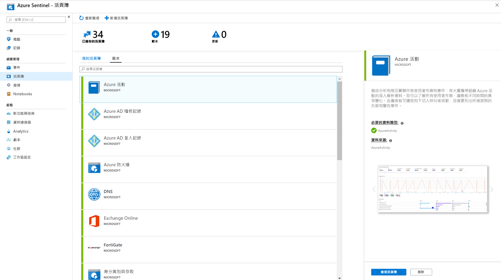

# 教程：視覺化和監控資料

 [將資料來源](quickstart-onboard.md) 連接到 Azure Sentinel 後，可以使用 Azure Sentinel 採用 Azure 監視器活頁簿來視覺化和監視資料，從而在創建自訂儀表板時提供多功能性。 雖然活頁簿在 Azure Sentinel 中以不同的方式顯示，但瞭解如何[使用 Azure 監視器活頁簿 創建互動式報表](../azure-monitor/app/usage-workbooks.md)可能很有用。 Azure Sentinel 可讓您建立資料的自訂活頁簿，同時還隨附內建活頁簿範本，可讓您在連線資料來源後快速取得資料的見解。

本教程可説明您在 Azure Sentinel 中視覺化資料。
> [!div class="checklist"]
> * 使用內建活頁簿
> * 建立新活頁簿

## Prerequisites

- 在 Azure Sentinel 工作區的資源組上，必須至少具有活頁簿閱讀器或活頁簿參與者許可權。

> [!NOTE]
> 可在 Azure Sentinel 中看到的活頁簿保存在 Azure Sentinel 工作區資源組中，並由創建這些活頁簿的工作區標記。

## 使用內建活頁簿

1. 轉到**活頁簿**，然後選擇**範本**以查看 Azure Sentinel 內置活頁簿的完整清單。 要查看哪些資料類型與您連接的資料類型相關，如果已經將相關資料流程式傳輸到 Azure Sentinel，則每個活頁簿中的 **"必需資料類型"** 欄位將列出綠色核取記號旁邊的資料類型。
  
1. 按一下 **"查看活頁簿"** 以查看使用資料填充的範本。
  
1. 要編輯活頁簿，請選擇 **"保存**"，然後選擇要保存範本的 json 檔的位置。 

   > [!NOTE]
   > 這將基於相關範本創建 Azure 資源，並保存範本 Json 檔本身，而不是資料。

1. 選擇 **"查看活頁簿**"。 然後，按一下頂部的 **"編輯"** 按鈕。 您現在可以編輯活頁簿，並根據需要對其進行自訂。 有關如何自訂活頁簿的詳細資訊，請參閱如何使用[Azure 監視器活頁簿創建互動式報表](../azure-monitor/app/usage-workbooks.md)。

1. 進行更改後，可以保存活頁簿。 

1. 您還可以克隆活頁簿：選擇 **"編輯"，** 然後**另存為**，請確保在同一訂閱和資源組下用另一個名稱保存活頁簿。 這些活頁簿顯示在"**我的活頁簿"** 選項卡下。

## 創建新活頁簿

1. 轉到**活頁簿**，然後選擇 **"添加活頁簿"** 以從頭開始創建新的活頁簿。
  

1. 要編輯活頁簿，請選擇 **"編輯**"，然後根據需要添加文本、查詢和參數。 有關如何自訂活頁簿的詳細資訊，請參閱如何使用[Azure 監視器活頁簿創建互動式報表](../azure-monitor/app/usage-workbooks.md)。 

1. 生成查詢時，將**資料來源**設置為 **"日誌**"，**將資源類型**設置為 **"日誌分析"，** 然後選擇相關工作區。 

1. 創建活頁簿後，請保存活頁簿，以確保將其保存在 Azure Sentinel 工作區的訂閱和資源組下。

1. 如果要讓組織中的其他人使用活頁簿，請在 **"保存"** 下選擇 **"共用報表**"。 如果希望此活頁簿僅對您可用，請選擇 **"我的報表**"。

1. 要在工作區中的活頁簿之間切換，可以在任何活頁簿的頂部窗格](./media/tutorial-monitor-data/switch.png)中選擇 **"打開**

## 如何刪除活頁簿

您可以刪除從 Azure Sentinel 範本創建的活頁簿。 

要刪除自訂活頁簿，請在活頁簿頁中選擇要刪除的已保存活頁簿，然後選擇 **"刪除**"。 這將刪除保存的活頁簿。

> [!NOTE]
> 這將刪除資源以及對範本所做的任何更改。 原始範本將保持可用狀態。

## 後續步驟

在本教程中，您學習了如何在 Azure Sentinel 中查看資料。

要瞭解如何自動回應威脅，請參閱在 Azure [Sentinel 中設置自動威脅回應](tutorial-respond-threats-playbook.md)。
