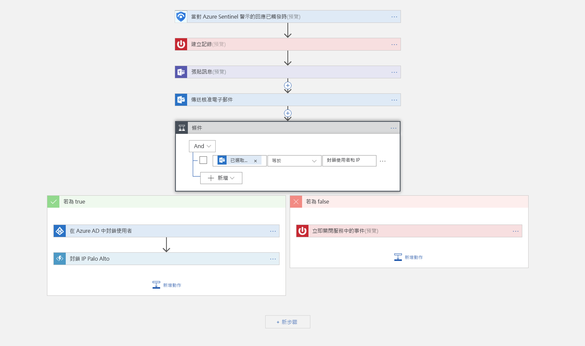

# 教學課程：在 Azure Sentinel 中設定自動化威脅回應

本教學課程可協助您使用 Azure Sentinel 中的安全性劇本，來設定對 Azure Sentinel 所偵測到之安全性相關問題的自動化威脅回應。

> [!div class="checklist"]
> * 了解劇本
> * 建立劇本
> * 執行劇本
> * 將威脅回應自動化

## 什麼是 Azure Sentinel 中的安全性劇本？

安全性劇本是可從 Azure Sentinel 執行以回應警示的程序集合。 安全性劇本可以協助自動化及協調您的回應，並可手動執行，或者在觸發特定警示時設定為自動執行。 Azure Sentinel 中的安全性劇本會以 [Azure Logic Apps](https://docs.microsoft.com/azure/logic-apps/logic-apps-what-are-logic-apps) 為依據，這表示您會取得所有能力、自訂功能，以及 Logic Apps 的內建範本。 每個劇本都會針對您選擇的特定訂用帳戶來建立，但當您查看 [劇本] 頁面時，將會看到任何所選取訂用帳戶上的所有劇本。

> [!NOTE]
> 劇本會運用 Azure Logic Apps，因此會產生費用。 請造訪 [Azure Logic Apps](https://azure.microsoft.com/pricing/details/logic-apps/) 價格分頁以取得詳細資料。

例如，如果您擔心惡意攻擊者會存取您的網路資源，您可以設定警示，以查看存取您網路的惡意 IP 位址。 接著，可以建立劇本來執行下列作業：
1. 觸發警示時，在 ServiceNow 或任何其他 IT 票證系統中開啟票證。
2. 將訊息傳送至您在 Microsoft Teams 或 Slack 中的安全性操作通道，以確定您的安全性分析師會留意該事件。
3. 將警示中的所有資訊都傳送給您的資深網路管理員和安全性管理員。電子郵件訊息也包含兩個使用者選項按鈕 [封鎖] 或 [忽略]。
4. 劇本會在收到管理員的回應之後繼續執行。
5. 如果管理員選擇 [封鎖]，即會在防火牆中封鎖該 IP 位址，並在 Azure AD 中停用該使用者。
6. 如果管理員選擇 [忽略]，即會在 Azure Sentinel 中關閉警示，並在 ServiceNow 中關閉該事件。

安全性劇本可以手動或自動執行。 手動執行它們表示，當您收到警示時，您可以視需要選擇執行劇本以作為所選取警示的回應。 自動執行它們表示，撰寫相互關聯的規則時，您會將它設定為在警示觸發時自動執行一或多個劇本。

## 建立安全性劇本

遵循下列步驟，以在 Azure Sentinel 中建立新的安全性劇本：

1. 開啟 [Azure Sentinel] 儀表板。
2. 在 [設定] 底下，選取 [劇本]。

   

3. 在 [Azure Sentinel - 劇本] 頁面中，按一下 [新增] 按鈕。

    

4. 在 [建立邏輯應用程式] 頁面中，輸入所要求的資訊以建立新的邏輯應用程式，然後按一下 [建立]。 

5. 在[**邏輯應用程式設計工具**](../logic-apps/logic-apps-overview.md)中，選取您想要使用的範本。 如果您選取需要認證的範本，就必須提供它們。 或者，可從頭開始建立新的空白劇本。 選取 [空白邏輯應用程式]。 

   

6. 您會前往邏輯應用程式設計工具，您可以在其中建立新的或編輯範本。 請深入了解如何使用 [Logic Apps](../logic-apps/logic-apps-create-logic-apps-from-templates.md) 建立劇本。

7. 如果您要建立空白劇本，在 [搜尋所有連接器及觸發程序] 欄位中，輸入 *Azure Sentinel*，然後選取 [當對 Azure Sentinel 警示的回應已觸發時]。  建立之後，新的劇本會出現在 [劇本] 清單中。 如果它沒有出現，按一下 [重新整理]。

1. 使用**取得實體**函式可讓您從 [實體] 清單內部取得相關實體，例如帳戶、IP 位址和主機。 這可讓您在特定實體上執行動作。

7. 現在您可以定義當觸發劇本時會發生什麼事。 您可以新增動作、邏輯條件、切換案例條件或迴圈。

   

## 如何執行安全性劇本

您可以視需要執行劇本。

視需要執行劇本：

1. 在 [事件] 頁面中，選取一個事件，然後按一下 [檢視完整的詳細資料]。

2. 在 [警示] 索引標籤中，按一下您想要執行劇本的警示、一路捲動到右邊並按一下 [檢視劇本]，然後從訂用帳戶的可用劇本清單中選取要**執行**的劇本。 

## 將威脅回應自動化

定期傳來的安全性警示會讓 SIEM/SOC 小組應接不暇。 由於產生的警示數量龐大，所有有空的安全性系統管理員都會忙得昏天暗地。 這往往會導致許多警示並未受到調查，而讓組織容易不知不覺地遭到攻擊。 

其中的許多 (但並非大多數) 警示會符合週期性模式，因此可透過特定且已定義的補救動作來加以解決。 Azure Sentinel 已可讓您在劇本中定義補救措施。 您也可以在劇本定義內設定即時自動化，以便能夠讓針對特定安全性警示所定義的回應完全自動地進行。 藉由使用即時自動化，回應小組可以藉由讓針對週期性類型的警示所制定的例行回應完全自動地進行、讓您能夠更專注地應付獨特警示、分析模式、威脅搜尋等等，而大幅降低工作量。

若要讓回應自動化：

1. 選取想要讓回應自動化的警示。
1. 在 [編輯警示規則] 頁面的 [即時自動化] 底下，選擇要在符合此警示規則時執行的 [觸發劇本]。
1. 選取 [儲存]。

   

## 後續步驟

在本教學課程中，您已了解如何在 Azure Sentinel 中執行劇本。 繼續了解使用 Azure Sentine [主動尋找威脅的方式](hunting.md)。

