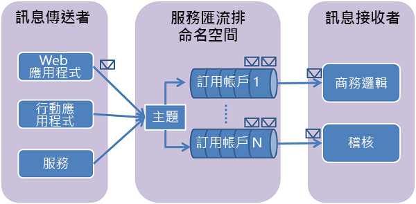

# 使用 Azure 入口網站建立服務匯流排主題和主題的訂用帳戶
在本快速入門中，您會使用 Azure 入口網站來建立服務匯流排主題，然後建立該主題的訂用帳戶。 

## 什麼是服務匯流排主題和訂用帳戶？
服務匯流排主題和訂用帳戶支援「發佈/訂閱」  訊息通訊模型。 使用主題和訂用帳戶時，分散式應用程式的元件彼此不直接通訊，相反的，他們會透過扮演中繼角色的主題來交換訊息。

有別於服務匯流排佇列，服務匯流排佇列中的每個訊息只會由單一取用者處理，主題和訂用帳戶採用發佈/訂閱模式，提供一對多的通訊形式。 一個主題可以登錄多個訂用帳戶。 當訊息傳送至主題時，每個訂用帳戶都可取得訊息來個別處理。 主題的訂用帳戶類似於虛擬佇列，同樣可接收已傳送到主題的訊息複本。 您可以選擇為個別訂用帳戶登錄主題的篩選規則，以篩選或限制主題的哪些訊息由哪些主題訂用帳戶接收。

服務匯流排主題和訂用帳戶可讓您擴大處理非常多使用者和應用程式上大量的訊息。

[!INCLUDE [service-bus-create-namespace-portal](../../includes/service-bus-create-namespace-portal.md)]

[!INCLUDE [service-bus-create-topics-three-subscriptions-portal](../../includes/service-bus-create-topics-three-subscriptions-portal.md)]

> [!NOTE]
> 您可以使用[服務匯流排總管](https://github.com/paolosalvatori/ServiceBusExplorer/)來管理服務匯流排資源。 服務匯流排總管可讓使用者連線到服務匯流排命名空間，並以簡便的方式管理傳訊實體。 此工具提供進階的功能 (例如匯入/匯出功能) 或測試主題、佇列、訂用帳戶、轉送服務、通知中樞和事件中樞的能力。 

## 後續步驟
在本文中，您已建立服務匯流排命名空間、命名空間中的主題，以及訂閱該主題的三個訂用帳戶。 若要了解如何將訊息發佈至主題並訂閱訂用帳戶中的訊息，請參閱「發佈和訂閱訊息」一節中的下列其中一個快速入門。 

- [.NET](service-bus-dotnet-how-to-use-topics-subscriptions.md)
- [Java](service-bus-java-how-to-use-topics-subscriptions.md)
- [JavaScript](service-bus-nodejs-how-to-use-topics-subscriptions.md)
- [Python](service-bus-python-how-to-use-topics-subscriptions.md)
- [PHP](service-bus-php-how-to-use-topics-subscriptions.md)
- [Ruby](service-bus-ruby-how-to-use-topics-subscriptions.md)