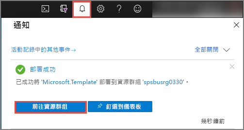
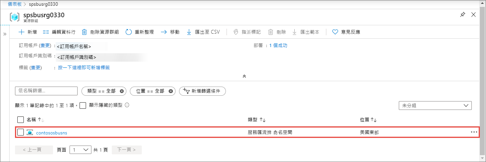
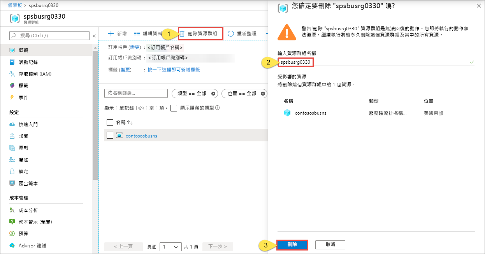

# 快速入門：使用 ARM 範本建立服務匯流排命名空間和佇列

本文說明如何使用 Azure Resource Manager 範本 (ARM 範本)，建立服務匯流排命名空間和在該命名空間內的佇列。 本文說明如何指定要部署哪些資源，以及如何定義執行部署時所指定的參數。 您可以直接在自己的部署中使用此範本，或自訂此範本以符合您的需求。

[!INCLUDE [About Azure Resource Manager](../../includes/resource-manager-quickstart-introduction.md)]

如果您的環境符合必要條件，而且您很熟悉 ARM 範本，請選取 [部署至 Azure] 按鈕。 範本會在 Azure 入口網站中開啟。

## 必要條件

如果您沒有 Azure 訂用帳戶，請在開始之前先[建立免費帳戶](https://azure.microsoft.com/free/)。

## 檢閱範本

本快速入門中使用的範本是來自 [Azure 快速入門範本](https://azure.microsoft.com/resources/templates/201-servicebus-create-queue)。

:::code language="json" source="~/quickstart-templates/201-servicebus-create-queue/azuredeploy.json":::

範本中定義的資源包括：

- [**Microsoft.ServiceBus/namespaces**](/azure/templates/microsoft.servicebus/namespaces)
- [**Microsoft.ServiceBus/namespaces/queues**](/azure/templates/microsoft.servicebus/namespaces/queues)

> [!NOTE]
> 下列的 ARM 範本可供下載和部署。
>
> * [建立服務匯流排命名空間與佇列和授權規則](service-bus-resource-manager-namespace-auth-rule.md)
> * [建立服務匯流排命名空間與主題和訂用帳戶](service-bus-resource-manager-namespace-topic.md)
> * [建立服務匯流排命名空間](service-bus-resource-manager-namespace.md)
> * [建立服務匯流排命名空間與主題、訂用帳戶和規則](service-bus-resource-manager-namespace-topic-with-rule.md)

您可以在 [Azure 快速入門範本](https://azure.microsoft.com/resources/templates/?resourceType=Microsoft.Servicebus&pageNumber=1&sort=Popular)中找到更多範本

## 部署範本

使用此範本，您將部署具有佇列的服務匯流排命名空間。

如果有一或多個競爭取用者，[服務匯流排佇列](service-bus-queues-topics-subscriptions.md#queues)會採用「先進先出」(FIFO) 訊息傳遞機制。

若要自動執行部署，請按一下下列按鈕：為部署建立新的資源群組，讓您稍後可以輕鬆地清除。

## 驗證部署

1. 選取頂端的 [通知]，查看部署狀態。 等待部署成功。 然後，在通知訊息中選取 [移至資源群組]，瀏覽至包含服務匯流排命名空間的資源群組頁面。 

    
2. 確認您在資源清單中看到您的服務匯流排命名空間。 

    
3. 從清單中選取命名空間，以查看**服務匯流排命名空間**頁面。 

## 清除資源

1. 在 Azure 入口網站中瀏覽至您資源群組的**資源群組**頁面。
2. 從工具列中選取 [刪除資源群組]。 
3. 輸入資源群組名稱，然後選取 [刪除]。 

    

## 後續步驟

參閱下列主題，了解如何建立命名空間/佇列的授權規則：

[使用 ARM 範本建立命名空間和佇列的服務匯流排授權規則](service-bus-resource-manager-namespace-auth-rule.md)

檢視下列文章以了解如何管理這些資源︰

* [使用 PowerShell 管理服務匯流排](service-bus-manage-with-ps.md)
* [使用服務匯流排總管管理服務匯流排資源](https://github.com/paolosalvatori/ServiceBusExplorer/releases)

[Authoring Azure Resource Manager templates]: ../azure-resource-manager/templates/template-syntax.md
[Service Bus namespace and queue template]: https://github.com/Azure/azure-quickstart-templates/blob/master/201-servicebus-create-queue/
[Azure Quickstart Templates]: https://azure.microsoft.com/documentation/templates/?term=service+bus
[Learn more about Service Bus queues]: service-bus-queues-topics-subscriptions.md
[Using Azure PowerShell with Azure Resource Manager]: ../azure-resource-manager/management/manage-resources-powershell.md
[Using the Azure CLI for Mac, Linux, and Windows with Azure Resource Management]: ../azure-resource-manager/management/manage-resources-cli.md