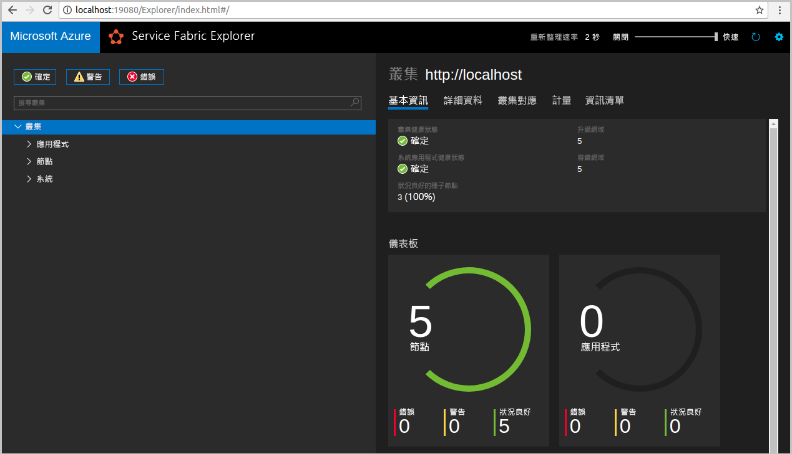
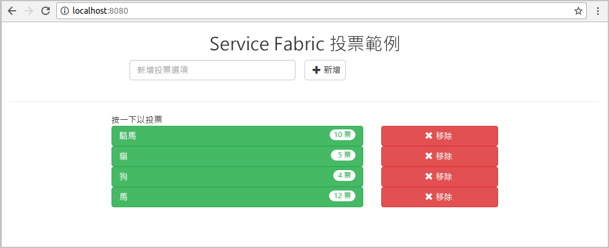
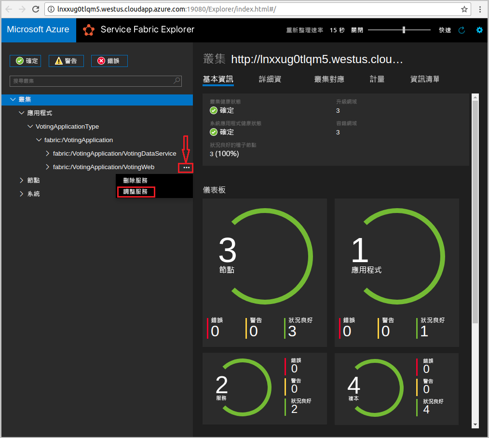
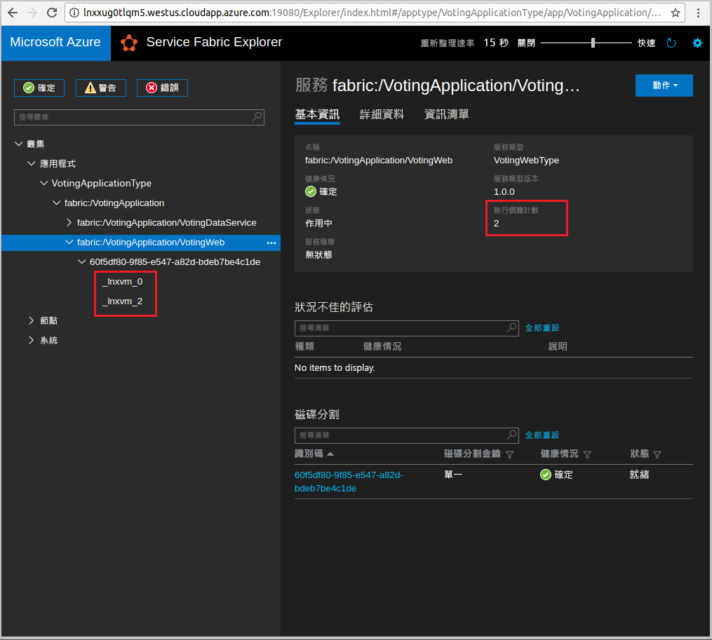

# <a name="quickstart--deploy-a-java-app-to-azure-service-fabric-on-linux"></a>快速入門：將 Java 應用程式部署至 Linux 上的 Azure Service Fabric

在本快速入門中，您會使用 Linux 開發人員機器上的 Eclipse IDE，將 Java 應用程式部署到 Azure Service Fabric。 當您完成時，您會有一個投票應用程式，其 Java Web 前端會將投票結果儲存在叢集中具狀態的後端服務。

Azure Service Fabric 是一個分散式系統平台，可讓您部署及管理微服務與容器。

## <a name="prerequisites"></a>Prerequisites

- [Java 環境](./service-fabric-get-started-linux.md#set-up-java-development)和 [Yeoman](./service-fabric-get-started-linux.md#set-up-yeoman-generators-for-containers-and-guest-executables)
- [Eclipse Neon (4.6)+](https://www.eclipse.org/downloads/packages/) 和[適用於 Service Fabric 的 Eclipse 外掛程式](./service-fabric-get-started-linux.md#install-the-eclipse-plug-in-optional)
- [Service Fabric SDK 和命令列介面 (CLI)](./service-fabric-get-started-linux.md#installation-methods)
- [Git](https://git-scm.com/downloads)

## <a name="download-the-sample"></a>下載範例

在命令視窗中執行下列命令，將範例應用程式存放庫複製到本機電腦。

```bash
git clone https://github.com/Azure-Samples/service-fabric-java-quickstart.git
```

## <a name="run-the-application-locally"></a>在本機執行應用程式

1. 執行下列命令來啟動本機叢集：

    ```bash
    sudo /opt/microsoft/sdk/servicefabric/common/clustersetup/devclustersetup.sh
    ```
    啟動本機叢集需要一些時間。 若要確認該叢集完全啟動，請存取位於 `http://localhost:19080` 的 Service Fabric Explorer。 五個狀況良好的節點表示本機叢集已啟動並執行。

    

2. 開啟 Eclipse。
3. 選取 [檔案]   > [匯入]   > [Gradle]   > [現有的 Gradle 專案]  ，然後依照精靈的指示操作。
4. 選取 [目錄]  ，然後從透過 GitHub 複製的 **service-fabric-java-quickstart** 資料夾中選擇 [投票]  目錄。 選取 [完成]  。

    

5. 在 Eclipse 的 [封裝總管] 中現在有 `Voting` 專案。
6. 以滑鼠右鍵按一下專案，並選取 [Service Fabric]  下拉式清單下的 [發佈應用程式]  。 選擇 **PublishProfiles/Local.json** 作為目標設定檔，並選取 [發佈]  。

    

7. 開啟您最愛的網頁瀏覽器，並存取 `http://localhost:8080` 以存取應用程式。

    

您現在可以新增一組投票選項，並開始進行投票。 應用程式會執行並將所有資料儲存在 Service Fabric 叢集中，而不需要個別資料庫。



## <a name="scale-applications-and-services-in-a-cluster"></a>調整叢集中的應用程式和服務

您可以在整個叢集內調整服務，以符合服務上的負載變更。 您可以藉由變更叢集中執行的執行個體數目來調整服務。 有許多方式可以調整您的服務。 例如，您可以從 Service Fabric CLI (`sfctl`) 使用指令碼或命令。 在下列步驟中，請使用 Service Fabric Explorer。

Service Fabric Explorer 會在所有 Service Fabric 叢集中執行，並可藉由瀏覽至叢集 HTTP 管理連接埠 (19080) 從瀏覽器存取。 例如： `http://localhost:19080` 。

若要調整 Web 前端服務，請執行下列動作：

1. 在您的叢集中開啟 Service Fabric Explorer。 例如： `https://localhost:19080` 。
2. 選取樹狀檢視中 **fabric:/Voting/VotingWeb** 節點旁的省略符號 ( **...** )，然後選取 [調整服務]  。

    

    您現在可以選擇調整 Web 前端服務的執行個體數目。

3. 將數字變更為 **2**，然後選取 [縮放服務]  。
4. 選取樹狀檢視中的 **fabric:/Voting/VotingWeb** 節點，然後展開資料分割節點 (以 GUID 表示)。

    

    您現在會看到此服務具有兩個執行個體，而且在樹狀檢視中，您會看到執行個體執行所在的節點。

藉由這項簡單的管理工作，您已讓前端服務可用來處理使用者負載的資源倍增。 請務必了解，您不需要多個服務執行個體，就能讓服務確實可靠地執行。 如果服務失敗，Service Fabric 可確保會有新的服務執行個體在叢集中執行。

## <a name="next-steps"></a>後續步驟

在此快速入門中，您已了解如何：

* 使用 Eclipse 作為 Service Fabric Java 應用程式的工具
* 將 Java 應用程式部署到本機叢集
* 跨多個節點相應放大應用程式

若要深入了解如何在 Service Fabric 中使用 Java 應用程式，請繼續進行教學課程以了解 Java 應用程式。

> [!div class="nextstepaction"]
> [部署 Java 應用程式](./service-fabric-tutorial-create-java-app.md)
