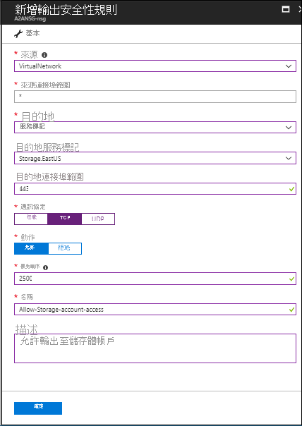
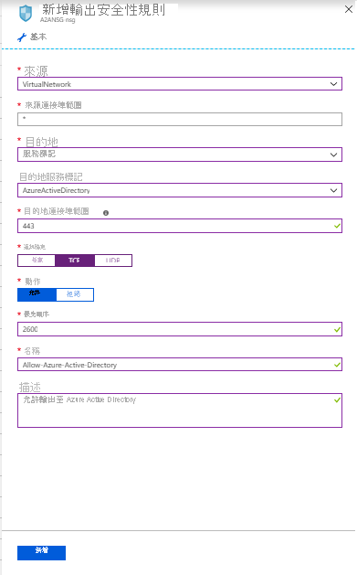

# 關於 Azure VM 災難修復中的網路功能

本文提供您使用 [Azure Site Recovery](site-recovery-overview.md)，將 Azure VM 從一個區域複寫和復原到另一個區域時的網路功能指引。

## 開始之前

了解 Site Recovery 如何針對[這種情況](azure-to-azure-architecture.md)提供災害復原。

## 一般網路基礎結構

下圖說明適用於 Azure VM 上執行之應用程式的一般 Azure 環境：

如果您使用 Azure ExpressRoute 或從內部部署網路到 Azure 的 VPN 連線，環境將如下所示：

通常會使用防火牆和網路安全性群組 (NSG) 來保護網路。 服務標記應該用來控制網路連線能力。 Nsg 應該允許數個服務標記來控制輸出連線能力。

>[!IMPORTANT]
> Site Recovery 不支援使用經過驗證的 Proxy 來控制網路連線能力，而且無法啟用複寫。

## URL 的輸出連線能力

如果您使用以 URL 為基礎的防火牆 Proxy 來控制輸出連線能力，請允許這些 Site Recovery URL：

>[!NOTE]
> 不應執行以 IP 位址為基礎的允許清單來控制輸出連線能力。

**URL** | **詳細資料**
--- | ---
*.blob.core.windows.net | 需要此項目方可從 VM 將資料寫入來源地區的快取儲存體帳戶中。 如果您知道 Vm 的所有快取儲存體帳戶，您可以允許存取特定的儲存體帳戶 Url (例如： cache1.blob.core.windows.net 和 cache2.blob.core.windows.net) ，而不是 *. blob.core.windows.net
login.microsoftonline.com | 需要此項目方可進行 Site Recovery 服務 URL 的授權和驗證。
*.hypervrecoverymanager.windowsazure.com | 需要此項目方可從 VM 進行 Site Recovery 服務通訊。
*.servicebus.windows.net | 需要此項目方可從 VM 寫入 Site Recovery 監視和診斷資料。
*.vault.azure.net | 允許存取透過入口網站啟用啟用 ADE 之虛擬機器的複寫
*. automation.ext.azure.com | 允許透過入口網站啟用複寫專案的行動代理程式自動升級

## 使用服務標記的輸出連線能力

如果您使用 NSG 來控制輸出連線能力，則必須允許這些服務標記。

- 針對來源區域中的儲存體帳戶：
    - 為這個來源地區建立[儲存體服務標記](../virtual-network/security-overview.md#service-tags)型 NSG 規則。
    - 允許這些位址，方可從 VM 將該資料寫入到快取儲存體帳戶。
- 建立 [Azure Active Directory (AAD) 服務標籤](../virtual-network/security-overview.md#service-tags)型 NSG 規則，以允許存取對應至 AAD 的所有 IP 位址
- 針對目的地區域建立以 EventsHub 服務標記為基礎的 NSG 規則，以允許存取 Site Recovery 監視。
- 建立以 AzureSiteRecovery 服務標記為基礎的 NSG 規則，以允許在任何區域中存取 Site Recovery 服務。
- 建立以 AzureKeyVault 服務標記為基礎的 NSG 規則。 只有在透過入口網站啟用啟用 ADE 的虛擬機器複寫時，才需要此項。
- 建立以 GuestAndHybridManagement 服務標記為基礎的 NSG 規則。 只有透過入口網站啟用複寫專案的行動代理程式自動升級時才需要此項。
- 建議您在測試 NSG 上建立必要的 NSG 規則，並確認沒有問題後，再於生產 NSG 上建立規則。

## 範例 NSG 設定

這個範例示範如何針對要複寫的 VM 設定 NSG 規則。

- 如果您使用 NSG 規則來控制輸出連線，請針對所有必要的 IP 位址範圍，將「允許 HTTPS 輸出」規則應用至連接埠：443。
- 此範例假設 VM 來源位置為「美國東部」，而目標位置為「美國中部」。

### NSG 規則：美國東部

1. 在 NSG 上針對 "Storage.EastUS" 建立輸出 HTTPS (443) 安全性規則，如以下螢幕擷取畫面所示。

      

2. 在 NSG 上針對 "AzureActiveDirectory" 建立輸出 HTTPS (443) 安全性規則，如以下螢幕擷取畫面所示。

      

3. 與上述安全性規則類似，請在對應至目標位置的 NSG 上，為 "CentralUS" 建立輸出 HTTPS (443) 安全性規則。 這可讓您存取 Site Recovery 監視。

4. 針對 NSG 上的 "AzureSiteRecovery" 建立輸出 HTTPS (443) 安全性規則。 這可讓您存取任何區域中的 Site Recovery 服務。

### NSG 規則：美國中部

需要這些規則，才能啟用從目標區域到來源地區容錯移轉後的複寫：

1. 在 NSG 上針對 "Storage.CentralUS" 建立輸出 HTTPS (443) 安全性規則。

2. 在 NSG 上針對 "AzureActiveDirectory" 建立輸出 HTTPS (443) 安全性規則。

3. 與上述安全性規則類似，請在對應至來源位置的 NSG 上，為 "EastUS" 建立輸出 HTTPS (443) 安全性規則。 這可讓您存取 Site Recovery 監視。

4. 針對 NSG 上的 "AzureSiteRecovery" 建立輸出 HTTPS (443) 安全性規則。 這可讓您存取任何區域中的 Site Recovery 服務。

## 網路虛擬設備設定

如果您使用網路虛擬設備 (NVA) 來控制 VM 的輸出網路流量，那麼只要所有的複寫流量都通過 NVA，該設備便有可能進行節流。 建議您在虛擬網路中為「儲存體」建立一個網路服務端點，這樣複寫流量就不會流向 NVA。

### 為儲存體建立網路服務端點
您可以在虛擬網路中為「儲存體」建立一個網路服務端點，這樣複寫流量就不會離開 Azure 範圍。

- 選取您的 Azure 虛擬網路，然後按一下 [服務端點]。

    

- 按一下 [新增]，[新增服務端點] 索引標籤隨即開啟。
- 選取 [服務] 底下的 [Microsoft.Storage]，接下來選取 [子網路] 底下的必要子網路，然後按一下 [新增]。

>[!NOTE]
>不要限制虛擬網路存取您用於 ASR 的儲存體帳戶。 您應該允許從 [所有網路] 存取。

### 強制通道

您可以使用[自訂路由](../virtual-network/virtual-networks-udr-overview.md#custom-routes)覆寫 0.0.0.0/0 位址前置詞的 Azure 預設系統路由，並將 VM 流量導向內部部署網路虛擬設備 (NVA)，但不建議將此設定用於 Site Recovery 複寫。 如果您使用自訂路由，則應該在虛擬網路中為「儲存體」[建立虛擬網路服務端點](azure-to-azure-about-networking.md#create-network-service-endpoint-for-storage)，這樣一來，複寫流量就不會離開 Azure 界限。

## 後續步驟
- [複寫 Azure 虛擬機器](./azure-to-azure-quickstart.md)來開始保護您的工作負載。
- 深入了解如何針對 Azure 虛擬機器容錯移轉[保留 IP 位址](site-recovery-retain-ip-azure-vm-failover.md)。
- 深入瞭解 [使用 ExpressRoute 進行 Azure 虛擬機器](azure-vm-disaster-recovery-with-expressroute.md)的嚴重損壞修復。
