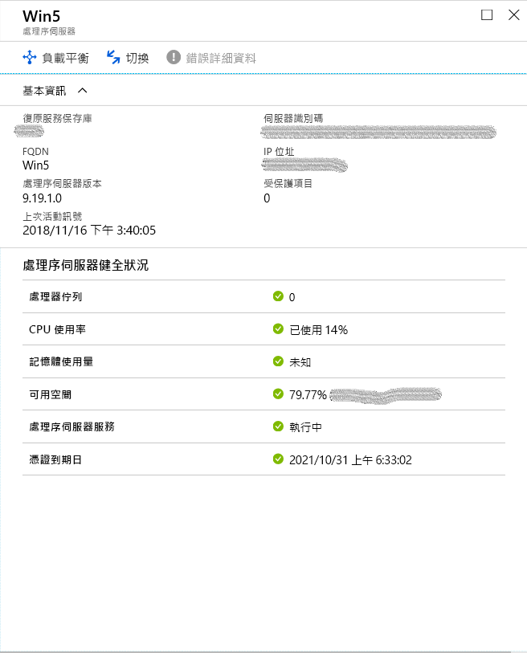

# <a name="manage-process-servers"></a>管理處理序伺服器

本文說明管理 Site Recovery 進程伺服器的一般工作。

進程伺服器用來接收、優化和傳送複寫資料至 Azure。 它也會在您想要複寫的 VMware Vm 和實體伺服器上執行行動服務的推送安裝，並執行內部部署機器的自動探索。 若要將內部部署 VMware Vm 或實體伺服器複寫至 Azure，設定伺服器電腦上預設會安裝進程伺服器。 

- 針對大型部署，您可能需要額外的內部部署處理序伺服器才能調整容量。
- 若要從 Azure 容錯回復至內部部署，您必須在 Azure 中設定暫時性的進程伺服器。 容錯回復完成後，您可以刪除此 VM。 

深入了解處理序伺服器。


## <a name="upgrade-a-process-server"></a>升級處理序伺服器

當您部署內部部署的進程伺服器，或部署為 Azure VM 進行容錯回復時，會安裝最新版本的進程伺服器。 Site Recovery 小組會定期發行修正程式和增強功能，我們建議您將處理序伺服器保持在最新狀態。 您可以升級進程伺服器，如下所示：

[!INCLUDE [site-recovery-vmware-upgrade -process-server](../../includes/site-recovery-vmware-upgrade-process-server-internal.md)]


## <a name="move-vms-to-balance-the-process-server-load"></a>移動 Vm 以平衡進程伺服器負載

藉由在兩個進程伺服器之間移動 Vm 來平衡負載，如下所示：

1. 在保存庫的 [ **管理** ] 下，按一下 [ **Site Recovery 基礎結構**]。 在 [ **VMware & 實體機器**] 底下，按一下 [設定 **伺服器**]。
2. 按一下用來註冊處理伺服器的設定伺服器。
3. 按一下您要對流量進行負載平衡的進程伺服器。

    

4. 按一下 [ **負載平衡**]，選取您要移動電腦的目標進程伺服器。 然後按一下 **[確定]**

    ![螢幕擷取畫面顯示已選取 [選取目標進程伺服器] 的 [負載平衡] 窗格。](media/vmware-azure-manage-process-server/LoadPS.PNG)

2. 按一下 [ **選取電腦**]，然後選擇您想要從目前的電腦移至目標進程伺服器的電腦。 系統會針對每個虛擬機器顯示平均資料變更的詳細資料。 然後按一下 [確定] 。 
3. 在保存庫中，監視**Monitoring**  >  **Site Recovery 作業**監視下的作業進度。

需要大約15分鐘的時間，變更才會反映在入口網站中。 如需更快速的效果，請重新整理設定 [伺服器](vmware-azure-manage-configuration-server.md#refresh-configuration-server)。

## <a name="switch-an-entire-workload-to-another-process-server"></a>將整個工作負載切換到另一個進程伺服器

將進程伺服器所處理的整個工作負載移至不同的進程伺服器，如下所示：

1. 在保存庫的 [ **管理** ] 下，按一下 [ **Site Recovery 基礎結構**]。 在 [ **VMware & 實體機器**] 底下，按一下 [設定 **伺服器**]。
2. 按一下用來註冊處理伺服器的設定伺服器。
3. 按一下您要切換工作負載的進程伺服器。
4. 按一下 [ **切換**]，選取您要移動工作負載的目標進程伺服器。 然後按一下 **[確定]**

    ![螢幕擷取畫面：顯示 [選取目標進程伺服器] 窗格。](media/vmware-azure-manage-process-server/Switch.PNG)

5. 在保存庫中，監視**Monitoring**  >  **Site Recovery 作業**監視下的作業進度。

需要大約15分鐘的時間，變更才會反映在入口網站中。 如需更快速的效果，請重新整理設定 [伺服器](vmware-azure-manage-configuration-server.md#refresh-configuration-server)。

## <a name="register-a-master-target-server"></a>註冊主要目標伺服器

主要目標伺服器位於設定伺服器和相應放大進程伺服器上。 它必須向設定伺服器註冊。 如果此註冊失敗，可能會影響受保護專案的健康情況。 若要向設定伺服器註冊主要目標伺服器，請登入需要註冊的特定設定伺服器/相應放大進程伺服器。 流覽至資料夾 **%PROGRAMDATA%\ASR\Agent**，然後在系統管理員命令提示字元中執行下列命令。

   ```
   cmd
   cdpcli.exe --registermt

   net stop obengine

   net start obengine

   exit
   ```

## <a name="reregister-a-process-server"></a>重新註冊處理序伺服器

使用設定伺服器，將在內部部署或 Azure VM 上執行的進程伺服器重新註冊，如下所示：

[!INCLUDE [site-recovery-vmware-register-process-server](../../includes/site-recovery-vmware-register-process-server.md)]

儲存設定之後，請執行下列作業：

1. 在處理序伺服器上，開啟系統管理員命令提示字元。
2. 瀏覽至 **%PROGRAMDATA%\ASR\Agent** 資料夾，然後執行命令：

    ```
    cdpcli.exe --registermt
    net stop obengine
    net start obengine
    ```

## <a name="modify-proxy-settings-for-an-on-premises-process-server"></a>修改內部部署處理序伺服器的 Proxy 設定

如果內部部署進程伺服器使用 proxy 連接到 Azure，您可以修改 proxy 設定，如下所示：

1. 登入進程伺服器電腦。 
2. 開啟系統管理 PowerShell 命令視窗並執行下列命令：
   ```powershell
   $pwd = ConvertTo-SecureString -String MyProxyUserPassword
   Set-OBMachineSetting -ProxyServer http://myproxyserver.domain.com -ProxyPort PortNumber –ProxyUserName domain\username -ProxyPassword $pwd
   net stop obengine
   net start obengine
   ```
2. 流覽至資料夾 **%PROGRAMDATA%\ASR\Agent**，然後執行此命令：
   ```
   cmd
   cdpcli.exe --registermt

   net stop obengine

   net start obengine

   exit
   ```

## <a name="remove-a-process-server"></a>移除處理序伺服器

[!INCLUDE [site-recovery-vmware-unregister-process-server](../../includes/site-recovery-vmware-unregister-process-server.md)]

## <a name="exclude-folders-from-anti-virus-software"></a>從防毒軟體排除資料夾

如果防毒軟體是在相應放大進程伺服器 (或主要目標伺服器) 上執行，請從防毒程式中排除下列資料夾：


- C:\Program Files\Microsoft Azure Recovery Services Agent
- C:\ProgramData\ASR
- C:\ProgramData\ASRLogs
- C:\ProgramData\ASRSetupLogs
- C:\ProgramData\LogUploadServiceLogs
- C:\ProgramData\Microsoft Azure Site Recovery
- 進程伺服器安裝目錄。 例如： C:\Program Files (x86) \Microsoft Azure Site Recovery