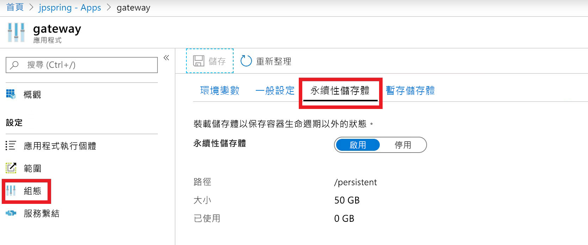

# <a name="use-persistent-storage-in-azure-spring-cloud"></a>在 Azure Spring Cloud 中使用持續性儲存體

Azure Spring Cloud 為應用程式提供了兩種類型的存儲：持久存儲和臨時存儲。

預設情況下，Azure 春雲為每個應用程式實例提供臨時存儲。 臨時存儲限制為每個實例 5 GB，預設裝載路徑 /tmp。

> [!WARNING]
> 如果重新開機應用程式實例，關聯的臨時存儲將被永久刪除。

持久存儲是由 Azure 管理並為每個應用程式分配的檔共用容器。 存儲在持久存儲中的資料由應用程式的所有實例共用。 Azure Spring Cloud 實例最多可以有 10 個啟用持久存儲的應用程式。 每個應用程式都分配 50 GB 的持久存儲。 持久存儲的預設裝載路徑為 /持久。

> [!WARNING]
> 如果禁用應用程式的持久存儲，則所有這些存儲都已處理，並且所有存儲的資料都丟失。

## <a name="use-the-azure-portal-to-enable-persistent-storage"></a>使用 Azure 門戶啟用持久存儲

1. 從 Azure 門戶的**主頁**中，選擇 **"所有資源**"。

    >

1. 選擇需要持久存儲的 Azure 春雲資源。 在此示例中，所選應用程式稱為**向上彈簧**。

    > 

1. 在 **"設置"** 標題下，選擇 **"應用**"。

1. Azure Spring 雲服務將顯示在表中。  選擇要向其添加持久存儲的服務。 在此示例中，選擇了**閘道**服務。

    > 

1. 從服務的配置頁面中，選擇 **"配置"**

1. 選擇 **"持久存儲**"選項卡並選擇 **"啟用**"。

    > 

啟用持久存儲後，其大小和路徑將顯示在配置頁上。

## <a name="use-the-azure-cli-to-modify-persistent-storage"></a>使用 Azure CLI 修改持久存儲

如有必要，請為 Azure CLI 安裝春雲擴展：

```azurecli
az extension add --name spring-cloud
```
其他操作：

* 要創建啟用持久存儲的應用，請：

    ```azurecli
    az spring-cloud app create -n <app> -g <resource-group> -s <service-name> --enable-persistent-storage true
    ```

* 要為現有應用啟用持久存儲，可以：

    ```azurecli
    az spring-cloud app update -n <app> -g <resource-group> -s <service-name> --enable-persistent-storage true
    ```

* 要禁用現有應用中的持久存儲，請進行：

    ```azurecli
    az spring-cloud app update -n <app> -g <resource-group> -s <service-name> --enable-persistent-storage false
    ```

    > [!WARNING]
    > 如果禁用應用程式的持久存儲，則所有這些存儲都已處理，並且所有存儲的資料將永久丟失。

## <a name="next-steps"></a>後續步驟

* 瞭解[應用程式和服務配額](spring-cloud-quotas.md)。
* 瞭解如何[手動擴展應用程式](spring-cloud-tutorial-scale-manual.md)。
