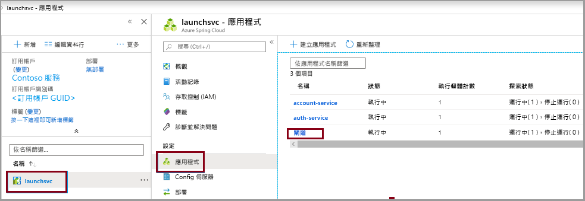

# <a name="quickstart-launch-a-java-spring-application-using-the-azure-cli"></a>快速入門：使用 Azure CLI 來啟動 Java Spring 應用程式

Azure Spring Cloud 可讓您輕鬆地在 Azure 上執行以 Spring Boot 為基礎的微服務應用程式。

本快速入門會示範如何將現有的 Java Spring Cloud 應用程式部署到 Azure。 當您完成時，您可以繼續透過 Azure CLI 來管理該應用程式，或是切換成使用 Azure 入口網站。

透過遵循本快速入門，您將能了解如何：

> [!div class="checklist"]
> * 佈建服務執行個體
> * 設定執行個體的設定伺服器
> * 於本機建置微服務應用程式
> * 部署每個微服務
> * 為您的應用程式指派公用端點

## <a name="prerequisites"></a>Prerequisites

>[!Note]
> Azure Spring Cloud 目前提供公開預覽版。 公開預覽版供應項目可讓客戶在其正式發行前，先試驗新功能。  公開預覽功能和服務不適用於生產環境。  如需有關預覽期間支援的詳細資訊，請參閱我們的[常見問題集](https://azure.microsoft.com/support/faq/)或提出[支援要求](https://docs.microsoft.com/azure/azure-portal/supportability/how-to-create-azure-support-request)以深入了解。

>[!TIP]
> Azure Cloud Shell 是免費的互動式 Shell，可讓您用來執行本文中的步驟。  它已預先安裝常用的 Azure 工具，包括 Git、JDK、Maven 和 Azure CLI 的最新版本。 如果您已登入 Azure 訂用帳戶，請從 shell.azure.com 啟動您的 [Azure Cloud Shell](https://shell.azure.com) \(英文\)。  您可以[閱讀我們的文件](../cloud-shell/overview.md)，以深入了解 Azure Cloud Shell

若要完成本快速入門：

1. [安裝 Git](https://git-scm.com/)
2. [安裝 JDK 8](https://docs.microsoft.com/java/azure/jdk/?view=azure-java-stable)
3. [安裝 Maven 3.0 或更新版本](https://maven.apache.org/download.cgi) \(英文\)
4. [安裝 Azure CLI 2.0.67 版或更新版本](https://docs.microsoft.com/cli/azure/install-azure-cli?view=azure-cli-latest)
5. [註冊 Azure 訂用帳戶](https://azure.microsoft.com/free/)

## <a name="install-the-azure-cli-extension"></a>安裝 Azure CLI 擴充功能

使用下列命令安裝適用於 Azure CLI 的 Azure Spring Cloud 擴充功能

```azurecli
az extension add --name spring-cloud
```

## <a name="provision-a-service-instance-on-the-azure-cli"></a>在 Azure CLI 上佈建服務執行個體

1. 登入 Azure CLI 並選擇您的有效定用帳戶。 請務必選擇已加入 Azure Spring Cloud 白清單的有效訂用帳戶

    ```azurecli
        az login
        az account list -o table
        az account set --subscription <Name or ID of subscription from the last step>
    ```

2. 為您的 Azure Spring Cloud 服務準備名稱。  名稱長度必須為 4 到 32 個字元，且只能包含小寫字母、數字及連字號。  服務名稱的第一個字元必須是字母，且最後一個字元必須是字母或數字。

3. 建立資源群組來包含您的 Azure Spring Cloud 服務。

    ```azurecli
        az group create --location eastus --name <resource group name>
    ```

    深入了解 [Azure 資源群組](../azure-resource-manager/management/overview.md)。

4. 開啟 Azure CLI 視窗並執行下列命令來佈建 Azure Spring Cloud 的執行個體。

    ```azurecli
        az spring-cloud create -n <service instance name> -g <resource group name>
    ```

    服務執行個體大約需要五分鐘的時間來完成部署。

5. 使用下列命令來設定預設資源群組名稱及叢集名稱：

    ```azurecli
        az configure --defaults group=<resource group name>
        az configure --defaults spring-cloud=<service instance name>
    ```

> [!div class="nextstepaction"]
> [我遇到問題](https://www.research.net/r/javae2e?tutorial=asc-cli-quickstart&step=provision)

## <a name="setup-your-configuration-server"></a>設定您的設定伺服器

搭配我們專案之 Git 存放庫的位置來更新您的設定伺服器：

```azurecli
az spring-cloud config-server git set -n <service instance name> --uri https://github.com/Azure-Samples/piggymetrics-config
```

> [!div class="nextstepaction"]
> [我遇到問題](https://www.research.net/r/javae2e?tutorial=asc-cli-quickstart&step=config-server)

## <a name="build-the-microservices-applications-locally"></a>於本機建置微服務應用程式

1. 建立新資料夾並將範例應用程式存放庫複製到您的 Azure 雲端帳戶。  

    ```console
        mkdir source-code
        git clone https://github.com/Azure-Samples/piggymetrics
    ```

2. 變更目錄並建置專案。

    ```console
        cd piggymetrics
        mvn clean package -D skipTests
    ```

編譯專案大約需要 5 分鐘的時間。  完成後，在每個服務的相對應資料夾中應該會有適用於該服務的個別 JAR 檔案。

## <a name="create-the-microservices"></a>建立微服務

使用在上一個步驟中所建置的 JAR 檔案來建立 Spring Cloud 微服務。 您將會建立三個微服務：**gateway**、**auth-service** 及 **account-service**。

```azurecli
az spring-cloud app create --name gateway
az spring-cloud app create --name auth-service
az spring-cloud app create --name account-service
```

## <a name="deploy-applications-and-set-environment-variables"></a>部署應用程式並設定環境變數

我們必須將應用程式實際部署到 Azure。 使用下列命令來部署全部三個應用程式：

```azurecli
az spring-cloud app deploy -n gateway --jar-path ./gateway/target/gateway.jar
az spring-cloud app deploy -n account-service --jar-path ./account-service/target/account-service.jar
az spring-cloud app deploy -n auth-service --jar-path ./auth-service/target/auth-service.jar
```

> [!div class="nextstepaction"]
> [我遇到問題](https://www.research.net/r/javae2e?tutorial=asc-cli-quickstart&step=deploy)

## <a name="assign-public-endpoint-to-gateway"></a>將公用端點指派到閘道

我們需要透過網頁伺服器存取應用程式的方法。 我們的閘道應用程式需要公眾對應的端點。

1. 使用下列命令來指派端點：

```azurecli
az spring-cloud app update -n gateway --is-public true
```

2. 查詢**閘道**應用程式來取得其公用 IP，讓您可以確認該應用程式正在執行：

Linux：

```azurecli
az spring-cloud app show --name gateway | grep url
```

Windows：

```azurecli
az spring-cloud app show -s <service name> -g <resource group> -n gateway -o table
```

3. 瀏覽至由上一個命令所提供的 URL，以執行 PiggyMetrics 應用程式。
    

您也可以瀏覽 Azure 入口網站來尋找 URL。 
1. 瀏覽到服務
2. 選取**應用程式**
3. 選取**閘道**

    
    
4. 在 [閘道概觀]  頁面上尋找 URL 

> [!div class="nextstepaction"]
> [我遇到問題](https://www.research.net/r/javae2e?tutorial=asc-cli-quickstart&step=public-endpoint)

## <a name="next-steps"></a>後續步驟

在本快速入門中，您已經從 Azure CLI 部署 Spring Cloud 應用程式。  若要深入了解 Azure Spring Cloud，請繼續進行準備應用程式以進行部署的教學課程。

> [!div class="nextstepaction"]
> [準備您的 Azure Spring Cloud 應用程式以進行部署](spring-cloud-tutorial-prepare-app-deployment.md)

GitHub 上可用的其他範例：[Azure Spring Cloud 範例](https://github.com/Azure-Samples/Azure-Spring-Cloud-Samples/tree/master/service-binding-cosmosdb-sql)。
