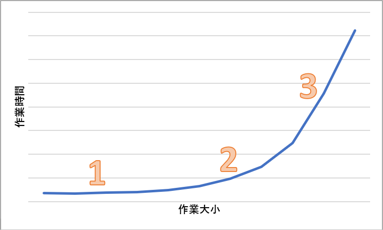

# Blob 儲存體中的延遲

延遲 (有時候會被視為回應時間) 是應用程式必須等候要求完成的時間量。 延遲可能會直接影響應用程式的效能。 低延遲通常對於人機互動 \(human-in-the-loop\) 情節很重要，例如進行信用卡交易或載入網頁。 需要以較高的速率處理傳入事件的系統 (例如遙測記錄或 IoT 事件) 也需要低延遲。 此文章說明如何了解和測量區塊 Blob 上的作業延遲，以及如何針對低延遲設計您的應用程式。

Azure 儲存體提供兩個不同的區塊 Blob 效能選項：進階和標準。 透過高效能 SSD 磁碟，進階區塊 Blob 可提供比標準區塊 Blob 明顯較低且更一致的延遲。 如需詳細資訊，請參閱 **Azure Blob 儲存體：經常性存取、非經常性存取和封存存取層**中的[進階效能區塊 Blob 儲存體](storage-blob-storage-tiers.md)。

## 關於 Azure 儲存體延遲

Azure 儲存體延遲與 Azure 儲存體作業的要求率有關。 要求率也稱為每秒輸入/輸出作業 (IOPS)。

若要計算要求率，請先決定每個要求完成所需的時間長度，然後計算每秒可處理的要求數。 例如，假設要求需要 50 毫秒 (ms) 才能完成。 使用一個執行緒搭配一個未完成讀取或寫入作業的應用程式，應該達到 20 IOPS (每個要求 1 秒或 1000 毫秒/50 毫秒)。 理論上來說，如果執行緒計數加倍為兩倍，那麼應用程式應該能夠達到 40 IOPS。 如果每個執行緒的未處理非同步讀取或寫入作業加倍為兩倍，則應用程式應該能夠達到 80 IOPS。

實際上，由於用戶端從工作排程、內容切換等方面的額外負荷，因此不一定會以線性方式調整要求率。 在服務端上，由於 Azure 儲存體系統上的壓力、使用的儲存媒體中的差異、其他工作負載的干擾、維護工作和其他因素，所以延遲可能會有所變化。 最後，用戶端與伺服器之間的網路連線可能會因壅塞、重新路由或其他中斷而影響 Azure 儲存體延遲。

Azure 儲存體頻寬 (也稱為輸送量) 與要求率相關，而且可以藉由將要求率 (IOPS) 乘以要求大小來計算。 例如，假設每秒 160 個要求，每 256 KB 的資料會產生每秒 40,960 KB 或每秒 40 MB 的輸送量。

## 區塊 Blob 的延遲計量

Azure 儲存體提供兩個區塊 Blob 的延遲計量。 您可以在 Azure 入口網站中檢視這些計量：

- **端對端 (E2E) 延遲**會測量從 Azure 儲存體收到要求的第一個封包，到 Azure 儲存體收到回應最後一個封包的用戶端通知之間的時間間隔。

- **伺服器延遲**會測量從 Azure 儲存體收到要求的最後一個封包，到 Azure 儲存體傳回回應第一個封包之間的時間間隔。

下圖顯示呼叫  **作業的範例工作負載的**平均成功 E2E 延遲**和**平均成功伺服器延遲`Get Blob`：

在正常情況下，端對端延遲和伺服器延遲之間會有極小的差距，這就是影像針對範例工作負載所顯示的內容。

如果您檢閱端對端和伺服器延遲計量，並發現端對端延遲明顯高於伺服器延遲，則請調查並解決額外延遲的來源。

如果您的端對端延遲和伺服器延遲很類似，但您需要較低的延遲，請考慮移轉至進階區塊 Blob 儲存體。

## 影響延遲的因素

影響延遲的主要因素是作業大小。 由於透過網路傳送並由 Azure 儲存體處理的資料量，因此需要更長的時間才能完成較大的作業。

下圖顯示各種大小之作業的總時間。 針對少量的資料，延遲間隔主要是用來處理要求，而不是傳送資料。 延遲間隔只會隨著作業大小增加而稍微增加 (在下圖中標示為 1)。 當作業大小進一步增加時，會花費更多時間來傳輸資料，以便在要求處理和資料傳輸之間分割總延遲間隔 (在下圖中標示為 2)。 使用較大的作業大小時，延遲間隔幾乎只是用來傳送資料，要求處理在很大程度上是不重要的 (在下圖中標記為 3)。

並行和執行緒之類的用戶端設定因素也會影響延遲。 整體輸送量取決於在任何指定時間點進行的儲存要求數量，以及應用程式處理執行緒的方式。 用戶端資源 (包括 CPU、記憶體、本機儲存體和網路介面等) 也會影響延遲。

處理 Azure 儲存體要求需要用戶端 CPU 和記憶體資源。 如果用戶端因為動能不足的虛擬機器或系統中的一些失控進程而面臨壓力，則可以使用較少的資源來處理 Azure 儲存體要求。 任何用戶端資源爭用或缺少都會導致端對端延遲增加，而不會增加伺服器延遲，進而增加兩個計量之間的差距。

同樣重要的是，用戶端和 Azure 儲存體之間的網路介面和網路管道。 單單物理距離就是一個重要因素，例如，如果用戶端 VM 位於不同的 Azure 區域或內部部署中。 其他因素 (例如網路躍點、ISP 路由和網際網路狀態) 可能會影響整體儲存體延遲。

若要評估延遲，請先為您的情節建立基準計量。 基準計量會根據您的工作負載設定檔、應用程式組態設定、用戶端資源、網路管道和其他因素，在應用程式環境的內容中提供預期的端對端延遲和伺服器延遲。 當您有基準計量時，可以更輕鬆地識別異常和正常狀況。 基準計量也可讓您觀察已變更參數的效果，例如應用程式設定或 VM 大小。

## 後續步驟

- [Blob 儲存體的延展性和效能目標](scalability-targets.md)
- [Blob 儲存體的效能和延展性檢查清單](storage-performance-checklist.md)
