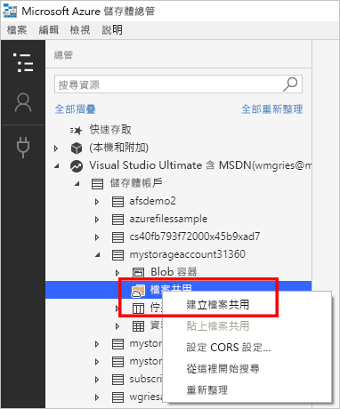
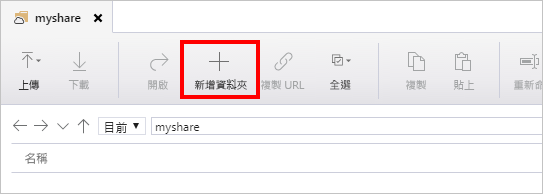

# 快速入門：使用 Azure 儲存體總管來建立及管理 Azure 檔案共用的快速入門
本指南會逐步說明透過 [Azure 儲存體總管](storage-files-introduction.md)來使用 Azure 檔案共用的基本概念。 Azure 檔案共用與其他檔案共用類似，但它儲存在雲端中，並且由 Azure 平台支援。 Azure 檔案共用支援業界標準 SMB 通訊協定，並可在多個機器、應用程式及執行個體上啟用檔案共用。 

Azure 儲存體總管是適用於 Windows、macOS 和 Linux 的熱門用戶端工具。 您可以使用儲存體總管來管理 Azure 檔案共用和其他儲存體資源。

如果您沒有 Azure 訂用帳戶，請在開始前建立[免費帳戶](https://azure.microsoft.com/free/?WT.mc_id=A261C142F)。

## Prerequisites
本快速入門需要安裝儲存體總管。 若要下載並安裝儲存體總管，請前往 [Azure 儲存體總管](https://azure.microsoft.com/features/storage-explorer/)。

## 建立儲存體帳戶
您無法使用儲存體總管來建立新資源。 為執行此範例，我們在 [Azure 入口網站](https://portal.azure.com/)中建立儲存體帳戶。 

[!INCLUDE [storage-files-create-storage-account-portal](../../../includes/storage-files-create-storage-account-portal.md)]

## 將儲存體總管連線至 Azure 資源
您第一次啟動儲存體總管時，[Microsoft Azure 儲存體總管 - 連線]  視窗會隨即出現。 儲存體總管提供數種方式來連線至儲存體帳戶： 

- **使用您的 Azure 帳戶登入**：您可以使用組織或 Microsoft 帳戶的使用者認證登入。 
- **使用連接字串或 SAS 權杖連線至特定的儲存體帳戶**：連接字串是特殊字串，其中包含儲存體帳戶名稱和儲存體帳戶金鑰/SAS 權杖。 儲存體總管會透過權杖直接存取儲存體帳戶 (並非只是看到 Azure 帳戶中的所有儲存體帳戶)。 若要深入了解連接字串，請參閱[設定 Azure 儲存體連接字串](../common/storage-configure-connection-string.md?toc=%2fazure%2fstorage%2ffiles%2ftoc.json)。
- **使用儲存體帳戶名稱和金鑰來連線至特定儲存體帳戶**：使用儲存體帳戶的儲存體名稱和儲存體帳戶金鑰來連線到 Azure 儲存體。

為使用本快速入門，請使用您的 Azure 帳戶登入。 選取 [新增 Azure 帳戶]  ，然後選取 [登入]  。 依照提示來登入您的 Azure 帳戶。

![[Microsoft Azure 儲存體總管 - 連線] 視窗螢幕擷取畫面](./media/storage-how-to-use-files-storage-explorer/connect-to-azure-storage-1.png)

### 建立檔案共用
若要在 `storageacct<random number>` 儲存體帳戶內建立第一個 Azure 檔案共用：

1. 展開您所建立的儲存體帳戶。
2. 以滑鼠右鍵按一下 [檔案共用]  ，然後選取 [建立檔案共用]  。  
    

3. 針對檔案共用，輸入 myshare  ，然後按 Enter 鍵。

共用名稱只能包含小寫字母、數字和單一連字號 (但開頭不可以是連字號)。 如需有關為檔案共用與檔案命名的完整詳細資料，請參閱[命名和參考共用、目錄、檔案及中繼資料](https://docs.microsoft.com/rest/api/storageservices/Naming-and-Referencing-Shares--Directories--Files--and-Metadata)。

建立檔案共用後，檔案共用索引標籤會在右側窗格中開啟。 

## 使用您的 Azure 檔案共用
您現在已建立 Azure 檔案共用，並且可使用 SMB 將檔案共用掛接在 [Windows](storage-how-to-use-files-windows.md)、[Linux](storage-how-to-use-files-linux.md) 或 [macOS](storage-how-to-use-files-mac.md) 上。 或者，您也可以使用 Azure 儲存體總管來處理 Azure 檔案共用。 不使用 SMB 來掛接檔案共用而改用 Azure 儲存體總管的優點是，以 Azure 儲存體總管提出的所有要求都會用檔案 REST API 來執行。 您可以使用檔案 REST API 在沒有 SMB 存取權的用戶端上建立、修改及刪除檔案與目錄。

### 建立目錄
新增目錄可提供一個階層式結構，以便 Azure 檔案共用。 您可以在您的目錄中建立多個層級。 不過，您必須先確定父目錄存在，才能建立子目錄。 例如，對於 myDirectory/mySubDirectory 路徑，您必須先建立 myDirectory  目錄。 然後，您才能建立 mySubDirectory  。 

1. 在檔案共用索引標籤上，選取上方功能表的 [新增資料夾]  按鈕。 [建立新目錄]  窗格將會開啟。
    

2. 針對目錄名稱，輸入 myDirectory  ，然後選取 [確定]  。 

myDirectory  目錄會列在 myshare  檔案共用的索引標籤上。

### 上傳檔案 
您可以將檔案從本機電腦上傳到您檔案共用中的新目錄。 您可以上傳整個資料夾或上傳單一檔案。

1. 在頂端功能表上，選取 [上傳]  。 這可讓您選擇上傳資料夾或檔案。
2. 選取 [上傳檔案]  ，然後從本機電腦選取要上傳的檔案。
3. 在 [上傳至目錄]  中輸入 myDirectory  ，然後選取 [上傳]  。 

當您完成時，檔案會出現在 [myDirectory]  窗格中的清單上。

### 下載檔案
若要從檔案共用下載檔案的複本，請以滑鼠右鍵按一下檔案，然後選取 [下載]  。 選擇您在本機電腦上要放置檔案的位置，然後選取 [儲存]  。

視窗底部的 [活動]  窗格中會顯示下載進度。

## 清除資源
您無法使用儲存體總管來移除新資源。 若要清除此快速入門的內容，您可以使用 [Azure 入口網站](https://portal.azure.com/)。 

[!INCLUDE [storage-files-clean-up-portal](../../../includes/storage-files-clean-up-portal.md)]

## 後續步驟

> [!div class="nextstepaction"]
> [什麼是 Azure 檔案服務？](storage-files-introduction.md)
