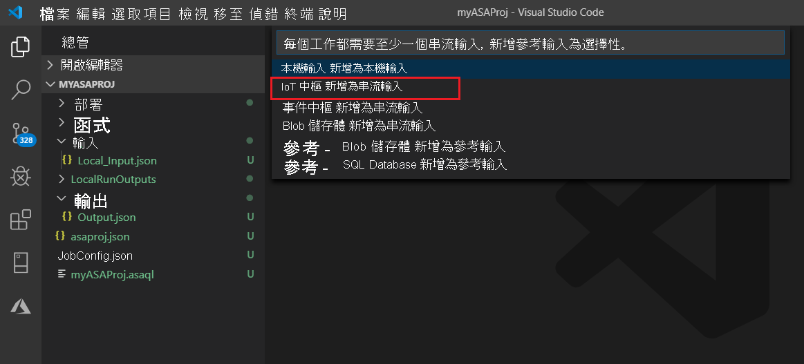

# 使用 Visual Studio Code 在本機針對即時資料流輸入測試串流分析查詢

您可以使用 Azure 串流分析工具進行 Visual Studio Code，以針對即時串流輸入在本機測試串流分析作業。 輸入可能來自 Azure 事件中樞或 Azure IoT 中樞之類的來源。 輸出結果會以 JSON 檔案的形式傳送至您專案中的資料夾，稱為 **LocalRunOutputs**。

## 必要條件

* 安裝 [.NET Core SDK](https://dotnet.microsoft.com/download) ，然後重新開機 Visual Studio Code。

* 您可以使用 [本快速入門](quick-create-visual-studio-code.md) 來瞭解如何使用 Visual Studio Code 來建立串流分析作業。

## 定義即時資料流輸入

1. 以滑鼠右鍵按一下您串流分析專案中的**輸入**資料夾。 然後，從操作功能表中選取 **[ASA：新增輸入]** 。

   ![從 [輸入] 資料夾新增輸入](./media/quick-create-visual-studio-code/add-input-from-inputs-folder.png)

   您也可以選取 **Ctrl + Shift + P** 來開啟命令選擇區，並輸入 **ASA： Add Input**。

   

2. 從下拉式清單中選擇輸入來源類型。

   

3. 如果您已從命令選擇區新增輸入，請選擇將使用輸入的串流分析查詢指令碼。 其中應該會自動填入 **myASAproj.asaql** 的檔案路徑。

   

4. 從下拉式功能表中選擇 [從您的 Azure 訂用帳戶選取]  。

    

5. 設定新產生的 JSON 檔案。 您可以利用 CodeLens 功能來輸入字串、從下拉式清單中選取，或直接在檔案中變更文字。 下列螢幕擷取畫面顯示**從您的訂用帳戶選取**作為範例。

   

## 預覽輸入

若要確定輸入資料即將存在，請從頂端行選取 [預覽即時輸入設定檔中的 **資料** ]。 某些輸入資料來自 IoT 中樞，而且會顯示在 [預覽] 視窗中。 預覽可能需要幾秒鐘的時間才會出現。

 

## 在本機執行查詢

返回您的查詢編輯器，然後選取 [在 **本機執行**]。 然後，從下拉式清單中選取 [ **使用即時輸入** ]。

![在查詢編輯器中選取 [在本機執行]](./media/vscode-local-run/run-locally.png)

![選取 [使用即時輸入]](./media/vscode-local-run-live-input/run-locally-use-live-input.png)

結果會顯示在右邊的視窗中，並每3秒重新整理一次。 您可以選取 [ **執行** ] 以再次進行測試。 您也可以選取 [ **在資料夾中開啟** ] 以查看檔案總管中的結果檔案，然後使用 Visual Studio Code 或 Excel 之類的工具來開啟它們。 請注意，結果檔案僅適用于 JSON 格式。

作業開始建立輸出的預設時間是設定為 [ **現在**]。 您可以在 [結果] 視窗中選取 [ **輸出開始時間** ] 按鈕來自訂時間。

## 後續步驟

* [使用 Visual Studio Code (預覽版探索 Azure 串流分析作業) ](visual-studio-code-explore-jobs.md)

* [使用 npm 套件來設定 CI/CD 管線](setup-cicd-vs-code.md)
