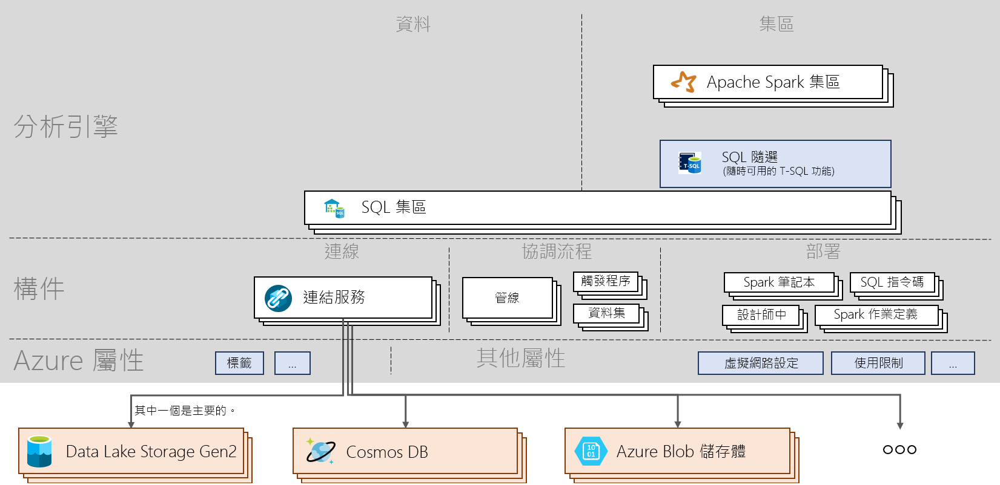

# Azure Synapse Analytics 功能提要

[!INCLUDE [preview](includes/note-preview.md)]

Azure Synapse Analytics 功能提要會引導您了解服務及重要命令的基本概念。 本文適用於新的學習人員，以及想要了解 Azure Synapse 重要主題的使用者。

## 架構

> [!div class="mx-imgBorder"]
>

## 詞彙
| 詞彙                         | 定義      |
|:---                                 |:---                 |
| **Synapse 工作區** | 在 Azure 中進行雲端式企業分析的安全共同作業界限。 工作區會部署在特定區域中，並且具有相關聯的 ADLS Gen2 帳戶和檔案系統 (用於儲存暫存資料)。 工作區位在資源群組底下。 |
| **Synapse SQL**   | 使用集區或隨選功能執行分析。  |
| **SQL 集區**   | 您可以在工作區中部署 0 對 N 的 SQL 佈建資源及其對應資料庫。 每個 SQL 集區都有相關聯的資料庫。 SQL 集區可以透過手動或自動方式進行調整、暫停及繼續。 SQL 集區可以從 100 DWU 擴充到 30,000 DWU。       |
| **SQL 隨選**   | 針對大規模資料所建立的分散式資料處理系統，可讓您對資料湖中的資料執行 T-SQL 查詢。 這是無伺服器服務，因此您不需要管理基礎結構。       |
|**適用於 Synapse 的 Apache Spark** | Spark 集區中使用的 Spark 執行階段。 目前支援的版本為 Spark 2.4，其搭配 Python 3.6.1、Scala 2.11.12、適用於 Apache Spark 0.5 的 .NET 支援和 Delta Lake 0.3 。  | 
| **Apache Spark 集區**  | 您可以在工作區中部署 0 對 N 的 Spark 佈建資源及其對應資料庫。 Spark 集區可以自動暫停、繼續及調整。  |
| **Spark 應用程式**  |   其中包含驅動程式程序和一組執行程式程序。 Spark 應用程式會在 Spark 集區上執行。            |
| **Spark 工作階段**  |   Spark 應用程式的統一進入點。 其提供一種方式來與 Spark 的各種功能互動，並使用較少的結構。 若要執行筆記本，您必須建立工作階段。 工作階段可以設定為在特定數量及特定大小的執行程式上執行。 筆記本工作階段的預設組態是在 2 個中型執行程式上執行。 |
| **SQL 要求**  |   查詢之類的作業會透過 SQL 集區或 SQL 隨選執行。 |
|**資料整合**| 其功能可用來在各種來源之間內嵌資料，以及協調在工作區中或工作區外部執行的活動。| 
|**成品**| 為使用者封裝管理資料來源、進行開發、協調和視覺化所需物件的概念。|
|**Notebook**| 互動式和回應式資料科學和工程介面，支援 Scala、PySpark、C# 和 SparkSQL。 |
|**Spark 作業定義**|用來提交 Spark 作業的介面，其中具有包含程式碼和其相依性的組件 jar。|
|**資料流程**|  提供完全視覺化的體驗，您不需要撰寫任何程式碼來進行巨量資料轉換。 所有最佳化和執行都會以無伺服器的方式處理。 |
|**SQL 指令碼**| 儲存在檔案中的 SQL 命令集。 SQL 指令碼可以包含一或多個 SQL 陳述式。 可以用來透過 SQL 集區或 SQL 隨選執行 SQL 要求。|
|**管線**| 一起執行某個工作的活動邏輯群組。|
|**活動**| 定義要對資料執行的動作，例如複製資料、執行 Notebook 或 SQL 指令碼。|
|**觸發程序**| 執行管線。 可以手動執行或自動執行 (排程、輪轉視窗或以事件為基礎)。|
|**連結服務**| 連接字串，用於定義工作區連線到外部資源所需的連線資訊。|
|**資料集**|  具名的資料檢視，只會指向或參考要在活動中作為輸入和輸出的資料。 其屬於連結服務。|

## 後續步驟

- [建立工作區](quickstart-create-workspace.md)
- [使用 Synapse Studio](quickstart-synapse-studio.md)
- [建立 SQL 集區](quickstart-create-sql-pool-portal.md)
- [建立 Apache Spark 集區](quickstart-create-apache-spark-pool-portal.md)
- [使用 SQL 隨選](quickstart-sql-on-demand.md)

