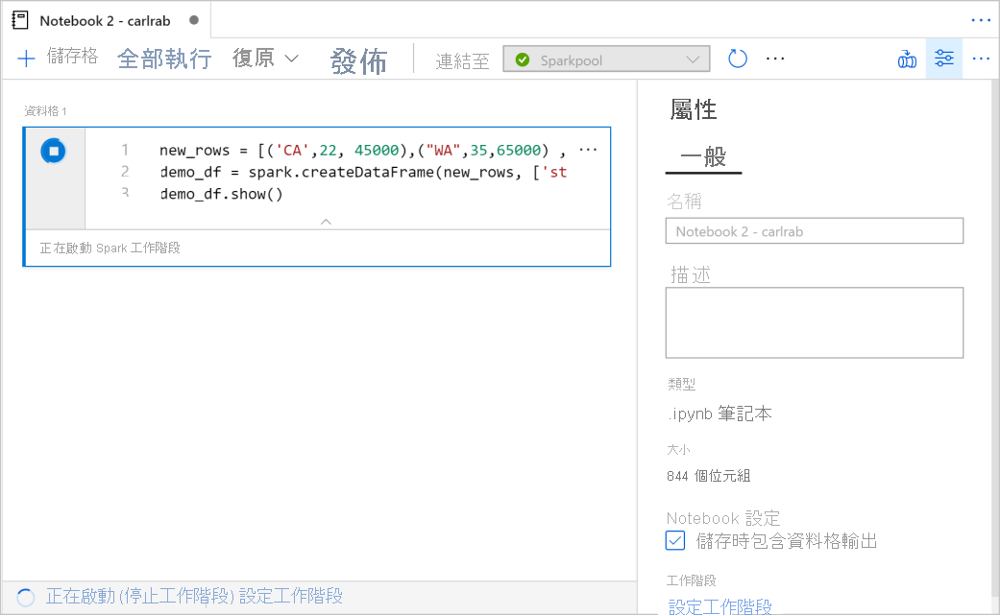
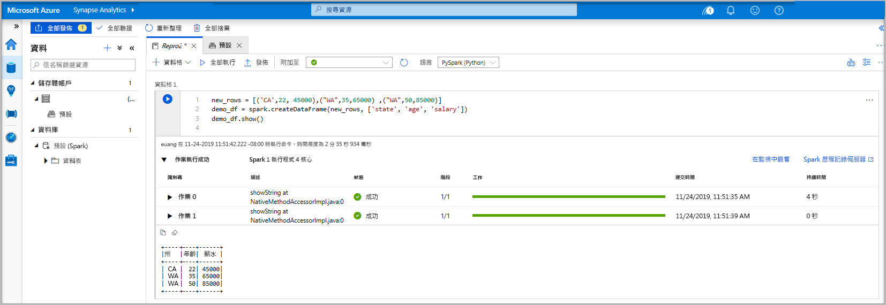
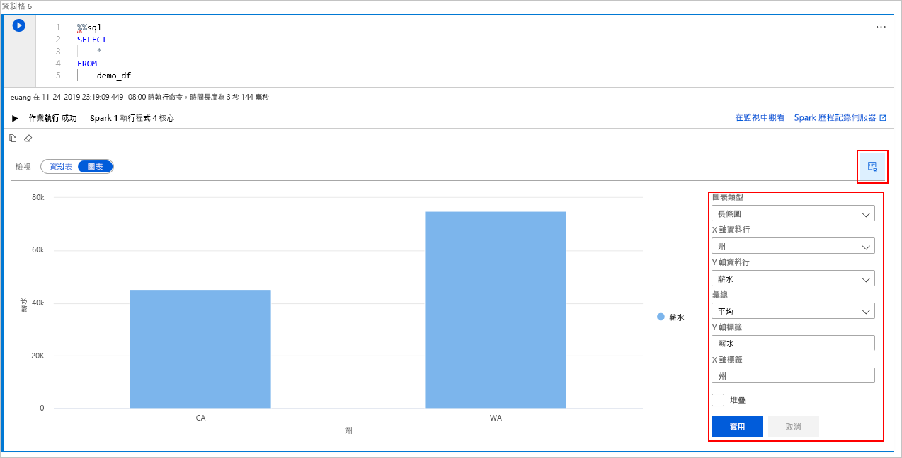

# <a name="quickstart-create-an-apache-spark-pool-preview-in-azure-synapse-analytics-using-web-tools"></a>快速入門：使用 Web 工具在 Azure Synapse Analytics 中建立 Apache Spark 集區 (預覽)

在本快速入門中，您將了解如何使用 Web 工具在 Azure Synapse 中建立 Apache Spark 集區 (預覽)。 接著，您將了解如何連線到 Apache Spark 集區，並對檔案和資料表執行 Spark SQL 查詢。 Apache Spark 能夠運用記憶體內部處理，使得資料分析及叢集運算更為快速。 若要深入了解 Azure Synapse 中的 Spark，請參閱[概觀：Azure Synapse 上的 Apache Spark 集區](./spark/apache-spark-overview.md)。

> [!IMPORTANT]
> 無論使用與否，Spark 執行個體都是按分鐘計費。 當您使用完 Spark 執行個體之後，請務必將其關閉，或設定短暫的逾時時間。 如需詳細資訊，請參閱本文的**清除資源**一節。

如果您沒有 Azure 訂用帳戶，請[在開始前建立免費帳戶](https://azure.microsoft.com/free/)。

## <a name="prerequisites"></a>Prerequisites

- Azure 訂用帳戶 - [建立免費帳戶](https://azure.microsoft.com/free/)
- [Synapse Analytics 工作區](quickstart-create-workspace.md)
- [Apache Spark 集區](quickstart-create-apache-spark-pool-studio.md)

## <a name="sign-in-to-the-azure-portal"></a>登入 Azure 入口網站

登入 [Azure 入口網站](https://portal.azure.com/)。

如果您沒有 Azure 訂用帳戶，請在開始之前先[建立免費帳戶](https://azure.microsoft.com/free/)。

## <a name="create-a-notebook"></a>建立 Notebook

Notebook 是支援各種程式設計語言的互動式環境。 Notebook 可讓您與資料互動、將程式碼與 Markdown 文字相結合，並執行簡單的視覺效果。

1. 在 Azure 入口網站檢視中，針對您想要使用的 Azure Synapse 工作區選取 [啟動 Synapse Studio]。
2. Synapse Studio 啟動之後，請選取 [開發]。 然後，將滑鼠停留在 **Notebooks** 項目上。 選取省略符號 ( **...** )。
3. 從該處選取 [新增 Notebook]。 新的 Notebook 會隨即建立，並且使用自動產生的名稱來開啟。
  

4. 在 [屬性] 視窗中，提供 Notebook 的名稱。
5. 在工具列上，按一下 [發佈]。
6. 如果您的工作區中只有一個 Apache Spark 集區，則預設會選取該集區。 如果未選取任何項目，請使用下拉式選單來選取正確的 Apache Spark 集區。
7. 按一下 [新增程式碼]。 預設語言為 `Pyspark`。 您將混合使用 Pyspark 和 Spark SQL，因此預設選項是可行的。
8. 接下來，您要建立簡單的 Spark DataFrame 來操作。 在此案例中，您可以透過程式碼來建立。 其中有三個資料列和三個資料行：

   ```python
   new_rows = [('CA',22, 45000),("WA",35,65000) ,("WA",50,85000)]
   demo_df = spark.createDataFrame(new_rows, ['state', 'age', 'salary'])
   demo_df.show()
   ```

9. 現在，使用下列其中一種方法來執行資料格：

   - 按下 **SHIFT + ENTER**。
   - 選取儲存格左邊的藍色播放圖示。
   - 選取工具列上的 [全部執行] 按鈕。

   

10. 如果 Apache Spark 集區執行個體尚未執行，則會自動啟動。 您可以在執行中的資料格底下，以及 Notebook 底部的狀態面板上，查看 Apache Spark 集區執行個體的狀態。 視集區的大小而定，啟動應該需要 2-5 分鐘的時間。 當程式碼完成執行之後，資料格下方的資訊會顯示其執行所花的時間及執行狀態。 在輸出儲存格中，您會看到輸出。

    

11. 資料現在存在於 DataFrame 中，您可以透過許多不同方式從中使用資料。 在本快速入門的其餘部分，您將需要不同的格式的資料。
12. 在另一個儲存格中輸入下列程式碼並加以執行，這會建立一個 Spark 資料表、一個 CSV 和一個 Parquet 檔案，其中都會包含資料的複本：

    ```python
     demo_df.createOrReplaceTempView('demo_df')
     demo_df.write.csv('demo_df', mode='overwrite')
     demo_df.write.parquet('abfss://<<TheNameOfAStorageAccountFileSystem>>@<<TheNameOfAStorageAccount>>.dfs.core.windows.net/demodata/demo_df', mode='overwrite')
    ```

    如果您使用儲存體總管，則可以看到上述兩種不同檔案寫入方式所造成的影響。 若未指定檔案系統，則會使用預設值，在此案例中為 `default>user>trusted-service-user>demo_df`。 資料會儲存到指定檔案系統的位置。

    請注意，在 "csv" 和 "parquet" 格式的寫入作業中，會建立具有許多分割檔案的目錄。

    

    

## <a name="run-spark-sql-statements"></a>執行 Spark SQL 陳述式

結構化查詢語言 (SQL) 是最常見且廣泛使用的語言，可用於查詢及定義資料。 Spark SQL 可作為 Apache Spark 的擴充功能，可讓您使用熟悉的 SQL 語法來處理結構化資料。

1. 將以下程式碼貼入空白儲存格，然後執行程式碼。 此命令會列出集區上的資料表。

   ```sql
   %%sql
   SHOW TABLES
   ```

   當您使用 Notebook 搭配 Azure Synapse Apache Spark 集區時，您會取得預設的 `sqlContext`，您可以使用此項目來透過 Spark SQL 執行查詢。 `%%sql` 會告訴 Notebook 使用預設的 `sqlContext` 來執行查詢。 根據預設，查詢會從隨附於所有 Azure Synapse Apache Spark 集區的系統資料表中，擷取前 10 個資料列。

2. 執行另一個查詢，以查看 `demo_df` 中的資料。

    ```sql
    %%sql
    SELECT * FROM demo_df
    ```

    程式碼會產生兩個輸出儲存格，其中一個包含資料，另一個則會顯示作業檢視。

    根據預設，結果檢視會顯示方格。 但方格底下會有一個檢視切換器，可讓您在方格和圖表檢視之間切換。

    

3. 在 [檢視] 切換器中，選取 [圖表]。
4. 選取最右側的 [檢視選項] 圖示。
5. 在 [圖表類型] 欄位中，選取 [長條圖]。
6. 在 [X 軸資料行] 欄位中，選取 [州]。
7. 在 [Y 軸資料行] 欄位中，選取 [薪資]。
8. 在 [彙總] 欄位中，選取 [平均]。
9. 選取 [套用]。

   

10. 您不需要切換語言，即可擁有執行 SQL 的相同體驗。 若要這麼做，您可以將上面的 SQL 資料格取代為此 PySpark 資料格，如此一來，輸出體驗就會因為使用  命令而相同：

    ```python
    display(spark.sql('SELECT * FROM demo_df'))
    ```

11. 先前執行的每個資料格都可以選擇移至**記錄伺服器**及**監視**。 按一下連結會帶您前往使用者體驗的不同部分。

## <a name="clean-up-resources"></a>清除資源

Azure Synapse 會將您的資料儲存在 Azure Data Lake Storage 中。 當 Spark 執行個體不在使用中時，您可以安全地讓其關閉。 只要執行Azure Synapse Apache Spark 集區，您就需要為其支付費用，即使不在使用中也一樣。 

由於集區費用是儲存體費用的許多倍，所以關閉非使用中的 Spark 執行個體較符合經濟效益。

為確保 Spark 執行個體已關閉，請結束任何已連線的工作階段 (Notebook)。 當達到 Apache Spark 集區中指定的**閒置時間**時，集區就會關閉。 您也可以從 Notebook 底部的狀態列中選取 [結束工作階段]。

## <a name="next-steps"></a>後續步驟

在本快速入門中，您已了解如何建立 Azure Synapse Apache Spark 集區和執行基本的 Spark SQL 查詢。

- [Azure Synapse Analytics](overview-what-is.md)
- [適用於 Apache Spark 的 .NET 文件](/dotnet/spark?toc=/azure/synapse-analytics/toc.json&bc=/azure/synapse-analytics/breadcrumb/toc.json)
- [Apache Spark 官方文件](https://spark.apache.org/docs/latest/)

>[!NOTE]
> 某些 Apache Spark 官方文件會依賴使用 Spark 主控台，但 Azure Synapse Spark 不提供這項功能。 請改用 [Notebook](quickstart-apache-spark-notebook.md) 或 [IntelliJ](./spark/intellij-tool-synapse.md) 體驗。
