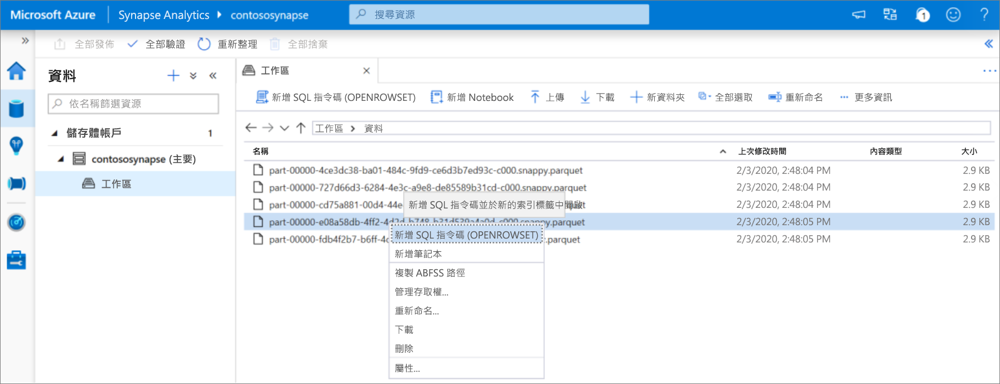
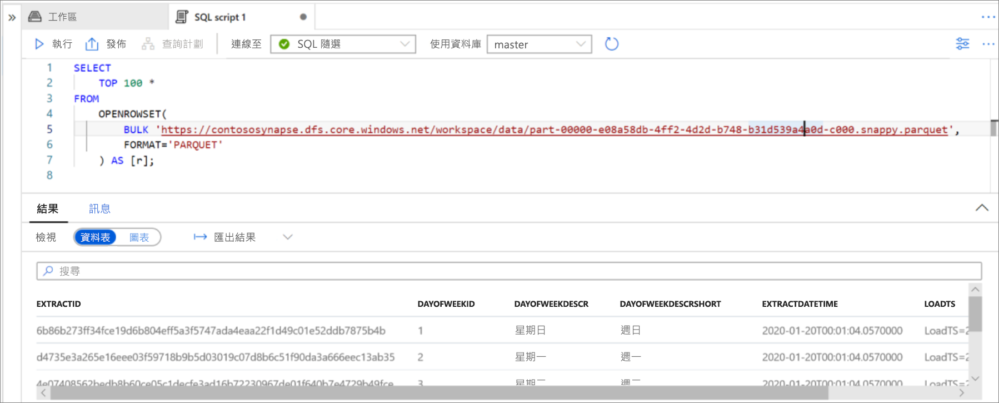

# 快速入門：使用 Synapse Studio (預覽)

在本快速入門中，您將了解如何使用 Synapse Studio 來查詢檔案。

如果您沒有 Azure 訂用帳戶，請在開始前建立[免費帳戶](https://azure.microsoft.com/free/)。

## 登入 Azure 入口網站

登入 [Azure 入口網站](https://portal.azure.com/)。

## 必要條件

[建立 Azure Synapse 工作區和相關聯的儲存體帳戶](quickstart-create-workspace.md)。

## 啟動 Synapse Studio

在 Azure 入口網站的 Azure Synapse 工作區中，按一下 [啟動 Synapse Studio]。

或者，您也可以按一下 [Azure Synapse Analytics](https://web.azuresynapse.net)，並提供適當的租用戶、訂用帳戶和工作區值來啟動 Synapse Studio。

## 瀏覽儲存體帳戶

開啟 Synapse Studio 之後，瀏覽至**資料**，然後展開 [儲存體帳戶] 以在工作區中查看儲存體帳戶。

您可以使用工具列中的連結來建立新的資料夾並上傳檔案，以組織您的檔案。

## 查詢儲存體帳戶上的檔案

> [!IMPORTANT]
> 您必須是基礎儲存體中 `Storage Blob Reader` 角色的成員，才能夠查詢檔案。 了解如何在 Azure 儲存體中[指派**儲存體 Blob 資料讀者**或**儲存體 Blob 資料參與者**的 RBAC 權限](../storage/common/storage-auth-aad-rbac-portal.md?toc=/azure/synapse-analytics/toc.json&bc=/azure/synapse-analytics/breadcrumb/toc.json#assign-an-azure-built-in-role)。

1. 上傳一些 `PARQUET` 檔案。
2. 選取一或多個檔案，然後建立新的 SQL 指令碼或 Spark 筆記本，以查看檔案的內容。 如果想建立筆記本，您必須[在 Synapse 工作區中建立 Apache Spark 集區](quickstart-create-apache-spark-pool-studio.md)。

   

3. 執行產生的查詢或筆記本以查看檔案的內容。

   

4. 您可以變更查詢來篩選和排序結果。 在 [SQL 功能概觀](sql/overview-features.md)中，尋找 SQL 隨選可用的語言功能。

## 後續步驟

- 在 Azure 儲存體中[指派**儲存體 Blob 資料讀者**或**儲存體 Blob 資料參與者**的 RBAC 權限](../storage/common/storage-auth-aad-rbac-portal.md?toc=/azure/synapse-analytics/toc.json&bc=/azure/synapse-analytics/breadcrumb/toc.json#assign-an-azure-built-in-role)，讓 Azure AD 使用者查詢檔案
- [使用 SQL 隨選查詢 Azure 儲存體上的檔案](sql/on-demand-workspace-overview.md)
- [使用 Azure 入口網站建立 Apache Spark 集區](quickstart-create-apache-spark-pool-portal.md)
- [建立儲存在 Azure 儲存體上之檔案的 Power BI 報告](sql/tutorial-connect-power-bi-desktop.md)
