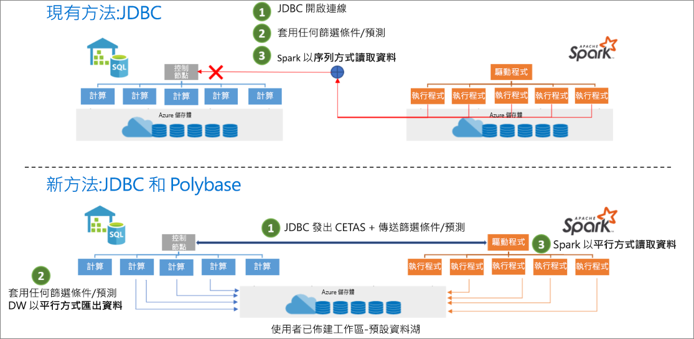

# <a name="introduction"></a>簡介

Azure Synapse Apache Spark 對 Synapse SQL 連接器的設計目的是要讓您在 Azure Synapse 中於 Spark 集區 (預覽) 和 SQL 集區之間有效率地傳輸資料。 Azure Synapse Apache Spark 對 Synapse SQL 連接器僅適用於 SQL 集區，不適用於 SQL 隨選。

## <a name="design"></a>設計

若要在 Spark 集區和 SQL 集區之間傳輸資料，可使用 JDBC 來進行。 不過，在有兩個分散式系統 (例如 Spark 和 SQL 集區) 的情況下，JDBC 往往會成為序列資料傳輸的瓶頸。

Azure Synapse Apache Spark 集區對 Synapse SQL 連接器是適用於 Apache Spark 的資料來源實作。 其會使用 Azure Data Lake Storage Gen2 以及 SQL 集區中的 Polybase，以在 Spark 叢集與 Synapse SQL 執行個體之間有效率地傳輸資料。



## <a name="authentication-in-azure-synapse-analytics"></a>Azure Synapse Analytics 中的驗證

在 Azure Synapse Analytics 中，系統之間的驗證會順暢地進行。 權杖服務會與 Azure Active Directory 連線，以取得要在存取儲存體帳戶或資料倉儲伺服器時使用的安全性權杖。

因此，只要在儲存體帳戶和資料倉儲伺服器上設定好 AAD 驗證，就不需要建立認證或在連接器 API 中指定認證。 如果未設定，則可以指定 SQL 驗證。 請於[使用方式](#usage)一節尋找更多詳細資料。

## <a name="constraints"></a>條件約束

- 此連接器僅適用於 Scala。

## <a name="prerequisites"></a>必要條件

- 在想要於其中往返傳輸資料的資料庫/SQL 集區中，必須是 **db_exporter** 角色的成員。
- 在預設的儲存體帳戶上必須是「儲存體 Blob 資料參與者」角色的成員。

若要建立使用者，請連線到 SQL 集區資料庫，並遵循下列範例：

```sql
--SQL User
CREATE USER Mary FROM LOGIN Mary;

--Azure Active Directory User
CREATE USER [mike@contoso.com] FROM EXTERNAL PROVIDER;
```

若要指派角色：

```sql
--SQL User
EXEC sp_addrolemember 'db_exporter', 'Mary';

--Azure Active Directory User
EXEC sp_addrolemember 'db_exporter',[mike@contoso.com]
```

## <a name="usage"></a>使用量

您不必提供匯入陳述式，筆記本體驗已預先匯入這些陳述式。

### <a name="transfer-data-to-or-from-a-sql-pool-attached-with-the-workspace"></a>在連結有工作區的 SQL 集區之間來回傳輸資料

> [!NOTE]
> **筆記本體驗中不需要匯入**

```scala
 import com.microsoft.spark.sqlanalytics.utils.Constants
 import org.apache.spark.sql.SqlAnalyticsConnector._
```

#### <a name="read-api"></a>讀取 API

```scala
val df = spark.read.sqlanalytics("<DBName>.<Schema>.<TableName>")
```

在 SQL 集區中，上述 API 會同時適用於內部 (受控) 以及外部資料表。

#### <a name="write-api"></a>寫入 API

```scala
df.write.sqlanalytics("<DBName>.<Schema>.<TableName>", <TableType>)
```

寫入 API 會在 SQL 集區中建立資料表，然後叫用 Polybase 來載入資料。  資料表不能存在於 SQL 集區中，否則會傳回錯誤，指出「已經有物件名為...」

TableType 值

- Constants.INTERNAL - SQL 集區中的受控資料表
- Constants.EXTERNAL - SQL 集區中的外部資料表

SQL 集區受控資料表

```scala
df.write.sqlanalytics("<DBName>.<Schema>.<TableName>", Constants.INTERNAL)
```

SQL 集區外部資料表

若要寫入 SQL 集區外部資料表，SQL 集區上必須有 EXTERNAL DATA SOURCE 和 EXTERNAL FILE FORMAT。  如需詳細資訊，請參閱 SQL 集區中的[建立外部資料來源](/sql/t-sql/statements/create-external-data-source-transact-sql?toc=/azure/synapse-analytics/sql-data-warehouse/toc.json&bc=/azure/synapse-analytics/sql-data-warehouse/breadcrumb/toc.json&view=azure-sqldw-latest&preserve-view=true)和[外部檔案格式](/sql/t-sql/statements/create-external-file-format-transact-sql?toc=/azure/synapse-analytics/sql-data-warehouse/toc.json&bc=/azure/synapse-analytics/sql-data-warehouse/breadcrumb/toc.json&view=azure-sqldw-latest&preserve-view=true)。  以下是在 SQL 集區中建立外部資料來源和外部檔案格式的範例。

```sql
--For an external table, you need to pre-create the data source and file format in SQL pool using SQL queries:
CREATE EXTERNAL DATA SOURCE <DataSourceName>
WITH
  ( LOCATION = 'abfss://...' ,
    TYPE = HADOOP
  ) ;

CREATE EXTERNAL FILE FORMAT <FileFormatName>
WITH (  
    FORMAT_TYPE = PARQUET,  
    DATA_COMPRESSION = 'org.apache.hadoop.io.compress.SnappyCodec'  
);
```

對儲存體帳戶使用 Azure Active Directory 傳遞驗證時，不需要 EXTERNAL CREDENTIAL 物件。  請確定您是「儲存體 Blob 資料參與者」角色的成員。

```scala

df.write.
    option(Constants.DATA_SOURCE, <DataSourceName>).
    option(Constants.FILE_FORMAT, <FileFormatName>).
    sqlanalytics("<DBName>.<Schema>.<TableName>", Constants.EXTERNAL)

```

### <a name="if-you-transfer-data-to-or-from-a-sql-pool-or-database-outside-the-workspace"></a>如果您要在工作區外的 SQL 集區或資料庫之間來回傳輸資料

> [!NOTE]
> 筆記本體驗中不需要匯入

```scala
 import com.microsoft.spark.sqlanalytics.utils.Constants
 import org.apache.spark.sql.SqlAnalyticsConnector._
```

#### <a name="read-api"></a>讀取 API

```scala
val df = spark.read.
option(Constants.SERVER, "samplews.database.windows.net").
sqlanalytics("<DBName>.<Schema>.<TableName>")
```

#### <a name="write-api"></a>寫入 API

```scala
df.write.
option(Constants.SERVER, "samplews.database.windows.net").
sqlanalytics("<DBName>.<Schema>.<TableName>", <TableType>)
```

### <a name="use-sql-auth-instead-of-aad"></a>使用 SQL 驗證而非 AAD

#### <a name="read-api"></a>讀取 API

目前，連接器不支援對工作區外的 SQL 集區進行權杖型驗證。 您必須使用 SQL 驗證。

```scala
val df = spark.read.
option(Constants.SERVER, "samplews.database.windows.net").
option(Constants.USER, <SQLServer Login UserName>).
option(Constants.PASSWORD, <SQLServer Login Password>).
sqlanalytics("<DBName>.<Schema>.<TableName>")
```

#### <a name="write-api"></a>寫入 API

```scala
df.write.
option(Constants.SERVER, "samplews.database.windows.net").
option(Constants.USER, <SQLServer Login UserName>).
option(Constants.PASSWORD, <SQLServer Login Password>).
sqlanalytics("<DBName>.<Schema>.<TableName>", <TableType>)
```

### <a name="use-the-pyspark-connector"></a>使用 PySpark 連接器

> [!NOTE]
> 請記住，這個範例僅針對筆記本體驗來提供。

假使您有想要寫入到 DW 的「pyspark_df」資料框架。

請在 PySpark 中使用資料框架建立暫存資料表：

```py
pyspark_df.createOrReplaceTempView("pysparkdftemptable")
```

請使用 magic 在 PySpark 筆記本中執行 Scala 資料格：

```scala
%%spark
val scala_df = spark.sqlContext.sql ("select * from pysparkdftemptable")

scala_df.write.sqlanalytics("sqlpool.dbo.PySparkTable", Constants.INTERNAL)
```

同樣地，在讀取案例中，請使用 Scala 讀取資料並將其寫入暫存資料表，並在 PySpark 中使用 Spark SQL 將暫存資料表查詢至資料框架。

## <a name="allow-other-users-to-use-the-azure-synapse-apache-spark-to-synapse-sql-connector-in-your-workspace"></a>允許其他使用者對您工作區中的 Synapse SQL 連接器使用 Azure Synapse Apache Spark

您必須是連線到工作區的 ADLS Gen2 儲存體帳戶上所存在的儲存體 Blob 資料擁有者，才能更改其他人的遺漏權限。 請確定使用者可存取工作區並有權執行筆記本。

### <a name="option-1"></a>選項 1

- 將使用者設為儲存體 Blob 資料參與者/擁有者

### <a name="option-2"></a>選項 2

- 在資料夾結構上指定下列 ACL：

| 資料夾 | / | synapse | workspaces  | \<workspacename> | sparkpools | \<sparkpoolname>  | sparkpoolinstances  |
|--|--|--|--|--|--|--|--|
| 存取權限 | --X | --X | --X | --X | --X | --X | -WX |
| 預設權限 | ---| ---| ---| ---| ---| ---| ---|

- 您應該能夠從 Azure 入口網站，對所有來自 "synapse" 和其下層的資料夾執行 ACL。 若要對根 "/" 資料夾執行 ACL，請遵循下列指示。

- 使用 AAD 從儲存體總管連線到與工作區連線的儲存體帳戶
- 選取您的帳戶，並提供工作區的 ADLS Gen2 URL 和預設檔案系統
- 在看到儲存體帳戶列出後，請以滑鼠右鍵按一下列出的工作區，然後選取 [管理存取權]。
- 將具有「執行」存取權限的使用者新增至 / 資料夾。 選取 [確定]

> [!IMPORTANT]
> 如果您不想要設定預設值的話，請確定您未選取 [預設]。

## <a name="next-steps"></a>後續步驟

- [使用 Azure 入口網站建立 SQL 集區](../../synapse-analytics/quickstart-create-apache-spark-pool-portal.md)
- [使用 Azure 入口網站建立新的 Apache Spark 集區](../../synapse-analytics/quickstart-create-apache-spark-pool-portal.md) 
