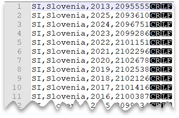

# <a name="query-csv-files"></a>查詢 CSV 檔案

在本文中，您將瞭解如何使用 Azure Synapse 分析中的 SQL 隨選（預覽）來查詢單一 CSV 檔案。 CSV 檔案可能會有不同的格式： 

- 包含和不含標頭資料列
- 逗號和定位字元分隔值
- Windows 和 Unix 樣式行尾結束符號
- 非引號和引號的值，以及逸出字元

以下將涵蓋上述所有變化。

## <a name="prerequisites"></a>先決條件

閱讀本文的其餘部分之前，請先參閱下列文章：

- [第一次設定](query-data-storage.md#first-time-setup)
- [先決條件](query-data-storage.md#prerequisites)

## <a name="windows-style-new-line"></a>Windows 樣式的新行

下列查詢顯示如何讀取沒有標頭資料列的 CSV 檔案、Windows 樣式的新行，以及逗號分隔的資料行。

檔案預覽：



```sql
SELECT *
FROM OPENROWSET(
        BULK 'https://sqlondemandstorage.blob.core.windows.net/csv/population/population.csv',
         FORMAT = 'CSV',
        FIELDTERMINATOR =',',
        ROWTERMINATOR = '\n'
    )
WITH (
    [country_code] VARCHAR (5) COLLATE Latin1_General_BIN2,
    [country_name] VARCHAR (100) COLLATE Latin1_General_BIN2,
    [year] smallint,
    [population] bigint
) AS [r]
WHERE
    country_name = 'Luxembourg'
    AND year = 2017;
```

## <a name="unix-style-new-line"></a>Unix 樣式的新行

下列查詢顯示如何讀取沒有標頭資料列的檔案、具有 Unix 樣式的新行，以及逗號分隔的資料行。 請注意，與其他範例相比，檔案的不同位置。

檔案預覽：


```sql
SELECT *
FROM OPENROWSET(
        BULK 'https://sqlondemandstorage.blob.core.windows.net/csv/population-unix/population.csv',
        FORMAT = 'CSV',
        FIELDTERMINATOR =',',
        ROWTERMINATOR = '0x0a'
    )
WITH (
    [country_code] VARCHAR (5) COLLATE Latin1_General_BIN2,
    [country_name] VARCHAR (100) COLLATE Latin1_General_BIN2,
    [year] smallint,
    [population] bigint
) AS [r]
WHERE
    country_name = 'Luxembourg'
    AND year = 2017;
```

## <a name="header-row"></a>標頭資料列

下列查詢示範如何使用標頭資料列、以 Unix 樣式的新行和以逗號分隔的資料行來讀取檔案。 請注意，與其他範例相比，檔案的不同位置。

檔案預覽：


```sql
SELECT *
FROM OPENROWSET(
        BULK 'https://sqlondemandstorage.blob.core.windows.net/csv/population-unix-hdr/population.csv',
        FORMAT = 'CSV',
        FIELDTERMINATOR =',',
        FIRSTROW = 2
    )
    WITH (
        [country_code] VARCHAR (5) COLLATE Latin1_General_BIN2,
        [country_name] VARCHAR (100) COLLATE Latin1_General_BIN2,
        [year] smallint,
        [population] bigint
    ) AS [r]
WHERE
    country_name = 'Luxembourg'
    AND year = 2017;
```

## <a name="custom-quote-character"></a>自訂引號字元

下列查詢顯示如何讀取具有標頭資料列的檔案，以及 Unix 樣式的新行、以逗號分隔的資料行，以及加上引號的值。 請注意，與其他範例相比，檔案的不同位置。

檔案預覽：


```sql
SELECT *
FROM OPENROWSET(
        BULK 'https://sqlondemandstorage.blob.core.windows.net/csv/population-unix-hdr-quoted/population.csv',
        FORMAT = 'CSV',
        FIELDTERMINATOR =',',
        ROWTERMINATOR = '0x0a',
        FIRSTROW = 2,
        FIELDQUOTE = '"'
    )
    WITH (
        [country_code] VARCHAR (5) COLLATE Latin1_General_BIN2,
        [country_name] VARCHAR (100) COLLATE Latin1_General_BIN2,
        [year] smallint,
        [population] bigint
    ) AS [r]
WHERE
    country_name = 'Luxembourg'
    AND year = 2017;
```

> [!NOTE]
> 如果您省略 FIELDQUOTE 參數，則此查詢會傳回相同的結果，因為 FIELDQUOTE 的預設值是雙引號。

## <a name="escaping-characters"></a>逸出字元

下列查詢顯示如何讀取具有標頭資料列的檔案，其中包含 Unix 樣式的新行、逗號分隔的資料行，以及用於值內欄位分隔符號（逗號）的 escape 字元。 請注意，與其他範例相比，檔案的不同位置。

檔案預覽：


```sql
SELECT *
FROM OPENROWSET(
        BULK 'https://sqlondemandstorage.blob.core.windows.net/csv/population-unix-hdr-escape/population.csv',
        FORMAT = 'CSV',
        FIELDTERMINATOR =',',
        ROWTERMINATOR = '0x0a',
        FIRSTROW = 2,
        ESCAPECHAR = '\\'
    )
    WITH (
        [country_code] VARCHAR (5) COLLATE Latin1_General_BIN2,
        [country_name] VARCHAR (100) COLLATE Latin1_General_BIN2,
        [year] smallint,
        [population] bigint
    ) AS [r]
WHERE
    country_name = 'Slov,enia';
```

> [!NOTE]
> 如果未指定 ESCAPECHAR，此查詢將會失敗，因為 "之外，enia" 中的逗號會被視為欄位分隔符號，而不是國家/地區名稱的一部分。 "之外，enia" 會視為兩個數據行。 因此，特定資料列會有一個以上的資料行，而不是在 WITH 子句中定義的資料行。

## <a name="tab-delimited-files"></a>Tab 鍵分隔檔案

下列查詢會示範如何使用標頭資料列、以 Unix 樣式的新行，以及 tab 鍵分隔的資料行來讀取檔案。 請注意，與其他範例相比，檔案的不同位置。

檔案預覽：


```sql
SELECT *
FROM OPENROWSET(
        BULK 'https://sqlondemandstorage.blob.core.windows.net/csv/population-unix-hdr-tsv/population.csv',
        FORMAT = 'CSV',
        FIELDTERMINATOR ='\t',
        ROWTERMINATOR = '0x0a',
        FIRSTROW = 2
    )
    WITH (
        [country_code] VARCHAR (5) COLLATE Latin1_General_BIN2,
        [country_name] VARCHAR (100) COLLATE Latin1_General_BIN2,
        [year] smallint,
        [population] bigint
    ) AS [r]
WHERE
    country_name = 'Luxembourg'
    AND year = 2017
```

## <a name="returning-subset-of-columns"></a>傳回資料行的子集

到目前為止，您已使用搭配來指定 CSV 檔案架構，並列出所有資料行。 在查詢中，您只能針對所需的每個資料行使用序數來指定您實際需要的資料行。 您也會省略不感的資料行。

下列查詢會傳回檔案中不同國家/地區名稱的數目，僅指定所需的資料行：

> [!NOTE]
> 請查看下方查詢中的 WITH 子句，並注意在您定義 *[country_name]* 資料行的資料列結尾有 "2" （不含引號）。 這表示 *[country_name]* 資料行是檔案中的第二個數據行。 此查詢會忽略檔案中的所有資料行，但不包括第二個。

```sql
SELECT
    COUNT(DISTINCT country_name) AS countries
FROM OPENROWSET(
        BULK 'https://sqlondemandstorage.blob.core.windows.net/csv/population/population.csv',
         FORMAT = 'CSV',
        FIELDTERMINATOR =',',
        ROWTERMINATOR = '\n'
    )
WITH (
    --[country_code] VARCHAR (5) COLLATE Latin1_General_BIN2,
    [country_name] VARCHAR (100) COLLATE Latin1_General_BIN2 2
    --[year] smallint,
    --[population] bigint
) AS [r]
```

## <a name="next-steps"></a>後續步驟

下一篇文章將為您示範如何：

- [查詢 Parquet 檔案](query-parquet-files.md)
- [查詢資料夾和多個檔案](query-folders-multiple-csv-files.md)
