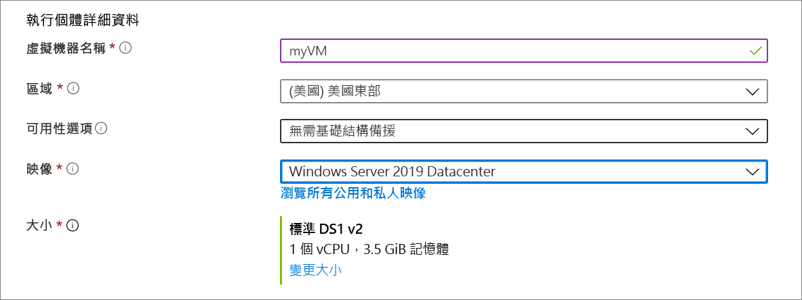
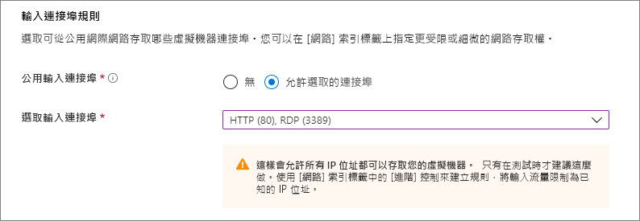

# <a name="quickstart-create-a-windows-virtual-machine-in-the-azure-portal"></a>快速入門：在 Azure 入口網站中建立 Windows 虛擬機器

您可以透過 Azure 入口網站建立 Azure 虛擬機器 (VM)。 此方法可提供以瀏覽器為基礎的使用者介面，以便建立 VM 及其相關聯的資源。 本快速入門說明如何使用 Azure 入口網站，在 Azure 中部署執行 Windows Server 2019 的虛擬機器 (VM)。 若要查看作用中的 VM，接著要以 RDP 連線至 VM，並安裝 IIS 網頁伺服器。

如果您沒有 Azure 訂用帳戶，請在開始前建立[免費帳戶](https://azure.microsoft.com/free/?WT.mc_id=A261C142F)。

## <a name="sign-in-to-azure"></a>登入 Azure

在 https://portal.azure.com 登入 Azure 入口網站。

## <a name="create-virtual-machine"></a>建立虛擬機器

1. 在搜尋中輸入 **虛擬機器**。
1. 在 [服務] 底下，選取 [虛擬機器]。
1. 在 [虛擬機器]  頁面中，選取 [新增]  。 
1. 在 [基本資料]  索引標籤中的 [專案詳細資料]  底下，確認已選取正確的訂用帳戶，然後選擇 [新建]  資源群組。 輸入 myResourceGroup  作為名稱。 

    

1. 在 [執行個體詳細資料]  底下，輸入 *myVM* 作為 [虛擬機器名稱]  ，並選擇 [美國東部]  作為您的 [區域]  ，然後選擇 [Windows Server 2019 Datacenter]  作為 [映像]  。 其他部分保留預設值。

    

1. 在 [系統管理員帳戶]  底下提供使用者名稱 (例如 azureuser  ) 和密碼。 密碼長度至少必須有 12 個字元，而且符合[定義的複雜度需求](faq.md#what-are-the-password-requirements-when-creating-a-vm)。

    

1. 在 [輸入連接埠規則] 底下，選擇 [允許選取的連接埠]，然後從下拉式清單中選取 [RDP (3389)] 和 [HTTP (80)]。

    

1. 保留其餘預設值，然後在頁面底部選取 [檢閱 + 建立] 按鈕。

    ![顯示頁面底部的 [檢閱] 和 [建立] 按鈕的螢幕擷取畫面](./media/quick-create-portal/review-create.png)


## <a name="connect-to-virtual-machine"></a>連線至虛擬機器

建立與虛擬機器的遠端桌面連線。 這些指示可為您指出如何從 Windows 電腦連線至您的 VM。 在 Mac 上，您需要 RDP 用戶端，例如來自 Mac App Store 的[遠端桌面用戶端](https://apps.apple.com/app/microsoft-remote-desktop/id1295203466?mt=12)。

1. 在虛擬機器的 [概觀] 頁面上，選取 [連線] 按鈕。 

    ![虛擬機器概觀頁面的螢幕擷取畫面，其中顯示 [連線] 按鈕的位置](./media/quick-create-portal/portal-quick-start-9.png)
    
2. 在 [連線至虛擬機器]  頁面中，保留以 IP 位址透過連接埠 3389 進行連線的預設選項，然後按一下 [下載 RDP 檔案]  。

2. 開啟下載的 RDP 檔案，然後在出現提示時按一下 [連線]  。 

3. 在 [Windows 安全性]  視窗中，選取 [更多選擇]  ，然後選取 [使用不同的帳戶]  。 輸入 **localhost**\\*username* 作為使用者名稱，並輸入您為虛擬機器建立的密碼，然後按一下 [確定]  。

4. 您可能會在登入過程中收到憑證警告。 按一下 [是]  或 [繼續]  以建立連線。

## <a name="install-web-server"></a>安裝 Web 伺服器

若要查看作用中的 VM，請安裝 IIS 網頁伺服器。 在 VM 上開啟 PowerShell 提示字元並執行下列命令：

```powershell
Install-WindowsFeature -name Web-Server -IncludeManagementTools
```

完成時，關閉與 VM 的 RDP 連線。


## <a name="view-the-iis-welcome-page"></a>檢視 IIS 歡迎使用頁面

在入口網站中，選取 VM，然後在 VM 的概觀中，使用 IP 位址右邊的 [按一下以複製]  按鈕，將它複製並貼到瀏覽器索引標籤中。預設的 IIS 歡迎使用頁面將會開啟，而且應如下所示：


## <a name="clean-up-resources"></a>清除資源

若不再需要，您可以刪除資源群組、虛擬機器和所有相關資源。 

請選取虛擬機器的資源群組，然後選取 [刪除]  。 確認要完成資源刪除作業的資源群組名稱。

## <a name="next-steps"></a>後續步驟

在此快速入門中，您已部署簡單的虛擬機器、對網路流量開啟網路連接埠，以及安裝基本的網頁伺服器。 若要深入了解 Azure 虛擬機器，請繼續 Windows VM 的教學課程。

> [!div class="nextstepaction"]
> [Azure Windows 虛擬機器教學課程](./tutorial-manage-vm.md)
