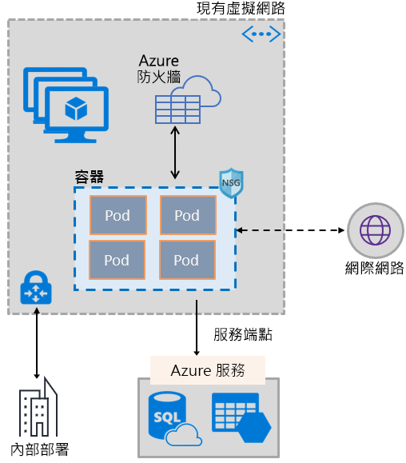

# 讓容器使用 Azure 虛擬網路功能

藉由利用可提供虛擬機器的相同軟體定義網路堆疊，來為容器提供一組豐富的 Azure 網路功能。 Azure 虛擬網路容器網路介面 (CNI) 外掛程式會安裝於 Azure 虛擬機器中。 外掛程式會將虛擬網路的 IP 位址指派給虛擬機器中提供的容器、將它們連結到虛擬網路，然後將它們直接連線到其他容器和虛擬網路資源。 外掛程式不依賴重疊網路或路由來進行連線，並提供與虛擬機器相同的效能。 概括而言，外掛程式會提供下列功能：

- 虛擬網路 IP 位址會指派給由一或多個容器所組成的每個 Pod。
- Pod 可以透過 ExpressRoute 或網站間 VPN，連線到對等互連的虛擬網路和內部部署環境。 Pod 也可以從對等互連和內部部署網路連線。
- Pod 可以存取 Azure 儲存體和 Azure SQL Database 之類的服務，其受到虛擬網路服務端點所保護。
- 網路安全性群組和路由可以直接套用到 Pod。
- Pod 可以直接放在 Azure 內部或公用 Load Balancer 後方，就像虛擬機器一樣
- 您可以為 Pod 指派公用 IP 位址，使其可直接從網際網路存取。 Pod 也可以存取網際網路本身。
- 搭配 Kubernetes 資源順暢地運作，例如服務、輸入控制器及 Kube DNS。 Kubernetes 服務也可以透過 Azure Load Balancer 在內部或外部公開。

下圖顯示外掛程式如何為 Pod 提供 Azure 虛擬網路功能：

外掛程式支援 Linux 和 Windows 平台。

## 將 Pod 連線到虛擬網路

Pod 會在屬於虛擬網路的虛擬機器中提供。 適用於 Pod 的 IP 位址集區會設定為虛擬機器網路介面上的次要位址。 Azure CNI 會為 Pod 設定基本網路連線，並管理集區中的 IP 位址使用率。 當 Pod 在虛擬機器中出現時，Azure CNI 會從集區中指派可用的 IP 位址，並將該 Pod 連線到虛擬機器中的軟體橋接器。 當 Pod 終止時，會將 IP 位址加回集區。 下圖顯示 Pod 連線到虛擬網路的方式：

## 網際網路存取

若要讓 Pod 能夠存取網際網路，外掛程式會設定 *iptables* 規則，針對來自 Pod 的網際網路繫結流量進行網路位址轉譯 (NAT)。 封包的來源 IP 位址會轉譯為虛擬機器網路介面上的主要 IP 位址。 Windows 虛擬機器會自動針對流量進行來源 NAT (SNAT)，該流量的目的地為虛擬機器所屬子網路外部的 IP 位址。 通常，會轉譯目的地為虛擬網路 IP 範圍外部之 IP 位址的所有流量。

## 限制

外掛程式針對每部虛擬機器最多支援 250 個 Pod，並且在虛擬網路中最多支援 16,000 個 Pod。 對於 [Azure Kubernetes Service](../azure-resource-manager/management/azure-subscription-service-limits.md?toc=%2fazure%2fvirtual-network%2ftoc.json#azure-kubernetes-service-limits) 而言，這些限制均不相同。

## 使用外掛程式

外掛程式可透過下列方式使用，以針對 Pod 或 Docker 容器提供基本的虛擬網路連結：

- **Azure Kubernetes Service**：外掛程式會整合到 Azure Kubernetes Service (AKS)，並可藉由選擇 [進階網路]  選項來使用。 進階網路功能可讓您在現有或新的虛擬網路中部署 Kubernetes 叢集。 若要深入了解進階網路功能及其設定步驟，請參閱 [AKS 中的網路設定](../aks/networking-overview.md?toc=%2fazure%2fvirtual-network%2ftoc.json)。
- **AKS-Engine**：AKS-Engine 是一種工具，產生在 Azure 中部署 Kubernetes 叢集的 Azure Resource Manager 範本。 如需詳細指示，請參閱[部署適用於 AKS-Engine Kubernetes 叢集的外掛程式](deploy-container-networking.md#deploy-the-azure-virtual-network-container-network-interface-plug-in)。
- **在 Azure 中建立自己的 Kubernetes 叢集**：外掛程式可用來針對您在 Kubernetes 叢集中自行部署的 Pod 提供基本網路功能，而不依賴 AKS 或 AKS-Engine 之類的工具。 在此案例中，已在叢集中的每部虛擬機器上安裝並啟用外掛程式。 如需詳細指示，請參閱[部署自行部署的 Kubernetes 叢集外掛程式](deploy-container-networking.md#deploy-plug-in-for-a-kubernetes-cluster)。
- **Azure 中適用於 Docker 容器的虛擬網路連結**：如果您不想建立 Kubernetes 叢集，並且想要在虛擬機器中建立具有虛擬網路連結的 Docker 容器，即可使用外掛程式。 如需詳細指示，請參閱[部署適用於 Docker 的外掛程式](deploy-container-networking.md#deploy-plug-in-for-docker-containers)。

## 後續步驟

[部署外掛程式](deploy-container-networking.md) (適用於 Kubernetes 叢集或 Docker 容器)
