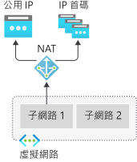
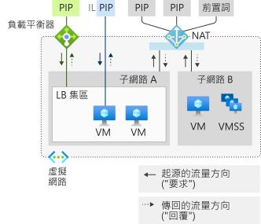
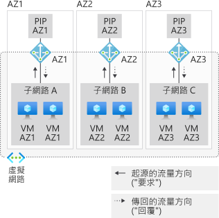

# 什麼是虛擬網路 NAT？

虛擬網路 NAT (網路位址轉譯) 可簡化虛擬網路的僅限輸出網際網路連線。 在子網路上設定時，所有輸出連線都會使用您指定的靜態公用 IP 位址。  在沒有負載平衡器或直接連結至虛擬機器的公用 IP 位址的情況下，可能有輸出連線能力。 NAT 完全受控且具有高度復原性。

<!-- 

-->

  

*圖：虛擬網路 NAT*

## 僅限輸出的靜態 IP 位址

您可以使用 NAT 為每個子網路定義輸出連線能力。  相同虛擬網路內的多個子網路可以有不同的 NAT。 藉由指定要使用哪個 NAT 閘道資源來設定子網路。 來自任何虛擬機器執行個體的所有 UDP 和 TCP 輸出流量都會使用 NAT。 

NAT 與標準 SKU 公用 IP 位址資源、公用 IP 前置詞資源或兩者的組合相容。  您可以直接使用公用 IP 前置詞，或將前置詞的公用 IP 位址散發到多個 NAT 閘道資源。 NAT 會將所有流量清理到前置詞的 IP 位址範圍。  現在很容易就能為您的部署建立任何 IP 允許清單。

子網路的所有輸出流量都是由 NAT 自動處理，而不需要任何客戶設定。  不需要使用者定義的路由。 NAT 優先於其他輸出案例，並可取代子網路的預設網際網路目的地。

## 具有多個 IP 位址可供調整的隨選 SNAT

NAT 會使用「連接埠網路位址轉譯」(PNAT 或 PAT)，而且建議用於大部分的工作負載。 動態或分歧的工作負載可透過隨選輸出流量配置輕鬆地適應。 避免輸出資源的廣泛預先規劃、預先配置和最終過度佈建。 SNAT 連接埠資源可透過特定 NAT 閘道資源在所有子網路上共用和取得，並可在需要時提供。

連結至 NAT 的公用 IP 位址最多可為 UDP 和 TCP 提供 64000 個並行流量。 您可以從單一 IP 位址開始，並擴大至 16 個公用 IP 位址。

NAT 可讓您建立從虛擬網路到網際網路的流量。 只有在回應作用中流量時，才允許從網際網路傳回流量。

不同於負載平衡器輸出 SNAT，NAT 不會限制虛擬機器執行個體的哪個私人 IP 可以進行輸出連線。  次要 IP 組態可以建立與 NAT 的輸出網際網路連線。

## 輸入和輸出共存

NAT 與下列標準 SKU 資源相容：

- 負載平衡器
- 公用 IP 位址
- 公用 IP 首碼

搭配 NAT 使用時，這些資源會提供連到子網路的輸入網際網路連線能力。 NAT 會提供從子網路連出的輸出網際網路連線能力。

NAT 和相容的標準 SKU 功能可感知流量的開始方向。 輸入和輸出案例可以共存。 這些案例將會收到正確的網路位址轉譯，因為這些功能可感知流量方向。 

<!-- 

-->

  

*圖：虛擬網路 NAT 流量方向*

## 完全受控、高度復原性性

NAT 一開始就完全擴充。 不需要增強或擴充作業。  Azure 會為您管理 NAT 的作業。  NAT 一律有多個容錯網域並可承受多次失敗，而不會發生服務中斷。

## 無法辨識流量的 TCP 重設

NAT 的私人端會傳送「TCP 重設」封包，以嘗試在不存在的 TCP 連線上進行通訊。 其中一個範例是已達到閒置逾時的連線。 收到的下一個封包會將「TCP 重設」傳回到私人 IP 位址，以指示並強制關閉連線。

NAT 的公用端不會產生「TCP 重設」封包或任何其他流量。  只會發出客戶的虛擬網路所產生的流量。

## 可設定的 TCP 閒置逾時

預設 TCP 會使用 4 分鐘的閒置逾時，且最多可增加到 120 分鐘。 流量上的任何活動也都可以重設閒置計時器，包括 TCP Keepalive。

## 具有可用性區域的地區性或區域隔離

根據預設，NAT 有地區性。 建立[可用性區域](../availability-zones/az-overview.md)案例時，NAT 可以在特定區域 (區域性部署) 中隔離。

<!-- 

-->

  

*圖：具有可用性區域的虛擬網路 NAT*

## 可檢視性的多維度計量

您可以透過 Azure 監視器中公開的多維度計量來監視 NAT 作業。 這些計量可用來觀察使用量和進行疑難排解。  NAT 閘道資源會公開下列計量：
- 位元組
- 封包
- 丟棄的封包
- SNAT 連線總數
- 每個間隔的 SNAT 連線狀態轉換。

<!-- "ADD when PM is done" Learn more about [NAT gateway metrics](./nat-gateway-metrics.md) -->

## SLA

公開上市時，NAT 資料路徑至少 99.9% 可用。

## 定價

NAT 閘道會使用兩個不同的計量進行計費：

| 計量 | 費率 |
| --- | --- |
| 資源時數 | $0.045/小時 |
| 已處理的資料量 | $0.045/GB |

資源時數說明 NAT 閘道資源存在的持續期間。
已處理的資料量說明 NAT 閘道資源處理的所有流量。

## 可用性

虛擬網路 NAT 和 NAT 閘道資源適用於所有 Azure 公用雲端[區域](https://azure.microsoft.com/global-infrastructure/regions/)。

## 支援

NAT 是透過標準支援管道來支援。

## 建議

我們想要知道如何改善服務。 請針對我們接下來應在[適用於 NAT 的 UserVoice](https://aka.ms/natuservoice) 建置的項目，提出建議和投票。

## 限制

* NAT 與標準 SKU 公用 IP、公用 IP 前置詞和負載平衡器資源相容。 基本資源 (例如基本負載平衡器) 及其衍生的所有產品都不會與 NAT 相容。  基本資源必須置於未透過 NAT 設定的子網路上。
* 支援 IPv4 位址系列。  NAT 不會與 IPv6 位址系列互動。  NAT 無法部署在具有 IPv6 首碼的子網路上。
* 使用 NAT 時，不支援 NSG 流量記錄。
* NAT 無法跨越多個虛擬網路。

## 後續步驟

* 深入了解 [NAT 閘道資源](./nat-gateway-resource.md)。
* [在 UserVoice 中告訴我們可為虛擬網路 NAT 打造的下一項功能](https://aka.ms/natuservoice)。

