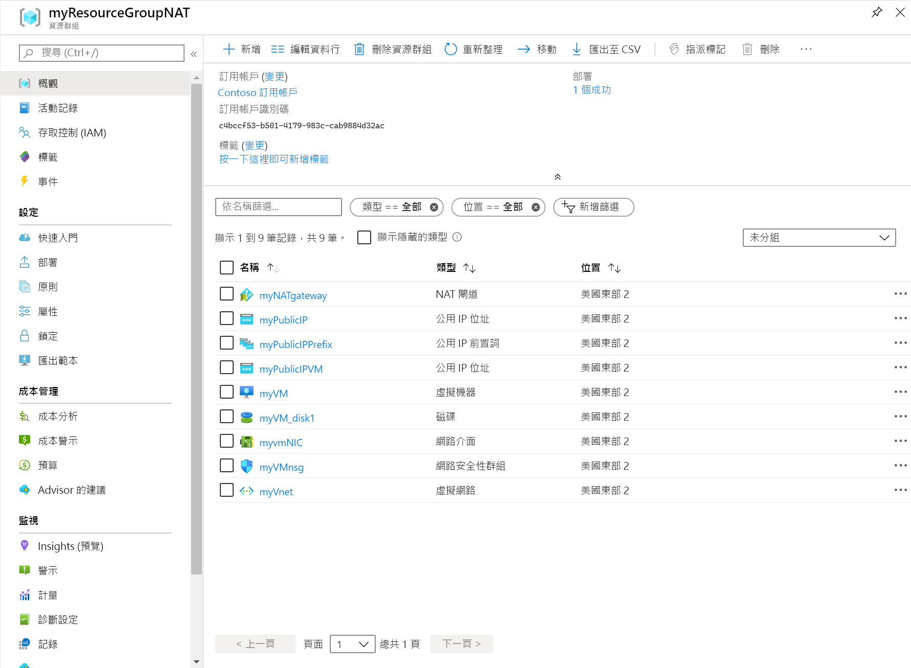

# <a name="quickstart-create-a-nat-gateway---resource-manager-template"></a>快速入門：建立 NAT 閘道 - Resource Manager 範本

使用 Azure Resource Manager 範本開始使用虛擬網路 NAT。  此範本會部署虛擬網路、NAT 閘道資源和 Ubuntu 虛擬機器。 Ubuntu 虛擬機器會部署到與 NAT 閘道資源相關聯的子網路。

[!INCLUDE [About Azure Resource Manager](../../includes/resource-manager-quickstart-introduction.md)]

如果您沒有 Azure 訂用帳戶，請在開始前建立[免費帳戶](https://azure.microsoft.com/free/?WT.mc_id=A261C142F)。

## <a name="create-a-nat-gateway-and-supporting-resources"></a>建立 NAT 閘道和支援資源

此範本已設定為建立 

* 虛擬網路 
* NAT 閘道資源
* Ubuntu 虛擬機器

Ubuntu VM會部署到與 NAT 閘道資源相關聯的子網路。

### <a name="review-the-template"></a>檢閱範本

本快速入門中使用的範本是來自 [Azure 快速入門範本](https://raw.githubusercontent.com/Azure/azure-quickstart-templates/master/101-nat-gateway-1-vm/azuredeploy.json)

:::code language="json" source="~/quickstart-templates/101-nat-gateway-1-vm/azuredeploy.json" range="1-335" highlight="256-282":::

範本中定義了九個 Azure 資源：

**Microsoft.Network**

* **[Microsoft.Network/natGateways](https://docs.microsoft.com/azure/templates/microsoft.network/natgateways)** ：建立 NAT 閘道資源。

* **[Microsoft.Network/networkSecurityGroups](https://docs.microsoft.com/azure/templates/microsoft.network/networksecuritygroups)** ：建立網路安全性群組。

    * **[Microsoft.Network/networkSecurityGroups/securityRules](https://docs.microsoft.com/azure/templates/microsoft.network/networksecuritygroups/securityrules)** ：建立安全性規則。

* **[Microsoft.Network/publicIPAddresses](https://docs.microsoft.com/azure/templates/microsoft.network/publicipaddresses)** ：建立公用 IP 位址。

* **[Microsoft.Network/publicIPPrefixes](https://docs.microsoft.com/azure/templates/microsoft.network/publicipprefixes)** ：建立公用 IP 前置碼。

* **[Microsoft.Network/virtualNetworks](https://docs.microsoft.com/azure/templates/microsoft.network/virtualnetworks)** ：建立虛擬網路。

    * **[Microsoft.Network/virtualNetworks/subnets](https://docs.microsoft.com/azure/templates/microsoft.network/virtualnetworks/subnets)** ：建立虛擬網路子網路。

* **[Microsoft.Network/networkinterfaces](https://docs.microsoft.com/azure/templates/microsoft.network/networkinterfaces)** ：建立網路介面。

**Microsoft.Compute**

* **[Microsoft.Compute/virtualMachines](https://docs.microsoft.com/azure/templates/Microsoft.Compute/virtualMachines)** ：建立虛擬機器。

### <a name="deploy-the-template"></a>部署範本

**Azure CLI**

```azurecli-interactive
read -p "Enter the location (i.e. westcentralus): " location
resourceGroupName="myResourceGroupNAT"
templateUri="https://raw.githubusercontent.com/Azure/azure-quickstart-templates/master/101-nat-gateway-1-vm/azuredeploy.json" 

az group create \
--name $resourceGroupName \
--location $location

az group deployment create \
--resource-group $resourceGroupName \
--template-uri  $templateUri
```

**Azure PowerShell**

```azurepowershell-interactive
$location = Read-Host -Prompt "Enter the location (i.e. westcentralus)"
$templateUri = "https://raw.githubusercontent.com/Azure/azure-quickstart-templates/master/101-nat-gateway-1-vm/azuredeploy.json"

$resourceGroupName = "myResourceGroupNAT"

New-AzResourceGroup -Name $resourceGroupName -Location $location
New-AzResourceGroupDeployment -ResourceGroupName $resourceGroupName -TemplateUri $templateUri
```

**Azure 入口網站**

[](https://portal.azure.com/#create/Microsoft.Template/uri/https%3A%2F%2Fraw.githubusercontent.com%2FAzure%2Fazure-quickstart-templates%2Fmaster%2F101-nat-gateway-1-vm%2Fazuredeploy.json)

## <a name="review-deployed-resources"></a>檢閱已部署的資源

1. 登入 [Azure 入口網站](https://portal.azure.com)。

2. 選取左側面板中的 [資源群組]  。

3. 選取您在上一節中建立的資源群組。 預設的資源組名為 **myResourceGroupNAT**

4. 確認下列資源是在資源群組中建立的：

    

## <a name="clean-up-resources"></a>清除資源

**Azure CLI**

若不再需要，您可以使用 [az group delete](/cli/azure/group#az-group-delete) 命令來移除資源群組及其內含的所有資源。

```azurecli-interactive 
  az group delete \
    --name myResourceGroupNAT
```

**Azure PowerShell**

當不再需要時，您可以使用 [Remove-AzResourceGroup](https://docs.microsoft.com/powershell/module/az.resources/remove-azresourcegroup?view=latest) 命令來移除資源群組和其中所有資源。

```azurepowershell-interactive 
Remove-AzResourceGroup -Name myResourceGroupNAT
```

**Azure 入口網站**

若不再需要，可刪除資源群組、NAT 閘道和所有相關資源。 選取包含 NAT 閘道的資源群組 **myResourceGroupNAT**，然後選取 [刪除]  。

## <a name="next-steps"></a>後續步驟

在本快速入門中，您已建立一個：

* NAT 閘道資源
* 虛擬網路
* Ubuntu 虛擬機器

虛擬機器會部署到與 NAT 閘道相關聯的虛擬網路子網路。 

若要深入了解虛擬網路 NAT 和 Azure Resource Manager，請繼續閱讀下列文章。

* 閱讀[虛擬網路 NAT 概觀](nat-overview.md)
* 閱讀 [NAT 閘道資源](nat-gateway-resource.md)相關文章
* 深入了解 [Azure Resource Manager](../azure-resource-manager/management/overview.md)
