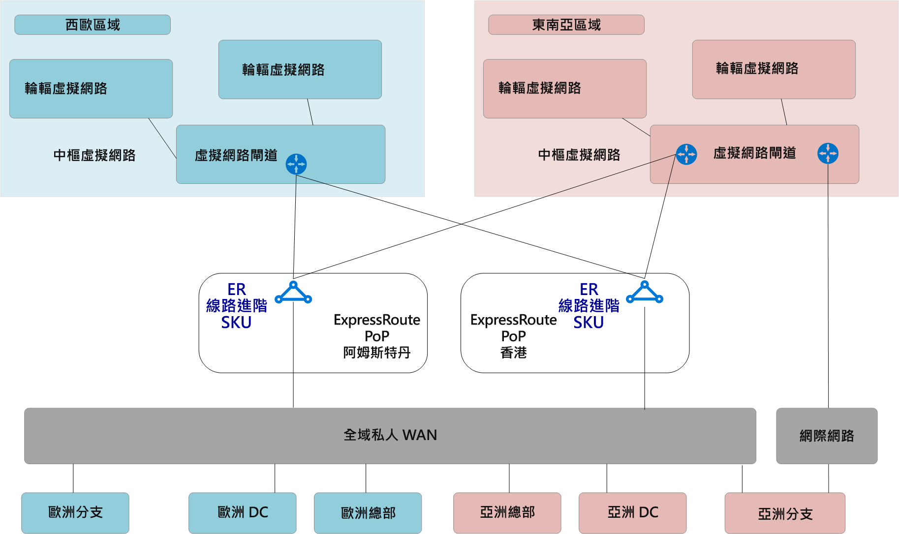
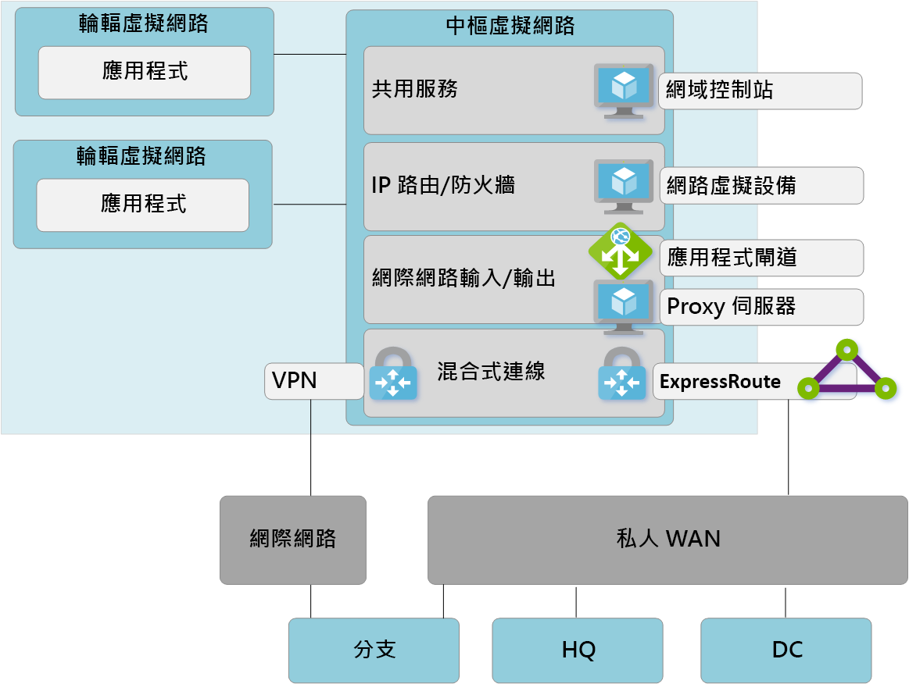
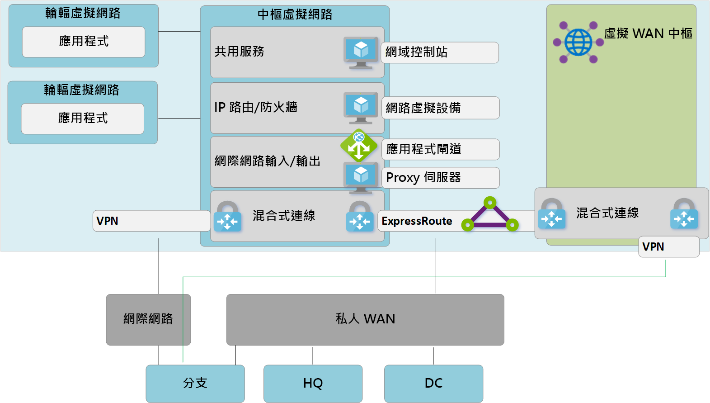
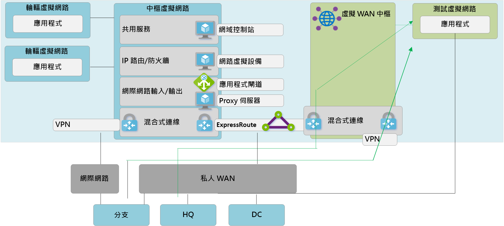
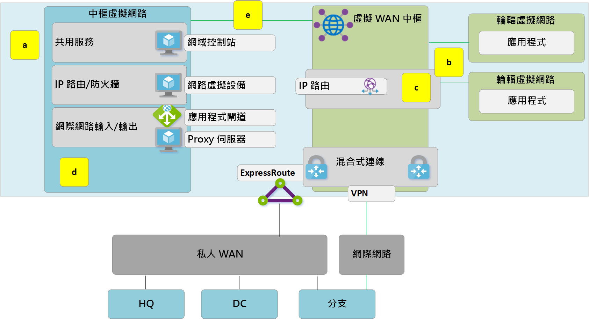
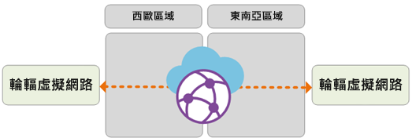
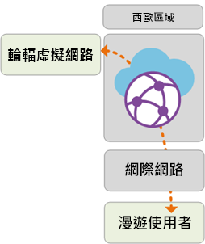
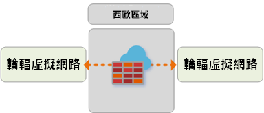
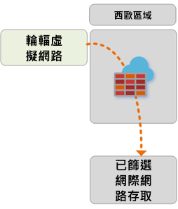
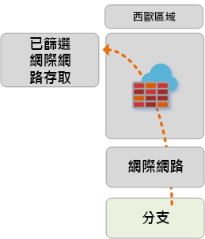

# 移轉移至 Azure 虛擬 WAN

Azure 虛擬 WAN 允許公司簡化其全球連接，以便從 Microsoft 全球網路的規模中獲益。 本文為希望從現有客戶管理的中心點和分支拓撲遷移到利用 Microsoft 管理的虛擬 WAN 中心的設計的公司提供了技術詳細資訊。

有關 Azure 虛擬 WAN 為採用以雲為中心的現代企業全球網路的企業帶來的優勢的資訊，請參閱[全球傳輸網路架構和虛擬廣域網路](virtual-wan-global-transit-network-architecture.md)。

**圖：Azure 虛擬廣域網路**

數千客戶採用了 Azure 虛擬資料中心 （VDC） 集線器和分機連接模型，以利用 Azure 網路的預設傳輸路由行為來構建簡單且可擴展的雲網路。 Azure 虛擬 WAN 基於這些概念構建，並引入了新功能，不僅允許在本地位置和 Azure 之間實現全域連接拓撲，還允許客戶利用 Microsoft 網路的規模來增強其現有的全球網路。

本文演示如何將現有混合環境遷移到虛擬 WAN。

## 狀況

Contoso 是一家全球性金融組織，在歐洲和亞洲設有辦事處。 他們打算將現有的應用程式從內部部署資料中心移至 Azure，並根據 VDC 架構建置基礎設計，包括區域客戶管理的中樞虛擬網路，以提供混合式連線能力。 作為向基於雲的技術轉移的一部分，網路團隊的任務是確保其連接針對業務向前發展進行優化。

下圖顯示了現有全域網路的高級視圖，包括連接到多個 Azure 區域。

**圖：Contoso 現有網路拓撲**

您可以從現有的網路拓撲了解下列幾點：

- 中樞和輪輻拓撲會用於多個區域，包括連線回一般私人 WAN 的 ExpressRoute 進階線路。

- 這其中一些網站也具有直接通往 Azure 的 VPN 通道，以觸達裝載於 Microsoft 雲端的應用程式。

## 需求

分派給網路小組的任務是提供可支援 Contoso 移轉至雲端的全球網路模型，而且必須在成本、規模和效能方面進行最佳化。 總而言之，必須符合下列需求：

- 為總公司 (HQ) 和分公司提供已最佳化的雲端裝載應用程式路徑。
- 消除對現有本地資料中心 （DC） 的依賴，實現 VPN 終止，同時保留以下連接路徑：
  - **分支到 VNet：VPN**連接的辦公室必須能夠訪問遷移到本地 Azure 區域中的雲的應用程式。
  - **分支到集線器到集線器到 VNet：VPN**連接的辦公室必須能夠訪問遷移到遠端 Azure 區域中的雲的應用程式。
  - **分支到分支**：區域 VPN 連接的辦事處必須能夠相互通信，並快速路由連接 HQ/DC 網站。
  - **分支到集線器到集線器到分支**：全球分離的 VPN 連接辦公室必須能夠相互通信，並且任何與 ExpressRoute 連接的 HQ/DC 網站。
  - **分支到互聯網**：連接的網站必須能夠與互聯網通信。 必須篩選和記錄此流量。
  - **VNet 到 VNet：** 同一區域中的分支虛擬網路必須能夠相互通信。
  - **VNet 到集線器到集線器到 VNet：** 不同區域中的分支虛擬網路必須能夠相互通信。
- 為 Contoso 漫遊使用者（筆記本電腦和電話）提供訪問公司資源的能力，而不在公司網路上。

## Azure 虛擬廣域網路架構

下圖顯示了使用 Azure 虛擬 WAN 更新的目標拓撲的高級視圖，以滿足上一節中詳述的要求。

域網體系結構**圖：Azure 虛擬廣域網路體系結構**

摘要：

- 歐洲的 HQ 會維持與 ExpressRoute 連線，而歐洲的內部部署 DC 則會完全移轉至 Azure 並立即解除委任。
- 亞洲的 DC 和 HQ 仍會連線到私人 WAN。 Azure 虛擬 WAN 現在用於增強本地運營商網路並提供全域連接。
- 部署在西歐和東南亞 Azure 區域的 Azure 虛擬廣域網路中心，為 ExpressRoute 和 VPN 連接的設備提供連接中心。
- 中樞也會為使用全球網狀網路的 OpenVPN 連線能力，針對跨多個用戶端類型的漫遊使用者提供 VPN 終止點，讓您不僅可以存取移轉至 Azure 的應用程式，也能存取內部部署中剩餘的任何資源。
- Azure 虛擬 WAN 會提供虛擬網路內資源的網際網路連線能力。

Azure 虛擬 WAN 也會提供遠端網站的網際網路連線能力。 透過合作夥伴整合支援本地網際網路分組，以將存取 SaaS 服務 (例如 Office 365) 最佳化。

## 遷移至虛擬 WAN

本節顯示遷移到 Azure 虛擬 WAN 的各種步驟。

### 第 1 步：VDC 中心輻條單個區域

查看體系結構。 下圖顯示了在推出 Azure 虛擬 WAN 之前 Contoso 的單個區域拓撲：

**圖 1：VDC 中心輻條單區域**

根據虛擬資料中心 （VDC） 方法，客戶管理的集線器虛擬網路包含多個功能塊：

- 共用服務（多個分支所需的任何通用功能）。 示例：Contoso 在基礎架構即服務 （IaaS） 虛擬機器上使用 Windows Server 網域控制站。
- IP/路由防火牆服務會透過協力廠商網路虛擬設備提供，可啟用輪輻對輪輻第 3 層 IP 路由。
- 網際網路輸入/輸出服務 (包括適用於輸入 HTTPS 要求的 Azure 應用程式閘道)，以及在虛擬機器上執行的協力廠商 Proxy 服務 (用以篩選對網際網路資源的輸出存取)。
- 用於連接到本地網路的 ExpressRoute 和 VPN 虛擬網路閘道。

### 第 2 步：部署虛擬廣域網路集線器

在每個區域部署虛擬廣域網路中心。 設置具有 VPN 閘道和快速路由閘道的虛擬 WAN 集線器，如以下文章中所述：

- [教學課程：使用 Azure 虛擬 WAN 來建立站對站連線](virtual-wan-site-to-site-portal.md)
- [教程：使用 Azure 虛擬 WAN 創建快速路由關聯](virtual-wan-expressroute-portal.md)

> [!NOTE]
> Azure 虛擬 WAN 必須使用標準 SKU 來啟用本文中所示的某些流量路徑。

網集線器**圖 2：VDC 中心與虛擬 WAN 遷移的分機**

### 第 3 步：將遠端站台（快速路由和 VPN）連接到虛擬 WAN

將虛擬廣域網路集線器連接到現有的 ExpressRoute 電路，並通過互聯網將網站到網站 VPN 連接到任何遠端分支。

> [!NOTE]
> ExpressRoute 線路必須升級為進階 SKU 類型，才能連線到虛擬 WAN 中樞。

WAN**圖 3：VDC 集線器和分支到虛擬 WAN 遷移**

此時，本地網路設備將開始接收反映分配給虛擬 WAN 管理的集線器 VNet 的 IP 位址空間的路由。 在此階段中，遠端 VPN 連線的分支將會看到兩個連至輪輻虛擬網路中任何現有應用程式的路徑。 這些裝置應設定為繼續使用通往 VDC 中樞的通道，以確保會在轉換階段進行對稱式路由傳送。

### 第 4 步：通過虛擬 WAN 測試混合連接

在將託管虛擬廣域網路中心用於生產連接之前，我們建議您設置測試分支虛擬網路和虛擬 WAN VNet 連接。 驗證此測試環境的連線會透過 ExpressRoute 和站對站 VPN 來運作，然後繼續進行後續步驟。

測試混合連接圖**4：VDC 集線器和 VDC 到虛擬 WAN 遷移**

### 第 5 步：將連接轉換為虛擬廣域網路中心

網中心**圖 5：VDC 中心與虛擬 WAN 遷移的分電**

**a**. 從分支虛擬網路到舊 VDC 中心刪除現有的對等互連連接。 完成步驟 a-c 之前，無法存取輪輻虛擬網路中的應用程式。

**b**. . . 通過 VNet 連接將分支虛擬網路連接到虛擬廣域網路中心。

**c**. . 移除任何先前在輪輻虛擬網路內用來進行輪輻對輪輻通訊的使用者定義路由 (UDR)。 這個路徑現在會透過虛擬 WAN 中樞內可用的動態路由來啟用。

**d**. . 為進行下一步 (e)，VDC 中樞目前的 ExpressRoute 和 VPN 閘道現已解除委任。

**e**. . 透過新的 VNet 連線，將舊有 VDC 中樞 (中樞虛擬網路) 連線到虛擬 WAN 中樞。

### 第 6 步：舊中心成為共用服務分支

我們現在已重新設計 Azure 網路，讓虛擬 WAN 中樞成為新拓撲的中心點。

服務分支**圖 6：VDC 中心與虛擬 WAN 遷移**

由於虛擬 WAN 中心是託管實體，不允許部署自訂資源（如虛擬機器），因此共用服務塊現在作為分支虛擬網路存在，並託管通過 Azure 應用程式閘道或網路虛擬化設備。 共用服務環境與後端虛擬機器之間的流量現在會通過虛擬 WAN 管理的中樞。

### 第 7 步：優化本地連接以充分利用虛擬 WAN

在此階段中，Contoso 幾乎已完成將商務應用程式移轉至 Microsoft Cloud 的過程，而內部部署 DC 中只剩下一些舊版應用程式。

圖**7：VDC 中心與虛擬 WAN 遷移的分電**

為了利用 Azure 虛擬 WAN 的完整功能，Contoso 決定解除委任其舊版內部部署 VPN 連線。 任何繼續存取 HQ 或 DC 網路的分支，均能使用 Azure 虛擬 WAN 內建的傳輸路由來傳輸 Microsoft 全球網路。

> [!NOTE]
> 若客戶想要利用 Microsoft 骨幹來補充其現有的私人 WAN，則 ExpressRoute Global Reach 是另一種選擇。

## 端狀態體系結構和流量路徑

**圖：雙區域虛擬廣域網路**

此節透過查看一些範例流量流程，來提供此拓撲如何符合原始需求的摘要。

### 路徑 1

路徑 1 顯示了從亞洲 S2S VPN 連接的分支到東南亞區域的 Azure VNet 的流量。

流量的路由如下所示：

- 亞洲分支通過支援彈性 S2S BGP 的隧道連接到東南亞虛擬廣域網路樞紐。

- 亞洲虛擬 WAN 中樞會在本地將流量路由傳送到連線的 VNet。

### 路徑 2

路徑 2 顯示了從連接歐洲總部的 ExpressRoute 到東南亞區域 Azure VNet 的流量。

流量的路由如下所示：

- 歐洲總部通過高級 ExpressRoute 電路連接到西歐虛擬廣域網路樞紐。

- 虛擬 WAN 中樞對中樞全球連線能力，可讓您將流量傳輸到遠端區域中連線的 VNet。

### 路徑 3

路徑 3 顯示了從連接到專用廣域網路到歐洲 S2S 連接分支的亞洲本地 DC 的流量。

流量的路由如下所示：

- 亞洲 DC 會連線到本地私人 WAN 電訊廠商。

- 專用廣域網路中的 ExpressRoute 電路本地終止連接到東南亞虛擬廣域網路中心。

- 虛擬 WAN 樞紐到樞紐全域連接可實現流量的傳輸。

### 路徑 4

路徑 4 顯示了從東南亞區域的 Azure VNet 到西歐區域的 Azure VNet 的流量。

流量的路由如下所示：

- 虛擬 WAN 中樞對中樞全域連線能力讓您能夠在沒有進階使用者設定的情況下，原生傳輸所有連線的 Azure VNet。

### 路徑 5

路徑 5 顯示了從漫遊 VPN （P2S） 使用者到西歐區域 Azure VNet 的流量。

流量的路由如下所示：

- 筆記本電腦和行動裝置使用者使用 OpenVPN 用戶端在西歐的 P2S VPN 閘道進行透明連接。

- 西歐虛擬 WAN 中樞會在本地將流量路由傳送到連線的 VNet。

## 透過 Azure 防火牆的安全性與原則控制

Contoso 現已根據本文前面討論的要求驗證了所有分支和 VNet 之間的連接。 為了滿足他們對安全控制和網路隔離的要求，他們需要繼續通過集線器網路分離和記錄流量。 以前，此功能由網路虛擬裝置 （NVA） 執行。 Contoso 還希望停用其現有代理服務，並使用本機 Azure 服務進行出站 Internet 篩選。

進行安全和策略控制**圖：虛擬 WAN 中的 Azure 防火牆（安全虛擬中心）**

在虛擬 WAN 集線器中引入 Azure 防火牆以啟用統一的策略控制點，需要執行以下高級步驟。 有關此過程和安全虛擬中心概念的詳細資訊，請參閱[Azure 防火牆管理器](../firewall-manager/index.yml)。

1. 建立 Azure 防火牆原則。
2. 將防火牆原則連結到 Azure 虛擬 WAN 中樞。 此步驟允許現有虛擬 WAN 中心充當安全虛擬中心，並部署所需的 Azure 防火牆資源。

> [!NOTE]
> 如果 Azure 防火牆部署在標準虛擬廣域網路集線器 （SKU ： 標準）： V2V、B2V、V2I 和 B2I FW 策略僅在連接到部署 Azure FW 的特定集線器的特定集線器（安全集線器）的 VNet 和分支上強制執行。 來自遠端 VNet 和分支的流量連接到同一虛擬廣域網路中的其他虛擬廣域網路集線器，即使遠端分支和 VNet 通過虛擬廣域網路中心連接到集線器鏈路，也不會"防火牆"。 跨中心防火牆支援位於 Azure 虛擬 WAN 和防火牆管理器路線圖中。

以下路徑顯示了通過使用 Azure 保護的虛擬中心啟用的連接路徑：

### 路徑 6

路徑 6 顯示同一區域內 VNet 之間的安全流量。

流量的路由如下所示：

- 連線到相同安全虛擬中樞的虛擬網路，現在會透過 Azure 防火牆路由傳送流量。

- Azure 防火牆可以將原則套用到這些流程。

### 路徑 7

路徑 7 顯示了從 Azure VNet 到 Internet 或協力廠商安全服務的流量。

流量的路由如下所示：

- 連線到安全虛擬中樞的虛擬網路可以使用安全中樞作為網際網路存取的中心點，將流量傳送到網際網路上的公用目的地。

- 此流量可以使用 Azure 防火牆 FQDN 規則在本地進行篩選，或發送到協力廠商安全服務進行檢查。

### 路徑 8

路徑 8 顯示了從分支到 Internet 或協力廠商安全服務的流量。

流量的路由如下所示：

- 連接到安全虛擬中心的分支機搆可以使用安全中心作為 Internet 訪問的中心點，將流量發送到 Internet 上的公共目標。

- 此流量可以使用 Azure 防火牆 FQDN 規則在本地進行篩選，或發送到協力廠商安全服務進行檢查。

 

## 後續步驟

深入了解 [Azure 虛擬 WAN](virtual-wan-about.md)
